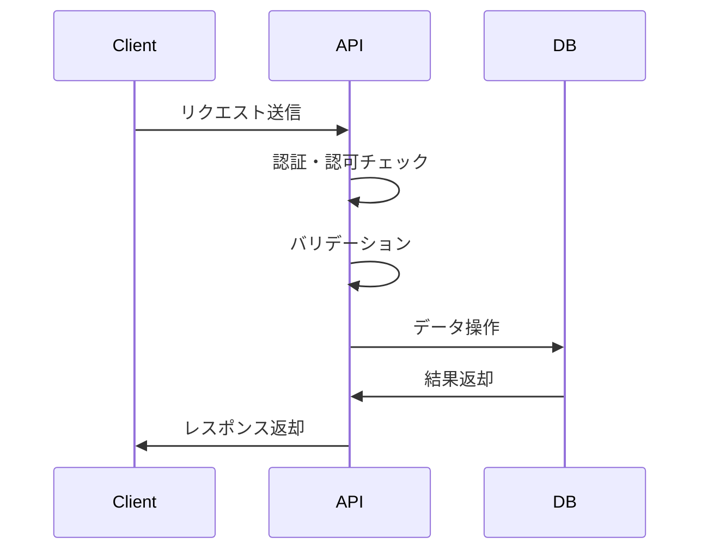

# API定義書：{{api_name}} ({{api_id}})

## 1. 基本情報

| 項目 | 内容 |
|------|------|
| **API ID** | {{api_id}} |
| **API名称** | {{api_name}} |
| **HTTPメソッド** | {{method}} |
| **エンドポイント** | {{endpoint}} |
| **優先度** | {{priority}} |
| **ステータス** | 未着手 |
| **作成日** | {{current_date}} |
| **最終更新日** | {{current_date}} |

## 2. API概要

### 2.1 概要・目的
{{description}}

### 2.2 関連画面
{{#each related_screens}}
- [{{this}}](../screens/specs/画面設計書_{{this}}.md)
{{/each}}

### 2.3 関連テーブル
{{#each related_tables}}
- [{{this}}](../database/tables/テーブル定義書_{{this}}.md)
{{/each}}

## 3. API仕様

### 3.1 リクエスト仕様

#### 3.1.1 URL
```
{{method}} {{endpoint}}
```

#### 3.1.2 ヘッダー
| ヘッダー名 | 必須 | 説明 | 例 |
|------------|------|------|-----|
| Content-Type | ○ | リクエスト形式 | application/json |
| Authorization | ○ | 認証トークン | Bearer eyJhbGciOiJIUzI1NiIsInR5cCI6IkpXVCJ9... |
| X-Tenant-ID | ○ | テナントID | tenant001 |

#### 3.1.3 パラメータ
| パラメータ名 | 種別 | データ型 | 必須 | 説明 | 例 |
|--------------|------|----------|------|------|-----|
| id | Path | string | ○ | リソースID | 123 |
| page | Query | number | × | ページ番号 | 1 |
| limit | Query | number | × | 取得件数 | 20 |

#### 3.1.4 リクエストボディ
```json
{
  "field1": "string",
  "field2": 123,
  "field3": true,
  "field4": {
    "nested_field": "value"
  },
  "field5": [
    "array_item1",
    "array_item2"
  ]
}
```

### 3.2 レスポンス仕様

#### 3.2.1 正常時レスポンス（200 OK）
```json
{
  "status": "success",
  "data": {
    "id": "123",
    "field1": "string",
    "field2": 123,
    "field3": true,
    "created_at": "2025-05-31T00:00:00Z",
    "updated_at": "2025-05-31T00:00:00Z"
  },
  "meta": {
    "total": 100,
    "page": 1,
    "limit": 20
  }
}
```

#### 3.2.2 エラーレスポンス
| HTTPステータス | エラーコード | エラーメッセージ | 発生条件 |
|----------------|--------------|------------------|----------|
| 400 | BAD_REQUEST | リクエストが不正です | パラメータ不正 |
| 401 | UNAUTHORIZED | 認証が必要です | 認証トークン不正 |
| 403 | FORBIDDEN | アクセス権限がありません | 権限不足 |
| 404 | NOT_FOUND | リソースが見つかりません | リソース存在しない |
| 500 | INTERNAL_ERROR | サーバー内部エラーです | システムエラー |

```json
{
  "status": "error",
  "error": {
    "code": "BAD_REQUEST",
    "message": "リクエストが不正です",
    "details": [
      {
        "field": "field1",
        "message": "必須項目です"
      }
    ]
  }
}
```

## 4. 認証・認可

### 4.1 認証方式
- JWT（JSON Web Token）
- Bearer Token形式

### 4.2 必要権限
| 権限 | 説明 |
|------|------|
| READ_PERMISSION | 読み取り権限 |
| WRITE_PERMISSION | 書き込み権限 |

### 4.3 テナント制御
- マルチテナント対応
- X-Tenant-IDヘッダーによるテナント識別

## 5. バリデーション

### 5.1 入力チェック
| 項目 | チェック内容 | エラーメッセージ |
|------|--------------|------------------|
| 必須チェック | 必須項目の存在確認 | 「{field}は必須項目です」 |
| 形式チェック | データ形式の妥当性 | 「{field}の形式が不正です」 |
| 長さチェック | 文字列長の妥当性 | 「{field}は{max}文字以内で入力してください」 |

### 5.2 業務チェック
| 項目 | チェック内容 | エラーメッセージ |
|------|--------------|------------------|
| 重複チェック | データの重複確認 | 「{field}は既に登録されています」 |
| 関連チェック | 関連データの存在確認 | 「関連する{entity}が存在しません」 |

## 6. 処理フロー

### 6.1 処理概要


### 6.2 詳細処理
1. リクエスト受信
2. 認証トークン検証
3. 権限チェック
4. テナントID検証
5. パラメータバリデーション
6. 業務ロジック実行
7. データベース操作
8. レスポンス生成
9. レスポンス返却

## 7. 非機能要件

### 7.1 パフォーマンス
- レスポンス時間：500ms以内
- スループット：1000リクエスト/秒
- 同時接続数：100接続

### 7.2 可用性
- 稼働率：99.9%以上
- 障害時の自動復旧機能

### 7.3 セキュリティ
- HTTPS通信必須
- CSRF対策
- XSS対策
- SQLインジェクション対策

## 8. テスト仕様

### 8.1 正常系テスト
| テストケース | 入力値 | 期待結果 |
|--------------|--------|----------|
| 正常登録 | 正常なリクエスト | 200 OK |
| 正常取得 | 存在するID | 200 OK |

### 8.2 異常系テスト
| テストケース | 入力値 | 期待結果 |
|--------------|--------|----------|
| 必須項目未入力 | field1なし | 400 Bad Request |
| 存在しないID | 999999 | 404 Not Found |
| 権限なし | 権限不足ユーザー | 403 Forbidden |

## 9. 実装メモ

### 9.1 技術仕様
- フレームワーク：Express.js
- ORM：Prisma
- バリデーション：Joi
- 認証：JWT

### 9.2 注意事項
- マルチテナント対応必須
- ログ出力必須
- エラーハンドリング必須

---

**改訂履歴**

| バージョン | 日付 | 変更者 | 変更内容 |
|------------|------|--------|----------|
| 1.0 | {{current_date}} | システムアーキテクト | 初版作成 |
