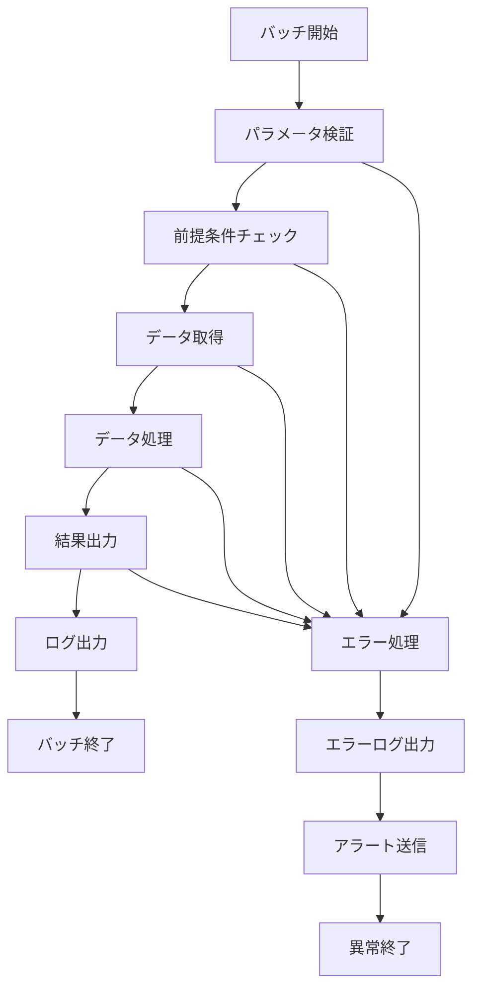

# バッチ仕様書：{{batch_name}} ({{batch_id}})

## 1. 基本情報

| 項目 | 内容 |
|------|------|
| **バッチID** | {{batch_id}} |
| **バッチ名** | {{batch_name}} |
| **実行スケジュール** | {{schedule}} |
| **優先度** | {{priority}} |
| **ステータス** | 未着手 |
| **作成日** | {{current_date}} |
| **最終更新日** | {{current_date}} |

## 2. バッチ概要

### 2.1 概要・目的
{{description}}

### 2.2 関連テーブル
{{#each related_tables}}
- [{{this}}](../database/tables/テーブル定義書_{{this}}.md)
{{/each}}

### 2.3 関連API
{{#each related_apis}}
- [{{this}}](../api/specs/API定義書_{{this}}.md)
{{/each}}

## 3. 実行仕様

### 3.1 実行スケジュール
| 項目 | 設定値 | 備考 |
|------|--------|------|
| 実行頻度 | {{schedule}} | cron形式 |
| 実行時間 | 02:00 | 深夜バッチ |
| タイムアウト | 60分 | 最大実行時間 |
| リトライ回数 | 3回 | 失敗時の再実行 |

### 3.2 実行条件
| 条件 | 内容 | 備考 |
|------|------|------|
| 前提条件 | 関連システム稼働中 | 依存システムチェック |
| 実行可能時間 | 02:00-05:00 | メンテナンス時間外 |
| 排他制御 | 同一バッチの重複実行禁止 | ロックファイル使用 |

### 3.3 実行パラメータ
| パラメータ名 | データ型 | 必須 | デフォルト値 | 説明 |
|--------------|----------|------|--------------|------|
| tenant_id | string | × | all | 対象テナントID |
| batch_date | date | × | 前日 | 処理対象日 |
| dry_run | boolean | × | false | テスト実行フラグ |

## 4. 処理仕様

### 4.1 処理フロー

### 4.2 詳細処理
1. **初期化処理**
   - パラメータ検証
   - ログファイル初期化
   - 排他制御ロック取得

2. **前処理**
   - 前提条件チェック
   - 対象データ件数確認
   - 処理開始ログ出力

3. **主処理**
   - データ取得・変換
   - 業務ロジック実行
   - 結果データ出力

4. **後処理**
   - 処理結果サマリー作成
   - 統計情報更新
   - 排他制御ロック解除

5. **終了処理**
   - 処理完了ログ出力
   - 通知送信（必要に応じて）

## 5. データ仕様

### 5.1 入力データ
| データ名 | 形式 | 取得元 | 説明 |
|----------|------|--------|------|
| 対象データ | DB | {{related_tables}} | 処理対象のマスタデータ |
| パラメータファイル | CSV | /data/input/ | 実行時パラメータ |

### 5.2 出力データ
| データ名 | 形式 | 出力先 | 説明 |
|----------|------|--------|------|
| 処理結果 | DB | {{related_tables}} | 処理済みデータ |
| 実行ログ | LOG | /logs/batch/ | 実行履歴ログ |
| エラーレポート | CSV | /data/output/ | エラー詳細情報 |

### 5.3 データ量見積もり
| 項目 | 件数 | 備考 |
|------|------|------|
| 処理対象件数 | 10,000件/日 | 平均値 |
| 最大処理件数 | 50,000件/日 | ピーク時 |
| 処理時間 | 30分 | 平均実行時間 |

## 6. エラーハンドリング

### 6.1 エラー分類
| エラー種別 | 対応方法 | 通知要否 | 備考 |
|------------|----------|----------|------|
| システムエラー | 処理中断・リトライ | ○ | DB接続エラー等 |
| データエラー | エラーログ出力・継続 | △ | データ不整合等 |
| 業務エラー | エラーレポート出力 | × | 業務ルール違反等 |

### 6.2 リトライ仕様
| 条件 | リトライ回数 | 間隔 | 備考 |
|------|--------------|------|------|
| DB接続エラー | 3回 | 5分 | 指数バックオフ |
| ファイルI/Oエラー | 2回 | 1分 | 固定間隔 |
| 外部API呼び出しエラー | 5回 | 30秒 | 指数バックオフ |

### 6.3 異常終了時の処理
1. 処理中断
2. ロールバック実行
3. エラーログ出力
4. アラート送信
5. 排他制御ロック解除

## 7. 監視・運用

### 7.1 監視項目
| 監視項目 | 閾値 | アラート条件 | 対応方法 |
|----------|------|--------------|----------|
| 実行時間 | 60分 | 超過時 | 処理見直し |
| エラー率 | 5% | 超過時 | 原因調査 |
| 処理件数 | 期待値±20% | 乖離時 | データ確認 |

### 7.2 ログ出力
| ログ種別 | 出力レベル | 出力内容 | 保存期間 |
|----------|------------|----------|----------|
| 実行ログ | INFO | 処理開始・終了・進捗 | 3ヶ月 |
| エラーログ | ERROR | エラー詳細・スタックトレース | 1年 |
| デバッグログ | DEBUG | 詳細処理内容 | 1週間 |

### 7.3 アラート通知
| 通知条件 | 通知先 | 通知方法 | 備考 |
|----------|--------|----------|------|
| 異常終了 | 運用チーム | メール・Slack | 即座に通知 |
| 処理時間超過 | 開発チーム | Slack | 業務時間内のみ |
| データ異常 | 業務担当者 | メール | 翌営業日まで |

## 8. 非機能要件

### 8.1 パフォーマンス
- 処理時間：60分以内
- メモリ使用量：2GB以内
- CPU使用率：80%以内

### 8.2 可用性
- 成功率：99%以上
- リトライ機能による自動復旧
- 障害時の手動実行機能

### 8.3 セキュリティ
- 実行権限の制限
- ログファイルのアクセス制御
- 機密データの暗号化

## 9. テスト仕様

### 9.1 単体テスト
| テストケース | 入力条件 | 期待結果 |
|--------------|----------|----------|
| 正常処理 | 正常データ | 正常終了 |
| データなし | 対象データ0件 | 正常終了（処理件数0） |
| 大量データ | 最大件数 | 正常終了 |

### 9.2 異常系テスト
| テストケース | 入力条件 | 期待結果 |
|--------------|----------|----------|
| DB接続エラー | DB停止状態 | リトライ後異常終了 |
| ディスク容量不足 | 容量不足状態 | 異常終了・アラート |
| 不正パラメータ | 不正な日付 | パラメータエラー |

## 10. 実装メモ

### 10.1 技術仕様
- 言語：Node.js
- フレームワーク：なし（Pure Node.js）
- DB接続：Prisma
- ログ出力：Winston

### 10.2 注意事項
- マルチテナント対応必須
- 大量データ処理時のメモリ管理
- 長時間実行時のタイムアウト対策

### 10.3 デプロイ・実行環境
- 実行サーバー：バッチサーバー
- 実行ユーザー：batch_user
- 実行ディレクトリ：/opt/batch/
- 設定ファイル：/etc/batch/config.json

---

**改訂履歴**

| バージョン | 日付 | 変更者 | 変更内容 |
|------------|------|--------|----------|
| 1.0 | {{current_date}} | システムアーキテクト | 初版作成 |
