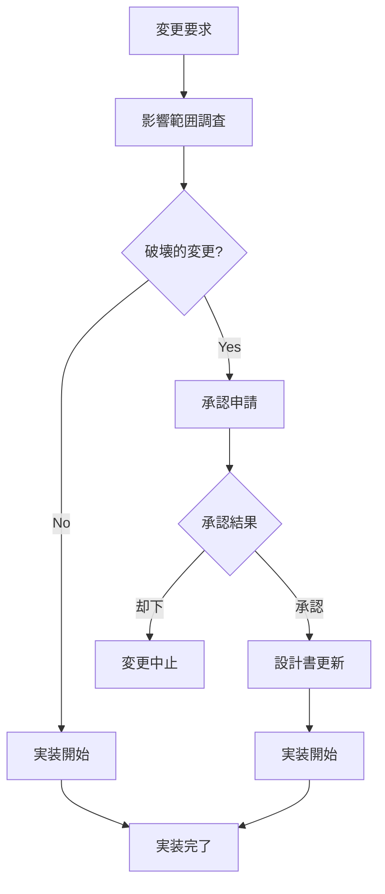

# 仕様書準拠・破壊的修正防止ガイドライン

## 基本方針

### 仕様書準拠の強制
- **docs/配下の仕様書が唯一の真実**: 全実装はdocs/配下の設計書に従う
- **破壊的修正の禁止**: 既存機能の破壊的変更は原則禁止
- **影響範囲調査の必須化**: 修正前に必ず影響範囲を調査・報告
- **承認プロセスの徹底**: 重要な変更は必ずユーザー承認を得る

### 設計書との整合性保証
- **実装前の仕様書確認**: コード実装前に必ず対応する設計書を確認
- **設計書の更新**: 仕様変更時は設計書を先に更新
- **トレーサビリティ**: 要求仕様ID→設計書→実装の一貫性を保証

## docs/配下の仕様書構造

### 設計書カテゴリ
```
docs/
├── requirements/           # 要件定義
│   ├── 要件定義.md
│   ├── プロジェクト基本情報_改訂版.md
│   └── UI_UX共通仕様書.md
├── design/                # 設計仕様
│   ├── screens/           # 画面設計
│   ├── api/              # API設計
│   ├── database/         # データベース設計
│   ├── batch/            # バッチ設計
│   ├── architecture/     # アーキテクチャ設計
│   └── interfaces/       # インターフェース設計
└── testing/              # テスト仕様
```

### 設計書の優先順位
1. **要件定義**: 最上位の仕様（変更時は全体影響）
2. **アーキテクチャ設計**: システム全体設計（変更時は広範囲影響）
3. **API設計**: インターフェース仕様（変更時は連携影響）
4. **画面設計**: UI/UX仕様（変更時はフロントエンド影響）
5. **データベース設計**: データ構造仕様（変更時はデータ影響）
6. **バッチ設計**: バッチ処理仕様（変更時は運用影響）

## 実装前の必須確認プロセス

### 1. 要求仕様IDの確認
```typescript
// 実装時の必須コメント例
/**
 * 要求仕様ID: SKL.1-HIER.1
 * 対応設計書: docs/design/screens/specs/画面設計書_SCR-SKILL_スキル画面.md
 * 実装内容: スキル階層表示機能
 */
export function SkillHierarchyComponent() {
  // 実装内容
}
```

### 2. 設計書との整合性チェック
- **画面ID**: 設計書の画面IDと実装のコンポーネント名が一致
- **API仕様**: エンドポイント・リクエスト・レスポンス形式が一致
- **データベース**: テーブル構造・制約・インデックスが一致
- **バッチ仕様**: 処理内容・実行タイミング・エラーハンドリングが一致

### 3. 非機能要件の確認
- **パフォーマンス**: レスポンス時間1秒以内の要件
- **アクセシビリティ**: WCAG 2.1 AA準拠の要件
- **セキュリティ**: 認証・認可・暗号化の要件
- **マルチテナント**: テナント分離の要件

## 破壊的修正の定義と禁止事項

### 破壊的修正の定義
1. **API仕様の変更**: エンドポイント・パラメータ・レスポンス形式の変更
2. **データベース構造変更**: テーブル・カラム・制約の削除・変更
3. **画面レイアウト変更**: 既存UIの大幅な変更・削除
4. **機能の削除**: 既存機能の削除・無効化
5. **設定値の変更**: 既存の設定・デフォルト値の変更

### 禁止される修正例
```typescript
// ❌ 禁止: APIレスポンス形式の破壊的変更
// 既存: { success: boolean, data: User[] }
// 変更: { status: string, users: User[] } // 破壊的変更

// ❌ 禁止: 既存プロパティの削除
interface User {
  id: number;
  name: string;
  // email: string; // 既存プロパティの削除は禁止
}

// ❌ 禁止: 既存関数のシグネチャ変更
// 既存: function getUser(id: number): User
// 変更: function getUser(id: string): User // 破壊的変更
```

### 許可される修正例
```typescript
// ✅ 許可: 新しいプロパティの追加（オプショナル）
interface User {
  id: number;
  name: string;
  email: string;
  department?: string; // 新規追加はOK
}

// ✅ 許可: 新しいAPIエンドポイントの追加
// 既存: GET /api/users
// 追加: GET /api/users/search // 新規追加はOK

// ✅ 許可: 内部実装の改善（外部インターフェース不変）
function calculateSkillScore(skills: Skill[]): number {
  // 内部ロジックの改善は外部に影響しないためOK
  return skills.reduce((sum, skill) => sum + skill.level, 0);
}
```

## 修正時の影響範囲調査

### 1. 影響範囲調査チェックリスト
- [ ] **API影響**: 変更するAPIを使用している箇所の特定
- [ ] **データベース影響**: 変更するテーブル・カラムを使用している箇所の特定
- [ ] **UI影響**: 変更する画面・コンポーネントを使用している箇所の特定
- [ ] **バッチ影響**: 変更する処理に依存するバッチ・ジョブの特定
- [ ] **外部連携影響**: 外部システムとの連携に影響する変更の特定

### 2. 影響範囲調査の実施方法
```bash
# コード検索による影響範囲調査例
# 特定の関数・API・テーブルの使用箇所を検索
grep -r "getUserProfile" src/
grep -r "/api/users" src/
grep -r "users_table" src/

# 設計書での影響範囲確認
find docs/ -name "*.md" -exec grep -l "API-021" {} \;
find docs/ -name "*.md" -exec grep -l "SCR-SKILL" {} \;
```

### 3. 影響範囲報告書テンプレート
```markdown
# 影響範囲調査報告書

## 変更概要
- **対象**: [変更対象の機能・API・テーブル等]
- **変更内容**: [具体的な変更内容]
- **要求仕様ID**: [対応する要求仕様ID]

## 影響範囲
### フロントエンド
- [ ] 影響なし
- [ ] 影響あり: [具体的な影響箇所]

### バックエンド
- [ ] 影響なし
- [ ] 影響あり: [具体的な影響箇所]

### データベース
- [ ] 影響なし
- [ ] 影響あり: [具体的な影響箇所]

### 外部連携
- [ ] 影響なし
- [ ] 影響あり: [具体的な影響箇所]

## 対応方針
- [影響箇所への対応方針]
- [移行計画・スケジュール]
- [リスク軽減策]

## 承認要否
- [ ] 軽微な変更（承認不要）
- [ ] 重要な変更（承認必要）
```

## 承認プロセス

### 1. 承認が必要な変更
- **破壊的変更**: API・データベース・UI の破壊的変更
- **新機能追加**: 新しい要求仕様IDに対応する機能追加
- **非機能要件変更**: パフォーマンス・セキュリティ要件の変更
- **外部連携変更**: 外部システムとの連携仕様変更

### 2. 承認プロセスフロー


### 3. 承認申請テンプレート
```markdown
# 変更承認申請

## 申請者情報
- **申請者**: [氏名]
- **申請日**: [YYYY-MM-DD]
- **緊急度**: [高/中/低]

## 変更内容
- **要求仕様ID**: [対応する要求仕様ID]
- **変更対象**: [API/データベース/UI/バッチ等]
- **変更理由**: [変更が必要な理由]
- **変更内容**: [具体的な変更内容]

## 影響範囲
- **影響システム**: [影響を受けるシステム・機能]
- **影響ユーザー**: [影響を受けるユーザー・業務]
- **ダウンタイム**: [必要な場合のダウンタイム]

## 対応計画
- **実装スケジュール**: [実装予定日程]
- **テスト計画**: [テスト内容・スケジュール]
- **リリース計画**: [リリース予定日・手順]
- **ロールバック計画**: [問題発生時の復旧手順]

## リスク評価
- **技術リスク**: [技術的なリスクと対策]
- **業務リスク**: [業務への影響とリスク]
- **運用リスク**: [運用面でのリスクと対策]
```

## 設計書更新プロセス

### 1. 設計書更新の原則
- **実装前更新**: コード実装前に設計書を更新
- **バージョン管理**: 設計書の変更履歴を適切に管理
- **整合性確認**: 関連する設計書との整合性を確認
- **レビュー実施**: 設計書変更のレビューを実施

### 2. 設計書更新手順
```bash
# 1. 設計書の現状確認
git status docs/design/

# 2. 関連設計書の特定
find docs/design/ -name "*.md" -exec grep -l "SKL.1-HIER.1" {} \;

# 3. 設計書の更新
# 対象の設計書を編集

# 4. 整合性確認
# 関連する設計書との整合性をチェック

# 5. コミット（設計書更新専用）
git add docs/design/
git commit -m "📚 docs: SKL.1-HIER.1 スキル階層設計書を更新"
```

### 3. 設計書変更時の必須確認事項
- [ ] **要求仕様IDの一致**: 変更内容が要求仕様IDと一致している
- [ ] **関連設計書の更新**: 影響する他の設計書も同時に更新
- [ ] **実装との整合性**: 既存実装との整合性を確認
- [ ] **テスト仕様の更新**: 必要に応じてテスト仕様も更新

## 実装時の遵守事項

### 1. コード実装時の必須事項
```typescript
// 必須: 要求仕様IDとファイルパスの明記
/**
 * 要求仕様ID: API-021
 * 設計書: docs/design/api/specs/API定義書_API-021_スキル情報取得API.md
 * 実装日: 2025-06-04
 * 実装者: [開発者名]
 */

// 必須: 設計書との整合性確認コメント
/**
 * 設計書準拠確認:
 * - エンドポイント: GET /api/skills ✓
 * - レスポンス形式: { success: boolean, data: Skill[] } ✓
 * - エラーハンドリング: 400, 401, 500 ✓
 */
export async function GET(request: NextRequest) {
  // 実装内容
}
```

### 2. 設計書からの逸脱時の対応
```typescript
// 設計書からの逸脱が必要な場合の対応例
/**
 * 設計書逸脱事項:
 * - 設計書: レスポンス形式 { data: Skill[] }
 * - 実装: レスポンス形式 { success: boolean, data: Skill[] }
 * - 理由: エラーハンドリングの統一のため
 * - 承認: [承認者名] [承認日]
 * - 設計書更新: [更新予定日]
 */
```

## 品質保証・監査

### 1. 設計書準拠の自動チェック
```bash
# 設計書準拠チェックスクリプト例
#!/bin/bash

# 要求仕様IDの存在チェック
echo "要求仕様ID存在チェック..."
find src/ -name "*.ts" -name "*.tsx" | xargs grep -L "要求仕様ID:" | head -10

# 設計書参照の存在チェック
echo "設計書参照チェック..."
find src/ -name "*.ts" -name "*.tsx" | xargs grep -L "設計書:" | head -10

# API仕様との整合性チェック
echo "API仕様整合性チェック..."
# 実装とAPI仕様書の比較ロジック
```

### 2. 定期的な整合性監査
- **週次**: 新規実装の設計書準拠チェック
- **月次**: 既存実装と設計書の整合性確認
- **リリース前**: 全体的な整合性監査

## 禁止事項・注意事項

### 禁止事項
- 設計書確認なしの実装
- 破壊的変更の無承認実行
- 要求仕様IDなしのコード作成
- 設計書との不整合を含む実装

### 注意事項
- 実装前に必ず対応する設計書を確認
- 変更時は影響範囲を必ず調査
- 破壊的変更は必ず承認を得る
- 設計書更新は実装前に実施

---

この仕様書準拠・破壊的修正防止ガイドラインに従って、安全で一貫性のある開発を進めてください。
