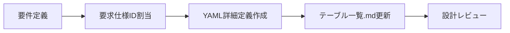

# データベース設計ガイドライン

## 基本設計原則

### 1. マルチテナント対応の徹底
- **テナントID必須**: 全テーブルに`tenant_id`カラムを必須で追加
- **データ分離**: テナント間の完全なデータ分離を保証
- **アクセス制御**: 全クエリでテナントIDによるフィルタリング必須
- **インデックス設計**: テナントIDを含む複合インデックスの設計

### 2. テーブル命名規則の厳守
- **MST_**: マスタ系テーブル（ユーザー、ロール、部署、スキル階層等）
- **TRN_**: トランザクション系テーブル（スキル情報、目標進捗、案件実績等）
- **HIS_**: 履歴系テーブル（監査ログ、操作履歴等）
- **SYS_**: システム系テーブル（検索インデックス、システムログ、トークン等）
- **WRK_**: ワーク系テーブル（一括登録ジョブログ、バッチワーク等）
- **IF_**: インターフェイス系テーブル（外部連携・インポート/エクスポート用）

### 3. パフォーマンス要件の明確化
- **マスタ系**: 高速参照重視（5-10ms以内）
- **トランザクション系**: バランス重視（15-50ms以内）
- **システム系**: 書き込み重視、参照は許容範囲
- **履歴系**: 書き込み重視、参照は低頻度
- **ワーク系**: 処理効率重視

## テーブル定義書作成ツール統合ワークフロー

### Phase 1: 設計フェーズ


#### 1.1 要件定義
- **業務要件**: 機能要件からテーブル仕様を策定
- **非機能要件**: パフォーマンス・セキュリティ・運用要件の明確化
- **データ量見積**: 初期データ件数・月間増加件数・5年後想定件数の算出
- **アーカイブ条件**: データ保持期間・削除条件の設定

#### 1.2 要求仕様ID割当
- **カテゴリ分類**: TNT, PLT, ACC, PRO, SKL, CAR, WPM, TRN, RPT, NTF
- **ID体系**: {カテゴリ}.{番号}-{サブカテゴリ}.{番号}
- **トレーサビリティ**: 要求仕様IDとテーブル・カラムの対応関係明確化

#### 1.3 YAML詳細定義作成
```yaml
# table-details/{テーブル名}_details.yaml
table_name: "MST_Employee"
logical_name: "社員基本情報"
category: "マスタ系"
priority: "最高"
requirement_id: "PRO.1-BASE.1"

columns:
  - name: "id"
    type: "VARCHAR(50)"
    nullable: false
    primary_key: true
    comment: "プライマリキー（UUID）"
    requirement_id: "PLT.1-WEB.1"
  
  - name: "tenant_id"
    type: "VARCHAR(50)"
    nullable: false
    comment: "マルチテナント識別子"
    requirement_id: "TNT.1-MGMT.1"

indexes:
  - name: "idx_employee_tenant"
    columns: ["tenant_id"]
    unique: false
    comment: "テナント別検索用インデックス"

foreign_keys:
  - name: "fk_employee_tenant"
    columns: ["tenant_id"]
    references:
      table: "MST_Tenant"
      columns: ["id"]
    on_update: "CASCADE"
    on_delete: "RESTRICT"
```

### Phase 2: 自動生成フェーズ
```bash
# 基本的な使用方法
cd ~/skill-report-web/docs/design/database/tools
python3 -m table_generator --table [テーブル名] --verbose

# 複数テーブル一括生成
python3 -m table_generator --table MST_Employee,MST_Department,MST_Position

# カテゴリ別生成
python3 -m table_generator --table MST_* --verbose
```

#### 2.1 生成される出力ファイル
- **Markdown定義書**: `tables/テーブル定義書_{テーブル名}_{論理名}.md`
- **DDLファイル**: `ddl/{テーブル名}.sql`
- **サンプルデータ**: `data/{テーブル名}_sample_data.sql`

#### 2.2 自動生成内容
- **CREATE TABLE文**: データ型、制約、文字セット対応
- **インデックス**: 通常・ユニークインデックス
- **外部キー制約**: 参照整合性、CASCADE設定
- **共通カラム**: created_at, updated_at, is_deleted等の自動追加

### Phase 3: 品質保証フェーズ
```bash
# 全体整合性チェック
python run_check.py --verbose

# 特定テーブルのみチェック
python run_check.py --tables MST_Employee,MST_Department

# 特定のチェックのみ実行
python run_check.py --checks table_existence,column_consistency
```

#### 3.1 自動チェック項目
- ✅ **テーブル存在整合性**: 全ソース間でのテーブル定義一致
- ✅ **カラム定義整合性**: YAML ↔ DDL ↔ 定義書の整合性
- ✅ **外部キー整合性**: 参照関係の妥当性チェック
- ✅ **データ型整合性チェック** (v1.2.0で追加): DDLとYAML間のデータ型完全一致・互換性チェック
  - データ型の完全一致・互換性チェック
  - 長さ制約の比較（VARCHAR(50) vs VARCHAR(100)等）
  - NULL制約の整合性（NOT NULL vs NULL許可）
  - デフォルト値の比較
  - ENUM値の整合性
- ✅ **孤立ファイル検出**: 未使用・重複ファイルの特定
- ✅ **命名規則チェック**: プレフィックス・命名規則の準拠確認

#### 3.2 手動レビュー項目
- 📋 **業務要件との整合性**: 要求仕様IDとの対応確認
- 🔗 **エンティティ関連の妥当性**: 正規化・非正規化の適切性
- 📊 **パフォーマンス要件**: インデックス設計・クエリ最適化
- 🔒 **セキュリティ要件**: 暗号化・アクセス制御の実装
- 🏗️ **マルチテナント対応**: テナント分離の実装確認

## 実践的な開発フロー

### 新規テーブル追加時の標準フロー
```bash
# 1. 要求仕様ID確認・割当
# 要求仕様書で対応するIDを確認

# 2. YAML詳細定義作成
# table-details/{テーブル名}_details.yamlを作成

# 3. テーブル一覧.md更新
# 新規テーブルをテーブル一覧に追加

# 4. 自動生成実行
cd ~/skill-report-web/docs/design/database/tools
python3 -m table_generator --table NEW_TABLE --verbose

# 5. 個別整合性チェック
python run_check.py --tables NEW_TABLE

# 6. 全体整合性確認
python run_check.py --verbose

# 7. 設計レビュー実施
# 業務要件・非機能要件・マルチテナント対応の確認

# 8. Git コミット
cd ~/skill-report-web
git add .
git commit -m "🆕 feat: NEW_TABLEテーブル追加

要求仕様ID: XXX.X-XXX.X
- YAML詳細定義作成
- 自動生成ツールによる定義書・DDL・サンプルデータ生成
- 整合性チェック通過確認
- マルチテナント対応実装"
```

### 既存テーブル修正時の標準フロー
```bash
# 1. 影響範囲調査
# 修正対象テーブルの参照関係・依存関係を確認

# 2. YAML詳細定義修正
# table-details/{テーブル名}_details.yamlを更新

# 3. 該当テーブルのみ再生成
python3 -m table_generator --table MODIFIED_TABLE --verbose

# 4. 影響範囲チェック
python run_check.py --checks foreign_key_consistency

# 5. 関連テーブルの整合性確認
python run_check.py --tables MODIFIED_TABLE,RELATED_TABLE

# 6. 破壊的変更チェック
# 既存データ・既存機能への影響を確認

# 7. Git コミット
git add .
git commit -m "🔧 fix: MODIFIED_TABLEテーブル修正

要求仕様ID: XXX.X-XXX.X
- カラム追加/修正: {変更内容}
- 影響範囲: {関連テーブル・機能}
- 破壊的変更: なし/あり（詳細）
- 整合性チェック通過確認"
```

### 一括メンテナンス作業
```bash
# 全テーブル再生成（大規模変更時）
python3 -m table_generator --verbose

# 全体整合性チェック（レポート出力）
python run_check.py --verbose --output-format markdown --output-file consistency_report.md

# 孤立ファイル検出・クリーンアップ
python run_check.py --checks orphaned_files

# パフォーマンス監視レポート生成
# 想定データ量との乖離・応答時間の確認
```

## 品質保証・整合性チェック

### 自動チェック詳細

#### 1. テーブル存在整合性チェック
```python
# チェック対象
- テーブル一覧.md
- entity_relationships.yaml
- DDLファイル (ddl/*.sql)
- テーブル詳細定義ファイル (table-details/*.yaml)

# エラー例
❌ テーブル一覧.mdに定義されていません
❌ DDLファイルが存在しません
⚠️ エンティティ関連定義に存在しません
```

#### 2. カラム定義整合性チェック
```python
# チェック対象
- YAML詳細定義のカラム定義
- DDLファイルのCREATE TABLE文
- Markdown定義書のカラム一覧

# エラー例
❌ データ型が一致しません: YAML(VARCHAR(50)) ≠ DDL(VARCHAR(100))
❌ NOT NULL制約が一致しません
❌ デフォルト値が一致しません
```

#### 3. 外部キー整合性チェック
```python
# チェック対象
- 参照先テーブルの存在確認
- 参照先カラムのデータ型一致確認
- CASCADE/RESTRICT設定の妥当性確認

# エラー例
❌ 参照先テーブル 'MST_Department' が存在しません
❌ 参照先カラムのデータ型が一致しません
⚠️ CASCADE設定により意図しないデータ削除の可能性
```

### 手動レビューチェックリスト

#### 業務要件との整合性
- [ ] 要求仕様IDが全テーブル・全カラムに割り当てられている
- [ ] 業務ルールがテーブル制約として適切に実装されている
- [ ] データ項目の定義が業務要件と一致している
- [ ] 必須項目・任意項目の設定が適切である

#### エンティティ関連の妥当性
- [ ] 正規化が適切に行われている（第3正規形まで）
- [ ] 非正規化の判断が妥当である（パフォーマンス要件に基づく）
- [ ] エンティティ間の関連が適切に定義されている
- [ ] 循環参照が発生していない

#### パフォーマンス要件
- [ ] インデックス設計が検索パターンに適している
- [ ] 複合インデックスの列順序が最適化されている
- [ ] 不要なインデックスが存在しない
- [ ] パーティショニングの検討が必要な大量データテーブルを特定

#### セキュリティ要件
- [ ] 個人情報含有テーブルで暗号化が設定されている
- [ ] 機密情報レベルに応じたアクセス制御が設計されている
- [ ] 監査証跡テーブルで改ざん防止策が実装されている
- [ ] パスワード等の機密データがハッシュ化されている

#### マルチテナント対応
- [ ] 全テーブルにtenant_idカラムが追加されている
- [ ] テナントIDを含む複合インデックスが設計されている
- [ ] 外部キー制約でテナント間の参照が防止されている
- [ ] 共有マスタテーブルの設計が適切である

## 定期メンテナンス指針

### 月次作業
```bash
# 1. 全体整合性チェック実行
python run_check.py --verbose --output-file monthly_check.log

# 2. 新規追加テーブルの品質確認
# 要求仕様IDとの対応確認
# 命名規則準拠確認
# マルチテナント対応確認

# 3. パフォーマンス監視
# 想定データ量との乖離チェック
# 応答時間の監視結果確認
# スロークエリの分析

# 4. セキュリティ監査
# 個人情報・機密情報含有テーブルの確認
# アクセスログの分析
# 暗号化設定の確認
```

### 四半期作業
```bash
# 1. 孤立ファイル・重複ファイルのクリーンアップ
python run_check.py --checks orphaned_files
# 検出されたファイルの手動確認・削除

# 2. パフォーマンス要件の見直し
# 応答時間・データ量の再評価
# インデックス設計の最適化
# パーティショニング戦略の検討

# 3. セキュリティ監査
# 個人情報・機密情報含有テーブルの棚卸
# アクセス権限の見直し
# 暗号化アルゴリズムの更新検討

# 4. アーカイブ実行計画
# 各テーブルの保持期間確認
# アーカイブ対象データの特定
# アーカイブ実行スケジュール策定
```

### 半期作業
```bash
# 1. ツール機能の見直し・改善
# table_generatorの機能拡張検討
# database_consistency_checkerの新機能追加
# 自動化スクリプトの改善

# 2. 設計方針の更新
# 技術トレンドへの対応
# 業務要件変化への対応
# パフォーマンス要件の見直し

# 3. アーカイブ実行
# 各テーブルの条件に従ったデータアーカイブ
# アーカイブデータの検証
# 本番環境からの削除実行

# 4. 災害復旧テスト
# バックアップデータからの復旧テスト
# データ整合性の確認
# 復旧手順の見直し
```

## 品質指標・成功基準

### 設計品質指標
- **整合性チェック通過率**: 100%維持（必須）
- **要求仕様ID対応率**: 100%（全テーブル・全カラム）
- **命名規則準拠率**: 100%（プレフィックス・命名規則）
- **ドキュメント自動生成率**: 95%以上
- **マルチテナント対応率**: 100%（全テーブル）

### 開発効率指標
- **新規テーブル追加時間**: 30分以内（設計〜生成〜チェック完了）
- **既存テーブル修正時間**: 15分以内（修正〜チェック完了）
- **整合性チェック実行時間**: 5分以内（全テーブル）
- **エラー修正時間**: 問題発見から修正完了まで1時間以内
- **自動生成成功率**: 95%以上（エラーなしでの生成）

### 運用品質指標
- **データ量監視**: 想定値の150%を超えた場合はアラート
- **パフォーマンス監視**: 応答時間が設定値の120%を超えた場合は調査
- **セキュリティ監査**: 個人情報・機密情報含有テーブルは月次監査
- **アーカイブ実行**: 各テーブルの条件に従い自動実行
- **可用性**: 99.5%以上を維持

## トラブルシューティング・FAQ

### よくある問題と解決方法

#### 1. 整合性チェックエラー
```bash
# 問題: テーブル存在整合性エラー
❌ MST_Department: DDLファイルが存在しません

# 解決方法
# 1. エラー詳細確認
python run_check.py --verbose --tables MST_Department

# 2. 個別ファイル確認
ls -la table-details/MST_Department_details.yaml
ls -la ddl/MST_Department.sql
ls -la tables/テーブル定義書_MST_Department_*.md

# 3. 再生成実行
python3 -m table_generator --table MST_Department --verbose

# 4. 再チェック
python run_check.py --tables MST_Department
```

#### 2. DDL生成エラー
```bash
# 問題: YAML構文エラー
❌ YAML解析エラー: mapping values are not allowed here

# 解決方法
# 1. YAML構文チェック
python3 -c "import yaml; yaml.safe_load(open('table-details/MST_Employee_details.yaml'))"

# 2. インデント・構文確認
# - インデントはスペース2文字で統一
# - コロン後にスペース必須
# - 文字列は引用符で囲む

# 3. 再生成実行
python3 -m table_generator --table MST_Employee --verbose
```

#### 3. 外部キー制約エラー
```bash
# 問題: 外部キー制約違反
❌ 参照先テーブル 'MST_Department' が存在しません

# 解決方法
# 1. 参照先テーブルの存在確認
python run_check.py --tables MST_Department

# 2. 参照先テーブルの生成
python3 -m table_generator --table MST_Department

# 3. 参照元テーブルの再生成
python3 -m table_generator --table MST_Employee

# 4. 外部キー整合性チェック
python run_check.py --checks foreign_key_consistency
```

#### 4. パフォーマンス問題
```bash
# 問題: 応答時間が設定値を超過
⚠️ MST_Employee: SELECT応答時間 15ms > 設定値 10ms

# 解決方法
# 1. インデックス設計の見直し
# - 検索条件に使用されるカラムにインデックス追加
# - 複合インデックスの列順序最適化

# 2. クエリの最適化
# - WHERE句の条件見直し
# - JOINの最適化
# - 不要なカラムの除外

# 3. データ量の確認
# - 想定データ量との乖離確認
# - パーティショニングの検討
```

### 緊急時対応フロー
```
1. 問題発見
   ↓
2. 影響範囲特定
   - 関連テーブル・機能の確認
   - ユーザー影響度の評価
   ↓
3. 根本原因分析
   - ログ・エラーメッセージの確認
   - 設定・データの確認
   ↓
4. 応急処置
   - サービス継続のための一時対応
   - ユーザー通知
   ↓
5. 恒久対策
   - YAML修正
   - 再生成実行
   - 整合性確認
   ↓
6. 再発防止策
   - チェック項目の追加
   - 手順の見直し
   ↓
7. Git コミット
   - 修正内容の記録
   - 影響範囲の明記
```

## 関連ドキュメント

### 内部ドキュメント
- **テーブル一覧**: `docs/design/database/テーブル一覧.md`
- **エンティティ関連図**: `docs/design/database/エンティティ関連図.md`
- **ツール詳細ガイド**: `docs/design/database/tools/README.md`
- **整合性チェックツール**: `docs/design/database/tools/database_consistency_checker/README.md`

### 外部参照
- **PostgreSQL公式ドキュメント**: https://www.postgresql.org/docs/
- **Prisma公式ドキュメント**: https://www.prisma.io/docs/
- **マルチテナント設計パターン**: 06-multitenant-development.md
- **バックエンド設計ガイドライン**: 04-backend-guidelines.md

---

このガイドラインに従って、効率的で品質の高いDB設計・開発を実現してください。
