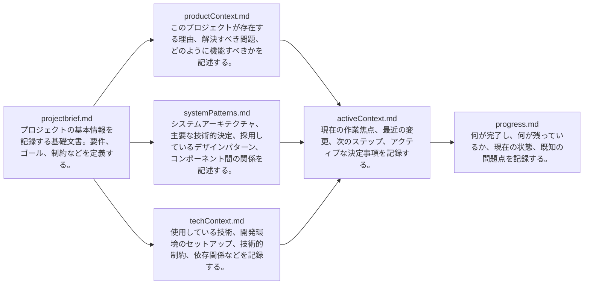

# 年間スキル報告書WEB化PJT

---

# プロジェクト基本方針

---

## エス・エー・エスの基本方針
### 使命
- すべては笑顔のために ～世の中のすべての人を笑顔にする～

### 経営理念
- 常に質の高いサービスを提供し  
会社のスキルアップを通じて  
SAS全メンバーの生活水準の向上を図る  
と共に社会の笑顔に貢献していく  

### 経営ビジョン
- ITサービスで社会に笑顔をとどける会社になる

### ブランドコンセプト

- Make IT Smile.  
ITと笑顔を掛け合わせた Make It Smileという標語として作成しました。  
「make it ◯◯◯」＝◯◯◯にさせることをうまく活用し、「笑顔にする」というストレートな表現をしています。  
itをIT（大文字）とすることで、ITソリューションを提供する会社であることを表現しています。  
最後のピリオドで、強い意志（想い）を表現しています。  

- 社会に笑顔を実装するスマイルテック・カンパニー  
使命・理念・ビジョンで掲げられる「笑顔」を他社との差別化できるキーワードとして活用しています。  
「テック」というキーワードを入れることで、事業領域を目立たせています。  
提供価値・ソリューションであるテックというワードと笑顔を掛け合わせることで、シンプルながらコンパクトなキーワードとして活用しやすい文字数としました。  

---
## DX推進チーム基本方針

### DX推進​チーム 全体基本方針
#### DX戦略 背景・目的​
「ＩＴサービスで社会に笑顔をとどける会社になる」​を実現するために​  
我々は「ＩＴサービスで社会に笑顔をとどける会社になる」を経営ビジョンに掲げ​事業しているが、ユーザーとしてIT体験が少なく、価値を理解できているのだろうか…？​  
DX推進では、社内のIT導入促進・業務改善をメンバーと共に創り上げ、運営することで​IT価値を体験できるよう変革し、更にSASの組織・事業価値を変革するための​土台作りを推進していくことで、顧客や社会にも笑顔を提供していく​  

#### DX戦略 DX戦略イメージ​
トランスフォーメーションインフラとして3つの基盤を構築し、2つの変革を推進する​ことで顧客や社会に笑顔を提供していく​
- 提供価値の変革
    - ビジネスのトランスフォーメーション​
        - 仮説検証に基づく実験を繰り返し、結果を積み上げ、新たな事業の立ち上げや顧客への価値提供に繋げるためのIT臨床実験の場を提供する​
    - データドリブンによる経営の実現​
        - SoI（System of Insight）の構築によりSAS内部に独自データを蓄積​
        - 蓄積した情報を加工・分析して新たな洞察や知見を得ることで、施策・改善を考案する​
    - 共通プラットフォーム構築​
        - お客様と共に笑顔を生み出すための共通基盤を構築し、新規事業を提供する環境としても活用する
- 組織の変革
    - メンバーが変化に適応できる足場の構築​​
        - スキルのトランスフォーメーション、​業務のデジタル化の実現のために​既存のIT環境などの見直しや再構築を図る​
    - 業務の高度化実現​
        - 基幹・バックオフィスを中心に​業務プロセスを改革する基盤を構築し、​業務効率化の実現から高度化に繋げる​
    - ハイブリットワーク環境の構築​​
        - ゼロトラストセキュリティと​ライフサイクル管理により​いつでもどこでも働ける基盤を構築​

- 参考文献  
[SAS2030経営計画書_DX推進詳細版_v3.0](https://sasbusiness.sharepoint.com/:p:/r/sites/msteams_81e110_093265/Shared%20Documents/%E3%83%9E%E3%83%8D%E3%82%B8%E3%83%A1%E3%83%B3%E3%83%88T/SAS2030%E8%A8%88%E7%94%BB%E7%AD%96%E5%AE%9A/02.%E3%83%AD%E3%83%BC%E3%83%AA%E3%83%B3%E3%82%B0/%E7%AC%AC3.0%E7%89%88/SAS2030%E7%B5%8C%E5%96%B6%E8%A8%88%E7%94%BB%E6%9B%B8_DX%E6%8E%A8%E9%80%B2%E8%A9%B3%E7%B4%B0%E7%89%88_v3.0.pptx?d=we84411bdba944deea167b87ec976cc6b&csf=1&web=1&e=SP3bK9)

### DX推進チーム 2025年度基本方針
#### ビジョン
- DXを価値に変えよ​ -Success for SAS2030-​  

#### 活動方針
1. 「人と社会に笑顔を届けるDX」（DX推進の目的）を実現させるための社内DX活動推進をリードする
    1. SAS2030実行フェーズ3年目として、単なる「変化」ではなく、「定着」や「成果創出」といった視点を持つ​
2. DXを活用し、組織の競争力を強化し、持続的な成長を実現する​
    1. DXの定着は、単なるIT導入や業務効率化ではなく、デジタル技術を活用して市場優位性を確立し、​環境変化に適応しながら新たな価値を創出できる組織になること​
3. SASメンバーの一人ひとりのスキルとキャリアの成長を加速する​
    1. DXを特定のチームやプロジェクトだけでなく、全社の働き方・考え方に浸透させる​
4. 変化に迅速に適用できる柔軟な組織の構築​
    1. 業務のデジタル化・標準化 により、属人化を解消し、組織全体の対応速度を向上させる​

- 参考文献  
[DX推進全体定例_20250520](https://sasbusiness.sharepoint.com/:p:/r/sites/msteams_81e110_093265/Shared%20Documents/%E3%83%9E%E3%83%8D%E3%82%B8%E3%83%A1%E3%83%B3%E3%83%88T/DX%E6%96%B9%E9%87%9D/2025%E5%B9%B4%E5%BA%A6/DX%E6%8E%A8%E9%80%B2%E5%85%A8%E4%BD%93%E5%AE%9A%E4%BE%8B_20250520.pptx?d=wf9b6ebf9dba34b57b4989f7a6a8ff5c1&csf=1&web=1&e=K6n760)

---
## AI推進チーム基本方針

### AI推進​チーム 全体基本方針

#### 2030年(SAS2030)に向けての目的
- AIで業務効率化やストレス軽減を実現し、​社会に時間的・精神的な余裕を創造することで笑顔を提供する

#### 2030年(SAS2030)に向けての目標
- AIを駆使したSAS独自のシステム開発支援ツールを提供する​

> 【AI推進チーム内指摘事項】
> 目標は定量的評価に落とし込んだ設定が必要のため再検討
> 対象がAI駆動開発のみに着目されているためAI利活用の観点で再検討

### AI推進​チーム 2025年度基本方針
#### 目的
- AI駆動開発を推進する基盤を作る​
- 社内のAI利用を促進する​

> 【経営推進会議内指摘事項】
> 目的が手段となっているため、何のために活動して何を実現したいのか本来の目的として落とし込んだ設定が必要のため再検討

#### 目標​
- 既存のAI駆動開発ツールを検証して資料にまとめて全社展開する​
- 社内のAI利用状況を調査する​
- バックオフィス業務向けのAIツールの選定、検証する​

> 【経営推進会議内指摘事項】
> 2030年(SAS2030)に向けての目標に対して2025年度の目標設定が必要のため再検討

- 参考文献  
[【AI推進】2025年度キックオフ](https://sasbusiness.sharepoint.com/:p:/r/sites/msteams_81e110_093265/Shared%20Documents/General/99_%E3%82%A2%E3%83%BC%E3%82%AB%E3%82%A4%E3%83%96/43_AI%E6%8E%A8%E9%80%B2TF/2025%E5%B9%B4%E5%BA%A6/%E3%80%90AI%E6%8E%A8%E9%80%B2%E3%80%912025%E5%B9%B4%E5%BA%A6%E3%82%AD%E3%83%83%E3%82%AF%E3%82%AA%E3%83%95.pptx?d=wae26d43d5b6f48f5a1cc4f1ff9ad3783&csf=1&web=1&e=uWD4kn)

---
## プロジェクト基本方針

## プロジェクトの目的

本プロジェクトには2つの主要な目的があります：

1. **AI駆動開発の知見獲得**
   - AI駆動チーム開発を実践し、PJT推進方法を確立する
   - AIアーキテクチャと技術スタックに関するナレッジを習得する
   - チーム内でのAI活用ベストプラクティスを構築する

2. **業務効率化と可視化の実現**
   - 社内で毎年作成している「個人マスタースケジュール／スキル報告書」（Excel フォーマット）をWeb化
   - 手作業での配布・回収・集計作業を自動化
   - **生産性と可視化を向上**させる

## プロジェクト基本情報

| 項目 | 内容 |
|------|------|
| **プロジェクト名** | 年間スキル報告書WEB化PJT |
| **開始日** | 2025年5月 |
| **責任者** | 黒澤 (@yusuke-kurosawa) |
| **PM** | 中島 (@SAS-nakajima) |
| **PL** | 笹尾 (@SAS-sasao) |
|**メンバー**|柏崎（@MichihiroKashiwazaki）|
|**メンバー**|室山（@muroyama）|
|**メンバー**|杉本（@sas-sugimoto）|
|**メンバー**|市川（@sas-ichikawa）|
|**メンバー**|金子晄士 （@Akito-Kaneko）|


## 検証内容・ゴール

### ユーザー体験
- 3 ステップ以内に目的の画面（スキル入力 or レビュー）へ到達できるか

### 技術面
- ページ平均レスポンス < **1 秒** を維持できるか
- 外部APIの使用は可能か

## 要件定義（最低限）

### 機能要件

| ID | 機能 | 補足 |
|------|------|------|
| FR‑01 | **ログイン画面** | SSO またはダミーユーザー認証を実装 |
| FR‑02 | **ダッシュボード** | 年間目標・達成度の可視化（チャート） |
| FR‑03 | **スキル入力画面** | Excel と同等の入力 UI (テーブル + ドロップダウン) |

### 非機能要件

| ID | 要件 | 補足 |
|------|------|------|
| NFR‑01 | **パフォーマンス** | API 〜 UI までレスポンス 1 秒以内 |
| NFR‑02 | **アクセシビリティ** | WCAG 2.1 AA 相当（キーボード操作 & 画面読み上げ） |

## プロジェクトスコープ

### 含まれるもの
- ユーザー認証機能
- スキル入力・編集機能
- ダッシュボード表示機能
- 基本的なレポート機能

### 含まれないもの
- 高度な分析機能
- 他システムとの連携（将来的な拡張可能性として検討）
- モバイルアプリ版（Webアプリのみ）

## 開発・検証の進め方

1. **イテレーション**: 1 週間スプリントで計画 → 実装 → レビュー（毎週金曜に週次レビュー実施）
2. **レビュー方法**: GitHub Pull Request + 毎週火曜日ステークホルダーミーティング
3. **バックログ管理**: Backlogでタスク管理を実施（画面ベースでチケット管理）
4. **変更管理**: ユーザーストーリー単位で Issue を起票し、必要に応じて仕様を更新
5. **WBSと工数管理**: [SharePointリンク](https://sasbusiness.sharepoint.com/:f:/r/sites/msteams_81e110_093265/Shared%20Documents/General/43_AI%E6%8E%A8%E9%80%B2TF/2025%E5%B9%B4%E5%BA%A6/AI%E9%A7%86%E5%8B%95%E9%96%8B%E7%99%BA/%E5%B9%B4%E9%96%93%E3%82%B9%E3%82%AD%E3%83%AB%E5%A0%B1%E5%91%8A%E6%9B%B8WEB%E5%8C%96PJT?csf=1&web=1&e=ZQJDLB)で管理（各メンバーは週次で工数実績を記録）

## プロジェクト成果物

1. Webアプリケーション（フロントエンド + バックエンド）
2. 技術文書・設計書
3. AI駆動開発のナレッジベース
4. ユーザーマニュアル

## プロジェクト終了条件

- 基本機能の実装完了
- 非機能要件の達成確認
- ステークホルダーによる承認
- 知見の文書化と共有

## プロトタイプの扱い

- 今後検討する

---

# memory-bank

## memory-bankとは
Clineなどを利用したAI駆動開発におけるmemory-bankとは、**AIエージェントがプロジェクトの文脈（コンテキスト）や設計・進捗情報を長期的かつ構造的に保持・参照するためのドキュメント群**です。  
AIは通常、セッションごとに内部記憶がリセットされてしまうため、過去の設計判断や現在の状況、技術的な制約などを毎回説明し直す必要がありました。memory-bankはこの課題を解決するために考案されました。

memory-bankはプロジェクトルートに`memory-bank/`ディレクトリを作成し、以下のような複数のMarkdownファイルで構成されます：

- **projectbrief.md**：プロジェクトの基本情報、目的、要件、スコープなどの基盤文書
- **productContext.md**：プロジェクトが解決する課題やユーザー体験、業務フローなど
- **systemPatterns.md**：システムアーキテクチャ、設計パターン、コンポーネントの関係性
- **techContext.md**：使用技術、開発環境、技術的制約、依存関係
- **activeContext.md**：現在の開発フォーカス、最近の変更、次のステップ
- **progress.md**：実装済み機能、未実装機能、既知の問題点、進捗状況



AIエージェント（例：Cline）は、**各タスク開始時に必ずmemory-bankの全ファイルを読み込む**ことで、前回までの経緯やプロジェクトの全体像を正確に把握し、継続的かつ一貫性のあるサポートを実現します。  
この仕組みにより、  
- プロジェクトの知識が属人化せず、チームやAI間で共有される
- 設計判断や進捗が明確に記録され、説明責任やレビューが容易になる
- AIの出力品質が安定し、誤った提案や矛盾した実装が減る  
といったメリットがあります。

また、memory-bankは「AIがすべてを覚えている」状態ではなく、**「ドキュメントに書かれていることだけを信頼する」**という意図的な忘却を前提としています。これにより、AIの記憶の曖昧さや誤解を防ぎ、常に最新かつ正確な情報にもとづいた開発が可能になります。

ClineやCursorなどのオープンソースAI開発支援ツールでは、このmemory-bankの運用がAI駆動開発の基盤となっており、プロジェクトの規模や複雑さに関わらず、**持続的かつ効率的なAI協働開発**を実現するための中核的な仕組みとして位置づけられています。

---

### 本プロジェクトにおける「memory-bank」について
**memory-bank**は、AI駆動開発を行うチームにおいて、各メンバーが使用するAIの出力や設計情報を標準化し、プロジェクト全体の一貫性・効率性・品質を高めるためのドキュメント群です。  
AIと人間の協働開発において、知識や判断基準を共有・蓄積し、チーム全体の認識齟齬や属人化を防ぐ役割を担います。

#### memory-bankの概要

- **目的**  
  チーム全体でAIを活用した開発を進める際、プロジェクトの目的・要求・設計・進捗などの情報を一元管理し、AIの出力や人間の判断を標準化すること。
- **活用シーン**  
  - 新規メンバーやAIエージェントへのオンボーディング
  - 設計・仕様変更時の影響範囲の明確化
  - チーム内コミュニケーションや意思決定の根拠
  - プロジェクトの振り返りやナレッジ共有

---

### memory-bank内のファイル構成

| ファイル名             | 役割・主な記載内容                                                                 | 工程                           | 説明                                                                                         | 備考                                  |
|-----------------------|------------------------------------------------------------------------------------|--------------------------------|----------------------------------------------------------------------------------------------|---------------------------------------|
| projectbrief.md       | プロジェクトの基本情報、目的、背景、スコープ、主要関係者など全体方針の基盤文書       | プロジェクト管理               | プロジェクトの全体像を把握するための基礎文書。目的、背景、スコープ、関係者、方針を明記。      | すべての設計・運用の起点となる        |
| projectbrief.md       | プロジェクトの基本情報、目的、背景、スコープ、主要関係者など全体方針の基盤文書       | 要求仕様                       | 要求の全体像や主要な要求事項をまとめ、プロジェクトの方向性を示す。                           | 要求仕様の大枠として参照              |
| productContext.md     | 解決する課題、ユーザー体験、業務フロー、主要画面遷移、製品の位置づけなど            | 要求仕様                       | ユーザー視点での要求やユースケース、解決すべき課題を具体的に記載。                           | ユーザー視点の要求を記述              |
| productContext.md     | 解決する課題、ユーザー体験、業務フロー、主要画面遷移、製品の位置づけなど            | 業務設計                       | 業務フローや業務シナリオ、業務要件を明確化し、業務観点での設計基準を整理。                   | 業務観点の要件もここに含める          |
| productContext.md     | 解決する課題、ユーザー体験、業務フロー、主要画面遷移、製品の位置づけなど            | 画面設計                       | 主要画面の遷移、画面ごとのユーザー体験、画面設計の全体像を記載。                             | 画面仕様の全体像を記述                |
| systemPatterns.md     | システムアーキテクチャ、設計パターン、機能構成、API方針、バッチ・DB設計方針など    | 機能設計                       | システム構成、機能一覧、主要コンポーネント間の関係性を体系的に整理。                         | 機能設計の全体像                      |
| systemPatterns.md     | システムアーキテクチャ、設計パターン、機能構成、API方針、バッチ・DB設計方針など    | API設計                        | API設計方針やAPI構成、設計パターン、主要APIの概要を記載。                                     | 詳細なAPI仕様はサブファイル化も可      |
| systemPatterns.md     | システムアーキテクチャ、設計パターン、機能構成、API方針、バッチ・DB設計方針など    | バッチ設計                     | バッチ処理の概要、設計方針、処理フロー、スケジュールなどを整理。                              | 詳細はサブファイルやリンクで補完       |
| systemPatterns.md     | システムアーキテクチャ、設計パターン、機能構成、API方針、バッチ・DB設計方針など    | データベース設計               | DB構造、ER図、主要テーブルの概要、設計方針を記載。                                            | 詳細DDLや定義はサブファイル化も可      |
| techContext.md        | 採用技術、開発環境、外部サービス、技術的制約、依存関係など技術コンテキスト          | プロジェクト管理               | 採用技術や開発環境、外部サービス、技術的制約や依存関係など、技術的な前提条件を整理。           | 技術的なリスクや前提条件を明確化        |
| activeContext.md      | 現在の開発フォーカス、最近の変更、次のステップ、課題・対応状況など                  | プロジェクト管理               | 開発の現状、直近の変更、今後の計画、課題・対応状況などを記録し、状況把握と意思決定に活用。     | 変更管理や意思決定の根拠となる        |
| activeContext.md      | 現在の開発フォーカス、最近の変更、次のステップ、課題・対応状況など                  | 各設計工程の変更管理           | 各工程で発生した変更や決定事項を時系列で記録し、変更履歴を一元管理。                         | 変更履歴の一元管理                    |
| progress.md           | 実装済み機能、未実装機能、既知の問題点、進捗状況、タスク一覧など                    | 進捗管理                       | 実装状況や課題、進捗グラフ、タスク一覧などを記載し、進捗の可視化とレビューに活用。            | 定期的なレビューや振り返りに活用      |
| progress.md           | 実装済み機能、未実装機能、既知の問題点、進捗状況、タスク一覧など                    | 各設計工程の進捗可視化         | 各設計工程ごとの進捗や課題、タスクの状況を横断的に管理し、全体の進捗把握を容易にする。         | 各工程の進捗を横断的に管理            |

#### ポイント
- 「役割・主な記載内容」欄に、各ファイルの本質的な目的・内容を簡潔に明記しました。
- 「説明」欄では、実際にどのような情報を記載するかを具体的に記述しています。
- ベースとなる表構成と、各ファイルの役割が直感的に理解できるように整理しています。


---
### memory-bankの運用ルール
- **memory-bankは、AI駆動開発における知識・判断基準の標準化と一貫性維持のための中核ドキュメント群**です。
- 情報の正確性と一貫性を最優先し、**責任者・PM・PLのみが更新権限を持つ**ことで品質を担保します。

#### 1. 更新権限と責任範囲

- memory-bankのファイル（projectbrief.md、productContext.md、systemPatterns.md、techContext.md、activeContext.md、progress.md）は**責任者、PM、PLのみが直接編集・更新**します。
- 一般メンバーは直接編集せず、**更新が必要な場合は必ず責任者層へ依頼**します。

#### 2. 更新プロセス

1. **依頼・申請**
   - メンバーは、memory-bankに反映すべき情報・変更・気づきを責任者、PM、PLへ報告・申請します。
2. **内容確認**
   - 責任者、PM、PLが内容を精査し、必要性・整合性・一貫性を確認します。
3. **更新実施**
   - 問題なければ責任者層がmemory-bankを更新します。
4. **チーム通知**
   - 更新後は必ず全メンバーに通知し、**重要な変更点・理由・影響範囲を明示**します。

#### 3. 情報の整理・圧縮

- **定期的に情報を圧縮・整理**し、肥大化や冗長化を防ぎます（特にactiveContext.mdやprogress.mdは頻繁に見直し）。
- 古い情報は要約・統合し、**最新の重要情報が常に分かりやすい状態**を保ちます。

#### 4. 構造化・時系列管理

- 決定事項と未解決事項を明確に区分し、**状態の透明化**を徹底します。
- 日付やバージョンごとに情報を整理し、**時系列での追跡**やプロジェクト進捗の把握を容易にします。

#### 5. AIとの親和性

- AIモデルとの相性やトークン効率を考慮し、**記述言語は英語を推奨**します（必要に応じて日本語も併記）。
- memory-bankはAIが必ず参照する前提で設計し、**AIの出力品質を最大化できるよう最新・正確な情報を維持**します。

#### 6. レビューと継続的改善

- スプリントやマイルストーンごとに**責任者層がmemory-bank全体をレビュー**し、情報の齟齬や陳腐化を防ぎます。
- 運用ルール自体も、AI技術やチーム体制の変化に応じて柔軟に見直します。

---

#### 運用上のポイント

- **属人化防止・継続性確保**：責任者層が一元管理し、プロジェクトの知識を組織資産として残します。
- **AI協働の基盤**：AIはmemory-bankを必ず参照し、セッション間の知識継承や一貫性維持を実現します。
- **情報の信頼性担保**：矛盾や誤りがAI出力に波及しないよう、責任者層が厳格に情報を精査します。

---

この運用ルールにより、memory-bankはAI駆動開発の「唯一の信頼できる知識基盤」として機能し、プロジェクトの品質と効率を最大化します。

---

## まとめ

memory-bankは、AIと人間が協働する開発現場で「知識の共通基盤」となり、  
プロジェクトの一貫性・透明性・生産性を大きく向上させます。  
運用ルールを徹底し、チーム全体でmemory-bankを活用することで、AI駆動開発の成功につながります。

---


## 開発・利用方法

```bash
# 技術スタック確定次第記載
```

### 環境変数

| 変数名       | 用途           | 例 |
| --------- | ------------ | - |
| TEST\_ENV | 環境変数確定次第内容記載 |   |

`.env.example` をコピーして `.env` を作成してください。

## 使用技術（検討中）

現在、技術スタックおよび開発環境は **検討中 (TBD)** です。確定次第このセクションを更新します。

## ディレクトリ構成

```
skill-report-web/
├── memory-bank/                  # Clineメモリバンク（要件定義や設計、技術スタック等を記載）
├── .clinerules/                  # Cline開発ルール（コーディング規約やテスト規約、gitルール等を記載）
├── CustomInstructions/           # Clineカスタムインストラクション
├── src/                          # ソースコード
└── README.md                     # このファイル
```

## 連絡先・メンバー

| 役割 | 名前 / GitHub | 連絡先 |
|------|--------------|-------|
| 責任者 | 黒澤 (@yusuke-kurosawa) | [kurosawa@sas-com.com](kurosawa@sas-com.com) |
| PM | 中島 (@SAS-nakajima) | [nakajima@sas-com.com](nakajima@sas-com.com) |
| PL | 笹尾 (@SAS-sasao) | [sasao@sas-com.com](sasao@sas-com.com) |
                                                 
## ライセンス

This project is licensed under the **MIT License**.
