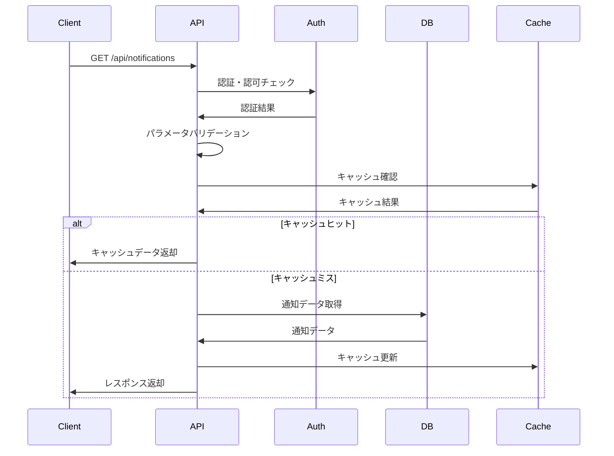

# API仕様書：通知一覧取得API (API-201)

## 1. 基本情報

| 項目 | 内容 |
|------|------|
| **API ID** | API-201 |
| **API名称** | 通知一覧取得API |
| **HTTPメソッド** | GET |
| **エンドポイント** | /api/notifications |
| **優先度** | 高 |
| **ステータス** | 実装完了 |
| **作成日** | 2025-05-31 |
| **最終更新日** | 2025-05-31 |

## 2. API概要

### 2.1 概要・目的
ユーザーに送信された通知の一覧を取得するAPIです。未読・既読状態、通知種別、期間などの条件で絞り込み検索が可能で、ページネーション機能により大量の通知データを効率的に取得できます。

### 2.2 関連画面
- [SCR-NOTIFY](../screens/specs/画面設計書_SCR-NOTIFY.md) - 通知一覧画面
- [SCR-HOME](../screens/specs/画面設計書_SCR-HOME.md) - ホーム画面（通知バッジ表示）

### 2.3 関連テーブル
- [TBL-021](../database/tables/テーブル定義書_TBL-021.md) - 通知テーブル
- [TBL-022](../database/tables/テーブル定義書_TBL-022.md) - 通知設定テーブル
- [TBL-001](../database/tables/テーブル定義書_TBL-001.md) - ユーザーテーブル

## 3. API仕様

### 3.1 リクエスト仕様

#### 3.1.1 URL
```
GET /api/notifications
```

#### 3.1.2 ヘッダー
| ヘッダー名 | 必須 | 説明 | 例 |
|------------|------|------|-----|
| Content-Type | ○ | リクエスト形式 | application/json |
| Authorization | ○ | 認証トークン | Bearer eyJhbGciOiJIUzI1NiIsInR5cCI6IkpXVCJ9... |
| X-Tenant-ID | ○ | テナントID | tenant001 |

#### 3.1.3 クエリパラメータ
| パラメータ名 | データ型 | 必須 | 説明 | 例 | デフォルト値 |
|--------------|----------|------|------|-----|-------------|
| page | number | × | ページ番号（1から開始） | 1 | 1 |
| limit | number | × | 1ページあたりの取得件数 | 20 | 20 |
| status | string | × | 通知状態（unread/read/all） | unread | all |
| type | string | × | 通知種別 | system_maintenance | - |
| priority | string | × | 優先度（high/medium/low） | high | - |
| from_date | string | × | 開始日（YYYY-MM-DD） | 2025-05-01 | - |
| to_date | string | × | 終了日（YYYY-MM-DD） | 2025-05-31 | - |
| sort | string | × | ソート順（created_at_desc/created_at_asc/priority_desc） | created_at_desc | created_at_desc |

#### 3.1.4 通知種別一覧
| 種別コード | 説明 |
|------------|------|
| system_maintenance | システムメンテナンス |
| skill_reminder | スキル更新リマインダー |
| goal_deadline | 目標期限通知 |
| training_reminder | 研修受講リマインダー |
| approval_request | 承認依頼 |
| approval_result | 承認結果 |
| report_ready | レポート生成完了 |
| tenant_announcement | テナント内お知らせ |

## 4. レスポンス仕様

### 4.1 正常時レスポンス（200 OK）
```json
{
  "status": "success",
  "data": {
    "notifications": [
      {
        "id": "notif_001",
        "type": "skill_reminder",
        "title": "スキル情報の更新をお願いします",
        "message": "今四半期のスキル情報更新期限が近づいています。期限：2025-06-30",
        "priority": "medium",
        "status": "unread",
        "sender": {
          "id": "system",
          "name": "システム",
          "type": "system"
        },
        "recipient_id": "user_001",
        "action_url": "/skills/edit",
        "action_label": "スキル更新画面へ",
        "metadata": {
          "deadline": "2025-06-30",
          "skill_category": "technical"
        },
        "created_at": "2025-05-30T10:00:00Z",
        "read_at": null,
        "expires_at": "2025-06-30T23:59:59Z"
      },
      {
        "id": "notif_002",
        "type": "approval_result",
        "title": "作業実績が承認されました",
        "message": "2025年5月の作業実績が承認されました。",
        "priority": "low",
        "status": "read",
        "sender": {
          "id": "user_manager_001",
          "name": "田中 太郎",
          "type": "user"
        },
        "recipient_id": "user_001",
        "action_url": "/work-records/2025-05",
        "action_label": "作業実績を確認",
        "metadata": {
          "work_record_id": "wr_202505_001",
          "approval_date": "2025-05-30"
        },
        "created_at": "2025-05-30T09:30:00Z",
        "read_at": "2025-05-30T14:20:00Z",
        "expires_at": null
      }
    ]
  },
  "meta": {
    "total": 45,
    "page": 1,
    "limit": 20,
    "total_pages": 3,
    "unread_count": 12,
    "has_next": true,
    "has_prev": false
  }
}
```

### 4.2 エラーレスポンス
| HTTPステータス | エラーコード | エラーメッセージ | 発生条件 |
|----------------|--------------|------------------|----------|
| 400 | BAD_REQUEST | リクエストパラメータが不正です | パラメータ形式不正 |
| 401 | UNAUTHORIZED | 認証が必要です | 認証トークン不正 |
| 403 | FORBIDDEN | アクセス権限がありません | 権限不足 |
| 500 | INTERNAL_ERROR | サーバー内部エラーです | システムエラー |

```json
{
  "status": "error",
  "error": {
    "code": "BAD_REQUEST",
    "message": "リクエストパラメータが不正です",
    "details": [
      {
        "field": "page",
        "message": "1以上の数値を指定してください"
      }
    ]
  }
}
```

## 5. 認証・認可

### 5.1 認証方式
- JWT（JSON Web Token）
- Bearer Token形式

### 5.2 必要権限
| 権限 | 説明 |
|------|------|
| NOTIFICATION_READ | 通知読み取り権限 |

### 5.3 テナント制御
- マルチテナント対応
- X-Tenant-IDヘッダーによるテナント識別
- ユーザーは自分のテナント内の通知のみ取得可能

## 6. バリデーション

### 6.1 入力チェック
| 項目 | チェック内容 | エラーメッセージ |
|------|--------------|------------------|
| page | 1以上の整数 | 「ページ番号は1以上の数値を指定してください」 |
| limit | 1-100の整数 | 「取得件数は1-100の範囲で指定してください」 |
| status | 指定値のみ | 「ステータスはunread/read/allのいずれかを指定してください」 |
| type | 通知種別マスタに存在 | 「指定された通知種別は存在しません」 |
| from_date/to_date | YYYY-MM-DD形式 | 「日付はYYYY-MM-DD形式で指定してください」 |

### 6.2 業務チェック
| 項目 | チェック内容 | エラーメッセージ |
|------|--------------|------------------|
| 日付範囲 | from_date ≤ to_date | 「開始日は終了日以前を指定してください」 |
| 検索期間 | 最大1年間 | 「検索期間は1年以内で指定してください」 |

## 7. 処理フロー

### 7.1 処理概要


### 7.2 詳細処理
1. リクエスト受信
2. 認証トークン検証
3. テナントID検証
4. パラメータバリデーション
5. キャッシュ確認（未読件数など）
6. データベースクエリ実行
7. 結果の整形・ページネーション
8. キャッシュ更新
9. レスポンス返却

## 8. 非機能要件

### 8.1 パフォーマンス
- レスポンス時間：300ms以内
- スループット：2000リクエスト/秒
- 同時接続数：500接続

### 8.2 可用性
- 稼働率：99.9%以上
- 障害時の自動復旧機能

### 8.3 セキュリティ
- HTTPS通信必須
- CSRF対策
- XSS対策
- SQLインジェクション対策
- 個人情報の適切な取り扱い

## 9. キャッシュ戦略

### 9.1 キャッシュ対象
- 未読通知件数（5分間キャッシュ）
- 通知種別マスタ（1時間キャッシュ）
- ユーザー権限情報（30分間キャッシュ）

### 9.2 キャッシュ無効化
- 通知状態更新時
- 新規通知作成時
- ユーザー権限変更時

## 10. テスト仕様

### 10.1 正常系テスト
| テストケース | 入力値 | 期待結果 |
|--------------|--------|----------|
| 通常取得 | デフォルトパラメータ | 200 OK、通知一覧取得 |
| 未読のみ取得 | status=unread | 200 OK、未読通知のみ |
| 期間指定取得 | from_date, to_date | 200 OK、期間内通知のみ |
| ページネーション | page=2, limit=10 | 200 OK、2ページ目取得 |

### 10.2 異常系テスト
| テストケース | 入力値 | 期待結果 |
|--------------|--------|----------|
| 不正ページ番号 | page=0 | 400 Bad Request |
| 不正取得件数 | limit=101 | 400 Bad Request |
| 不正ステータス | status=invalid | 400 Bad Request |
| 認証なし | Authorizationヘッダーなし | 401 Unauthorized |

## 11. 実装メモ

### 11.1 技術仕様
- フレームワーク：Express.js
- ORM：Prisma
- バリデーション：Joi
- 認証：JWT
- キャッシュ：Redis

### 11.2 データベースクエリ最適化
```sql
-- インデックス要件
CREATE INDEX idx_notifications_recipient_tenant ON notifications(recipient_id, tenant_id);
CREATE INDEX idx_notifications_status_created ON notifications(status, created_at DESC);
CREATE INDEX idx_notifications_type_priority ON notifications(type, priority);
```

### 11.3 注意事項
- 大量通知の場合のパフォーマンス考慮
- 期限切れ通知の自動削除バッチとの連携
- 通知設定による表示制御
- マルチテナント対応必須

## 12. 関連API

| API ID | API名称 | 関係 |
|--------|--------|------|
| [API-202](API仕様書_API-202.md) | 通知詳細取得API | 詳細情報取得 |
| [API-203](API仕様書_API-203.md) | 通知状態更新API | 既読状態更新 |
| [API-204](API仕様書_API-204.md) | 全通知既読API | 一括既読化 |
| [API-028](API仕様書_API-028.md) | 通知設定API | 通知設定取得 |
| [API-029](API仕様書_API-029.md) | 通知送信API | 通知送信 |

---

**改訂履歴**

| バージョン | 日付 | 変更者 | 変更内容 |
|------------|------|--------|----------|
| 1.0 | 2025-05-31 | システムアーキテクト | 初版作成 |
