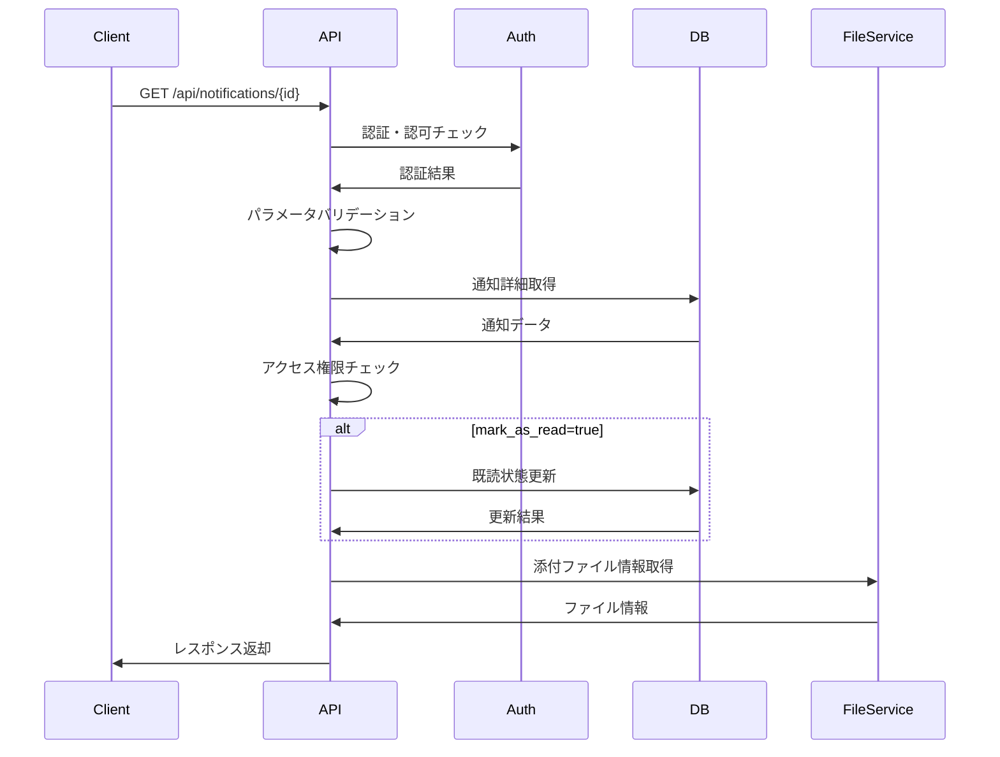

# API仕様書：通知詳細取得API (API-202)

## 1. 基本情報

| 項目 | 内容 |
|------|------|
| **API ID** | API-202 |
| **API名称** | 通知詳細取得API |
| **HTTPメソッド** | GET |
| **エンドポイント** | /api/notifications/{id} |
| **優先度** | 中 |
| **ステータス** | 実装完了 |
| **作成日** | 2025-05-31 |
| **最終更新日** | 2025-05-31 |

## 2. API概要

### 2.1 概要・目的
指定された通知IDの詳細情報を取得するAPIです。通知の内容、送信者情報、関連データ、アクション情報などの詳細な情報を提供し、通知詳細画面での表示や、通知に関連するアクションの実行に必要な情報を取得できます。

### 2.2 関連画面
- [SCR-NOTIFY-DETAIL](../screens/specs/画面設計書_SCR-NOTIFY-DETAIL.md) - 通知詳細画面
- [SCR-NOTIFY](../screens/specs/画面設計書_SCR-NOTIFY.md) - 通知一覧画面

### 2.3 関連テーブル
- [TBL-021](../database/tables/テーブル定義書_TBL-021.md) - 通知テーブル
- [TBL-022](../database/tables/テーブル定義書_TBL-022.md) - 通知設定テーブル
- [TBL-001](../database/tables/テーブル定義書_TBL-001.md) - ユーザーテーブル

## 3. API仕様

### 3.1 リクエスト仕様

#### 3.1.1 URL
```
GET /api/notifications/{id}
```

#### 3.1.2 ヘッダー
| ヘッダー名 | 必須 | 説明 | 例 |
|------------|------|------|-----|
| Content-Type | ○ | リクエスト形式 | application/json |
| Authorization | ○ | 認証トークン | Bearer eyJhbGciOiJIUzI1NiIsInR5cCI6IkpXVCJ9... |
| X-Tenant-ID | ○ | テナントID | tenant001 |

#### 3.1.3 パスパラメータ
| パラメータ名 | データ型 | 必須 | 説明 | 例 |
|--------------|----------|------|------|-----|
| id | string | ○ | 通知ID | notif_001 |

#### 3.1.4 クエリパラメータ
| パラメータ名 | データ型 | 必須 | 説明 | 例 | デフォルト値 |
|--------------|----------|------|------|-----|-------------|
| mark_as_read | boolean | × | 取得時に既読にするか | true | false |

## 4. レスポンス仕様

### 4.1 正常時レスポンス（200 OK）
```json
{
  "status": "success",
  "data": {
    "notification": {
      "id": "notif_001",
      "type": "approval_request",
      "title": "作業実績の承認依頼",
      "message": "山田太郎さんから2025年5月の作業実績の承認依頼が届いています。",
      "content": {
        "html": "<div><h3>承認依頼詳細</h3><p>以下の作業実績について承認をお願いします。</p><ul><li>期間：2025年5月1日〜2025年5月31日</li><li>総作業時間：160時間</li><li>主要プロジェクト：スキル管理システム開発</li></ul></div>",
        "plain_text": "承認依頼詳細\n以下の作業実績について承認をお願いします。\n期間：2025年5月1日〜2025年5月31日\n総作業時間：160時間\n主要プロジェクト：スキル管理システム開発"
      },
      "priority": "high",
      "status": "unread",
      "sender": {
        "id": "user_002",
        "name": "山田 太郎",
        "email": "yamada@example.com",
        "department": "開発部",
        "position": "エンジニア",
        "avatar_url": "/avatars/user_002.jpg",
        "type": "user"
      },
      "recipient_id": "user_001",
      "actions": [
        {
          "id": "approve",
          "label": "承認する",
          "type": "primary",
          "method": "POST",
          "url": "/api/work-records/wr_202505_002/approve",
          "confirm_message": "この作業実績を承認しますか？",
          "icon": "check-circle"
        },
        {
          "id": "reject",
          "label": "却下する",
          "type": "danger",
          "method": "POST",
          "url": "/api/work-records/wr_202505_002/reject",
          "confirm_message": "この作業実績を却下しますか？",
          "icon": "x-circle",
          "requires_comment": true
        },
        {
          "id": "view_detail",
          "label": "詳細を確認",
          "type": "secondary",
          "method": "GET",
          "url": "/work-records/wr_202505_002",
          "icon": "eye",
          "open_in_new_tab": true
        }
      ],
      "attachments": [
        {
          "id": "att_001",
          "name": "作業実績詳細.pdf",
          "size": 1024000,
          "type": "application/pdf",
          "url": "/api/files/att_001/download",
          "thumbnail_url": "/api/files/att_001/thumbnail"
        }
      ],
      "metadata": {
        "work_record_id": "wr_202505_002",
        "employee_id": "user_002",
        "period": "2025-05",
        "total_hours": 160,
        "project_name": "スキル管理システム開発",
        "deadline": "2025-06-05T23:59:59Z"
      },
      "related_notifications": [
        {
          "id": "notif_003",
          "title": "作業実績提出完了",
          "created_at": "2025-05-30T09:00:00Z"
        }
      ],
      "created_at": "2025-05-30T10:00:00Z",
      "read_at": null,
      "expires_at": "2025-06-05T23:59:59Z",
      "updated_at": "2025-05-30T10:00:00Z"
    }
  }
}
```

### 4.2 エラーレスポンス
| HTTPステータス | エラーコード | エラーメッセージ | 発生条件 |
|----------------|--------------|------------------|----------|
| 400 | BAD_REQUEST | リクエストが不正です | パラメータ不正 |
| 401 | UNAUTHORIZED | 認証が必要です | 認証トークン不正 |
| 403 | FORBIDDEN | アクセス権限がありません | 権限不足・他人の通知 |
| 404 | NOT_FOUND | 通知が見つかりません | 通知存在しない |
| 500 | INTERNAL_ERROR | サーバー内部エラーです | システムエラー |

```json
{
  "status": "error",
  "error": {
    "code": "NOT_FOUND",
    "message": "通知が見つかりません",
    "details": [
      {
        "field": "id",
        "message": "指定された通知IDは存在しません"
      }
    ]
  }
}
```

## 5. 認証・認可

### 5.1 認証方式
- JWT（JSON Web Token）
- Bearer Token形式

### 5.2 必要権限
| 権限 | 説明 |
|------|------|
| NOTIFICATION_READ | 通知読み取り権限 |

### 5.3 テナント制御
- マルチテナント対応
- X-Tenant-IDヘッダーによるテナント識別
- ユーザーは自分宛ての通知のみ取得可能

### 5.4 アクセス制御
- 通知の受信者のみアクセス可能
- 管理者は全ての通知にアクセス可能（監査目的）
- 期限切れ通知も取得可能（履歴確認用）

## 6. バリデーション

### 6.1 入力チェック
| 項目 | チェック内容 | エラーメッセージ |
|------|--------------|------------------|
| id | 必須、文字列 | 「通知IDは必須です」 |
| mark_as_read | boolean型 | 「mark_as_readはtrue/falseで指定してください」 |

### 6.2 業務チェック
| 項目 | チェック内容 | エラーメッセージ |
|------|--------------|------------------|
| 通知存在確認 | 指定IDの通知が存在 | 「指定された通知は存在しません」 |
| アクセス権限 | 受信者または管理者 | 「この通知にアクセスする権限がありません」 |
| テナント確認 | 同一テナント内の通知 | 「アクセス権限がありません」 |

## 7. 処理フロー

### 7.1 処理概要


### 7.2 詳細処理
1. リクエスト受信
2. 認証トークン検証
3. テナントID検証
4. パラメータバリデーション
5. 通知データ取得
6. アクセス権限チェック
7. 既読状態更新（mark_as_read=trueの場合）
8. 添付ファイル情報取得
9. 関連通知情報取得
10. レスポンス生成・返却

## 8. 非機能要件

### 8.1 パフォーマンス
- レスポンス時間：200ms以内
- スループット：1000リクエスト/秒
- 同時接続数：200接続

### 8.2 可用性
- 稼働率：99.9%以上
- 障害時の自動復旧機能

### 8.3 セキュリティ
- HTTPS通信必須
- CSRF対策
- XSS対策（HTMLコンテンツのサニタイズ）
- SQLインジェクション対策
- 個人情報の適切な取り扱い

## 9. キャッシュ戦略

### 9.1 キャッシュ対象
- 通知詳細情報（10分間キャッシュ）
- ユーザー情報（30分間キャッシュ）
- 添付ファイル情報（1時間キャッシュ）

### 9.2 キャッシュ無効化
- 通知状態更新時
- 通知内容更新時
- ユーザー情報変更時

## 10. テスト仕様

### 10.1 正常系テスト
| テストケース | 入力値 | 期待結果 |
|--------------|--------|----------|
| 通常取得 | 有効な通知ID | 200 OK、通知詳細取得 |
| 既読化付き取得 | mark_as_read=true | 200 OK、既読状態で取得 |
| 添付ファイル付き | 添付ファイルありの通知 | 200 OK、ファイル情報含む |
| 期限切れ通知 | 期限切れの通知ID | 200 OK、期限切れ通知取得 |

### 10.2 異常系テスト
| テストケース | 入力値 | 期待結果 |
|--------------|--------|----------|
| 存在しない通知 | 無効な通知ID | 404 Not Found |
| 他人の通知 | 他ユーザーの通知ID | 403 Forbidden |
| 認証なし | Authorizationヘッダーなし | 401 Unauthorized |
| 不正なID形式 | 空文字・null | 400 Bad Request |

## 11. 実装メモ

### 11.1 技術仕様
- フレームワーク：Express.js
- ORM：Prisma
- バリデーション：Joi
- 認証：JWT
- HTMLサニタイズ：DOMPurify

### 11.2 データベースクエリ最適化
```sql
-- 通知詳細取得用インデックス
CREATE INDEX idx_notifications_id_tenant ON notifications(id, tenant_id);
CREATE INDEX idx_notification_attachments_notification_id ON notification_attachments(notification_id);
CREATE INDEX idx_users_id_tenant ON users(id, tenant_id);
```

### 11.3 注意事項
- HTMLコンテンツのXSS対策必須
- 添付ファイルのアクセス制御
- 大容量添付ファイルの処理
- 関連通知の循環参照防止
- マルチテナント対応必須

## 12. セキュリティ考慮事項

### 12.1 HTMLコンテンツの処理
- サーバーサイドでのHTMLサニタイズ
- 許可されたタグ・属性のみ通過
- JavaScriptの実行防止

### 12.2 添付ファイルセキュリティ
- ファイルアクセス権限の確認
- ウイルススキャン結果の確認
- ファイルタイプの検証

### 12.3 個人情報保護
- 送信者情報の適切なマスキング
- ログ出力時の個人情報除外
- データ保持期間の遵守

## 13. 関連API

| API ID | API名称 | 関係 |
|--------|--------|------|
| [API-201](API仕様書_API-201.md) | 通知一覧取得API | 一覧表示 |
| [API-203](API仕様書_API-203.md) | 通知状態更新API | 既読状態更新 |
| [API-204](API仕様書_API-204.md) | 全通知既読API | 一括既読化 |
| [API-028](API仕様書_API-028.md) | 通知設定API | 通知設定取得 |
| [API-029](API仕様書_API-029.md) | 通知送信API | 通知送信 |

---

**改訂履歴**

| バージョン | 日付 | 変更者 | 変更内容 |
|------------|------|--------|----------|
| 1.0 | 2025-05-31 | システムアーキテクト | 初版作成 |
