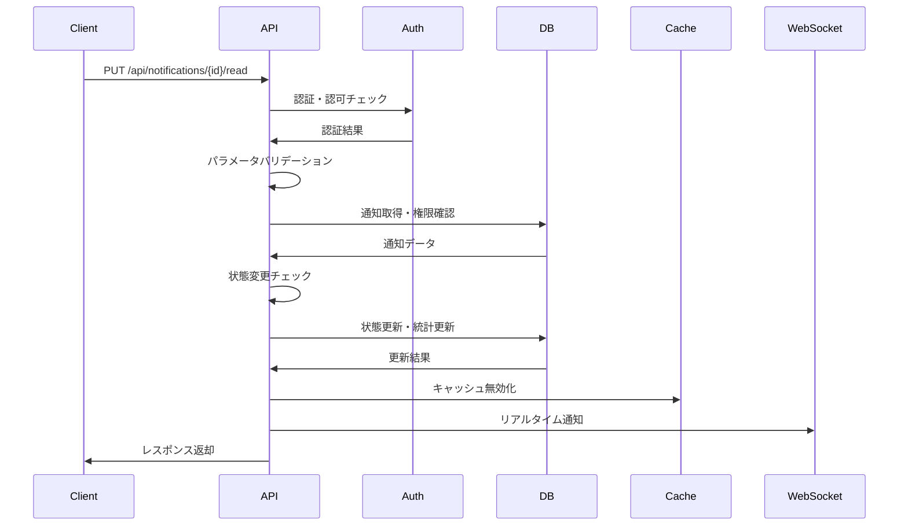

# API仕様書：通知状態更新API (API-203)

## 1. 基本情報

| 項目 | 内容 |
|------|------|
| **API ID** | API-203 |
| **API名称** | 通知状態更新API |
| **HTTPメソッド** | PUT |
| **エンドポイント** | /api/notifications/{id}/read |
| **優先度** | 中 |
| **ステータス** | 実装完了 |
| **作成日** | 2025-05-31 |
| **最終更新日** | 2025-05-31 |

## 2. API概要

### 2.1 概要・目的
指定された通知の既読状態を更新するAPIです。通知を既読または未読に変更し、既読日時の記録や未読件数の更新を行います。通知一覧画面や詳細画面からの状態変更操作に使用されます。

### 2.2 関連画面
- [SCR-NOTIFY](../screens/specs/画面設計書_SCR-NOTIFY.md) - 通知一覧画面
- [SCR-NOTIFY-DETAIL](../screens/specs/画面設計書_SCR-NOTIFY-DETAIL.md) - 通知詳細画面
- [SCR-HOME](../screens/specs/画面設計書_SCR-HOME.md) - ホーム画面（通知バッジ更新）

### 2.3 関連テーブル
- [TBL-021](../database/tables/テーブル定義書_TBL-021.md) - 通知テーブル
- [TBL-001](../database/tables/テーブル定義書_TBL-001.md) - ユーザーテーブル

## 3. API仕様

### 3.1 リクエスト仕様

#### 3.1.1 URL
```
PUT /api/notifications/{id}/read
```

#### 3.1.2 ヘッダー
| ヘッダー名 | 必須 | 説明 | 例 |
|------------|------|------|-----|
| Content-Type | ○ | リクエスト形式 | application/json |
| Authorization | ○ | 認証トークン | Bearer eyJhbGciOiJIUzI1NiIsInR5cCI6IkpXVCJ9... |
| X-Tenant-ID | ○ | テナントID | tenant001 |

#### 3.1.3 パスパラメータ
| パラメータ名 | データ型 | 必須 | 説明 | 例 |
|--------------|----------|------|------|-----|
| id | string | ○ | 通知ID | notif_001 |

#### 3.1.4 リクエストボディ
```json
{
  "status": "read"
}
```

| フィールド名 | データ型 | 必須 | 説明 | 例 | 制約 |
|--------------|----------|------|------|-----|------|
| status | string | ○ | 更新後の状態 | read | read/unread |

## 4. レスポンス仕様

### 4.1 正常時レスポンス（200 OK）
```json
{
  "status": "success",
  "data": {
    "notification": {
      "id": "notif_001",
      "status": "read",
      "read_at": "2025-05-31T07:15:00Z",
      "updated_at": "2025-05-31T07:15:00Z"
    },
    "user_stats": {
      "unread_count": 11,
      "total_count": 45
    }
  },
  "message": "通知の状態を更新しました"
}
```

### 4.2 未読に戻す場合のレスポンス（200 OK）
```json
{
  "status": "success",
  "data": {
    "notification": {
      "id": "notif_001",
      "status": "unread",
      "read_at": null,
      "updated_at": "2025-05-31T07:15:00Z"
    },
    "user_stats": {
      "unread_count": 13,
      "total_count": 45
    }
  },
  "message": "通知の状態を更新しました"
}
```

### 4.3 エラーレスポンス
| HTTPステータス | エラーコード | エラーメッセージ | 発生条件 |
|----------------|--------------|------------------|----------|
| 400 | BAD_REQUEST | リクエストが不正です | パラメータ不正 |
| 401 | UNAUTHORIZED | 認証が必要です | 認証トークン不正 |
| 403 | FORBIDDEN | アクセス権限がありません | 権限不足・他人の通知 |
| 404 | NOT_FOUND | 通知が見つかりません | 通知存在しない |
| 409 | CONFLICT | 既に同じ状態です | 状態変更不要 |
| 500 | INTERNAL_ERROR | サーバー内部エラーです | システムエラー |

```json
{
  "status": "error",
  "error": {
    "code": "CONFLICT",
    "message": "既に同じ状態です",
    "details": [
      {
        "field": "status",
        "message": "通知は既に既読状態です"
      }
    ]
  }
}
```

## 5. 認証・認可

### 5.1 認証方式
- JWT（JSON Web Token）
- Bearer Token形式

### 5.2 必要権限
| 権限 | 説明 |
|------|------|
| NOTIFICATION_UPDATE | 通知更新権限 |

### 5.3 テナント制御
- マルチテナント対応
- X-Tenant-IDヘッダーによるテナント識別
- ユーザーは自分宛ての通知のみ更新可能

### 5.4 アクセス制御
- 通知の受信者のみ更新可能
- 管理者は全ての通知を更新可能（監査・管理目的）
- 期限切れ通知も更新可能

## 6. バリデーション

### 6.1 入力チェック
| 項目 | チェック内容 | エラーメッセージ |
|------|--------------|------------------|
| id | 必須、文字列 | 「通知IDは必須です」 |
| status | 必須、指定値のみ | 「ステータスはread/unreadのいずれかを指定してください」 |

### 6.2 業務チェック
| 項目 | チェック内容 | エラーメッセージ |
|------|--------------|------------------|
| 通知存在確認 | 指定IDの通知が存在 | 「指定された通知は存在しません」 |
| アクセス権限 | 受信者または管理者 | 「この通知を更新する権限がありません」 |
| テナント確認 | 同一テナント内の通知 | 「アクセス権限がありません」 |
| 状態変更確認 | 現在の状態と異なる | 「既に同じ状態です」 |

## 7. 処理フロー

### 7.1 処理概要


### 7.2 詳細処理
1. リクエスト受信
2. 認証トークン検証
3. テナントID検証
4. パラメータバリデーション
5. 通知データ取得・権限確認
6. 現在の状態確認
7. 状態更新実行
8. 未読件数統計更新
9. キャッシュ無効化
10. WebSocket通知送信
11. レスポンス返却

## 8. 非機能要件

### 8.1 パフォーマンス
- レスポンス時間：100ms以内
- スループット：2000リクエスト/秒
- 同時接続数：500接続

### 8.2 可用性
- 稼働率：99.9%以上
- 障害時の自動復旧機能

### 8.3 セキュリティ
- HTTPS通信必須
- CSRF対策
- SQLインジェクション対策
- 個人情報の適切な取り扱い

## 9. キャッシュ戦略

### 9.1 キャッシュ無効化
- ユーザー別未読件数キャッシュ
- 通知一覧キャッシュ
- 通知詳細キャッシュ

### 9.2 リアルタイム更新
- WebSocketによる即座の状態同期
- 他のセッション・デバイスへの反映
- 未読バッジの即座更新

## 10. データベース更新

### 10.1 更新対象テーブル
```sql
-- 通知テーブル更新
UPDATE notifications 
SET 
    status = ?,
    read_at = CASE WHEN ? = 'read' THEN NOW() ELSE NULL END,
    updated_at = NOW()
WHERE 
    id = ? 
    AND recipient_id = ? 
    AND tenant_id = ?;

-- 未読件数統計更新（必要に応じて）
UPDATE user_notification_stats 
SET 
    unread_count = (
        SELECT COUNT(*) 
        FROM notifications 
        WHERE recipient_id = ? 
        AND tenant_id = ? 
        AND status = 'unread'
    ),
    updated_at = NOW()
WHERE 
    user_id = ? 
    AND tenant_id = ?;
```

### 10.2 トランザクション制御
- 通知状態更新と統計更新を同一トランザクションで実行
- ロールバック機能による整合性保証
- デッドロック対策

## 11. テスト仕様

### 11.1 正常系テスト
| テストケース | 入力値 | 期待結果 |
|--------------|--------|----------|
| 未読→既読 | status=read | 200 OK、既読状態に更新 |
| 既読→未読 | status=unread | 200 OK、未読状態に更新 |
| 統計更新確認 | 状態変更後 | 未読件数が正しく更新 |
| WebSocket通知 | 状態変更後 | リアルタイム通知送信 |

### 11.2 異常系テスト
| テストケース | 入力値 | 期待結果 |
|--------------|--------|----------|
| 存在しない通知 | 無効な通知ID | 404 Not Found |
| 他人の通知 | 他ユーザーの通知ID | 403 Forbidden |
| 同じ状態 | 現在と同じstatus | 409 Conflict |
| 不正なstatus | status=invalid | 400 Bad Request |
| 認証なし | Authorizationヘッダーなし | 401 Unauthorized |

## 12. 実装メモ

### 12.1 技術仕様
- フレームワーク：Express.js
- ORM：Prisma
- バリデーション：Joi
- 認証：JWT
- WebSocket：Socket.io
- キャッシュ：Redis

### 12.2 データベースクエリ最適化
```sql
-- 通知状態更新用インデックス
CREATE INDEX idx_notifications_id_recipient_tenant ON notifications(id, recipient_id, tenant_id);
CREATE INDEX idx_notifications_recipient_status ON notifications(recipient_id, status);
CREATE INDEX idx_user_notification_stats_user_tenant ON user_notification_stats(user_id, tenant_id);
```

### 12.3 注意事項
- 同時更新による競合状態の回避
- 統計データの整合性保証
- WebSocket接続の管理
- マルチテナント対応必須

## 13. WebSocket通知仕様

### 13.1 送信イベント
```javascript
// 通知状態更新イベント
socket.emit('notification_status_updated', {
  notification_id: 'notif_001',
  status: 'read',
  read_at: '2025-05-31T07:15:00Z',
  unread_count: 11
});

// 未読件数更新イベント
socket.emit('unread_count_updated', {
  user_id: 'user_001',
  unread_count: 11,
  total_count: 45
});
```

### 13.2 受信側処理
- 通知一覧の状態更新
- 未読バッジの更新
- 通知詳細画面の状態同期

## 14. 関連API

| API ID | API名称 | 関係 |
|--------|--------|------|
| [API-201](API仕様書_API-201.md) | 通知一覧取得API | 一覧表示 |
| [API-202](API仕様書_API-202.md) | 通知詳細取得API | 詳細情報取得 |
| [API-204](API仕様書_API-204.md) | 全通知既読API | 一括既読化 |
| [API-028](API仕様書_API-028.md) | 通知設定API | 通知設定取得 |

---

**改訂履歴**

| バージョン | 日付 | 変更者 | 変更内容 |
|------------|------|--------|----------|
| 1.0 | 2025-05-31 | システムアーキテクト | 初版作成 |
