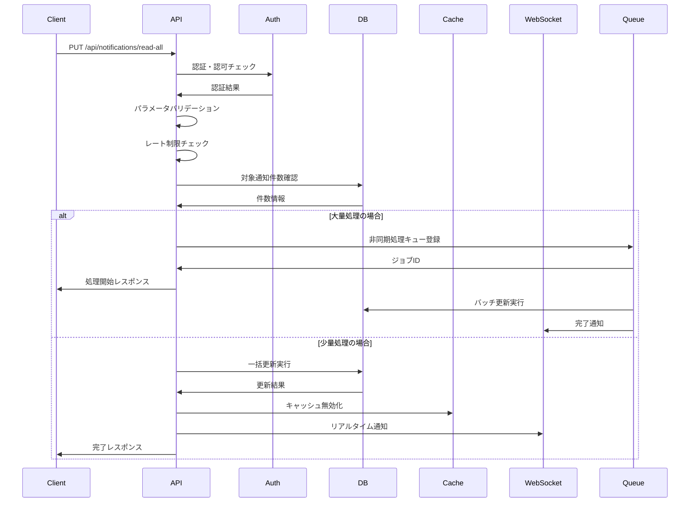
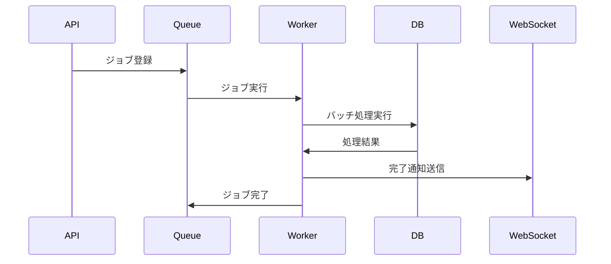

# API仕様書：全通知既読API (API-204)

## 1. 基本情報

| 項目 | 内容 |
|------|------|
| **API ID** | API-204 |
| **API名称** | 全通知既読API |
| **HTTPメソッド** | PUT |
| **エンドポイント** | /api/notifications/read-all |
| **優先度** | 中 |
| **ステータス** | 実装完了 |
| **作成日** | 2025-05-31 |
| **最終更新日** | 2025-05-31 |

## 2. API概要

### 2.1 概要・目的
ユーザーの未読通知を一括で既読状態に更新するAPIです。通知一覧画面の「すべて既読にする」機能や、ホーム画面での一括既読操作に使用されます。大量の未読通知を効率的に処理し、ユーザビリティを向上させます。

### 2.2 関連画面
- [SCR-NOTIFY](../screens/specs/画面設計書_SCR-NOTIFY.md) - 通知一覧画面
- [SCR-HOME](../screens/specs/画面設計書_SCR-HOME.md) - ホーム画面（通知バッジクリア）

### 2.3 関連テーブル
- [TBL-021](../database/tables/テーブル定義書_TBL-021.md) - 通知テーブル
- [TBL-001](../database/tables/テーブル定義書_TBL-001.md) - ユーザーテーブル

## 3. API仕様

### 3.1 リクエスト仕様

#### 3.1.1 URL
```
PUT /api/notifications/read-all
```

#### 3.1.2 ヘッダー
| ヘッダー名 | 必須 | 説明 | 例 |
|------------|------|------|-----|
| Content-Type | ○ | リクエスト形式 | application/json |
| Authorization | ○ | 認証トークン | Bearer eyJhbGciOiJIUzI1NiIsInR5cCI6IkpXVCJ9... |
| X-Tenant-ID | ○ | テナントID | tenant001 |

#### 3.1.3 リクエストボディ
```json
{
  "filter": {
    "type": "skill_reminder",
    "before_date": "2025-05-31"
  }
}
```

| フィールド名 | データ型 | 必須 | 説明 | 例 | 制約 |
|--------------|----------|------|------|-----|------|
| filter | object | × | 既読化対象の絞り込み条件 | - | - |
| filter.type | string | × | 通知種別での絞り込み | skill_reminder | 通知種別マスタに存在 |
| filter.before_date | string | × | 指定日以前の通知のみ対象 | 2025-05-31 | YYYY-MM-DD形式 |
| filter.priority | string | × | 優先度での絞り込み | low | high/medium/low |

## 4. レスポンス仕様

### 4.1 正常時レスポンス（200 OK）
```json
{
  "status": "success",
  "data": {
    "updated_count": 15,
    "user_stats": {
      "unread_count": 0,
      "total_count": 45
    },
    "processing_time_ms": 120
  },
  "message": "15件の通知を既読にしました"
}
```

### 4.2 フィルター適用時のレスポンス（200 OK）
```json
{
  "status": "success",
  "data": {
    "updated_count": 8,
    "filter_applied": {
      "type": "skill_reminder",
      "before_date": "2025-05-31"
    },
    "user_stats": {
      "unread_count": 7,
      "total_count": 45
    },
    "processing_time_ms": 85
  },
  "message": "条件に一致する8件の通知を既読にしました"
}
```

### 4.3 既読対象なしの場合（200 OK）
```json
{
  "status": "success",
  "data": {
    "updated_count": 0,
    "user_stats": {
      "unread_count": 0,
      "total_count": 45
    },
    "processing_time_ms": 15
  },
  "message": "既読にする通知がありませんでした"
}
```

### 4.4 エラーレスポンス
| HTTPステータス | エラーコード | エラーメッセージ | 発生条件 |
|----------------|--------------|------------------|----------|
| 400 | BAD_REQUEST | リクエストが不正です | パラメータ不正 |
| 401 | UNAUTHORIZED | 認証が必要です | 認証トークン不正 |
| 403 | FORBIDDEN | アクセス権限がありません | 権限不足 |
| 429 | TOO_MANY_REQUESTS | リクエストが多すぎます | レート制限 |
| 500 | INTERNAL_ERROR | サーバー内部エラーです | システムエラー |

```json
{
  "status": "error",
  "error": {
    "code": "BAD_REQUEST",
    "message": "リクエストが不正です",
    "details": [
      {
        "field": "filter.before_date",
        "message": "日付はYYYY-MM-DD形式で指定してください"
      }
    ]
  }
}
```

## 5. 認証・認可

### 5.1 認証方式
- JWT（JSON Web Token）
- Bearer Token形式

### 5.2 必要権限
| 権限 | 説明 |
|------|------|
| NOTIFICATION_UPDATE | 通知更新権限 |

### 5.3 テナント制御
- マルチテナント対応
- X-Tenant-IDヘッダーによるテナント識別
- ユーザーは自分宛ての通知のみ一括既読可能

### 5.4 レート制限
- 1分間に5回まで実行可能
- 大量処理による負荷軽減

## 6. バリデーション

### 6.1 入力チェック
| 項目 | チェック内容 | エラーメッセージ |
|------|--------------|------------------|
| filter.type | 通知種別マスタに存在 | 「指定された通知種別は存在しません」 |
| filter.before_date | YYYY-MM-DD形式 | 「日付はYYYY-MM-DD形式で指定してください」 |
| filter.priority | 指定値のみ | 「優先度はhigh/medium/lowのいずれかを指定してください」 |

### 6.2 業務チェック
| 項目 | チェック内容 | エラーメッセージ |
|------|--------------|------------------|
| 日付範囲 | 未来日でない | 「未来の日付は指定できません」 |
| 処理件数 | 1000件以下 | 「一度に処理できる件数を超えています」 |

## 7. 処理フロー

### 7.1 処理概要


### 7.2 詳細処理
1. リクエスト受信
2. 認証トークン検証
3. テナントID検証
4. パラメータバリデーション
5. レート制限チェック
6. 対象通知の件数確認
7. 処理方式判定（同期/非同期）
8. 一括更新実行
9. 統計情報更新
10. キャッシュ無効化
11. WebSocket通知送信
12. レスポンス返却

## 8. 非機能要件

### 8.1 パフォーマンス
- レスポンス時間：500ms以内（100件以下）
- 大量処理：非同期処理で対応
- スループット：100リクエスト/分
- 同時接続数：50接続

### 8.2 可用性
- 稼働率：99.9%以上
- 障害時の自動復旧機能
- 処理中断時のロールバック

### 8.3 セキュリティ
- HTTPS通信必須
- CSRF対策
- SQLインジェクション対策
- レート制限による悪用防止

## 9. データベース処理

### 9.1 一括更新クエリ
```sql
-- 全通知既読化
UPDATE notifications 
SET 
    status = 'read',
    read_at = NOW(),
    updated_at = NOW()
WHERE 
    recipient_id = ? 
    AND tenant_id = ?
    AND status = 'unread'
    AND (? IS NULL OR type = ?)
    AND (? IS NULL OR created_at <= ?)
    AND (? IS NULL OR priority = ?);

-- 統計更新
UPDATE user_notification_stats 
SET 
    unread_count = 0,
    last_read_all_at = NOW(),
    updated_at = NOW()
WHERE 
    user_id = ? 
    AND tenant_id = ?;
```

### 9.2 パフォーマンス最適化
- バッチサイズ：100件ずつ処理
- インデックス活用
- トランザクション分割
- デッドロック回避

## 10. 非同期処理

### 10.1 大量処理の判定基準
- 対象件数が100件を超える場合
- 処理時間が予想で500msを超える場合

### 10.2 非同期処理フロー


### 10.3 進捗通知
```javascript
// WebSocket進捗通知
socket.emit('bulk_read_progress', {
  job_id: 'job_12345',
  user_id: 'user_001',
  progress: 75,
  processed_count: 75,
  total_count: 100,
  estimated_remaining_ms: 5000
});

// 完了通知
socket.emit('bulk_read_completed', {
  job_id: 'job_12345',
  user_id: 'user_001',
  updated_count: 100,
  unread_count: 0,
  processing_time_ms: 2500
});
```

## 11. テスト仕様

### 11.1 正常系テスト
| テストケース | 入力値 | 期待結果 |
|--------------|--------|----------|
| 全通知既読化 | フィルターなし | 200 OK、全未読通知が既読 |
| 種別フィルター | type指定 | 200 OK、指定種別のみ既読 |
| 日付フィルター | before_date指定 | 200 OK、指定日以前のみ既読 |
| 既読対象なし | 未読通知なし | 200 OK、updated_count=0 |
| 大量処理 | 100件超の未読 | 202 Accepted、非同期処理 |

### 11.2 異常系テスト
| テストケース | 入力値 | 期待結果 |
|--------------|--------|----------|
| 不正な通知種別 | type=invalid | 400 Bad Request |
| 不正な日付形式 | before_date=invalid | 400 Bad Request |
| レート制限超過 | 短時間で連続実行 | 429 Too Many Requests |
| 認証なし | Authorizationヘッダーなし | 401 Unauthorized |

## 12. 実装メモ

### 12.1 技術仕様
- フレームワーク：Express.js
- ORM：Prisma
- バリデーション：Joi
- 認証：JWT
- キュー：Bull Queue (Redis)
- WebSocket：Socket.io

### 12.2 データベースクエリ最適化
```sql
-- 一括更新用インデックス
CREATE INDEX idx_notifications_recipient_status_tenant ON notifications(recipient_id, status, tenant_id);
CREATE INDEX idx_notifications_type_created ON notifications(type, created_at);
CREATE INDEX idx_notifications_priority_status ON notifications(priority, status);
```

### 12.3 注意事項
- 大量データ処理時のメモリ使用量
- トランザクションタイムアウト対策
- 同時実行制御
- エラー時のロールバック処理
- マルチテナント対応必須

## 13. 監視・ログ

### 13.1 ログ出力項目
- 処理開始・完了時刻
- 対象件数・更新件数
- 処理時間
- エラー情報
- ユーザー・テナント情報

### 13.2 メトリクス
- 実行回数・頻度
- 平均処理時間
- エラー率
- 大量処理の発生頻度

## 14. 関連API

| API ID | API名称 | 関係 |
|--------|--------|------|
| [API-201](API仕様書_API-201.md) | 通知一覧取得API | 一覧表示 |
| [API-202](API仕様書_API-202.md) | 通知詳細取得API | 詳細情報取得 |
| [API-203](API仕様書_API-203.md) | 通知状態更新API | 個別既読化 |
| [API-028](API仕様書_API-028.md) | 通知設定API | 通知設定取得 |

---

**改訂履歴**

| バージョン | 日付 | 変更者 | 変更内容 |
|------------|------|--------|----------|
| 1.0 | 2025-05-31 | システムアーキテクト | 初版作成 |
