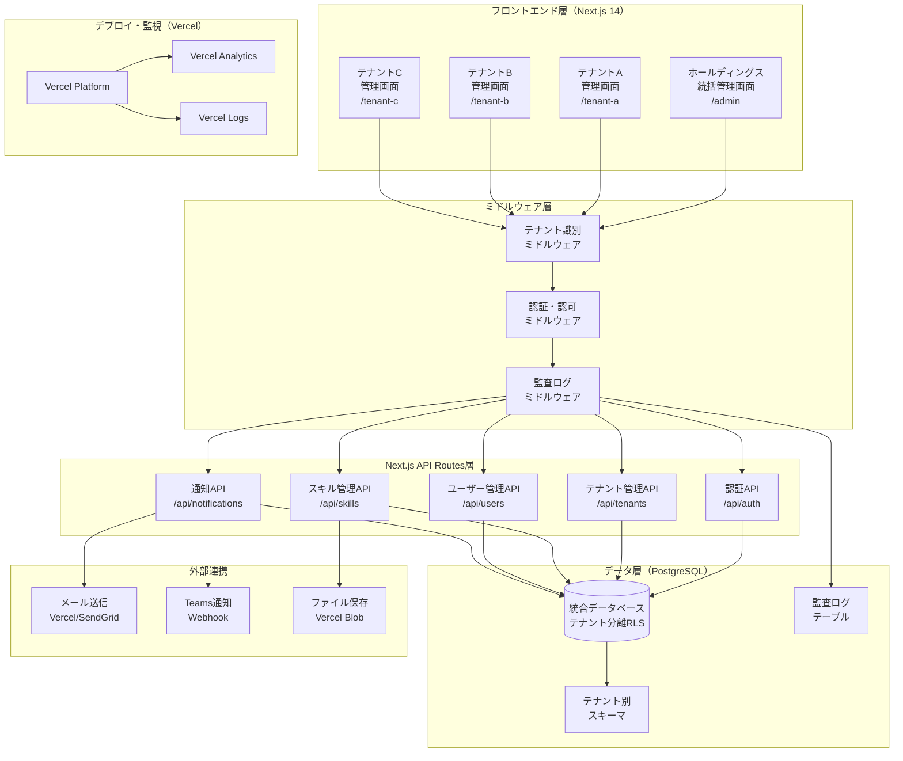
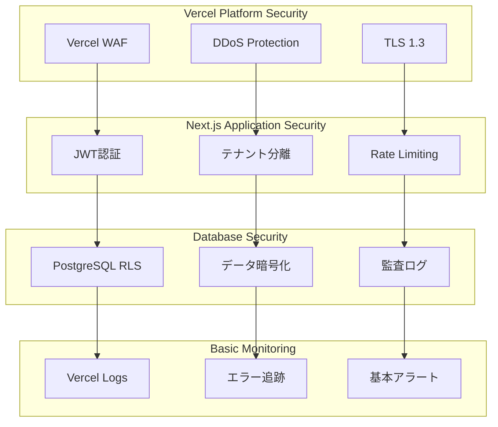

# マルチテナントアーキテクチャ設計書: ホールディングス・グループ会社向けSaaS基盤

## 1. 文書基本情報

- **文書名**: マルチテナントアーキテクチャ設計書
- **プロジェクト名**: 年間スキル報告書WEB化PJT - マルチテナント対応
- **対象システム**: ホールディングス・グループ会社向けマルチテナントSaaS基盤
- **作成日**: 2025/05/30
- **作成者**: システムアーキテクト
- **改訂履歴**: 2025/05/30 初版作成

---

## 2. 概要・目的

### 2.1 7週間実装可能なマルチテナント設計方針

**実用性重視のマルチテナント基盤**を構築し、以下の目標を段階的に達成します：

#### Phase 1: 基本マルチテナント機能（7週間で実装）
1. **シンプルなテナント分離**
   - テナントID分離によるデータ完全分離
   - 基本的なテナント管理機能
   - JWT + テナント識別による認証統合

2. **実用的な管理機能**
   - テナント作成・設定・ユーザー管理
   - 基本的なUI設定（ロゴ・カラーテーマ）
   - 監査ログ・操作履歴の記録

3. **Next.js統合アーキテクチャ**
   - Next.js 14 + TypeScript + PostgreSQLによる統一技術スタック
   - Vercelデプロイによる運用コスト最小化
   - 段階的拡張可能な設計

#### Phase 2: 将来拡張（7週間後）
- 高度なSSO統合（SAML/OIDC）
- 詳細な課金・請求管理
- 高度なセキュリティ機能
- 自動プロビジョニング

### 2.2 適用範囲（実用的スコープ）

- **対象**: ホールディングス + 傘下グループ会社（初期5-10テナント）
- **ユーザー規模**: 全体1,000ユーザー、テナント平均100ユーザー
- **サービス**: 年間スキル報告書システム（コア機能）
- **地域**: 国内のみ（初期フェーズ）

---

## 3. アーキテクチャ概要

### 3.1 Next.js統合マルチテナントアーキテクチャ（7週間実装版）



### 3.2 シンプルなテナント分離戦略（7週間実装版）

#### A. テナントID分離方式（実用的アプローチ）

**単一データベース + テナントID分離**を採用：

1. **Row Level Security (RLS)による分離**
   - 全テーブルにtenant_idカラムを追加
   - PostgreSQL RLSポリシーで自動分離
   - シンプルで確実なデータ分離

2. **実装例**
   ```sql
   -- 基本テーブル構造
   CREATE TABLE users (
       id UUID PRIMARY KEY DEFAULT gen_random_uuid(),
       tenant_id UUID NOT NULL,
       email VARCHAR(255) NOT NULL,
       name VARCHAR(255) NOT NULL,
       created_at TIMESTAMP DEFAULT NOW()
   );
   
   -- RLSポリシー設定
   ALTER TABLE users ENABLE ROW LEVEL SECURITY;
   
   CREATE POLICY tenant_isolation ON users
       FOR ALL TO authenticated
       USING (tenant_id = current_setting('app.current_tenant_id')::uuid);
   ```

#### B. アプリケーション分離

**テナントコンテキスト注入方式**：

```typescript
// テナントコンテキスト
interface TenantContext {
  tenantId: string;
  tenantCode: string;
  permissions: string[];
  customizations: TenantCustomization;
}

// ミドルウェアでテナント情報注入
app.use(tenantContextMiddleware);

// 全APIでテナント情報を自動適用
app.get('/api/skills', authenticateUser, (req, res) => {
  const { tenantId } = req.tenantContext;
  // テナント固有のデータのみ取得
});
```

#### C. UI分離・カスタマイズ

**動的テーマ・ブランディング**：

```typescript
// テナント別テーマ設定
interface TenantTheme {
  primaryColor: string;
  secondaryColor: string;
  logo: string;
  favicon: string;
  customCSS?: string;
}

// 動的テーマ適用
const ThemeProvider = ({ tenantId, children }) => {
  const theme = useTenantTheme(tenantId);
  return (
    <StyledThemeProvider theme={theme}>
      {children}
    </StyledThemeProvider>
  );
};
```

---

## 4. 詳細設計

### 4.1 テナント管理システム

#### A. テナント登録・管理

```typescript
// テナント定義
interface Tenant {
  id: string;
  code: string; // 一意識別子
  name: string;
  displayName: string;
  parentTenantId?: string; // ホールディングス階層
  status: 'active' | 'inactive' | 'suspended';
  plan: 'basic' | 'standard' | 'enterprise';
  settings: TenantSettings;
  customizations: TenantCustomization;
  createdAt: Date;
  updatedAt: Date;
}

interface TenantSettings {
  maxUsers: number;
  features: string[];
  dataRetentionDays: number;
  backupEnabled: boolean;
  ssoEnabled: boolean;
  mfaRequired: boolean;
}

interface TenantCustomization {
  theme: TenantTheme;
  branding: TenantBranding;
  locale: string;
  timezone: string;
  dateFormat: string;
  currency: string;
}
```

#### B. テナント自動プロビジョニング

```typescript
class TenantProvisioningService {
  async createTenant(request: CreateTenantRequest): Promise<Tenant> {
    // 1. テナント基本情報作成
    const tenant = await this.tenantRepository.create(request);
    
    // 2. データベーススキーマ作成
    await this.databaseService.createTenantSchema(tenant.code);
    
    // 3. 初期データセットアップ
    await this.dataSeeder.seedTenantData(tenant.id);
    
    // 4. ストレージ領域作成
    await this.storageService.createTenantBucket(tenant.code);
    
    // 5. 監視・アラート設定
    await this.monitoringService.setupTenantMonitoring(tenant.id);
    
    // 6. 初期管理者ユーザー作成
    await this.userService.createTenantAdmin(tenant.id, request.adminUser);
    
    return tenant;
  }
  
  async deleteTenant(tenantId: string): Promise<void> {
    // 逆順でリソース削除
    await this.monitoringService.removeTenantMonitoring(tenantId);
    await this.storageService.deleteTenantBucket(tenantId);
    await this.databaseService.dropTenantSchema(tenantId);
    await this.tenantRepository.delete(tenantId);
  }
}
```

### 4.2 認証・認可システム

#### A. 統合ID管理（Azure AD/Entra ID連携）

```typescript
// SAML/OIDC設定
interface SSOConfiguration {
  tenantId: string;
  provider: 'azure-ad' | 'google' | 'okta' | 'custom';
  entityId: string;
  ssoUrl: string;
  certificateFingerprint: string;
  attributeMapping: {
    email: string;
    firstName: string;
    lastName: string;
    groups: string;
  };
}

class SSOService {
  async authenticateUser(samlResponse: string, tenantCode: string): Promise<AuthResult> {
    // 1. SAML応答検証
    const ssoConfig = await this.getSSOConfig(tenantCode);
    const userInfo = await this.validateSAMLResponse(samlResponse, ssoConfig);
    
    // 2. テナント内ユーザー存在確認
    let user = await this.userService.findByEmail(userInfo.email, tenantCode);
    
    // 3. 初回ログイン時はユーザー自動作成
    if (!user) {
      user = await this.userService.createFromSSO(userInfo, tenantCode);
    }
    
    // 4. JWT発行
    const token = await this.jwtService.generateToken({
      userId: user.id,
      tenantId: user.tenantId,
      permissions: user.permissions
    });
    
    return { user, token };
  }
}
```

#### B. 階層型権限管理（RBAC + ABAC）

```typescript
// 権限定義
interface Permission {
  id: string;
  name: string;
  resource: string; // 'users', 'skills', 'reports'
  action: string;   // 'create', 'read', 'update', 'delete'
  scope: 'tenant' | 'global' | 'own';
}

interface Role {
  id: string;
  name: string;
  tenantId?: string; // null = グローバルロール
  permissions: Permission[];
  isSystemRole: boolean;
}

// 階層型権限チェック
class AuthorizationService {
  async checkPermission(
    userId: string, 
    resource: string, 
    action: string, 
    context?: any
  ): Promise<boolean> {
    const user = await this.userService.findById(userId);
    const userRoles = await this.getUserRoles(userId);
    
    // 1. システム管理者チェック
    if (userRoles.some(role => role.name === 'system-admin')) {
      return true;
    }
    
    // 2. テナント管理者チェック
    if (userRoles.some(role => 
      role.name === 'tenant-admin' && 
      role.tenantId === user.tenantId
    )) {
      return this.checkTenantAdminPermission(resource, action);
    }
    
    // 3. 個別権限チェック
    return this.checkUserPermissions(userRoles, resource, action, context);
  }
}
```

### 4.3 データアクセス制御

#### A. Row Level Security (RLS) 実装

```sql
-- テナント分離ポリシー
CREATE POLICY tenant_isolation_policy ON common.users
  FOR ALL
  TO application_role
  USING (tenant_id = current_setting('app.current_tenant_id')::uuid);

-- 読み取り専用ポリシー
CREATE POLICY read_only_policy ON common.skills
  FOR SELECT
  TO read_only_role
  USING (tenant_id = current_setting('app.current_tenant_id')::uuid);

-- 管理者ポリシー
CREATE POLICY admin_policy ON common.users
  FOR ALL
  TO admin_role
  USING (
    tenant_id = current_setting('app.current_tenant_id')::uuid OR
    current_setting('app.user_role') = 'system-admin'
  );
```

#### B. データアクセス層実装

```typescript
class TenantAwareRepository<T> {
  constructor(
    private entity: EntityTarget<T>,
    private dataSource: DataSource
  ) {}
  
  async find(tenantId: string, options?: FindManyOptions<T>): Promise<T[]> {
    // テナントコンテキスト設定
    await this.setTenantContext(tenantId);
    
    return this.dataSource
      .getRepository(this.entity)
      .find({
        ...options,
        where: {
          ...options?.where,
          tenantId
        }
      });
  }
  
  private async setTenantContext(tenantId: string): Promise<void> {
    await this.dataSource.query(
      'SELECT set_config($1, $2, true)',
      ['app.current_tenant_id', tenantId]
    );
  }
}
```

### 4.4 UI・フロントエンド分離

#### A. マルチテナント対応ルーティング

```typescript
// Next.js動的ルーティング
// pages/[tenant]/dashboard.tsx
export default function TenantDashboard() {
  const router = useRouter();
  const { tenant } = router.query;
  
  return (
    <TenantProvider tenantCode={tenant as string}>
      <DashboardContent />
    </TenantProvider>
  );
}

// テナントコンテキストプロバイダー
const TenantProvider = ({ tenantCode, children }) => {
  const { data: tenant } = useTenant(tenantCode);
  const { data: theme } = useTenantTheme(tenantCode);
  
  return (
    <TenantContext.Provider value={{ tenant, theme }}>
      <ThemeProvider theme={theme}>
        {children}
      </ThemeProvider>
    </TenantContext.Provider>
  );
};
```

#### B. 動的ブランディング・カスタマイズ

```typescript
// テナント別カスタマイズフック
const useTenantCustomization = (tenantCode: string) => {
  return useQuery(['tenant-customization', tenantCode], async () => {
    const response = await api.get(`/tenants/${tenantCode}/customization`);
    return response.data;
  });
};

// 動的スタイル適用
const CustomizableComponent = () => {
  const { tenant } = useTenantContext();
  const customization = useTenantCustomization(tenant.code);
  
  const dynamicStyles = {
    '--primary-color': customization.theme.primaryColor,
    '--secondary-color': customization.theme.secondaryColor,
    '--logo-url': `url(${customization.branding.logo})`
  };
  
  return (
    <div style={dynamicStyles} className="tenant-customized">
      {/* カスタマイズされたコンテンツ */}
    </div>
  );
};
```

### 4.5 監査・ログ管理

#### A. 包括的監査ログ

```typescript
interface AuditLog {
  id: string;
  tenantId: string;
  userId: string;
  action: string;
  resource: string;
  resourceId?: string;
  oldValues?: any;
  newValues?: any;
  ipAddress: string;
  userAgent: string;
  timestamp: Date;
  success: boolean;
  errorMessage?: string;
}

class AuditService {
  async logAction(context: AuditContext): Promise<void> {
    const auditLog: AuditLog = {
      id: generateId(),
      tenantId: context.tenantId,
      userId: context.userId,
      action: context.action,
      resource: context.resource,
      resourceId: context.resourceId,
      oldValues: context.oldValues,
      newValues: context.newValues,
      ipAddress: context.request.ip,
      userAgent: context.request.headers['user-agent'],
      timestamp: new Date(),
      success: context.success,
      errorMessage: context.error?.message
    };
    
    // 非同期でログ保存（パフォーマンス影響を最小化）
    await this.auditRepository.save(auditLog);
    
    // 重要なアクションは即座にアラート
    if (this.isCriticalAction(context.action)) {
      await this.alertService.sendSecurityAlert(auditLog);
    }
  }
}

// 監査ログミドルウェア
const auditMiddleware = (req: Request, res: Response, next: NextFunction) => {
  const originalSend = res.send;
  
  res.send = function(data) {
    // レスポンス送信時に監査ログ記録
    auditService.logAction({
      tenantId: req.tenantContext.tenantId,
      userId: req.user.id,
      action: `${req.method} ${req.path}`,
      resource: extractResource(req.path),
      request: req,
      success: res.statusCode < 400,
      error: res.statusCode >= 400 ? new Error(data) : undefined
    });
    
    return originalSend.call(this, data);
  };
  
  next();
};
```

### 4.6 課金・請求管理

#### A. テナント別使用量計測

```typescript
interface UsageMetrics {
  tenantId: string;
  period: string; // YYYY-MM
  metrics: {
    activeUsers: number;
    storageUsedGB: number;
    apiCalls: number;
    reportGenerated: number;
    customFeatureUsage: Record<string, number>;
  };
  calculatedAt: Date;
}

class BillingService {
  async calculateTenantUsage(tenantId: string, period: string): Promise<UsageMetrics> {
    const [
      activeUsers,
      storageUsage,
      apiCalls,
      reportCount
    ] = await Promise.all([
      this.userService.getActiveUserCount(tenantId, period),
      this.storageService.getUsage(tenantId, period),
      this.analyticsService.getApiCallCount(tenantId, period),
      this.reportService.getGeneratedCount(tenantId, period)
    ]);
    
    return {
      tenantId,
      period,
      metrics: {
        activeUsers,
        storageUsedGB: storageUsage,
        apiCalls,
        reportGenerated: reportCount,
        customFeatureUsage: await this.getCustomFeatureUsage(tenantId, period)
      },
      calculatedAt: new Date()
    };
  }
  
  async generateInvoice(tenantId: string, period: string): Promise<Invoice> {
    const usage = await this.calculateTenantUsage(tenantId, period);
    const tenant = await this.tenantService.findById(tenantId);
    const pricingPlan = await this.getPricingPlan(tenant.plan);
    
    const lineItems = this.calculateLineItems(usage, pricingPlan);
    const totalAmount = lineItems.reduce((sum, item) => sum + item.amount, 0);
    
    const invoice: Invoice = {
      id: generateId(),
      tenantId,
      period,
      lineItems,
      totalAmount,
      currency: tenant.customizations.currency,
      status: 'pending',
      generatedAt: new Date()
    };
    
    await this.invoiceRepository.save(invoice);
    return invoice;
  }
}
```

---

## 5. 実用的セキュリティ設計（7週間実装版）

### 5.1 シンプルなセキュリティアーキテクチャ



### 5.2 データ暗号化戦略

#### A. 保存時暗号化

```typescript
class EncryptionService {
  private readonly algorithm = 'aes-256-gcm';
  
  async encryptSensitiveData(data: any, tenantId: string): Promise<EncryptedData> {
    // テナント固有の暗号化キー取得
    const key = await this.keyManagementService.getTenantKey(tenantId);
    
    const iv = crypto.randomBytes(16);
    const cipher = crypto.createCipher(this.algorithm, key);
    
    let encrypted = cipher.update(JSON.stringify(data), 'utf8', 'hex');
    encrypted += cipher.final('hex');
    
    const authTag = cipher.getAuthTag();
    
    return {
      encryptedData: encrypted,
      iv: iv.toString('hex'),
      authTag: authTag.toString('hex'),
      algorithm: this.algorithm
    };
  }
  
  async decryptSensitiveData(
    encryptedData: EncryptedData, 
    tenantId: string
  ): Promise<any> {
    const key = await this.keyManagementService.getTenantKey(tenantId);
    
    const decipher = crypto.createDecipher(
      encryptedData.algorithm, 
      key
    );
    decipher.setAuthTag(Buffer.from(encryptedData.authTag, 'hex'));
    
    let decrypted = decipher.update(encryptedData.encryptedData, 'hex', 'utf8');
    decrypted += decipher.final('utf8');
    
    return JSON.parse(decrypted);
  }
}
```

#### B. 転送時暗号化

```typescript
// TLS 1.3 + 証明書ピニング
const httpsOptions = {
  key: fs.readFileSync('private-key.pem'),
  cert: fs.readFileSync('certificate.pem'),
  secureProtocol: 'TLSv1_3_method',
  ciphers: [
    'TLS_AES_256_GCM_SHA384',
    'TLS_CHACHA20_POLY1305_SHA256',
    'TLS_AES_128_GCM_SHA256'
  ].join(':'),
  honorCipherOrder: true
};

// API間通信の相互TLS認証
const mtlsConfig = {
  ca: fs.readFileSync('ca-cert.pem'),
  cert: fs.readFileSync('client-cert.pem'),
  key: fs.readFileSync('client-key.pem'),
  rejectUnauthorized: true
};
```

### 5.3 侵入検知・防御

```typescript
class SecurityMonitoringService {
  async detectAnomalousActivity(auditLogs: AuditLog[]): Promise<SecurityAlert[]> {
    const alerts: SecurityAlert[] = [];
    
    // 1. 異常ログイン検知
    const suspiciousLogins = this.detectSuspiciousLogins(auditLogs);
    alerts.push(...suspiciousLogins);
    
    // 2. 権限昇格検知
    const privilegeEscalations = this.detectPrivilegeEscalation(auditLogs);
    alerts.push(...privilegeEscalations);
    
    // 3. データアクセス異常検知
    const dataAccessAnomalies = this.detectDataAccessAnomalies(auditLogs);
    alerts.push(...dataAccessAnomalies);
    
    // 4. API使用量異常検知
    const apiAnomalies = this.detectApiUsageAnomalies(auditLogs);
    alerts.push(...apiAnomalies);
    
    return alerts;
  }
  
  private detectSuspiciousLogins(logs: AuditLog[]): SecurityAlert[] {
    const alerts: SecurityAlert[] = [];
    
    // 短時間での複数失敗ログイン
    const failedLogins = logs.filter(log => 
      log.action === 'login' && !log.success
    );
    
    const groupedByUser = groupBy(failedLogins, 'userId');
    
    for (const [userId, userLogs] of Object.entries(groupedByUser)) {
      if (userLogs.length >= 5) { // 5回以上の失敗
        alerts.push({
          type: 'suspicious-login',
          severity: 'high',
          userId,
          tenantId: userLogs[0].tenantId,
          description: `User ${userId} has ${userLogs.length} failed login attempts`,
          timestamp: new Date()
        });
      }
    }
    
    return alerts;
  }
}
```

---

## 6. パフォーマンス・スケーラビリティ

### 6.1 キャッシュ戦略

#### A. 多層キャッシュアーキテクチャ

```typescript
class MultiTierCacheService {
  constructor(
    private l1Cache: NodeCache,      // アプリケーション内メモリ
    private l2Cache: RedisCluster,   // 分散Redis
    private l3Cache: CDN             // CDN（静的コンテンツ）
  ) {}
  
  async get<T>(key: string, tenantId: string): Promise<T | null> {
    const tenantKey = `${tenantId}:${key}`;
    
    // L1キャッシュ確認
    let value = this.l1Cache.get<T>(tenantKey);
    if (value) return value;
    
    // L2キャッシュ確認
    const redisValue = await this.l2Cache.get(tenantKey);
    if (redisValue) {
      value = JSON.parse(redisValue);
      // L1キャッシュに昇格
      this.l1Cache.set(tenantKey, value, 300); // 5分
      return value;
    }
    
    return null;
  }
  
  async set<T>(
    key: string, 
    value: T, 
    tenantId: string, 
    ttl: number = 3600
  ): Promise<void> {
    const tenantKey = `${tenantId}:${key}`;
    
    // 全層に保存
    this.l1Cache.set(tenantKey, value, Math.min(ttl, 300));
    await this.l2Cache.setex(tenantKey, ttl, JSON.stringify(value));
  }
  
  async invalidatePattern(pattern: string, tenantId?: string): Promise<void> {
    const searchPattern = tenantId ? `${tenantId}:${pattern}` : pattern;
    
    // L1キャッシュクリア
    this.l1Cache.keys().forEach(key => {
      if (key.includes(searchPattern)) {
        this.l1Cache.del(key);
      }
    });
    
    // L2キャッシュクリア
    const keys = await this.l2Cache.keys(searchPattern);
    if (keys.length > 0) {
      await this.l2Cache.del(...keys);
    }
  }
}
```

#### B. テナント別キャッシュ分離

```typescript
// テナント別キャッシュ戦略
class TenantCacheManager {
  private readonly cacheService: MultiTierCacheService;
  
  async getTenantData<T>(
    tenantId: string, 
    key: string, 
    fetcher: () => Promise<T>
  ): Promise<T> {
    // キャッシュ確認
    const cached = await this.cacheService.get<T>(key, tenantId);
    if (cached) return cached;
    
    // データ取得
    const data = await fetcher();
    
    // キャッシュ保存（テナント別TTL適用）
    const ttl = await this.getTenantCacheTTL(tenantId);
    await this.cacheService.set(key, data, tenantId, ttl);
    
    return data;
  }
}
```

---

## 7. 実装計画（7週間完成スケジュール）

### 7.1 段階的実装アプローチ

#### Week 1-2: 基盤構築
- Next.js 14 + TypeScript + PostgreSQL環境構築
- 基本認証機能（JWT）実装
- テナント管理基本機能
- RLSによるデータ分離実装

#### Week 3-4: コア機能実装
- スキル管理機能（マルチテナント対応）
- ユーザー管理機能
- 基本的なUI設定（ロゴ・テーマ）
- 監査ログ機能

#### Week 5-6: 統合・テスト
- 通知・連携サービス統合
- テナント間分離テスト
- セキュリティテスト
- パフォーマンステスト

#### Week 7: 本番準備
- Vercelデプロイ設定
- 監視・アラート設定
- ドキュメント整備
- 運用手順確立

### 7.2 技術的実装優先度

**最高優先度（Week 1-2）**
- テナントID分離によるRLS実装
- JWT + テナント識別認証
- 基本的なテナント管理API

**高優先度（Week 3-4）**
- スキル管理のマルチテナント対応
- 基本的なUI設定機能
- 監査ログ記録

**中優先度（Week 5-6）**
- 通知サービス統合
- 詳細なセキュリティ機能
- パフォーマンス最適化

**低優先度（将来拡張）**
- 高度なSSO統合
- 自動プロビジョニング
- 詳細な課金管理

### 7.3 成功指標

- **機能完成度**: 基本マルチテナント機能100%実装
- **セキュリティ**: テナント間データ分離100%達成
- **パフォーマンス**: API応答時間1秒以内
- **運用性**: Vercel自動デプロイ・監視完備

---

この7週間実装可能なマルチテナントアーキテクチャ設計により、実用的なSaaS基盤を段階的に構築できます。Next.js統合による技術スタック統一と、シンプルで確実なテナント分離により、短期間での完成と将来の拡張性を両立した設計となっています。
