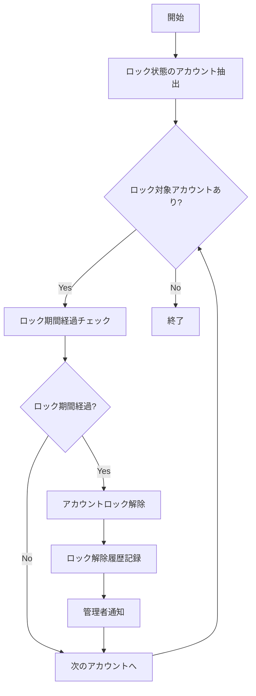

# バッチ仕様書：アカウントロック解除バッチ

| 項目                | 内容                                                                                |
|---------------------|------------------------------------------------------------------------------------|
| **バッチID**        | BATCH-001                                                                          |
| **バッチ名称**      | アカウントロック解除バッチ                                                          |
| **機能カテゴリ**    | 認証・認可                                                                          |
| **概要・目的**      | 一定期間経過したアカウントロックを自動的に解除し、ユーザーのシステムアクセスを回復する |
| **バッチ種別**      | 定期バッチ                                                                          |
| **実行スケジュール**| 毎日深夜（0:00）                                                                    |
| **入出力対象**      | UserAuth, ロック履歴                                                                |
| **優先度**          | 高                                                                                  |
| **備考**            | 管理者解除と併用                                                                    |

## 1. 処理概要

アカウントロック解除バッチは、セキュリティポリシーに基づいて一時的にロックされたユーザーアカウントを、一定時間経過後に自動的に解除するバッチ処理です。ログイン失敗回数超過などによりロックされたアカウントに対して、設定された期間（デフォルト24時間）が経過した場合に自動解除を行います。

## 2. 処理フロー



## 3. 入力データ

### 3.1 UserAuthテーブル

| フィールド名      | データ型 | 説明                                           |
|-------------------|----------|------------------------------------------------|
| user_id           | String   | ユーザーID（主キー）                           |
| status            | String   | アカウント状態（"LOCKED"/"ACTIVE"/"INACTIVE"） |
| locked_at         | DateTime | ロック日時                                     |
| lock_reason       | String   | ロック理由                                     |
| failed_login_count| Integer  | 連続ログイン失敗回数                           |

### 3.2 システム設定

| 設定項目                | データ型 | デフォルト値 | 説明                                 |
|-------------------------|----------|--------------|--------------------------------------|
| account_lock_duration   | Integer  | 24           | アカウントロック継続時間（時間単位） |
| auto_unlock_enabled     | Boolean  | true         | 自動ロック解除機能の有効/無効        |
| notify_admin_on_unlock  | Boolean  | true         | 解除時の管理者通知有無               |

## 4. 出力データ

### 4.1 UserAuthテーブル（更新）

| フィールド名      | データ型 | 説明                                           |
|-------------------|----------|------------------------------------------------|
| status            | String   | "ACTIVE"に更新                                 |
| locked_at         | DateTime | null に更新                                    |
| lock_reason       | String   | null に更新                                    |
| failed_login_count| Integer  | 0 にリセット                                   |
| last_modified_at  | DateTime | 更新日時                                       |
| last_modified_by  | String   | "SYSTEM_BATCH"                                 |

### 4.2 ロック履歴テーブル（追加）

| フィールド名      | データ型 | 説明                                           |
|-------------------|----------|------------------------------------------------|
| history_id        | String   | 履歴ID（主キー）                               |
| user_id           | String   | ユーザーID（外部キー）                         |
| action_type       | String   | "UNLOCK"                                       |
| action_by         | String   | "SYSTEM_BATCH"                                 |
| action_at         | DateTime | 解除日時                                       |
| reason            | String   | "AUTO_UNLOCK_BY_DURATION"                      |
| details           | String   | ロック期間などの詳細情報                       |

### 4.3 管理者通知

通知設定が有効な場合、以下の内容で管理者に通知メールを送信：

- 件名：「アカウント自動ロック解除通知」
- 本文：解除されたアカウント一覧、解除日時、ロック理由、ロック期間

## 5. エラー処理

| エラーケース                      | 対応方法                                                                 |
|-----------------------------------|--------------------------------------------------------------------------|
| DBアクセスエラー                  | エラーログを記録し、管理者に通知。処理を中断。                           |
| 通知送信エラー                    | エラーログを記録。アカウント解除処理は完了させ、通知エラーのみ管理者に報告。 |
| 設定値不正（ロック期間が負の値など）| デフォルト値（24時間）を使用し、警告ログを記録。                         |

## 6. 依存関係

- UserAuthテーブル
- ロック履歴テーブル
- システム設定テーブル
- メール通知サービス

## 7. 実行パラメータ

| パラメータ名        | 必須 | デフォルト値 | 説明                                           |
|---------------------|------|--------------|------------------------------------------------|
| --force-unlock-all  | No   | false        | 全ロックアカウントを強制解除（緊急時用）       |
| --dry-run           | No   | false        | 解除対象の確認のみ行い、実際の解除は行わない   |
| --skip-notification | No   | false        | 管理者通知をスキップ                           |

## 8. 実行例

```bash
# 通常実行
npm run batch:unlock-accounts

# 強制解除モード
npm run batch:unlock-accounts -- --force-unlock-all

# ドライラン（解除対象確認のみ）
npm run batch:unlock-accounts -- --dry-run

# TypeScript直接実行
npx tsx src/batch/unlock-accounts.ts

# パラメータ付きTypeScript実行
npx tsx src/batch/unlock-accounts.ts --force-unlock-all --dry-run
```

## 9. 運用上の注意点

- 本バッチは管理者によるアカウントロック解除機能と併用されます。管理者が手動でロックを解除した場合、本バッチによる自動解除は不要となります。
- セキュリティポリシーの変更に伴い、ロック期間の設定値を変更する場合は、システム設定テーブルの `account_lock_duration` を更新してください。
- 大量のアカウントが同時にロックされた場合（不正アクセス攻撃の可能性）、セキュリティ担当者による調査が完了するまで本バッチの実行を一時停止することを推奨します。

## 10. 改訂履歴

| 改訂日     | 改訂者 | 改訂内容                                         |
|------------|--------|--------------------------------------------------|
| 2025/05/29 | 初版   | 初版作成                                         |
