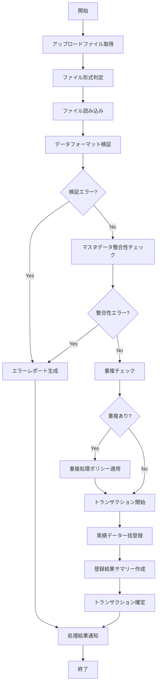

# バッチ仕様書：一括実績登録バッチ

| 項目                | 内容                                                                                |
|---------------------|------------------------------------------------------------------------------------|
| **バッチID**        | BATCH-010                                                                          |
| **バッチ名称**      | 一括実績登録バッチ                                                                  |
| **機能カテゴリ**    | 作業実績管理                                                                        |
| **概要・目的**      | CSV/Excelファイルのアップロード時に実績データを一括登録する                          |
| **バッチ種別**      | オンラインバッチ                                                                    |
| **実行スケジュール**| ファイルアップロード時                                                              |
| **入出力対象**      | BatchJobLog                                                                         |
| **優先度**          | 低                                                                                  |
| **備考**            | オンラインバッチ                                                                    |

## 1. 処理概要

一括実績登録バッチは、ユーザーがアップロードしたCSVまたはExcelファイルから作業実績データを読み取り、システムに一括登録するバッチ処理です。大量の実績データを手作業で入力する手間を省き、効率的なデータ登録を実現します。ファイルのフォーマット検証、データの整合性チェック、重複チェックなどを行い、エラーがあれば詳細なエラーレポートを生成します。正常に処理されたデータは、通常の実績データと同様にシステムに登録され、各種集計・分析の対象となります。

## 2. 処理フロー



## 3. 入力データ

### 3.1 アップロードファイル

#### 3.1.1 CSVファイル

**ファイル形式**: CSV  
**文字コード**: UTF-8  
**区切り文字**: カンマ(,)  
**ヘッダ行**: あり

```
emp_no,project_id,task_id,work_date,work_hours,overtime_hours,skill_used,work_type,work_description,deliverable
E10001,P001,T0101,2025-05-28,7.5,1.0,"Java,Spring",DEVELOPMENT,バグ修正対応,修正コード
E10002,P001,T0102,2025-05-28,8.0,0.0,"JavaScript,React",DEVELOPMENT,UI実装,コンポーネント実装
...
```

#### 3.1.2 Excelファイル

**ファイル形式**: Excel (.xlsx)  
**シート名**: 実績データ  
**ヘッダ行**: あり

| emp_no | project_id | task_id | work_date | work_hours | overtime_hours | skill_used | work_type | work_description | deliverable |
|--------|------------|---------|-----------|------------|----------------|------------|-----------|------------------|-------------|
| E10001 | P001 | T0101 | 2025-05-28 | 7.5 | 1.0 | Java,Spring | DEVELOPMENT | バグ修正対応 | 修正コード |
| E10002 | P001 | T0102 | 2025-05-28 | 8.0 | 0.0 | JavaScript,React | DEVELOPMENT | UI実装 | コンポーネント実装 |
| ... | ... | ... | ... | ... | ... | ... | ... | ... | ... |

### 3.2 システム設定

| 設定項目                    | データ型 | デフォルト値 | 説明                                 |
|-----------------------------|----------|--------------|--------------------------------------|
| batch_import_max_records    | Integer  | 1000         | 一括登録の最大レコード数             |
| duplicate_policy            | String   | "SKIP"       | 重複データ処理ポリシー（"SKIP"/"OVERWRITE"/"ERROR"） |
| validate_master_references  | Boolean  | true         | マスタ参照の整合性チェック有効/無効  |
| notify_manager_on_import    | Boolean  | false        | 一括登録時の上長通知有効/無効        |
| import_template_path        | String   | "/templates/record_import" | インポートテンプレートパス |

## 4. 出力データ

### 4.1 ProjectRecordテーブル（追加）

| フィールド名      | データ型 | 説明                                           |
|-------------------|----------|------------------------------------------------|
| record_id         | String   | 実績記録ID（主キー）                           |
| emp_no            | String   | 社員番号（外部キー）                           |
| project_id        | String   | プロジェクトID（外部キー）                     |
| task_id           | String   | タスクID（外部キー）                           |
| work_date         | Date     | 作業日                                         |
| work_hours        | Double   | 作業時間（時間）                               |
| overtime_hours    | Double   | 残業時間（時間）                               |
| skill_used        | String   | 使用スキル（カンマ区切り）                     |
| work_type         | String   | 作業種別                                       |
| work_description  | Text     | 作業内容                                       |
| deliverable       | Text     | 成果物                                         |
| status            | String   | ステータス（"SUBMITTED"）                      |
| created_at        | DateTime | 作成日時                                       |
| created_by        | String   | 作成者（アップロードユーザー）                 |

### 4.2 BatchJobLogテーブル（追加）

| フィールド名      | データ型 | 説明                                           |
|-------------------|----------|------------------------------------------------|
| job_id            | String   | ジョブID（主キー）                             |
| job_type          | String   | ジョブタイプ（"RECORD_IMPORT"）                |
| file_name         | String   | 元ファイル名                                   |
| file_size         | Integer  | ファイルサイズ（バイト）                       |
| file_format       | String   | ファイル形式（"CSV"/"EXCEL"）                  |
| total_records     | Integer  | 総レコード数                                   |
| processed_records | Integer  | 処理済レコード数                               |
| success_records   | Integer  | 成功レコード数                                 |
| error_records     | Integer  | エラーレコード数                               |
| duplicate_records | Integer  | 重複レコード数                                 |
| start_time        | DateTime | 処理開始時間                                   |
| end_time          | DateTime | 処理終了時間                                   |
| status            | String   | ステータス（"PROCESSING"/"COMPLETED"/"FAILED"）|
| error_details     | Text     | エラー詳細（発生時）                           |
| created_by        | String   | 実行ユーザー                                   |
| created_at        | DateTime | 作成日時                                       |

### 4.3 エラーレポート

**ファイル形式**: Excel (.xlsx)  
**ファイル名**: `import_error_report_YYYYMMDD_HHMMSS.xlsx`  
**シート構成**:

1. **サマリー**
   - 処理日時
   - 元ファイル名
   - 総レコード数
   - 成功レコード数
   - エラーレコード数
   - 重複レコード数

2. **エラーレコード**
   - 行番号
   - エラー種別
   - エラーメッセージ
   - 元データ

3. **重複レコード**
   - 行番号
   - 重複タイプ
   - 適用されたポリシー
   - 元データ
   - 既存データ

### 4.4 処理結果通知

**通知方法**: 画面表示  
**通知内容**:
- 処理結果サマリー
- エラーレポートダウンロードリンク（エラーがある場合）
- 登録成功データの一覧へのリンク

## 5. エラー処理

| エラーケース                      | 対応方法                                                                 |
|-----------------------------------|--------------------------------------------------------------------------|
| ファイル形式不正                  | エラーログを記録し、ユーザーに通知。処理を中断。                         |
| データフォーマット不正            | エラーレコードを記録し、エラーレポートに詳細を出力。正常レコードは処理継続。|
| マスタ参照整合性エラー            | エラーレコードを記録し、エラーレポートに詳細を出力。正常レコードは処理継続。|
| 重複データ検出                    | 設定された重複処理ポリシーに従って処理。結果をレポートに記録。           |
| 最大レコード数超過                | エラーログを記録し、ユーザーに通知。処理を中断。                         |
| DBアクセスエラー                  | エラーログを記録し、ユーザーに通知。トランザクションをロールバック。     |
| 処理タイムアウト                  | エラーログを記録し、ユーザーに通知。処理を中断。                         |
| 設定値不正                        | デフォルト値を使用し、警告ログを記録。                                   |

## 6. 依存関係

- ProjectRecordテーブル
- Projectテーブル
- Taskテーブル
- Employeeテーブル
- BatchJobLogテーブル
- ファイル読み込みサービス
- レポート生成サービス
- 通知サービス

## 7. 実行パラメータ

| パラメータ名        | 必須 | デフォルト値 | 説明                                           |
|---------------------|------|--------------|------------------------------------------------|
| file_path           | Yes  | -            | アップロードファイルのパス                     |
| duplicate_policy    | No   | 設定値       | 重複処理ポリシーを上書き                       |
| validate_references | No   | 設定値       | マスタ参照チェックの有効/無効を上書き          |
| notify_manager      | No   | 設定値       | 上長通知の有効/無効を上書き                    |
| submit_only         | No   | true         | 提出状態のみで登録（承認なし）                 |
| date_format         | No   | "yyyy-MM-dd" | 日付フォーマットを指定                         |

## 8. 実行例

```bash
# 通常実行（ファイルアップロード時に自動実行）
npm run batch:bulk-import -- --file_path=/uploads/records.csv

# TypeScript直接実行
npx tsx src/batch/bulkImport.ts --file_path=/uploads/records.csv

# 重複ポリシーを指定して実行
npm run batch:bulk-import -- --file_path=/uploads/records.xlsx --duplicate_policy=OVERWRITE

# マスタ参照チェックを無効化して実行
npm run batch:bulk-import -- --file_path=/uploads/records.csv --validate_references=false

# 上長通知を有効にして実行
npm run batch:bulk-import -- --file_path=/uploads/records.xlsx --notify_manager=true
```

## 9. 運用上の注意点

- 本バッチはファイルアップロード時に自動的に実行されるオンラインバッチです。
- 大量のデータを一括登録する場合は、処理時間が長くなる可能性があります。`batch_import_max_records` の設定値を超えるデータは処理されません。
- 重複データの処理方法は `duplicate_policy` の設定に依存します：
  - "SKIP": 重複データはスキップし、既存データを維持します（デフォルト）
  - "OVERWRITE": 重複データで既存データを上書きします
  - "ERROR": 重複データをエラーとして扱い、処理を中断します
- マスタ参照の整合性チェックを有効にすると、存在しないプロジェクトID、タスクID、社員番号などを参照するデータはエラーとなります。
- 一括登録されたデータは「提出済み（SUBMITTED）」状態で登録され、通常の承認フローに従って処理されます。
- エラーレポートは詳細なエラー情報を提供するため、データ修正の参考にしてください。
- インポートテンプレートは定期的に更新される可能性があるため、最新のテンプレートを使用することを推奨します。

## 10. 改訂履歴

| 改訂日     | 改訂者 | 改訂内容                                         |
|------------|--------|--------------------------------------------------|
| 2025/05/29 | 初版   | 初版作成                                         |
