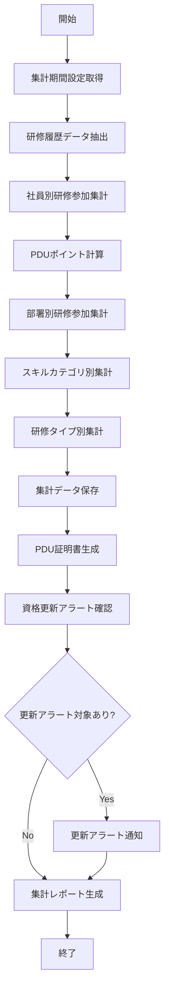

# バッチ仕様書：研修記録集計バッチ

| 項目                | 内容                                                                                |
|---------------------|------------------------------------------------------------------------------------|
| **バッチID**        | BATCH-011                                                                          |
| **バッチ名称**      | 研修記録集計バッチ                                                                  |
| **機能カテゴリ**    | 研修・教育管理                                                                      |
| **概要・目的**      | 研修参加履歴を集計し、PDUポイントを自動計算して社員の継続的な能力開発を支援する       |
| **バッチ種別**      | 定期バッチ                                                                          |
| **実行スケジュール**| 毎月1日深夜（4:30）                                                                 |
| **入出力対象**      | TrainingHistory, PDU                                                                |
| **優先度**          | 中                                                                                  |
| **備考**            |                                                                                     |

## 1. 処理概要

研修記録集計バッチは、社員の研修参加履歴を集計し、PDU（Professional Development Unit）ポイントを自動計算するバッチ処理です。社内外の研修、セミナー、e-ラーニングなどの教育活動への参加記録を基に、資格維持や専門能力開発に必要なポイントを集計します。また、部署別・スキルカテゴリ別の研修参加状況を分析し、組織全体の能力開発状況を可視化します。集計結果は社員のキャリア開発計画や組織の教育計画立案に活用されます。

## 2. 処理フロー



## 3. 入力データ

### 3.1 TrainingHistoryテーブル

| フィールド名      | データ型 | 説明                                           |
|-------------------|----------|------------------------------------------------|
| history_id        | String   | 履歴ID（主キー）                               |
| emp_no            | String   | 社員番号（外部キー）                           |
| training_id       | String   | 研修ID（外部キー）                             |
| start_date        | Date     | 開始日                                         |
| end_date          | Date     | 終了日                                         |
| completion_status | String   | 修了状態（"COMPLETED"/"IN_PROGRESS"/"CANCELLED"）|
| completion_date   | Date     | 修了日                                         |
| score             | Double   | 評価点数（該当する場合）                       |
| certificate_id    | String   | 修了証ID                                       |
| pdu_points        | Double   | PDUポイント                                    |
| pdu_category      | String   | PDUカテゴリ                                    |
| feedback          | Text     | フィードバック                                 |
| created_at        | DateTime | 作成日時                                       |
| created_by        | String   | 作成者                                         |
| last_modified_at  | DateTime | 最終更新日時                                   |
| last_modified_by  | String   | 最終更新者                                     |

### 3.2 Trainingテーブル

| フィールド名      | データ型 | 説明                                           |
|-------------------|----------|------------------------------------------------|
| training_id       | String   | 研修ID（主キー）                               |
| training_name     | String   | 研修名                                         |
| training_code     | String   | 研修コード                                     |
| training_type     | String   | 研修タイプ（"INTERNAL"/"EXTERNAL"/"E_LEARNING"）|
| skill_category    | String   | スキルカテゴリ                                 |
| description       | Text     | 説明                                           |
| duration_hours    | Double   | 所要時間（時間）                               |
| default_pdu_points| Double   | デフォルトPDUポイント                          |
| pdu_categories    | String   | 対応PDUカテゴリ（カンマ区切り）                |
| provider          | String   | 提供元                                         |
| cost              | Double   | 費用                                           |
| active            | Boolean  | 有効フラグ                                     |
| created_at        | DateTime | 作成日時                                       |
| last_modified_at  | DateTime | 最終更新日時                                   |

### 3.3 Certificationテーブル

| フィールド名      | データ型 | 説明                                           |
|-------------------|----------|------------------------------------------------|
| cert_id           | String   | 資格ID（主キー）                               |
| emp_no            | String   | 社員番号（外部キー）                           |
| cert_type_id      | String   | 資格種別ID（外部キー）                         |
| cert_name         | String   | 資格名称                                       |
| cert_number       | String   | 資格番号                                       |
| acquisition_date  | Date     | 取得日                                         |
| expiry_date       | Date     | 有効期限日                                     |
| renewal_required  | Boolean  | 更新必要フラグ                                 |
| renewal_cycle     | Integer  | 更新サイクル（月数）                           |
| required_pdu      | Double   | 更新に必要なPDUポイント                        |
| status            | String   | ステータス（"ACTIVE"/"EXPIRED"/"PENDING"）     |
| last_modified_at  | DateTime | 最終更新日時                                   |
| last_modified_by  | String   | 最終更新者                                     |

### 3.4 Employeeテーブル

| フィールド名      | データ型 | 説明                                           |
|-------------------|----------|------------------------------------------------|
| emp_no            | String   | 社員番号（主キー）                             |
| name              | String   | 氏名                                           |
| dept_id           | String   | 所属部署ID（外部キー）                         |
| group_id          | String   | 所属グループID（外部キー）                     |
| position_id       | String   | 役職ID（外部キー）                             |
| email             | String   | メールアドレス                                 |
| status            | String   | ステータス（"ACTIVE"/"INACTIVE"）              |

### 3.5 システム設定

| 設定項目                    | データ型 | デフォルト値 | 説明                                 |
|-----------------------------|----------|--------------|--------------------------------------|
| pdu_calculation_period_months | Integer | 12          | PDU集計期間（月数）                  |
| pdu_certificate_template    | String   | "/templates/pdu_certificate" | PDU証明書テンプレートパス |
| renewal_alert_threshold_days | Integer | 90          | 資格更新アラート閾値（日数）         |
| notify_on_pdu_update        | Boolean  | true         | PDU更新時の通知有効/無効             |
| training_report_path        | String   | "/reports/training" | 研修レポート保存パス          |

## 4. 出力データ

### 4.1 PDUテーブル（追加/更新）

| フィールド名      | データ型 | 説明                                           |
|-------------------|----------|------------------------------------------------|
| pdu_id            | String   | PDUID（主キー）                                |
| emp_no            | String   | 社員番号（外部キー）                           |
| cert_id           | String   | 資格ID（外部キー、該当する場合）               |
| period_start      | Date     | 集計期間開始日                                 |
| period_end        | Date     | 集計期間終了日                                 |
| total_pdu         | Double   | 総PDUポイント                                  |
| technical_pdu     | Double   | 技術PDUポイント                                |
| leadership_pdu    | Double   | リーダーシップPDUポイント                      |
| strategic_pdu     | Double   | 戦略PDUポイント                                |
| required_pdu      | Double   | 必要PDUポイント                                |
| achievement_rate  | Double   | 達成率                                         |
| certificate_path  | String   | 証明書ファイルパス                             |
| created_at        | DateTime | 作成日時                                       |
| created_by        | String   | "SYSTEM_BATCH"                                 |

### 4.2 TrainingSummaryテーブル（追加/更新）

| フィールド名      | データ型 | 説明                                           |
|-------------------|----------|------------------------------------------------|
| summary_id        | String   | サマリーID（主キー）                           |
| emp_no            | String   | 社員番号（外部キー、個人集計の場合）           |
| dept_id           | String   | 部署ID（外部キー、部署集計の場合）             |
| skill_category    | String   | スキルカテゴリ（カテゴリ集計の場合）           |
| summary_type      | String   | 集計タイプ（"EMPLOYEE"/"DEPARTMENT"/"SKILL"/"TRAINING_TYPE"）|
| period_start      | Date     | 集計期間開始日                                 |
| period_end        | Date     | 集計期間終了日                                 |
| training_count    | Integer  | 研修参加数                                     |
| total_hours       | Double   | 総研修時間                                     |
| total_pdu         | Double   | 総PDUポイント                                  |
| avg_score         | Double   | 平均評価点数                                   |
| completion_rate   | Double   | 修了率                                         |
| created_at        | DateTime | 作成日時                                       |
| created_by        | String   | "SYSTEM_BATCH"                                 |

### 4.3 PDU証明書

**ファイル形式**: PDF  
**ファイル名**: `pdu_certificate_{emp_no}_{YYYYMMDD}.pdf`  
**内容**:
- 社員情報（氏名、社員番号、所属部署）
- 集計期間
- PDUポイント詳細（カテゴリ別）
- 参加研修リスト
- 証明日
- 認証情報

### 4.4 研修集計レポート

**ファイル形式**: Excel (.xlsx)  
**ファイル名**: `training_summary_report_YYYYMM.xlsx`  
**シート構成**:

1. **サマリー**
   - 集計期間
   - 全体研修参加数
   - 全体研修時間
   - 全体PDUポイント
   - 平均修了率

2. **社員別集計**
   - 社員別研修参加数
   - 社員別研修時間
   - 社員別PDUポイント
   - 資格更新状況

3. **部署別集計**
   - 部署別研修参加数
   - 部署別研修時間
   - 部署別平均PDUポイント
   - 部署別修了率

4. **スキルカテゴリ別集計**
   - カテゴリ別研修参加数
   - カテゴリ別研修時間
   - カテゴリ別参加人数

5. **研修タイプ別集計**
   - タイプ別研修参加数
   - タイプ別研修時間
   - タイプ別参加人数
   - タイプ別平均評価

### 4.5 資格更新アラート通知

**対象者**: 資格更新が必要な社員

**通知内容**:
```
件名: 【重要】資格更新に必要なPDUポイントについて

{氏名}様

あなたが保有する以下の資格の更新期限が近づいています。

■資格: {資格名}
■資格番号: {資格番号}
■有効期限: {有効期限}
■残り日数: {残り日数}日

■PDU取得状況
必要ポイント: {必要PDUポイント}
現在のポイント: {現在のPDUポイント}
不足ポイント: {不足PDUポイント}

PDUポイントが不足しています。資格の更新には、有効期限までに必要なPDUポイントを取得する必要があります。
以下の研修への参加をご検討ください。

■推奨研修
{研修名1}: {PDUポイント1}ポイント
{研修名2}: {PDUポイント2}ポイント
{研修名3}: {PDUポイント3}ポイント

PDU証明書は以下のリンクからダウンロードできます。
{PDU証明書リンク}

※このメールはシステムより自動送信されています。
```

## 5. エラー処理

| エラーケース                      | 対応方法                                                                 |
|-----------------------------------|--------------------------------------------------------------------------|
| 研修履歴データ不足                | 警告ログを記録し、利用可能なデータのみで処理を継続。                     |
| PDU計算エラー                     | エラーログを記録し、エラー発生箇所までの集計結果を保存。処理を継続。     |
| 証明書生成エラー                  | エラーログを記録し、管理者に通知。集計データは保存済みの状態で処理を継続。|
| DBアクセスエラー                  | エラーログを記録し、管理者に通知。処理を中断。                           |
| レポート生成エラー                | エラーログを記録し、管理者に通知。集計データは保存済みの状態で終了。     |
| 通知送信エラー                    | エラーログを記録。集計・レポート処理は完了させ、通知エラーのみ管理者に報告。|
| 設定値不正                        | デフォルト値を使用し、警告ログを記録。                                   |

## 6. 依存関係

- TrainingHistoryテーブル
- Trainingテーブル
- Certificationテーブル
- Employeeテーブル
- PDUテーブル
- TrainingSummaryテーブル
- PDU証明書テンプレート
- レポート生成サービス
- 通知サービス

## 7. 実行パラメータ

| パラメータ名        | 必須 | デフォルト値 | 説明                                           |
|---------------------|------|--------------|------------------------------------------------|
| --period-months     | No   | 設定値       | 集計対象期間を上書き（月数）                   |
| --start-date        | No   | null         | 集計開始日を指定（YYYY-MM-DD形式）             |
| --end-date          | No   | null         | 集計終了日を指定（YYYY-MM-DD形式）             |
| --emp-no            | No   | null         | 特定社員のみを対象とする場合に指定             |
| --dept-id           | No   | null         | 特定部署のみを対象とする場合に指定             |
| --cert-type-id      | No   | null         | 特定資格種別のみを対象とする場合に指定         |
| --skip-certificate  | No   | false        | PDU証明書生成をスキップ                        |
| --skip-notification | No   | false        | 更新アラート通知をスキップ                     |
| --force-alert       | No   | false        | 閾値に関わらず更新アラートを強制送信           |

## 8. 実行例

```bash
# 通常実行（ファイルアップロード時に自動実行）
npm run batch:training-aggregate

# TypeScript直接実行
npx tsx src/batch/trainingAggregate.ts

# 過去6ヶ月間のデータを集計
npm run batch:training-aggregate -- --period-months=6

# 特定期間のデータを集計
npm run batch:training-aggregate -- --start-date=2024-11-01 --end-date=2025-04-30

# 特定社員のみ集計
npm run batch:training-aggregate -- --emp-no=E10023

# 特定部署のみ集計
npm run batch:training-aggregate -- --dept-id=D001

# 証明書生成をスキップして実行
npm run batch:training-aggregate -- --skip-certificate
```

## 9. 運用上の注意点

- 本バッチは毎月1日深夜に実行され、前月までの研修参加履歴を集計します。
- PDUポイントの計算は資格の種類によって異なるルールが適用される場合があります。資格ごとの要件に合わせて設定を調整してください。
- 資格更新アラートは `renewal_alert_threshold_days` の設定に基づいて送信されます。資格の重要度に応じて閾値を調整することを検討してください。
- PDU証明書は資格更新申請の際に必要となる場合があります。証明書のフォーマットは資格発行団体の要件に合わせて調整してください。
- 研修データの入力遅延がある場合、集計結果が実態と乖離する可能性があります。重要な資格更新の判断には、最新のデータを確認することを推奨します。
- 大量の研修履歴がある場合、処理時間が長くなる可能性があります。その場合は、集計期間を短くするか、特定の社員や部署に絞って実行することを検討してください。
- PDU証明書テンプレートを変更する場合は、`pdu_certificate_template` の設定を更新してください。

## 10. 改訂履歴

| 改訂日     | 改訂者 | 改訂内容                                         |
|------------|--------|--------------------------------------------------|
| 2025/05/29 | 初版   | 初版作成                                         |
