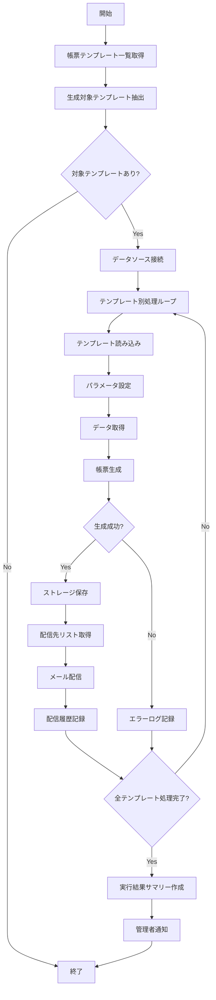

# バッチ仕様書：帳票自動生成バッチ

| 項目                | 内容                                                                                |
|---------------------|------------------------------------------------------------------------------------|
| **バッチID**        | BATCH-012                                                                          |
| **バッチ名称**      | 帳票自動生成バッチ                                                                  |
| **機能カテゴリ**    | レポート・分析                                                                      |
| **概要・目的**      | 定型帳票（Excel/PDF）を自動生成し、関係者に配信する                                  |
| **バッチ種別**      | 定期バッチ                                                                          |
| **実行スケジュール**| 毎月1日朝（6:00）                                                                   |
| **入出力対象**      | ReportTemplate                                                                      |
| **優先度**          | 低                                                                                  |
| **備考**            | メール/ストレージ連携                                                               |

## 1. 処理概要

帳票自動生成バッチは、あらかじめ定義されたテンプレートに基づいて、各種業務帳票（Excel/PDF）を自動的に生成し、指定された関係者に配信するバッチ処理です。スキル状況、プロジェクト実績、研修参加状況など、システムに蓄積されたデータを基に、定型的な帳票を定期的に作成することで、レポート作成業務を効率化します。また、生成された帳票はクラウドストレージに保存され、必要に応じて参照できるようになります。

## 2. 処理フロー



## 3. 入力データ

### 3.1 ReportTemplateテーブル

| フィールド名      | データ型 | 説明                                           |
|-------------------|----------|------------------------------------------------|
| template_id       | String   | テンプレートID（主キー）                       |
| template_name     | String   | テンプレート名                                 |
| template_type     | String   | テンプレートタイプ（"EXCEL"/"PDF"）            |
| template_path     | String   | テンプレートファイルパス                       |
| description       | Text     | 説明                                           |
| data_source_type  | String   | データソースタイプ（"SQL"/"API"/"FUNCTION"）   |
| data_source_config| JSON     | データソース設定（JSON形式）                   |
| parameters        | JSON     | パラメータ定義（JSON形式）                     |
| schedule_type     | String   | スケジュールタイプ（"MONTHLY"/"QUARTERLY"/"ANNUAL"）|
| schedule_day      | Integer  | スケジュール日（1-31）                         |
| output_filename_pattern | String | 出力ファイル名パターン                     |
| active            | Boolean  | 有効フラグ                                     |
| created_at        | DateTime | 作成日時                                       |
| last_modified_at  | DateTime | 最終更新日時                                   |
| last_modified_by  | String   | 最終更新者                                     |

### 3.2 ReportRecipientテーブル

| フィールド名      | データ型 | 説明                                           |
|-------------------|----------|------------------------------------------------|
| recipient_id      | String   | 受信者ID（主キー）                             |
| template_id       | String   | テンプレートID（外部キー）                     |
| recipient_type    | String   | 受信者タイプ（"USER"/"ROLE"/"EMAIL"/"DEPARTMENT"）|
| recipient_value   | String   | 受信者値（ユーザーID/ロールID/メールアドレス/部署ID）|
| delivery_method   | String   | 配信方法（"EMAIL"/"STORAGE"/"BOTH"）           |
| active            | Boolean  | 有効フラグ                                     |
| created_at        | DateTime | 作成日時                                       |
| last_modified_at  | DateTime | 最終更新日時                                   |

### 3.3 データソース

テンプレートごとに定義されたデータソース設定に基づいて、以下のいずれかからデータを取得：

#### 3.3.1 SQLデータソース

```json
{
  "type": "SQL",
  "query": "SELECT e.name, e.emp_no, d.dept_name, COUNT(s.skill_id) as skill_count, AVG(s.skill_level) as avg_skill_level FROM Employee e JOIN Department d ON e.dept_id = d.dept_id LEFT JOIN SkillRecord s ON e.emp_no = s.emp_no WHERE e.status = 'ACTIVE' GROUP BY e.emp_no, e.name, d.dept_name ORDER BY d.dept_name, e.name",
  "connection": "DEFAULT"
}
```

#### 3.3.2 APIデータソース

```json
{
  "type": "API",
  "endpoint": "/api/v1/reports/skill-summary",
  "method": "GET",
  "headers": {
    "Content-Type": "application/json",
    "Authorization": "Bearer ${API_TOKEN}"
  },
  "parameters": {
    "period": "${period}",
    "dept_id": "${dept_id}"
  }
}
```

#### 3.3.3 関数データソース

```json
{
  "type": "FUNCTION",
  "function": "generateSkillMatrixData",
  "parameters": {
    "asOfDate": "${as_of_date}",
    "deptId": "${dept_id}",
    "skillCategories": ["PROGRAMMING", "DATABASE", "INFRASTRUCTURE"]
  }
}
```

### 3.4 システム設定

| 設定項目                    | データ型 | デフォルト値 | 説明                                 |
|-----------------------------|----------|--------------|--------------------------------------|
| report_storage_path         | String   | "/reports"   | レポート保存パス                     |
| report_retention_months     | Integer  | 36           | レポート保持期間（月数）             |
| email_template_path         | String   | "/templates/report_email" | メールテンプレートパス   |
| max_attachment_size_mb      | Integer  | 10           | 最大添付ファイルサイズ（MB）         |
| notify_admin_on_error       | Boolean  | true         | エラー発生時の管理者通知有無         |
| default_storage_provider    | String   | "LOCAL"      | デフォルトストレージプロバイダ       |
| cloud_storage_config        | JSON     | {}           | クラウドストレージ設定               |

## 4. 出力データ

### 4.1 生成帳票ファイル

**ファイル形式**: Excel (.xlsx) / PDF (.pdf)  
**ファイル名**: テンプレートの `output_filename_pattern` に基づいて生成  
**例**: `skill_matrix_report_202505.xlsx`, `project_summary_2025Q1.pdf`

### 4.2 ReportHistoryテーブル（追加）

| フィールド名      | データ型 | 説明                                           |
|-------------------|----------|------------------------------------------------|
| report_id         | String   | レポートID（主キー）                           |
| template_id       | String   | テンプレートID（外部キー）                     |
| generation_date   | DateTime | 生成日時                                       |
| report_period     | String   | レポート対象期間                               |
| file_name         | String   | ファイル名                                     |
| file_path         | String   | ファイルパス                                   |
| file_size         | Integer  | ファイルサイズ（バイト）                       |
| file_format       | String   | ファイル形式（"EXCEL"/"PDF"）                  |
| parameters        | JSON     | 使用パラメータ（JSON形式）                     |
| status            | String   | ステータス（"GENERATED"/"DELIVERED"/"ERROR"）  |
| error_details     | Text     | エラー詳細（発生時）                           |
| created_at        | DateTime | 作成日時                                       |
| created_by        | String   | "SYSTEM_BATCH"                                 |

### 4.3 DeliveryHistoryテーブル（追加）

| フィールド名      | データ型 | 説明                                           |
|-------------------|----------|------------------------------------------------|
| delivery_id       | String   | 配信ID（主キー）                               |
| report_id         | String   | レポートID（外部キー）                         |
| recipient_id      | String   | 受信者ID（外部キー）                           |
| delivery_method   | String   | 配信方法（"EMAIL"/"STORAGE"/"BOTH"）           |
| delivery_address  | String   | 配信先（メールアドレス/ストレージパス）        |
| delivery_date     | DateTime | 配信日時                                       |
| status            | String   | ステータス（"SUCCESS"/"FAILED"）               |
| error_details     | Text     | エラー詳細（発生時）                           |
| created_at        | DateTime | 作成日時                                       |
| created_by        | String   | "SYSTEM_BATCH"                                 |

### 4.4 メール配信

**対象者**: テンプレートに紐づく受信者

**テンプレート例**:
```
件名: 【自動配信】{レポート名} ({対象期間})

{受信者名}様

{レポート名}（{対象期間}）が生成されましたのでお知らせします。

■レポート概要
レポート名: {レポート名}
対象期間: {対象期間}
生成日時: {生成日時}

添付ファイルをご確認ください。
また、以下のリンクからもアクセス可能です。
{ストレージリンク}

※このメールはシステムより自動送信されています。
```

### 4.5 実行結果サマリー

**通知方法**: メール  
**対象者**: システム管理者

**内容**:
```
件名: 【バッチ実行結果】帳票自動生成バッチ実行結果 ({実行日})

システム管理者様

帳票自動生成バッチの実行結果をお知らせします。

■実行概要
実行日時: {実行日時}
処理結果: {成功/一部エラー/失敗}

■処理詳細
処理対象テンプレート数: {テンプレート数}
正常生成数: {正常生成数}
エラー数: {エラー数}

■生成レポート一覧
{レポート名1}: {ステータス1} - {配信先数1}件
{レポート名2}: {ステータス2} - {配信先数2}件
...

■エラー詳細
{エラー詳細情報}

※このメールはシステムより自動送信されています。
```

## 5. エラー処理

| エラーケース                      | 対応方法                                                                 |
|-----------------------------------|--------------------------------------------------------------------------|
| テンプレートファイル不正          | エラーログを記録し、該当テンプレートの処理をスキップ。他のテンプレートは処理継続。|
| データソース接続エラー            | エラーログを記録し、該当テンプレートの処理をスキップ。他のテンプレートは処理継続。|
| データ取得エラー                  | エラーログを記録し、該当テンプレートの処理をスキップ。他のテンプレートは処理継続。|
| 帳票生成エラー                    | エラーログを記録し、該当テンプレートの処理をスキップ。他のテンプレートは処理継続。|
| ストレージ保存エラー              | エラーログを記録し、メール配信のみ試行。                                 |
| メール配信エラー                  | エラーログを記録し、ストレージ保存のみ確保。                             |
| パラメータ解決エラー              | エラーログを記録し、デフォルト値または空値で代替。                       |
| 設定値不正                        | デフォルト値を使用し、警告ログを記録。                                   |

## 6. 依存関係

- ReportTemplateテーブル
- ReportRecipientテーブル
- ReportHistoryテーブル
- DeliveryHistoryテーブル
- 帳票テンプレートファイル
- データソース（SQL/API/関数）
- 帳票生成エンジン
- メール送信サービス
- ストレージサービス

## 7. 実行パラメータ

| パラメータ名        | 必須 | デフォルト値 | 説明                                           |
|---------------------|------|--------------|------------------------------------------------|
| --template-id       | No   | null         | 特定テンプレートのみを対象とする場合に指定     |
| --reference-date    | No   | 当日         | 基準日を指定（YYYY-MM-DD形式）                 |
| --force-generate    | No   | false        | スケジュール設定に関わらず強制的に生成         |
| --skip-delivery     | No   | false        | 配信処理をスキップ                             |
| --delivery-method   | No   | null         | 配信方法を上書き（"EMAIL"/"STORAGE"/"BOTH"）   |
| --test-mode         | No   | false        | テストモード（テスト用受信者のみに配信）       |
| --parameter-override| No   | null         | パラメータ上書き（JSON形式）                   |

## 8. 実行例

```bash
# 通常実行（毎日深夜に自動実行）
npm run batch:notification-aggregate

# TypeScript直接実行
npx tsx src/batch/notificationAggregate.ts

# 過去7日間のデータを集計
npm run batch:notification-aggregate -- --period-days=7

# 特定期間のデータを集計
npm run batch:notification-aggregate -- --start-date=2025-05-01 --end-date=2025-05-31

# 特定社員のみ集計
npm run batch:notification-aggregate -- --emp-no=E10023

# 特定部署のみ集計
npm run batch:notification-aggregate -- --dept-id=D001

# 通知をスキップして実行
npm run batch:notification-aggregate -- --skip-notification
```

## 9. 運用上の注意点

- 本バッチは毎月1日朝に実行され、各テンプレートのスケジュール設定に基づいて帳票を生成します。
- テンプレートの `schedule_type` と `schedule_day` の組み合わせにより、月次/四半期/年次など異なる頻度で帳票が生成されます。
- 生成された帳票は `report_retention_months` の設定に基づいて保持され、期間を超えた古いレポートは自動的に削除されます。
- メール添付ファイルのサイズが `max_attachment_size_mb` を超える場合は、ストレージリンクのみが送信されます。
- クラウドストレージを利用する場合は、`cloud_storage_config` に適切な接続情報を設定する必要があります。
- テンプレートファイルの変更は、バッチ実行前に完了している必要があります。
- データ量が多い帳票の場合、処理時間が長くなる可能性があります。その場合は、個別に実行するか、処理の分散を検討してください。
- 帳票テンプレートには、条件付き書式やマクロなどの高度な機能を含めることができますが、互換性の問題が発生する可能性があるため、事前にテストすることを推奨します。

## 10. 改訂履歴

| 改訂日     | 改訂者 | 改訂内容                                         |
|------------|--------|--------------------------------------------------|
| 2025/05/29 | 初版   | 初版作成                                         |
