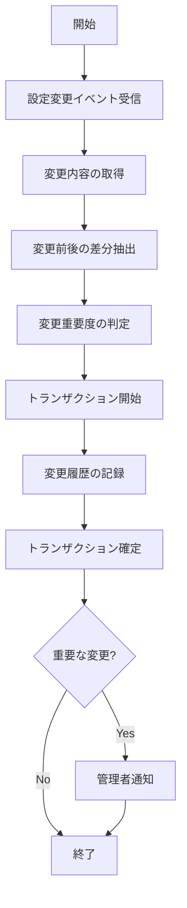

# バッチ仕様書：設定変更履歴記録バッチ

| 項目                | 内容                                                                                |
|---------------------|------------------------------------------------------------------------------------|
| **バッチID**        | BATCH-016                                                                          |
| **バッチ名称**      | 設定変更履歴記録バッチ                                                              |
| **機能カテゴリ**    | システム管理                                                                        |
| **概要・目的**      | システム設定変更の履歴を自動記録し、設定変更の追跡と監査を可能にする                 |
| **バッチ種別**      | オンラインバッチ                                                                    |
| **実行スケジュール**| 設定変更イベント発生時                                                              |
| **入出力対象**      | SystemConfig                                                                        |
| **優先度**          | 低                                                                                  |
| **備考**            | オンラインバッチ                                                                    |

## 1. 処理概要

設定変更履歴記録バッチは、システム設定の変更が発生した際に自動的に実行され、変更内容を詳細に記録するオンラインバッチ処理です。システム設定の変更履歴を保持することで、設定変更の追跡、監査、問題発生時の原因特定、および必要に応じた設定の復元を可能にします。また、重要な設定変更が行われた場合には、管理者に通知することで、不正な設定変更の早期発見にも貢献します。

## 2. 処理フロー



## 3. 入力データ

### 3.1 設定変更イベント

システム設定の変更時に発生するイベント情報：

| フィールド名      | データ型 | 説明                                           |
|-------------------|----------|------------------------------------------------|
| event_id          | String   | イベントID                                     |
| event_timestamp   | DateTime | イベント発生日時                               |
| actor_id          | String   | 操作実行者ID                                   |
| config_category   | String   | 設定カテゴリ                                   |
| config_key        | String   | 設定キー                                       |
| old_value         | String   | 変更前の値                                     |
| new_value         | String   | 変更後の値                                     |
| ip_address        | String   | 操作元IPアドレス                               |
| user_agent        | String   | ユーザーエージェント                           |

### 3.2 SystemConfigテーブル

| フィールド名      | データ型 | 説明                                           |
|-------------------|----------|------------------------------------------------|
| config_id         | String   | 設定ID（主キー）                               |
| category          | String   | カテゴリ                                       |
| config_key        | String   | 設定キー                                       |
| config_value      | String   | 設定値                                         |
| data_type         | String   | データ型（"STRING"/"INTEGER"/"BOOLEAN"/"JSON"）|
| description       | Text     | 説明                                           |
| is_sensitive      | Boolean  | 機密情報フラグ                                 |
| is_system         | Boolean  | システム設定フラグ                             |
| importance        | String   | 重要度（"LOW"/"MEDIUM"/"HIGH"/"CRITICAL"）     |
| created_at        | DateTime | 作成日時                                       |
| last_modified_at  | DateTime | 最終更新日時                                   |
| last_modified_by  | String   | 最終更新者                                     |

### 3.3 ConfigImportanceDefinitionテーブル

| フィールド名      | データ型 | 説明                                           |
|-------------------|----------|------------------------------------------------|
| definition_id     | String   | 定義ID（主キー）                               |
| category          | String   | カテゴリ                                       |
| config_key        | String   | 設定キー（ワイルドカード使用可）               |
| importance        | String   | 重要度（"LOW"/"MEDIUM"/"HIGH"/"CRITICAL"）     |
| notify_on_change  | Boolean  | 変更時通知フラグ                               |
| description       | Text     | 説明                                           |
| created_at        | DateTime | 作成日時                                       |
| last_modified_at  | DateTime | 最終更新日時                                   |

### 3.4 システム設定

| 設定項目                    | データ型 | デフォルト値 | 説明                                 |
|-----------------------------|----------|--------------|--------------------------------------|
| config_history_retention_days | Integer | 365         | 設定履歴の保持日数                   |
| notify_admin_on_critical    | Boolean  | true         | 重要設定変更時の管理者通知有無       |
| notify_admin_on_high        | Boolean  | true         | 高重要度設定変更時の管理者通知有無   |
| notify_admin_on_medium      | Boolean  | false        | 中重要度設定変更時の管理者通知有無   |
| notify_admin_on_low         | Boolean  | false        | 低重要度設定変更時の管理者通知有無   |
| mask_sensitive_values       | Boolean  | true         | 機密情報のマスク有無                 |

## 4. 出力データ

### 4.1 ConfigChangeHistoryテーブル（追加）

| フィールド名      | データ型 | 説明                                           |
|-------------------|----------|------------------------------------------------|
| history_id        | String   | 履歴ID（主キー）                               |
| config_id         | String   | 設定ID（外部キー）                             |
| change_timestamp  | DateTime | 変更日時                                       |
| actor_id          | String   | 操作実行者ID                                   |
| category          | String   | カテゴリ                                       |
| config_key        | String   | 設定キー                                       |
| old_value         | String   | 変更前の値（機密情報の場合はマスク）           |
| new_value         | String   | 変更後の値（機密情報の場合はマスク）           |
| data_type         | String   | データ型                                       |
| importance        | String   | 重要度                                         |
| ip_address        | String   | 操作元IPアドレス                               |
| user_agent        | String   | ユーザーエージェント                           |
| created_at        | DateTime | 作成日時                                       |
| created_by        | String   | "SYSTEM_BATCH"                                 |

### 4.2 管理者通知

**通知方法**: メール  
**対象者**: システム管理者

**テンプレート**:
```
件名: 【設定変更通知】{重要度}の設定が変更されました

システム管理者様

以下のシステム設定が変更されました。

■変更概要
変更日時: {変更日時}
変更者: {変更者}
重要度: {重要度}
IPアドレス: {IPアドレス}

■変更内容
カテゴリ: {カテゴリ}
設定キー: {設定キー}
変更前: {変更前の値}
変更後: {変更後の値}

■詳細情報
{設定の説明}

設定変更の詳細は管理画面から確認できます。
{管理画面リンク}

※このメールはシステムより自動送信されています。
```

## 5. エラー処理

| エラーケース                      | 対応方法                                                                 |
|-----------------------------------|--------------------------------------------------------------------------|
| 変更イベント情報不足              | エラーログを記録し、利用可能な情報のみで処理を継続。                     |
| 設定情報取得エラー                | エラーログを記録し、イベント情報のみで処理を継続。                       |
| 履歴記録エラー                    | エラーログを記録し、管理者に通知。                                       |
| 通知送信エラー                    | エラーログを記録。履歴記録は完了させる。                                 |
| トランザクションエラー            | エラーログを記録し、管理者に通知。                                       |
| 設定値不正                        | デフォルト値を使用し、警告ログを記録。                                   |

## 6. 依存関係

- SystemConfigテーブル
- ConfigImportanceDefinitionテーブル
- ConfigChangeHistoryテーブル
- イベント処理サービス
- 通知サービス

## 7. 実行パラメータ

| パラメータ名        | 必須 | デフォルト値 | 説明                                           |
|---------------------|------|--------------|------------------------------------------------|
| --event-id          | Yes  | -            | 設定変更イベントID                             |
| --skip-notification | No   | false        | 管理者通知をスキップ                           |
| --force-importance  | No   | null         | 重要度を上書き（"LOW"/"MEDIUM"/"HIGH"/"CRITICAL"）|
| --dry-run           | No   | false        | 実行シミュレーションのみ（実際の記録なし）     |

## 8. 実行例

```bash
# 通常実行（設定変更イベント発生時に自動実行）
npm run batch:config-history -- --event-id=EVT12345

# 通知なしで実行
npm run batch:config-history -- --event-id=EVT12345 --skip-notification

# 重要度を上書きして実行
npm run batch:config-history -- --event-id=EVT12345 --force-importance=HIGH

# 実行シミュレーション（ドライラン）
npm run batch:config-history -- --event-id=EVT12345 --dry-run
```

## 9. 運用上の注意点

- 本バッチはシステム設定の変更イベント発生時に自動的に実行されるオンラインバッチです。
- 機密情報（パスワード、APIキーなど）は、`is_sensitive` フラグが `true` の場合、履歴に記録される際にマスクされます。
- 設定変更の重要度は、`ConfigImportanceDefinitionテーブル` の定義に基づいて判定されます。定義がない場合は、`SystemConfigテーブル` の `importance` フィールドが使用されます。
- 管理者への通知は、設定変更の重要度と通知設定に基づいて行われます。重要な設定変更の場合は、即時に通知されます。
- 設定履歴は `config_history_retention_days` の設定に基づいて保持され、期間を超えた古い履歴は自動的に削除されます。
- 同一設定に対する短時間での連続変更は、変更履歴が大量に生成される可能性があります。必要に応じて、変更の集約や制限を検討してください。
- システム設定の変更は、システム全体の動作に影響を与える可能性があります。重要な設定の変更は、事前にテスト環境で検証することを推奨します。

## 10. 改訂履歴

| 改訂日     | 改訂者 | 改訂内容                                         |
|------------|--------|--------------------------------------------------|
| 2025/05/29 | 初版   | 初版作成                                         |
