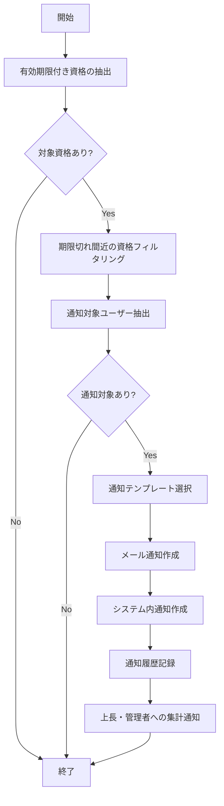

# バッチ仕様書：資格期限アラートバッチ

| 項目                | 内容                                                                                |
|---------------------|------------------------------------------------------------------------------------|
| **バッチID**        | BATCH-202                                                                          |
| **バッチ名称**      | 資格期限アラートバッチ                                                              |
| **機能カテゴリ**    | スキル管理                                                                          |
| **概要・目的**      | 資格有効期限切れが近いユーザーに通知・アラートを送信し、資格更新を促す               |
| **バッチ種別**      | 定期バッチ                                                                          |
| **実行スケジュール**| 毎日朝（7:00）                                                                      |
| **入出力対象**      | Certification                                                                       |
| **優先度**          | 高                                                                                  |
| **備考**            | メール/通知API連携                                                                  |

## 1. 処理概要

資格期限アラートバッチは、システムに登録されている社員の資格情報を監視し、有効期限が近づいている資格を持つユーザーに対して自動的に通知を送信するバッチ処理です。資格の更新漏れを防止し、社員の資格保有状況を最新に保つことを目的としています。通知はメールおよびシステム内通知の両方で行われ、資格の種類や期限までの残り日数に応じて通知頻度が調整されます。

## 2. 処理フロー



## 3. 入力データ

### 3.1 Certificationテーブル

| フィールド名      | データ型 | 説明                                           |
|-------------------|----------|------------------------------------------------|
| cert_id           | String   | 資格ID（主キー）                               |
| emp_no            | String   | 社員番号（外部キー）                           |
| cert_type_id      | String   | 資格種別ID（外部キー）                         |
| cert_name         | String   | 資格名称                                       |
| cert_number       | String   | 資格番号                                       |
| issuing_org       | String   | 発行組織                                       |
| acquisition_date  | Date     | 取得日                                         |
| expiry_date       | Date     | 有効期限日（nullの場合は無期限）               |
| renewal_required  | Boolean  | 更新必要フラグ                                 |
| renewal_cycle     | Integer  | 更新サイクル（月数）                           |
| last_notified_at  | DateTime | 最終通知日時                                   |
| notification_count| Integer  | 通知回数                                       |
| status            | String   | ステータス（"ACTIVE"/"EXPIRED"/"PENDING"）     |
| last_modified_at  | DateTime | 最終更新日時                                   |
| last_modified_by  | String   | 最終更新者                                     |

### 3.2 CertificationTypeテーブル

| フィールド名      | データ型 | 説明                                           |
|-------------------|----------|------------------------------------------------|
| cert_type_id      | String   | 資格種別ID（主キー）                           |
| cert_type_name    | String   | 資格種別名                                     |
| category          | String   | カテゴリ                                       |
| importance        | Integer  | 重要度（1-5）                                  |
| renewal_required  | Boolean  | 更新必要フラグ                                 |
| default_cycle     | Integer  | デフォルト更新サイクル（月数）                 |
| description       | Text     | 説明                                           |
| active            | Boolean  | 有効フラグ                                     |

### 3.3 Employeeテーブル

| フィールド名      | データ型 | 説明                                           |
|-------------------|----------|------------------------------------------------|
| emp_no            | String   | 社員番号（主キー）                             |
| name              | String   | 氏名                                           |
| dept_id           | String   | 所属部署ID（外部キー）                         |
| group_id          | String   | 所属グループID（外部キー）                     |
| position_id       | String   | 役職ID（外部キー）                             |
| email             | String   | メールアドレス                                 |
| manager_emp_no    | String   | 上長社員番号                                   |
| status            | String   | ステータス（"ACTIVE"/"INACTIVE"）              |

### 3.4 システム設定

| 設定項目                    | データ型 | デフォルト値 | 説明                                 |
|-----------------------------|----------|--------------|--------------------------------------|
| cert_alert_first_days       | Integer  | 90           | 初回通知を行う期限前日数             |
| cert_alert_second_days      | Integer  | 60           | 2回目通知を行う期限前日数            |
| cert_alert_third_days       | Integer  | 30           | 3回目通知を行う期限前日数            |
| cert_alert_urgent_days      | Integer  | 14           | 緊急通知を行う期限前日数             |
| cert_alert_expired_days     | Integer  | 7            | 期限切れ後の通知を行う日数           |
| cert_alert_manager_enabled  | Boolean  | true         | 上長への通知有無                     |
| cert_alert_admin_enabled    | Boolean  | true         | 管理者への通知有無                   |
| cert_alert_template_path    | String   | /templates/cert_alert | 通知テンプレートパス        |

## 4. 出力データ

### 4.1 NotificationHistoryテーブル（追加）

| フィールド名      | データ型 | 説明                                           |
|-------------------|----------|------------------------------------------------|
| notification_id   | String   | 通知ID（主キー）                               |
| notification_type | String   | 通知タイプ（"CERT_EXPIRY"）                    |
| emp_no            | String   | 社員番号（外部キー）                           |
| cert_id           | String   | 資格ID（外部キー）                             |
| notification_level| String   | 通知レベル（"INFO"/"WARNING"/"URGENT"/"EXPIRED"）|
| days_remaining    | Integer  | 残り日数                                       |
| sent_at           | DateTime | 送信日時                                       |
| sent_via          | String   | 送信方法（"EMAIL"/"SYSTEM"/"BOTH"）            |
| message           | Text     | 通知メッセージ                                 |
| status            | String   | ステータス（"SENT"/"FAILED"）                  |

### 4.2 Certificationテーブル（更新）

| フィールド名      | データ型 | 説明                                           |
|-------------------|----------|------------------------------------------------|
| last_notified_at  | DateTime | 最終通知日時（更新）                           |
| notification_count| Integer  | 通知回数（インクリメント）                     |

### 4.3 メール通知

**対象者**: 資格保有者本人

**テンプレート例**:
```
件名: 【重要】資格期限のお知らせ - {資格名}

{氏名}様

あなたが保有する以下の資格の有効期限が近づいています。

資格名: {資格名}
資格番号: {資格番号}
発行組織: {発行組織}
有効期限: {有効期限}
残り日数: {残り日数}日

資格の更新手続きをお早めにお願いいたします。
更新方法については、以下のリンクをご参照ください。
{更新手続きリンク}

※このメールはシステムより自動送信されています。
```

### 4.4 システム内通知

**対象者**: 資格保有者本人

**通知内容例**:
```
【資格期限アラート】
{資格名}の有効期限が{残り日数}日後に切れます。
更新手続きを行ってください。
```

### 4.5 上長・管理者への集計通知

**対象者**: 部署管理者、人事担当者

**テンプレート例**:
```
件名: 【資格期限情報】部下の資格期限状況（{日付}）

{管理者氏名}様

あなたの部下で以下の資格の有効期限が近づいている社員がいます。

■30日以内に期限切れ（緊急）
{社員名1}: {資格名1} ({残り日数1}日)
{社員名2}: {資格名2} ({残り日数2}日)

■60日以内に期限切れ（要対応）
{社員名3}: {資格名3} ({残り日数3}日)
{社員名4}: {資格名4} ({残り日数4}日)

■すでに期限切れ
{社員名5}: {資格名5} ({経過日数5}日経過)

詳細はシステムの管理画面からご確認ください。
{管理画面リンク}

※このメールはシステムより自動送信されています。
```

## 5. エラー処理

| エラーケース                      | 対応方法                                                                 |
|-----------------------------------|--------------------------------------------------------------------------|
| 資格データ不整合                  | 警告ログを記録し、整合性のあるデータのみで処理を継続。                   |
| メール送信エラー                  | エラーログを記録し、システム内通知のみ送信。再試行スケジュールを設定。   |
| システム内通知エラー              | エラーログを記録し、メール通知のみ送信。                                 |
| 上長・管理者情報取得エラー        | 警告ログを記録し、本人への通知のみ実施。管理者通知はスキップ。           |
| 通知履歴記録エラー                | エラーログを記録。通知自体は送信済みの状態で処理を継続。                 |
| 設定値不正                        | デフォルト値を使用し、警告ログを記録。                                   |

## 6. 依存関係

- Certificationテーブル
- CertificationTypeテーブル
- Employeeテーブル
- NotificationHistoryテーブル
- メール送信サービス
- システム内通知サービス
- 通知テンプレート

## 7. 実行パラメータ

| パラメータ名        | 必須 | デフォルト値 | 説明                                           |
|---------------------|------|--------------|------------------------------------------------|
| --days-override     | No   | null         | 通知日数設定を上書き（カンマ区切りで指定）     |
| --cert-type-id      | No   | null         | 特定資格種別のみを対象とする場合に指定         |
| --dept-id           | No   | null         | 特定部署のみを対象とする場合に指定             |
| --force-notify      | No   | false        | 前回通知からの間隔に関わらず強制的に通知       |
| --email-only        | No   | false        | メール通知のみ実施（システム内通知なし）       |
| --system-only       | No   | false        | システム内通知のみ実施（メール通知なし）       |
| --skip-manager      | No   | false        | 上長への通知をスキップ                         |

## 8. 実行例

```bash
# 通常実行
npm run batch:cert-alert

# 特定資格種別のみ通知
npm run batch:cert-alert -- --cert-type-id=CT001

# 特定部署のみ通知
npm run batch:cert-alert -- --dept-id=D001

# 通知日数設定を上書き（90,45,15日前に通知）
npm run batch:cert-alert -- --days-override=90,45,15

# メール通知のみ実施
npm run batch:cert-alert -- --email-only

# TypeScript直接実行
npx tsx src/batch/cert-alert.ts

# パラメータ付きTypeScript実行
npx tsx src/batch/cert-alert.ts --cert-type-id=CT001 --dept-id=D001
```

## 9. 運用上の注意点

- 本バッチは毎日朝に実行され、その日が通知条件に合致する資格保有者に通知を送信します。
- 同じ資格に対する通知の頻度は、残り日数に応じて自動的に調整されます（初期通知後、残り日数が少なくなるにつれて通知頻度が上がる）。
- 資格の重要度に応じて通知メッセージの緊急度が変わります。
- 上長・管理者への集計通知は、部下の資格期限状況をまとめて送信するため、個別通知よりも負担が少なくなっています。
- 通知テンプレートを変更する場合は、`cert_alert_template_path` の設定を更新してください。

## 10. 改訂履歴

| 改訂日     | 改訂者 | 改訂内容                                         |
|------------|--------|--------------------------------------------------|
| 2025/05/29 | 初版   | 初版作成                                         |
