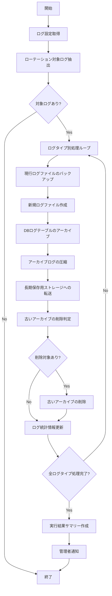

# バッチ仕様書：ログローテーションバッチ

| 項目                | 内容                                                                                |
|---------------------|------------------------------------------------------------------------------------|
| **バッチID**        | BATCH-303                                                                          |
| **バッチ名称**      | ログローテーションバッチ                                                            |
| **機能カテゴリ**    | システム管理                                                                        |
| **概要・目的**      | システムログ・監査ログのローテーション・アーカイブを行い、ログ管理を最適化する       |
| **バッチ種別**      | 定期バッチ                                                                          |
| **実行スケジュール**| 毎週月曜深夜（1:30）                                                                |
| **入出力対象**      | AuditLog, SystemLog                                                                 |
| **優先度**          | 高                                                                                  |
| **備考**            | 保管期限・容量制限対応                                                              |

## 1. 処理概要

ログローテーションバッチは、システムログや監査ログなどの各種ログファイルを定期的にローテーション（切り替え）し、アーカイブ化するバッチ処理です。ログファイルの肥大化を防ぎ、システムパフォーマンスを維持するとともに、法令やポリシーに基づいた適切なログ保管期間を確保します。また、古いログファイルの圧縮・アーカイブ化により、ストレージ使用量を最適化し、必要に応じて長期保存用ストレージへの移行も行います。

## 2. 処理フロー



## 3. 入力データ

### 3.1 LogConfigテーブル

| フィールド名      | データ型 | 説明                                           |
|-------------------|----------|------------------------------------------------|
| config_id         | String   | 設定ID（主キー）                               |
| log_type          | String   | ログタイプ（"SYSTEM"/"AUDIT"/"ACCESS"/"ERROR"）|
| log_source        | String   | ログソース（"FILE"/"DATABASE"/"BOTH"）         |
| file_path         | String   | ファイルパス（ファイルの場合）                 |
| table_name        | String   | テーブル名（データベースの場合）               |
| rotation_cycle    | String   | ローテーションサイクル（"DAILY"/"WEEKLY"/"MONTHLY"）|
| retention_days    | Integer  | 保持日数                                       |
| max_file_size_mb  | Integer  | 最大ファイルサイズ（MB）                       |
| compression_enabled| Boolean  | 圧縮有効/無効                                 |
| archive_enabled   | Boolean  | アーカイブ有効/無効                            |
| priority          | Integer  | 優先度（実行順序）                             |
| active            | Boolean  | 有効フラグ                                     |
| created_at        | DateTime | 作成日時                                       |
| last_modified_at  | DateTime | 最終更新日時                                   |
| last_modified_by  | String   | 最終更新者                                     |

### 3.2 AuditLogテーブル

| フィールド名      | データ型 | 説明                                           |
|-------------------|----------|------------------------------------------------|
| log_id            | String   | ログID（主キー）                               |
| event_type        | String   | イベントタイプ                                 |
| event_timestamp   | DateTime | イベント発生日時                               |
| actor_id          | String   | 操作実行者ID                                   |
| target_id         | String   | 操作対象ID                                     |
| target_type       | String   | 操作対象タイプ                                 |
| action            | String   | 実行アクション                                 |
| details           | JSON     | 詳細情報（JSON形式）                           |
| ip_address        | String   | IPアドレス                                     |
| user_agent        | String   | ユーザーエージェント                           |
| result            | String   | 結果                                           |
| created_at        | DateTime | 記録日時                                       |

### 3.3 SystemLogテーブル

| フィールド名      | データ型 | 説明                                           |
|-------------------|----------|------------------------------------------------|
| log_id            | String   | ログID（主キー）                               |
| log_level         | String   | ログレベル（"INFO"/"WARN"/"ERROR"/"DEBUG"）    |
| log_timestamp     | DateTime | ログ記録日時                                   |
| logger_name       | String   | ロガー名                                       |
| message           | Text     | メッセージ                                     |
| exception         | Text     | 例外情報                                       |
| thread_name       | String   | スレッド名                                     |
| class_name        | String   | クラス名                                       |
| method_name       | String   | メソッド名                                     |
| line_number       | Integer  | 行番号                                         |
| created_at        | DateTime | 記録日時                                       |

### 3.4 システム設定

| 設定項目                    | データ型 | デフォルト値 | 説明                                 |
|-----------------------------|----------|--------------|--------------------------------------|
| log_archive_path            | String   | "/logs/archive" | ログアーカイブパス                |
| log_temp_path               | String   | "/tmp/logs"  | 一時ログパス                         |
| long_term_storage_enabled   | Boolean  | true         | 長期保存ストレージ有効/無効          |
| long_term_storage_provider  | String   | "AWS"        | 長期保存ストレージプロバイダ         |
| long_term_storage_bucket    | String   | "app-logs"   | 長期保存ストレージバケット名         |
| long_term_storage_path      | String   | "/logs"      | 長期保存ストレージパス               |
| long_term_storage_credentials | String | ""           | 長期保存ストレージ認証情報（暗号化） |
| notify_admin_on_rotation    | Boolean  | false        | ローテーション完了時の管理者通知有無 |
| notify_admin_on_error       | Boolean  | true         | エラー発生時の管理者通知有無         |
| max_concurrent_rotations    | Integer  | 3            | 最大同時ローテーション数             |

## 4. 出力データ

### 4.1 アーカイブログファイル

**ファイル形式**: 圧縮テキスト (.log.gz)  
**ファイル名パターン**: `{log_type}_{YYYYMMDD}.log.gz`  
**例**: `system_20250529.log.gz`, `audit_20250529.log.gz`

### 4.2 LogArchiveテーブル（追加）

| フィールド名      | データ型 | 説明                                           |
|-------------------|----------|------------------------------------------------|
| archive_id        | String   | アーカイブID（主キー）                         |
| config_id         | String   | 設定ID（外部キー）                             |
| log_type          | String   | ログタイプ                                     |
| archive_date      | DateTime | アーカイブ日時                                 |
| start_date        | DateTime | 対象期間開始日時                               |
| end_date          | DateTime | 対象期間終了日時                               |
| record_count      | Integer  | レコード数                                     |
| file_name         | String   | アーカイブファイル名                           |
| file_size         | Long     | ファイルサイズ（バイト）                       |
| original_size     | Long     | 元のサイズ（バイト）                           |
| compression_ratio | Double   | 圧縮率                                         |
| local_path        | String   | ローカルパス                                   |
| storage_path      | String   | ストレージパス                                 |
| checksum          | String   | チェックサム（SHA-256）                        |
| status            | String   | ステータス（"ACTIVE"/"ARCHIVED"/"DELETED"）    |
| expiry_date       | Date     | 有効期限日                                     |
| created_at        | DateTime | 作成日時                                       |
| created_by        | String   | "SYSTEM_BATCH"                                 |

### 4.3 LogStatisticsテーブル（追加/更新）

| フィールド名      | データ型 | 説明                                           |
|-------------------|----------|------------------------------------------------|
| stat_id           | String   | 統計ID（主キー）                               |
| log_type          | String   | ログタイプ                                     |
| stat_date         | Date     | 統計日                                         |
| total_records     | Integer  | 総レコード数                                   |
| total_size_bytes  | Long     | 総サイズ（バイト）                             |
| active_records    | Integer  | アクティブレコード数                           |
| archived_records  | Integer  | アーカイブレコード数                           |
| error_count       | Integer  | エラー数                                       |
| warn_count        | Integer  | 警告数                                         |
| info_count        | Integer  | 情報数                                         |
| debug_count       | Integer  | デバッグ数                                     |
| created_at        | DateTime | 作成日時                                       |
| created_by        | String   | "SYSTEM_BATCH"                                 |

### 4.4 ローテーションログファイル

**ファイル形式**: テキスト (.log)  
**ファイル名**: `log_rotation_YYYYMMDD.log`  
**内容**:
- ローテーション開始・終了時刻
- 処理対象ログ一覧
- 処理結果詳細
- エラー情報（発生時）
- パフォーマンス統計

### 4.5 管理者通知

**通知方法**: メール  
**対象者**: システム管理者

**エラー時テンプレート**:
```
件名: 【エラー】ログローテーション実行エラー ({実行日})

システム管理者様

ログローテーション処理中にエラーが発生しました。
確認と対応をお願いします。

■実行概要
実行日時: {実行日時}
ステータス: {ステータス}

■エラー詳細
エラー発生箇所: {エラー発生箇所}
エラーメッセージ: {エラーメッセージ}
影響対象: {影響対象}

■部分的に成功したローテーション
{成功したローテーションリスト}

■ログファイル
{ログファイルパス}

※このメールはシステムより自動送信されています。
```

## 5. エラー処理

| エラーケース                      | 対応方法                                                                 |
|-----------------------------------|--------------------------------------------------------------------------|
| ログファイルアクセスエラー        | エラーログを記録し、管理者に通知。他のログタイプの処理は継続。           |
| データベースアクセスエラー        | エラーログを記録し、管理者に通知。ファイルログの処理は継続。             |
| ディスク容量不足                  | エラーログを記録し、管理者に通知。処理を中断。                           |
| 圧縮処理エラー                    | エラーログを記録し、非圧縮ファイルでアーカイブを試行。                   |
| 長期保存ストレージ接続エラー      | エラーログを記録し、管理者に通知。ローカルアーカイブのみ保持。           |
| 長期保存ストレージ転送エラー      | エラーログを記録し、管理者に通知。再試行スケジュールを設定。             |
| 古いアーカイブ削除エラー          | 警告ログを記録し、管理者に通知。メインのローテーション処理は完了させる。 |
| 設定値不正                        | デフォルト値を使用し、警告ログを記録。                                   |

## 6. 依存関係

- LogConfigテーブル
- AuditLogテーブル
- SystemLogテーブル
- LogArchiveテーブル
- LogStatisticsテーブル
- ファイルシステム操作ライブラリ
- 圧縮ライブラリ
- 長期保存ストレージSDK
- メール通知サービス

## 7. 実行パラメータ

| パラメータ名        | 必須 | デフォルト値 | 説明                                           |
|---------------------|------|--------------|------------------------------------------------|
| --config-id         | No   | null         | 特定設定のみを対象とする場合に指定             |
| --log-type          | No   | null         | 特定ログタイプのみを対象とする場合に指定       |
| --force-rotation    | No   | false        | サイクル設定に関わらず強制的にローテーション   |
| --skip-archive      | No   | false        | アーカイブ処理をスキップ                       |
| --skip-long-term    | No   | false        | 長期保存ストレージ転送をスキップ               |
| --retention-override| No   | null         | 保持期間を上書き（日数）                       |
| --dry-run           | No   | false        | 実行シミュレーションのみ（実際の処理なし）     |

## 8. 実行例

```bash
# 通常実行
npm run batch:log-rotation

# 特定ログタイプのみローテーション
npm run batch:log-rotation -- --log-type=AUDIT

# 強制ローテーション実行
npm run batch:log-rotation -- --force-rotation

# アーカイブなしで実行
npm run batch:log-rotation -- --skip-archive

# 長期保存ストレージ転送なしで実行
npm run batch:log-rotation -- --skip-long-term

# 保持期間を180日に設定して実行
npm run batch:log-rotation -- --retention-override=180

# 実行シミュレーション（ドライラン）
npm run batch:log-rotation -- --dry-run
```

## 9. 運用上の注意点

- 本バッチは毎週月曜深夜に実行され、各ログタイプの設定に基づいてローテーションを行います。
- ログローテーション中は、一部のログ書き込みが一時的に遅延する可能性があります。
- データベースログのアーカイブは、大量のレコードを扱う場合に処理時間が長くなる可能性があります。その場合は、個別に実行するか、処理の分散を検討してください。
- 長期保存ストレージへの転送は、ネットワーク帯域を消費します。必要に応じて帯域制限を設定することを検討してください。
- 保持期間を超えたアーカイブは自動的に削除されます。法的要件に基づく保管が必要なログは、適切な保持期間を設定してください。
- ログファイルの肥大化が早い場合は、`max_file_size_mb` の設定値を調整するか、ローテーションサイクルを短くすることを検討してください。
- 長期保存ストレージのコスト管理のため、不要なログの早期削除や低頻度アクセスストレージへの移行を検討してください。
- 監査目的で重要なログは、改ざん防止のための追加措置（例：デジタル署名、WORM ストレージの使用）を検討してください。

## 10. 改訂履歴

| 改訂日     | 改訂者 | 改訂内容                                         |
|------------|--------|--------------------------------------------------|
| 2025/05/29 | 初版   | 初版作成                                         |
