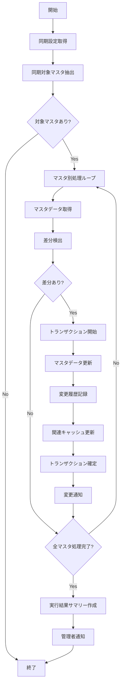

# バッチ仕様書：マスタデータ定期同期バッチ

| 項目                | 内容                                                                                |
|---------------------|------------------------------------------------------------------------------------|
| **バッチID**        | BATCH-501                                                                          |
| **バッチ名称**      | マスタデータ定期同期バッチ                                                          |
| **機能カテゴリ**    | システム管理                                                                        |
| **概要・目的**      | 各種マスタデータを自動同期し、システム全体のマスタデータ整合性を維持する             |
| **バッチ種別**      | 定期バッチ                                                                          |
| **実行スケジュール**| 毎日深夜（4:00）                                                                    |
| **入出力対象**      | 各種マスタDB                                                                        |
| **優先度**          | 低                                                                                  |
| **備考**            |                                                                                     |

## 1. 処理概要

マスタデータ定期同期バッチは、システム内の各種マスタデータ（コードマスタ、区分マスタ、設定マスタなど）を定期的に同期し、システム全体のデータ整合性を維持するバッチ処理です。マスタデータの変更を自動的に検出し、関連するテーブルやキャッシュを更新することで、常に最新のマスタデータが利用可能な状態を確保します。また、マスタデータの変更履歴を記録し、監査証跡としても活用できます。

## 2. 処理フロー



## 3. 入力データ

### 3.1 MasterSyncConfigテーブル

| フィールド名      | データ型 | 説明                                           |
|-------------------|----------|------------------------------------------------|
| config_id         | String   | 設定ID（主キー）                               |
| master_type       | String   | マスタタイプ（"CODE"/"CATEGORY"/"SETTING"など）|
| master_name       | String   | マスタ名                                       |
| table_name        | String   | テーブル名                                     |
| primary_key       | String   | 主キーカラム名                                 |
| sync_columns      | String   | 同期対象カラム（カンマ区切り）                 |
| sync_cycle        | String   | 同期サイクル（"DAILY"/"WEEKLY"/"MONTHLY"）     |
| sync_order        | Integer  | 同期順序                                       |
| cache_enabled     | Boolean  | キャッシュ有効/無効                            |
| notification_enabled | Boolean | 変更通知有効/無効                            |
| active            | Boolean  | 有効フラグ                                     |
| created_at        | DateTime | 作成日時                                       |
| last_modified_at  | DateTime | 最終更新日時                                   |
| last_modified_by  | String   | 最終更新者                                     |

### 3.2 MasterDataSourceテーブル

| フィールド名      | データ型 | 説明                                           |
|-------------------|----------|------------------------------------------------|
| source_id         | String   | ソースID（主キー）                             |
| config_id         | String   | 設定ID（外部キー）                             |
| source_type       | String   | ソースタイプ（"DATABASE"/"API"/"FILE"）        |
| connection_string | String   | 接続文字列（暗号化）                           |
| query             | Text     | クエリ/APIパス                                 |
| parameters        | JSON     | パラメータ（JSON形式）                         |
| auth_type         | String   | 認証タイプ                                     |
| auth_credentials  | String   | 認証情報（暗号化）                             |
| active            | Boolean  | 有効フラグ                                     |
| created_at        | DateTime | 作成日時                                       |
| last_modified_at  | DateTime | 最終更新日時                                   |

### 3.3 各種マスタテーブル

各マスタテーブルの構造は異なりますが、一般的に以下のような共通フィールドを持ちます：

| フィールド名      | データ型 | 説明                                           |
|-------------------|----------|------------------------------------------------|
| id/code           | String   | ID/コード（主キー）                            |
| name              | String   | 名称                                           |
| description       | Text     | 説明                                           |
| sort_order        | Integer  | 表示順                                         |
| parent_id/parent_code | String | 親ID/コード（階層構造の場合）                |
| valid_from        | Date     | 有効開始日                                     |
| valid_to          | Date     | 有効終了日                                     |
| active            | Boolean  | 有効フラグ                                     |
| created_at        | DateTime | 作成日時                                       |
| last_modified_at  | DateTime | 最終更新日時                                   |
| last_modified_by  | String   | 最終更新者                                     |

### 3.4 システム設定

| 設定項目                    | データ型 | デフォルト値 | 説明                                 |
|-----------------------------|----------|--------------|--------------------------------------|
| master_sync_history_retention_days | Integer | 90      | 同期履歴の保持日数                  |
| master_cache_enabled        | Boolean  | true         | マスタキャッシュ有効/無効            |
| master_cache_ttl_minutes    | Integer  | 60           | キャッシュTTL（分）                  |
| notify_admin_on_sync        | Boolean  | false        | 同期完了時の管理者通知有無           |
| notify_admin_on_error       | Boolean  | true         | エラー発生時の管理者通知有無         |
| max_concurrent_syncs        | Integer  | 5            | 最大同時同期数                       |
| sync_batch_size             | Integer  | 1000         | 同期バッチサイズ                     |

## 4. 出力データ

### 4.1 各種マスタテーブル（更新）

同期処理により、各マスタテーブルのデータが更新されます。

### 4.2 MasterSyncHistoryテーブル（追加）

| フィールド名      | データ型 | 説明                                           |
|-------------------|----------|------------------------------------------------|
| history_id        | String   | 履歴ID（主キー）                               |
| config_id         | String   | 設定ID（外部キー）                             |
| sync_date         | DateTime | 同期日時                                       |
| master_type       | String   | マスタタイプ                                   |
| master_name       | String   | マスタ名                                       |
| total_records     | Integer  | 総レコード数                                   |
| added_records     | Integer  | 追加レコード数                                 |
| updated_records   | Integer  | 更新レコード数                                 |
| deleted_records   | Integer  | 削除レコード数                                 |
| unchanged_records | Integer  | 変更なしレコード数                             |
| error_count       | Integer  | エラー数                                       |
| status            | String   | ステータス（"SUCCESS"/"PARTIAL"/"FAILED"）     |
| error_details     | Text     | エラー詳細（発生時）                           |
| duration_ms       | Integer  | 処理時間（ミリ秒）                             |
| created_at        | DateTime | 作成日時                                       |
| created_by        | String   | "SYSTEM_BATCH"                                 |

### 4.3 MasterChangeLogテーブル（追加）

| フィールド名      | データ型 | 説明                                           |
|-------------------|----------|------------------------------------------------|
| log_id            | String   | ログID（主キー）                               |
| history_id        | String   | 履歴ID（外部キー）                             |
| master_type       | String   | マスタタイプ                                   |
| master_name       | String   | マスタ名                                       |
| record_id         | String   | レコードID                                     |
| change_type       | String   | 変更タイプ（"ADD"/"UPDATE"/"DELETE"）          |
| change_columns    | String   | 変更カラム（カンマ区切り）                     |
| old_values        | JSON     | 変更前の値（JSON形式）                         |
| new_values        | JSON     | 変更後の値（JSON形式）                         |
| created_at        | DateTime | 作成日時                                       |
| created_by        | String   | "SYSTEM_BATCH"                                 |

### 4.4 同期ログファイル

**ファイル形式**: テキスト (.log)  
**ファイル名**: `master_sync_YYYYMMDD.log`  
**内容**:
- 同期開始・終了時刻
- 処理対象マスタ一覧
- 処理結果詳細
- エラー情報（発生時）
- パフォーマンス統計

### 4.5 管理者通知

**通知方法**: メール  
**対象者**: システム管理者

**エラー時テンプレート**:
```
件名: 【エラー】マスタデータ同期エラー ({実行日})

システム管理者様

マスタデータ同期処理中にエラーが発生しました。
確認と対応をお願いします。

■実行概要
実行日時: {実行日時}
ステータス: {ステータス}

■エラー詳細
エラー発生箇所: {エラー発生箇所}
エラーメッセージ: {エラーメッセージ}
影響対象: {影響対象}

■部分的に成功した同期
{成功した同期リスト}

■ログファイル
{ログファイルパス}

※このメールはシステムより自動送信されています。
```

## 5. エラー処理

| エラーケース                      | 対応方法                                                                 |
|-----------------------------------|--------------------------------------------------------------------------|
| データソース接続エラー            | エラーログを記録し、管理者に通知。他のマスタの処理は継続。               |
| データ取得エラー                  | エラーログを記録し、管理者に通知。他のマスタの処理は継続。               |
| データ形式不正                    | エラーログを記録し、管理者に通知。他のマスタの処理は継続。               |
| マスタテーブル更新エラー          | エラーログを記録し、管理者に通知。トランザクションをロールバック。       |
| キャッシュ更新エラー              | 警告ログを記録し、管理者に通知。マスタデータの更新は完了させる。         |
| 変更通知エラー                    | 警告ログを記録し、管理者に通知。マスタデータの更新は完了させる。         |
| 履歴記録エラー                    | 警告ログを記録し、管理者に通知。マスタデータの更新は完了させる。         |
| 設定値不正                        | デフォルト値を使用し、警告ログを記録。                                   |

## 6. 依存関係

- MasterSyncConfigテーブル
- MasterDataSourceテーブル
- 各種マスタテーブル
- MasterSyncHistoryテーブル
- MasterChangeLogテーブル
- キャッシュサービス
- 通知サービス
- データソース接続ライブラリ

## 7. 実行パラメータ

| パラメータ名        | 必須 | デフォルト値 | 説明                                           |
|---------------------|------|--------------|------------------------------------------------|
| --config-id         | No   | null         | 特定設定のみを対象とする場合に指定             |
| --master-type       | No   | null         | 特定マスタタイプのみを対象とする場合に指定     |
| --master-name       | No   | null         | 特定マスタ名のみを対象とする場合に指定         |
| --force-sync        | No   | false        | サイクル設定に関わらず強制的に同期             |
| --skip-cache-update | No   | false        | キャッシュ更新をスキップ                       |
| --skip-notification | No   | false        | 変更通知をスキップ                             |
| --batch-size        | No   | null         | 同期バッチサイズを上書き                       |
| --dry-run           | No   | false        | 実行シミュレーションのみ（実際の更新なし）     |

## 8. 実行例

```bash
# 通常実行
npm run batch:master-sync

# 特定マスタタイプのみ同期
npm run batch:master-sync -- --master-type=CODE

# 特定マスタ名のみ同期
npm run batch:master-sync -- --master-name=DEPARTMENT_MASTER

# 強制同期実行
npm run batch:master-sync -- --force-sync

# キャッシュ更新なしで実行
npm run batch:master-sync -- --skip-cache-update

# バッチサイズを変更して実行
npm run batch:master-sync -- --batch-size=500

# 実行シミュレーション（ドライラン）
npm run batch:master-sync -- --dry-run
```

## 9. 運用上の注意点

- 本バッチは毎日深夜に実行され、各マスタの設定に基づいて同期を行います。
- マスタデータの同期順序は依存関係を考慮して設定する必要があります。例えば、親マスタが先に同期されるように設定してください。
- 大量のマスタデータを同期する場合は、処理時間が長くなる可能性があります。その場合は、同期頻度や同期対象を見直すことを検討してください。
- キャッシュ更新を有効にすると、同期後に関連するキャッシュが自動的に更新されます。これにより、最新のマスタデータがすぐに利用可能になります。
- 変更通知を有効にすると、マスタデータの変更が関連するシステムコンポーネントに通知されます。これにより、マスタデータの変更に応じた処理を実行できます。
- 同期履歴は `master_sync_history_retention_days` の設定に基づいて保持され、期間を超えた古い履歴は自動的に削除されます。
- マスタデータの変更は、システム全体に影響を与える可能性があります。重要なマスタデータの変更は、事前にテスト環境で検証することを推奨します。

## 10. 改訂履歴

| 改訂日     | 改訂者 | 改訂内容                                         |
|------------|--------|--------------------------------------------------|
| 2025/05/29 | 初版   | 初版作成                                         |
