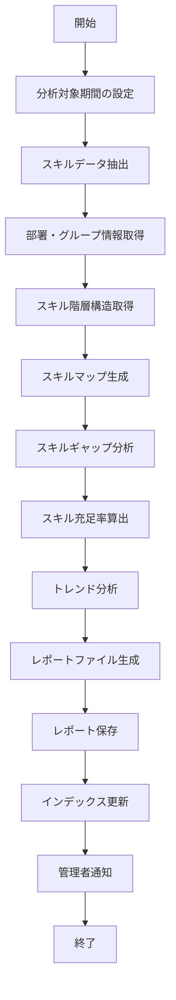

# バッチ仕様書：スキル分析レポート生成バッチ

| 項目                | 内容                                                                                |
|---------------------|------------------------------------------------------------------------------------|
| **バッチID**        | BATCH-601                                                                          |
| **バッチ名称**      | スキル分析レポート生成バッチ                                                        |
| **機能カテゴリ**    | スキル管理                                                                          |
| **概要・目的**      | スキルデータの集計・分析レポートを自動生成し、組織全体のスキル状況を可視化する       |
| **バッチ種別**      | 定期バッチ                                                                          |
| **実行スケジュール**| 毎月1日深夜（4:00）                                                                 |
| **入出力対象**      | SkillRecord, SkillIndex                                                             |
| **優先度**          | 高                                                                                  |
| **備考**            | スキルギャップ分析                                                                  |

## 1. 処理概要

スキル分析レポート生成バッチは、システムに蓄積された社員のスキル情報を集計・分析し、組織全体のスキル状況を可視化するレポートを自動生成するバッチ処理です。部署・グループ単位でのスキルマップ、スキルギャップ分析、スキル充足率などの指標を算出し、人材育成や適正配置の意思決定を支援します。

## 2. 処理フロー



## 3. 入力データ

### 3.1 SkillRecordテーブル

| フィールド名      | データ型 | 説明                                           |
|-------------------|----------|------------------------------------------------|
| record_id         | String   | スキル記録ID（主キー）                         |
| emp_no            | String   | 社員番号（外部キー）                           |
| skill_id          | String   | スキルID（外部キー）                           |
| skill_level       | Integer  | スキルレベル（0=×, 1=△, 2=○, 3=◎）           |
| self_assessment   | Text     | 自己評価コメント                               |
| manager_assessment| Text     | 上長評価コメント                               |
| acquired_date     | Date     | 取得/更新日                                    |
| last_modified_at  | DateTime | 最終更新日時                                   |
| last_modified_by  | String   | 最終更新者                                     |

### 3.2 SkillHierarchyテーブル

| フィールド名      | データ型 | 説明                                           |
|-------------------|----------|------------------------------------------------|
| skill_id          | String   | スキルID（主キー）                             |
| parent_skill_id   | String   | 親スキルID（外部キー、自己参照）               |
| skill_name        | String   | スキル名称                                     |
| skill_category    | String   | スキルカテゴリ                                 |
| skill_subcategory | String   | スキルサブカテゴリ                             |
| skill_level       | Integer  | スキル階層レベル（1=カテゴリ, 2=サブカテゴリ, 3=スキル項目） |
| importance        | Integer  | 重要度（1-5）                                  |
| description       | Text     | 説明                                           |
| active            | Boolean  | 有効フラグ                                     |

### 3.3 Departmentテーブル

| フィールド名      | データ型 | 説明                                           |
|-------------------|----------|------------------------------------------------|
| dept_id           | String   | 部署ID（主キー）                               |
| dept_name         | String   | 部署名                                         |
| parent_dept_id    | String   | 親部署ID（外部キー、自己参照）                 |
| dept_code         | String   | 部署コード                                     |
| manager_emp_id    | String   | 部署管理者社員ID                               |
| valid_from        | Date     | 有効開始日                                     |
| valid_to          | Date     | 有効終了日（null=現在有効）                    |

### 3.4 Employeeテーブル

| フィールド名      | データ型 | 説明                                           |
|-------------------|----------|------------------------------------------------|
| emp_no            | String   | 社員番号（主キー）                             |
| name              | String   | 氏名                                           |
| dept_id           | String   | 所属部署ID（外部キー）                         |
| group_id          | String   | 所属グループID（外部キー）                     |
| position_id       | String   | 役職ID（外部キー）                             |
| join_date         | Date     | 入社日                                         |
| email             | String   | メールアドレス                                 |
| status            | String   | ステータス（"ACTIVE"/"INACTIVE"）              |

### 3.5 システム設定

| 設定項目                    | データ型 | デフォルト値 | 説明                                 |
|-----------------------------|----------|--------------|--------------------------------------|
| skill_report_retention_months | Integer | 36         | スキルレポートの保持期間（月数）     |
| skill_gap_threshold         | Double   | 1.0          | スキルギャップ警告閾値               |
| skill_fulfillment_target    | Double   | 0.8          | スキル充足率目標値                   |
| notify_admin_on_report      | Boolean  | true         | レポート生成時の管理者通知有無       |
| report_template_path        | String   | /templates/skill_report | レポートテンプレートパス   |

## 4. 出力データ

### 4.1 スキルマップレポート

**ファイル形式**: Excel (.xlsx)  
**ファイル名**: `skill_map_YYYYMM.xlsx`  
**シート構成**:

1. **サマリー**
   - 分析対象期間
   - 対象社員数
   - 対象スキル数
   - 全体スキル充足率
   - 重要スキル充足率
   - スキルギャップ警告数

2. **部署別スキルマップ**
   - 部署ごとのスキルマトリクス（部署×スキルカテゴリ）
   - 平均スキルレベルのヒートマップ表示
   - 部署ごとのスキル充足率

3. **スキルカテゴリ別分析**
   - カテゴリごとの平均スキルレベル
   - カテゴリごとのスキル保有者数・割合
   - カテゴリごとの経年変化

4. **スキルギャップ分析**
   - 重要スキルの充足状況
   - スキルギャップ警告リスト
   - 育成優先度の提案

5. **トレンド分析**
   - 過去12ヶ月のスキルレベル推移
   - 新規獲得スキル数の推移
   - スキルカテゴリ別の成長率

### 4.2 SkillIndexテーブル（更新）

| フィールド名      | データ型 | 説明                                           |
|-------------------|----------|------------------------------------------------|
| index_id          | String   | インデックスID（主キー）                       |
| report_date       | Date     | レポート生成日                                 |
| report_type       | String   | レポートタイプ（"MONTHLY"/"QUARTERLY"/"ANNUAL"）|
| report_path       | String   | レポートファイルパス                           |
| dept_id           | String   | 部署ID（全社の場合はnull）                     |
| skill_category    | String   | スキルカテゴリ（全カテゴリの場合はnull）       |
| summary_json      | JSON     | サマリー情報（JSON形式）                       |
| created_at        | DateTime | 作成日時                                       |
| created_by        | String   | "SYSTEM_BATCH"                                 |

### 4.3 管理者通知

通知設定が有効な場合、以下の内容で管理者に通知メールを送信：

- 件名：「スキル分析レポート生成完了通知（YYYY年MM月）」
- 本文：
  - レポート生成日時
  - 主要指標サマリー（全体スキル充足率、重要スキルギャップ数など）
  - レポートへのアクセスリンク
  - 特記事項（スキルギャップ警告など）

## 5. エラー処理

| エラーケース                      | 対応方法                                                                 |
|-----------------------------------|--------------------------------------------------------------------------|
| スキルデータ不足                  | 警告ログを記録し、利用可能なデータのみで処理を継続。                     |
| 部署・組織データ不整合            | 警告ログを記録し、整合性のあるデータのみで処理を継続。                   |
| レポート生成エラー                | エラーログを記録し、管理者に通知。処理を中断。                           |
| ファイル保存エラー                | エラーログを記録し、管理者に通知。処理を中断。                           |
| インデックス更新エラー            | エラーログを記録し、管理者に通知。レポートファイルは保存済みの状態で終了。|
| 通知送信エラー                    | エラーログを記録。レポート生成は完了させ、通知エラーのみ管理者に報告。   |

## 6. 依存関係

- SkillRecordテーブル
- SkillHierarchyテーブル
- Departmentテーブル
- Employeeテーブル
- SkillIndexテーブル
- レポートテンプレート
- ファイルストレージサービス
- メール通知サービス

## 7. 実行パラメータ

| パラメータ名        | 必須 | デフォルト値 | 説明                                           |
|---------------------|------|--------------|------------------------------------------------|
| --target-month      | No   | 当月         | 対象月を指定（YYYY-MM形式）                    |
| --dept-id           | No   | null         | 特定部署のみを対象とする場合に指定             |
| --skill-category    | No   | null         | 特定スキルカテゴリのみを対象とする場合に指定   |
| --include-inactive  | No   | false        | 退職者・休職者も含めて分析                     |
| --skip-notification | No   | false        | 管理者通知をスキップ                           |

## 8. 実行例

```bash
# 通常実行（当月のレポート生成）
npm run batch:skill-report

# 特定月のレポート生成
npm run batch:skill-report -- --target-month=2025-04

# 特定部署のレポート生成
npm run batch:skill-report -- --dept-id=D001

# 特定スキルカテゴリのレポート生成
npm run batch:skill-report -- --skill-category=TECHNICAL

# TypeScript直接実行
npx tsx src/batch/skill-report.ts

# パラメータ付きTypeScript実行
npx tsx src/batch/skill-report.ts --target-month=2025-04 --dept-id=D001
```

## 9. 運用上の注意点

- 本バッチは月次で実行され、前月までのスキルデータを集計・分析します。
- レポートは `skill_report_retention_months` の設定に基づいて保持され、期間を超えたレポートは自動的に削除されます。
- スキルギャップ警告は `skill_gap_threshold` の設定値を下回るスキル項目に対して発生します。
- 大規模な組織変更直後は、部署別分析の正確性が低下する可能性があります。
- レポートテンプレートを変更する場合は、`report_template_path` の設定を更新してください。

## 10. 改訂履歴

| 改訂日     | 改訂者 | 改訂内容                                         |
|------------|--------|--------------------------------------------------|
| 2025/05/29 | 初版   | 初版作成                                         |
