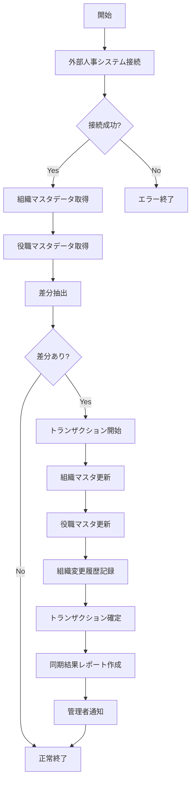

# バッチ仕様書：組織・役職マスタ同期バッチ

| 項目                | 内容                                                                                |
|---------------------|------------------------------------------------------------------------------------|
| **バッチID**        | BATCH-701                                                                          |
| **バッチ名称**      | 組織・役職マスタ同期バッチ                                                          |
| **機能カテゴリ**    | プロフィール管理                                                                    |
| **概要・目的**      | 外部人事システムからの組織・役職マスタ情報を自動同期し、最新の組織体制を反映する     |
| **バッチ種別**      | 定期バッチ                                                                          |
| **実行スケジュール**| 毎日早朝（5:00）                                                                    |
| **入出力対象**      | Department, Position                                                                |
| **優先度**          | 最高                                                                                |
| **備考**            | 人事システム連携                                                                    |

## 1. 処理概要

組織・役職マスタ同期バッチは、外部人事システムから最新の組織情報（部署・グループ）および役職情報を取得し、システム内のマスタデータを更新するバッチ処理です。人事異動や組織変更が反映された最新の組織体制を、スキル報告書システムに自動的に同期します。

## 2. 処理フロー



## 3. 入力データ

### 3.1 外部人事システムAPI

#### 3.1.1 組織情報API

**エンドポイント**: `/api/v1/organizations`  
**認証方式**: OAuth2.0  
**レスポンス形式**: JSON

```json
{
  "departments": [
    {
      "dept_id": "D001",
      "dept_name": "技術本部",
      "parent_dept_id": null,
      "dept_code": "TECH-HQ",
      "manager_emp_id": "E10001",
      "valid_from": "2025-04-01",
      "valid_to": null,
      "groups": [
        {
          "group_id": "G0101",
          "group_name": "開発1グループ",
          "group_code": "DEV-1",
          "manager_emp_id": "E10023",
          "valid_from": "2025-04-01",
          "valid_to": null
        },
        // 他のグループ情報...
      ]
    },
    // 他の部署情報...
  ]
}
```

#### 3.1.2 役職情報API

**エンドポイント**: `/api/v1/positions`  
**認証方式**: OAuth2.0  
**レスポンス形式**: JSON

```json
{
  "positions": [
    {
      "position_id": "P001",
      "position_name": "部長",
      "position_code": "DIRECTOR",
      "position_level": 1,
      "valid_from": "2025-04-01",
      "valid_to": null
    },
    // 他の役職情報...
  ]
}
```

### 3.2 システム設定

| 設定項目                    | データ型 | デフォルト値 | 説明                                 |
|-----------------------------|----------|--------------|--------------------------------------|
| hr_system_api_url           | String   | https://hr-api.example.com | 人事システムAPIのベースURL |
| hr_system_api_client_id     | String   | -            | API認証用クライアントID              |
| hr_system_api_client_secret | String   | -            | API認証用クライアントシークレット    |
| sync_history_retention_days | Integer  | 90           | 同期履歴の保持日数                   |
| notify_admin_on_sync        | Boolean  | true         | 同期完了時の管理者通知有無           |

## 4. 出力データ

### 4.1 Departmentテーブル（更新）

| フィールド名      | データ型 | 説明                                           |
|-------------------|----------|------------------------------------------------|
| dept_id           | String   | 部署ID（主キー）                               |
| dept_name         | String   | 部署名                                         |
| parent_dept_id    | String   | 親部署ID（外部キー、自己参照）                 |
| dept_code         | String   | 部署コード                                     |
| manager_emp_id    | String   | 部署管理者社員ID                               |
| valid_from        | Date     | 有効開始日                                     |
| valid_to          | Date     | 有効終了日（null=現在有効）                    |
| last_modified_at  | DateTime | 更新日時                                       |
| last_modified_by  | String   | "SYSTEM_BATCH"                                 |

### 4.2 Groupテーブル（更新）

| フィールド名      | データ型 | 説明                                           |
|-------------------|----------|------------------------------------------------|
| group_id          | String   | グループID（主キー）                           |
| dept_id           | String   | 所属部署ID（外部キー）                         |
| group_name        | String   | グループ名                                     |
| group_code        | String   | グループコード                                 |
| manager_emp_id    | String   | グループ管理者社員ID                           |
| valid_from        | Date     | 有効開始日                                     |
| valid_to          | Date     | 有効終了日（null=現在有効）                    |
| last_modified_at  | DateTime | 更新日時                                       |
| last_modified_by  | String   | "SYSTEM_BATCH"                                 |

### 4.3 Positionテーブル（更新）

| フィールド名      | データ型 | 説明                                           |
|-------------------|----------|------------------------------------------------|
| position_id       | String   | 役職ID（主キー）                               |
| position_name     | String   | 役職名                                         |
| position_code     | String   | 役職コード                                     |
| position_level    | Integer  | 役職レベル（数値が小さいほど上位）             |
| valid_from        | Date     | 有効開始日                                     |
| valid_to          | Date     | 有効終了日（null=現在有効）                    |
| last_modified_at  | DateTime | 更新日時                                       |
| last_modified_by  | String   | "SYSTEM_BATCH"                                 |

### 4.4 組織変更履歴テーブル（追加）

| フィールド名      | データ型 | 説明                                           |
|-------------------|----------|------------------------------------------------|
| history_id        | String   | 履歴ID（主キー）                               |
| sync_date         | DateTime | 同期実行日時                                   |
| change_type       | String   | 変更タイプ（"ADD"/"UPDATE"/"DELETE"）          |
| target_type       | String   | 対象タイプ（"DEPARTMENT"/"GROUP"/"POSITION"）  |
| target_id         | String   | 対象ID                                         |
| old_values        | JSON     | 変更前の値（JSON形式）                         |
| new_values        | JSON     | 変更後の値（JSON形式）                         |
| applied_by        | String   | "SYSTEM_BATCH"                                 |

### 4.5 同期結果レポート

以下の内容でCSVファイルを生成：

- ファイル名：`org_sync_report_YYYYMMDD_HHMMSS.csv`
- 内容：
  - 同期日時
  - 処理結果（成功/失敗）
  - 追加された部署数
  - 更新された部署数
  - 無効化された部署数
  - 追加されたグループ数
  - 更新されたグループ数
  - 無効化されたグループ数
  - 追加された役職数
  - 更新された役職数
  - 無効化された役職数
  - エラー内容（発生時）

### 4.6 管理者通知

通知設定が有効な場合、以下の内容で管理者に通知メールを送信：

- 件名：「組織・役職マスタ同期完了通知」
- 本文：同期結果サマリ、変更内容の概要、詳細レポートへのリンク

## 5. エラー処理

| エラーケース                      | 対応方法                                                                 |
|-----------------------------------|--------------------------------------------------------------------------|
| 外部APIアクセスエラー             | エラーログを記録し、管理者に通知。処理を中断。                           |
| API認証エラー                     | エラーログを記録し、管理者に通知。処理を中断。                           |
| データ形式不正                    | エラーログを記録し、管理者に通知。処理を中断。                           |
| DBアクセスエラー                  | エラーログを記録し、管理者に通知。トランザクションをロールバック。       |
| 部分的なデータ不整合              | 警告ログを記録し、処理を継続。不整合データは同期結果レポートに記録。     |
| 通知送信エラー                    | エラーログを記録。同期処理は完了させ、通知エラーのみ管理者に報告。       |

## 6. 依存関係

- 外部人事システムAPI
- Departmentテーブル
- Groupテーブル
- Positionテーブル
- 組織変更履歴テーブル
- システム設定テーブル
- メール通知サービス

## 7. 実行パラメータ

| パラメータ名        | 必須 | デフォルト値 | 説明                                           |
|---------------------|------|--------------|------------------------------------------------|
| --force-sync        | No   | false        | 差分がなくても強制的に同期を実行               |
| --dry-run           | No   | false        | 同期対象の確認のみ行い、実際の更新は行わない   |
| --skip-notification | No   | false        | 管理者通知をスキップ                           |
| --target-date       | No   | 当日         | 指定日付のデータを同期（YYYY-MM-DD形式）       |

## 8. 実行例

```bash
# 通常実行
npm run batch:org-sync

# 強制同期モード
npm run batch:org-sync -- --force-sync

# ドライラン（同期対象確認のみ）
npm run batch:org-sync -- --dry-run

# 特定日付のデータを同期
npm run batch:org-sync -- --target-date=2025-06-01

# TypeScript直接実行
npx tsx src/batch/org-sync.ts

# パラメータ付きTypeScript実行
npx tsx src/batch/org-sync.ts --force-sync --dry-run --target-date=2025-06-01
```

## 9. 運用上の注意点

- 本バッチは人事システムのマスタデータに依存するため、人事システム側のメンテナンス情報を事前に確認してください。
- 大規模な組織変更（会社統合や部門再編など）が予定されている場合は、事前に同期テストを実施することを推奨します。
- 同期エラーが発生した場合、手動での再実行が必要です。自動リトライは設定されていません。
- 組織変更履歴は監査目的で保持されますが、`sync_history_retention_days`の設定に基づいて古いデータは自動的に削除されます。

## 10. 改訂履歴

| 改訂日     | 改訂者 | 改訂内容                                         |
|------------|--------|--------------------------------------------------|
| 2025/05/29 | 初版   | 初版作成                                         |
