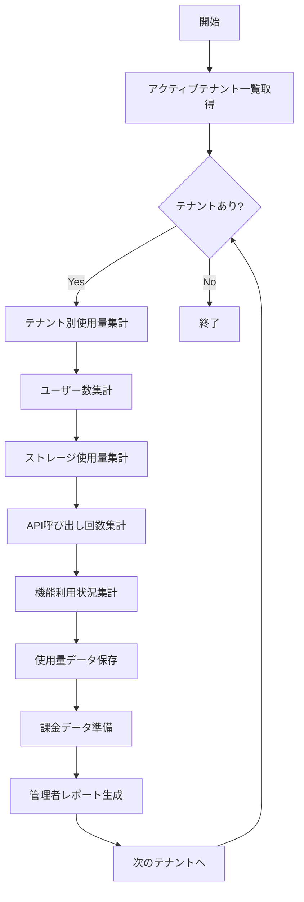

# バッチ仕様書：テナント使用量集計バッチ

| 項目                | 内容                                                                                |
|---------------------|------------------------------------------------------------------------------------|
| **バッチID**        | BATCH-901                                                                          |
| **バッチ名称**      | テナント使用量集計バッチ                                                            |
| **機能カテゴリ**    | テナント管理                                                                        |
| **概要・目的**      | 各テナントのリソース使用量を日次で集計し、課金計算の基礎データを作成する            |
| **バッチ種別**      | 定期バッチ                                                                          |
| **実行スケジュール**| 毎日深夜（1:00）                                                                    |
| **入出力対象**      | TenantUsage, UserActivity, StorageUsage                                            |
| **優先度**          | 高                                                                                  |
| **備考**            | マルチテナント対応必須                                                              |

## 1. 処理概要

テナント使用量集計バッチは、マルチテナント環境において各テナントのリソース使用量を日次で集計するバッチ処理です。ユーザー数、ストレージ使用量、API呼び出し回数、機能利用状況などを集計し、課金計算やリソース管理の基礎データを作成します。

## 2. 処理フロー



## 3. 入力データ

### 3.1 Tenantテーブル

| フィールド名      | データ型 | 説明                                           |
|-------------------|----------|------------------------------------------------|
| tenant_id         | String   | テナントID（主キー）                           |
| tenant_name       | String   | テナント名                                     |
| status            | String   | テナント状態（"ACTIVE"/"SUSPENDED"/"INACTIVE"）|
| plan_type         | String   | 契約プラン（"BASIC"/"STANDARD"/"PREMIUM"）     |
| created_at        | DateTime | テナント作成日時                               |

### 3.2 UserActivityテーブル

| フィールド名      | データ型 | 説明                                           |
|-------------------|----------|------------------------------------------------|
| tenant_id         | String   | テナントID（外部キー）                         |
| user_id           | String   | ユーザーID                                     |
| activity_date     | Date     | 活動日                                         |
| login_count       | Integer  | ログイン回数                                   |
| api_call_count    | Integer  | API呼び出し回数                                |
| feature_usage     | JSON     | 機能別使用状況                                 |

### 3.3 StorageUsageテーブル

| フィールド名      | データ型 | 説明                                           |
|-------------------|----------|------------------------------------------------|
| tenant_id         | String   | テナントID（外部キー）                         |
| storage_type      | String   | ストレージ種別（"FILE"/"DATABASE"/"BACKUP"）   |
| used_size_mb      | Integer  | 使用サイズ（MB）                               |
| measured_at       | DateTime | 測定日時                                       |

## 4. 出力データ

### 4.1 TenantUsageSummaryテーブル（追加）

| フィールド名      | データ型 | 説明                                           |
|-------------------|----------|------------------------------------------------|
| summary_id        | String   | 集計ID（主キー）                               |
| tenant_id         | String   | テナントID（外部キー）                         |
| summary_date      | Date     | 集計対象日                                     |
| active_user_count | Integer  | アクティブユーザー数                           |
| total_user_count  | Integer  | 総ユーザー数                                   |
| storage_usage_mb  | Integer  | ストレージ使用量（MB）                         |
| api_call_count    | Integer  | API呼び出し回数                                |
| feature_usage     | JSON     | 機能別使用状況                                 |
| billing_amount    | Decimal  | 課金対象金額                                   |
| created_at        | DateTime | 作成日時                                       |

### 4.2 TenantBillingDataテーブル（追加）

| フィールド名      | データ型 | 説明                                           |
|-------------------|----------|------------------------------------------------|
| billing_id        | String   | 課金ID（主キー）                               |
| tenant_id         | String   | テナントID（外部キー）                         |
| billing_date      | Date     | 課金対象日                                     |
| plan_type         | String   | 契約プラン                                     |
| base_amount       | Decimal  | 基本料金                                       |
| usage_amount      | Decimal  | 従量課金額                                     |
| total_amount      | Decimal  | 合計金額                                       |
| billing_details   | JSON     | 課金詳細                                       |
| created_at        | DateTime | 作成日時                                       |

### 4.3 管理者レポート

日次でテナント使用量レポートを生成：

- 件名：「テナント使用量日次レポート」
- 本文：各テナントの使用量サマリ、課金額、異常値検知結果

## 5. エラー処理

| エラーケース                      | 対応方法                                                                 |
|-----------------------------------|--------------------------------------------------------------------------|
| テナントデータ不整合              | エラーログを記録し、該当テナントをスキップして処理継続                   |
| ストレージ使用量取得エラー        | 前日値を使用し、警告ログを記録                                           |
| 課金計算エラー                    | エラーログを記録し、管理者に通知。該当テナントの課金データは保留状態に   |
| レポート生成エラー                | 集計処理は完了させ、レポート生成エラーのみ管理者に報告                   |

## 6. 依存関係

- Tenantテーブル
- UserActivityテーブル
- StorageUsageテーブル
- TenantUsageSummaryテーブル
- TenantBillingDataテーブル
- メール通知サービス

## 7. 実行パラメータ

| パラメータ名        | 必須 | デフォルト値 | 説明                                           |
|---------------------|------|--------------|------------------------------------------------|
| --target-date       | No   | 前日         | 集計対象日（YYYY-MM-DD形式）                   |
| --tenant-id         | No   | 全テナント   | 特定テナントのみ集計                           |
| --skip-billing      | No   | false        | 課金データ生成をスキップ                       |
| --dry-run           | No   | false        | 集計結果の確認のみ行い、実際の保存は行わない   |

## 8. 実行例

```bash
# 通常実行（前日分集計）
npm run batch:tenant-usage

# 特定日付の集計
npm run batch:tenant-usage -- --target-date=2025-05-29

# 特定テナントのみ集計
npm run batch:tenant-usage -- --tenant-id=tenant001

# ドライラン（集計結果確認のみ）
npm run batch:tenant-usage -- --dry-run

# TypeScript直接実行
npx tsx src/batch/tenant-usage.ts

# パラメータ付きTypeScript実行
npx tsx src/batch/tenant-usage.ts --target-date=2025-05-29 --dry-run
```

## 9. 運用上の注意点

- 本バッチは課金計算の基礎となるため、データの正確性が重要です。異常値が検出された場合は必ず調査を行ってください。
- ストレージ使用量の測定は外部システムに依存するため、測定エラーが発生した場合の代替手段を準備してください。
- テナント数が増加した場合、処理時間が長くなる可能性があります。必要に応じて並列処理の導入を検討してください。
- 課金データは法的要件を満たすため、改ざん防止機能の実装を推奨します。

## 10. 関連バッチ

- **BATCH-902**: テナント課金計算バッチ（本バッチの出力データを使用）
- **BATCH-903**: テナント状態監視バッチ（使用量データを参照）
- **BATCH-904**: 非アクティブテナント検知バッチ（使用量データを参照）

## 11. 改訂履歴

| 改訂日     | 改訂者 | 改訂内容                                         |
|------------|--------|--------------------------------------------------|
| 2025/05/30 | 初版   | 初版作成                                         |
