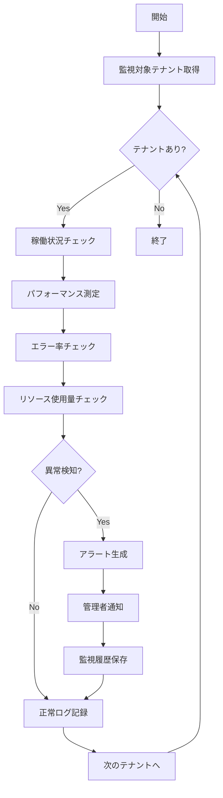

# バッチ仕様書：テナント状態監視バッチ

| 項目                | 内容                                                                                |
|---------------------|------------------------------------------------------------------------------------|
| **バッチID**        | BATCH-903                                                                          |
| **バッチ名称**      | テナント状態監視バッチ                                                              |
| **機能カテゴリ**    | テナント管理                                                                        |
| **概要・目的**      | テナントの稼働状況・異常を監視し、問題を早期検知・通知する                          |
| **バッチ種別**      | 定期バッチ                                                                          |
| **実行スケジュール**| 毎時間（毎時0分）                                                                   |
| **入出力対象**      | TenantStatus, SystemMetrics, AlertHistory                                          |
| **優先度**          | 高                                                                                  |
| **備考**            | 24時間監視体制                                                                      |

## 1. 処理概要

テナント状態監視バッチは、各テナントのシステム稼働状況、パフォーマンス、エラー発生状況を時間毎に監視し、異常を検知した場合に管理者への通知を行うバッチ処理です。

## 2. 処理フロー



## 3. 入力データ

### 3.1 Tenantテーブル

| フィールド名      | データ型 | 説明                                           |
|-------------------|----------|------------------------------------------------|
| tenant_id         | String   | テナントID（主キー）                           |
| status            | String   | テナント状態                                   |
| monitoring_enabled| Boolean  | 監視有効フラグ                                 |

### 3.2 SystemMetricsテーブル

| フィールド名      | データ型 | 説明                                           |
|-------------------|----------|------------------------------------------------|
| tenant_id         | String   | テナントID                                     |
| metric_type       | String   | メトリクス種別                                 |
| metric_value      | Decimal  | メトリクス値                                   |
| measured_at       | DateTime | 測定日時                                       |

## 4. 出力データ

### 4.1 TenantMonitoringLogテーブル（追加）

| フィールド名      | データ型 | 説明                                           |
|-------------------|----------|------------------------------------------------|
| log_id            | String   | ログID（主キー）                               |
| tenant_id         | String   | テナントID（外部キー）                         |
| check_time        | DateTime | チェック日時                                   |
| status            | String   | 監視結果（"NORMAL"/"WARNING"/"CRITICAL"）      |
| response_time_ms  | Integer  | レスポンス時間（ミリ秒）                       |
| error_rate        | Decimal  | エラー率（%）                                  |
| cpu_usage         | Decimal  | CPU使用率（%）                                 |
| memory_usage      | Decimal  | メモリ使用率（%）                              |
| disk_usage        | Decimal  | ディスク使用率（%）                            |
| alert_triggered   | Boolean  | アラート発生フラグ                             |
| details           | JSON     | 詳細情報                                       |

## 5. 監視項目

### 5.1 稼働状況監視

- **ヘルスチェックAPI**: `/health`エンドポイントの応答確認
- **レスポンス時間**: 3秒以上で警告、10秒以上で重要
- **可用性**: 5分間で3回連続失敗で重要アラート

### 5.2 パフォーマンス監視

- **CPU使用率**: 80%以上で警告、95%以上で重要
- **メモリ使用率**: 85%以上で警告、 95%以上で重要
- **ディスク使用率**: 80%以上で警告、90%以上で重要

### 5.3 エラー監視

- **エラー率**: 5%以上で警告、10%以上で重要
- **5xx エラー**: 1時間で10回以上で警告
- **データベース接続エラー**: 発生時即座に重要アラート

## 6. アラート条件

| 監視項目          | 警告閾値    | 重要閾値    | 通知方法                |
|-------------------|-------------|-------------|-------------------------|
| レスポンス時間    | 3秒以上     | 10秒以上    | メール + Slack          |
| CPU使用率         | 80%以上     | 95%以上     | メール + Slack          |
| メモリ使用率      | 85%以上     | 95%以上     | メール + Slack          |
| ディスク使用率    | 80%以上     | 90%以上     | メール + Slack + 電話   |
| エラー率          | 5%以上      | 10%以上     | メール + Slack          |
| サービス停止      | -           | 即座       | メール + Slack + 電話   |

## 7. 実行パラメータ

| パラメータ名        | 必須 | デフォルト値 | 説明                                           |
|---------------------|------|--------------|------------------------------------------------|
| --tenant-id         | No   | 全テナント   | 特定テナントのみ監視                           |
| --skip-alerts       | No   | false        | アラート通知をスキップ                         |
| --detailed-check    | No   | false        | 詳細チェックモード                             |
| --dry-run           | No   | false        | 監視結果の確認のみ行い、通知は行わない         |

## 8. 実行例

```bash
# 通常実行
npm run batch:tenant-monitoring

# 特定テナントのみ監視
npm run batch:tenant-monitoring -- --tenant-id=tenant001

# 詳細チェックモード
npm run batch:tenant-monitoring -- --detailed-check

# ドライラン
npm run batch:tenant-monitoring -- --dry-run

# TypeScript直接実行
npx tsx src/batch/tenant-monitoring.ts
```

## 9. 関連バッチ

- **BATCH-901**: テナント使用量集計バッチ（使用量データを参照）
- **BATCH-904**: 非アクティブテナント検知バッチ（監視データを参照）
- **BATCH-951**: 定期通知送信バッチ（アラート通知を送信）

## 10. 改訂履歴

| 改訂日     | 改訂者 | 改訂内容                                         |
|------------|--------|--------------------------------------------------|
| 2025/05/30 | 初版   | 初版作成                                         |
