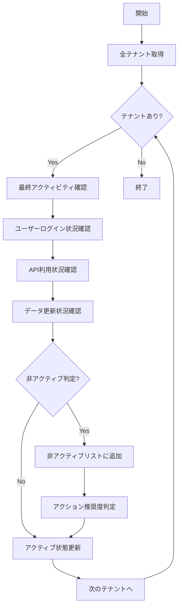

# バッチ仕様書：非アクティブテナント検知バッチ

| 項目                | 内容                                                                                |
|---------------------|------------------------------------------------------------------------------------|
| **バッチID**        | BATCH-904                                                                          |
| **バッチ名称**      | 非アクティブテナント検知バッチ                                                      |
| **機能カテゴリ**    | テナント管理                                                                        |
| **概要・目的**      | 長期間未使用のテナントを検知し、契約見直しや課金停止の判断材料を提供する            |
| **バッチ種別**      | 定期バッチ                                                                          |
| **実行スケジュール**| 毎日深夜（3:00）                                                                    |
| **入出力対象**      | TenantActivity, InactiveTenantsReport                                               |
| **優先度**          | 中                                                                                  |
| **備考**            | コスト最適化支援                                                                    |

## 1. 処理概要

非アクティブテナント検知バッチは、各テナントの利用状況を分析し、一定期間アクティビティがないテナントを検知するバッチ処理です。検知結果は管理者に通知され、契約見直しや課金停止の判断材料として活用されます。

## 2. 処理フロー



## 3. 入力データ

### 3.1 TenantActivityテーブル

| フィールド名      | データ型 | 説明                                           |
|-------------------|----------|------------------------------------------------|
| tenant_id         | String   | テナントID                                     |
| last_login_at     | DateTime | 最終ログイン日時                               |
| last_api_call_at  | DateTime | 最終API呼び出し日時                            |
| last_data_update_at| DateTime | 最終データ更新日時                             |
| active_user_count | Integer  | アクティブユーザー数（30日間）                 |

### 3.2 TenantContractテーブル

| フィールド名      | データ型 | 説明                                           |
|-------------------|----------|------------------------------------------------|
| tenant_id         | String   | テナントID                                     |
| plan_type         | String   | 契約プラン                                     |
| monthly_fee       | Decimal  | 月額料金                                       |
| contract_start    | Date     | 契約開始日                                     |

## 4. 出力データ

### 4.1 InactiveTenantsReportテーブル（追加）

| フィールド名      | データ型 | 説明                                           |
|-------------------|----------|------------------------------------------------|
| report_id         | String   | レポートID（主キー）                           |
| tenant_id         | String   | テナントID（外部キー）                         |
| report_date       | Date     | レポート作成日                                 |
| inactive_days     | Integer  | 非アクティブ日数                               |
| last_activity_type| String   | 最終アクティビティ種別                         |
| last_activity_at  | DateTime | 最終アクティビティ日時                         |
| risk_level        | String   | リスクレベル（"LOW"/"MEDIUM"/"HIGH"）          |
| recommended_action| String   | 推奨アクション                                 |
| monthly_cost      | Decimal  | 月額コスト                                     |
| potential_savings | Decimal  | 潜在的節約額                                   |
| created_at        | DateTime | 作成日時                                       |

## 5. 非アクティブ判定基準

### 5.1 アクティビティ種別

- **ログインアクティビティ**: ユーザーのシステムログイン
- **APIアクティビティ**: API呼び出し（自動処理含む）
- **データアクティビティ**: データの作成・更新・削除

### 5.2 非アクティブ期間

| リスクレベル | 期間      | 判定条件                                       |
|--------------|-----------|------------------------------------------------|
| LOW          | 30-60日   | 一部機能のみ利用、ユーザー活動は継続           |
| MEDIUM       | 60-90日   | ログインはあるがデータ更新なし                 |
| HIGH         | 90日以上  | 全てのアクティビティが停止                     |

### 5.3 推奨アクション

| リスクレベル | 推奨アクション                                 |
|--------------|------------------------------------------------|
| LOW          | 利用状況確認、機能案内                         |
| MEDIUM       | 契約見直し提案、サポート連絡                   |
| HIGH         | 契約停止検討、データ保持期間確認               |

## 6. 実行パラメータ

| パラメータ名        | 必須 | デフォルト値 | 説明                                           |
|---------------------|------|--------------|------------------------------------------------|
| --min-inactive-days | No   | 30           | 非アクティブ判定の最小日数                     |
| --tenant-id         | No   | 全テナント   | 特定テナントのみ分析                           |
| --include-trial     | No   | false        | トライアルテナントも対象に含める               |
| --dry-run           | No   | false        | 分析結果の確認のみ行い、レポート保存は行わない |

## 7. 実行例

```bash
# 通常実行
npm run batch:inactive-tenants

# 非アクティブ期間を60日に設定
npm run batch:inactive-tenants -- --min-inactive-days=60

# トライアルテナントも含めて分析
npm run batch:inactive-tenants -- --include-trial

# ドライラン
npm run batch:inactive-tenants -- --dry-run

# TypeScript直接実行
npx tsx src/batch/inactive-tenants.ts
```

## 8. 関連バッチ

- **BATCH-901**: テナント使用量集計バッチ（使用量データを参照）
- **BATCH-903**: テナント状態監視バッチ（アクティビティデータを参照）
- **BATCH-951**: 定期通知送信バッチ（非アクティブ通知を送信）

## 9. 改訂履歴

| 改訂日     | 改訂者 | 改訂内容                                         |
|------------|--------|--------------------------------------------------|
| 2025/05/30 | 初版   | 初版作成                                         |
