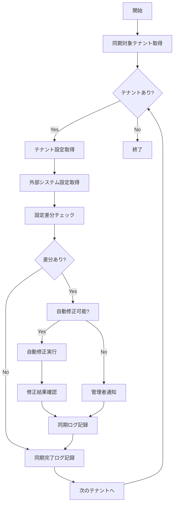

# バッチ仕様書：テナント設定同期バッチ

| 項目                | 内容                                                                                |
|---------------------|------------------------------------------------------------------------------------|
| **バッチID**        | BATCH-905                                                                          |
| **バッチ名称**      | テナント設定同期バッチ                                                              |
| **機能カテゴリ**    | テナント管理                                                                        |
| **概要・目的**      | テナント設定の整合性確認と外部システムとの同期を行う                                |
| **バッチ種別**      | 定期バッチ                                                                          |
| **実行スケジュール**| 毎日深夜（4:00）                                                                    |
| **入出力対象**      | TenantConfig, ExternalSystems, SyncLog                                             |
| **優先度**          | 中                                                                                  |
| **備考**            | データ整合性保証                                                                    |

## 1. 処理概要

テナント設定同期バッチは、各テナントの設定情報の整合性を確認し、外部システム（人事システム、認証システム等）との同期を行うバッチ処理です。設定の不整合や同期エラーを検知し、自動修正または管理者への通知を行います。

## 2. 処理フロー



## 3. 入力データ

### 3.1 TenantConfigテーブル

| フィールド名      | データ型 | 説明                                           |
|-------------------|----------|------------------------------------------------|
| tenant_id         | String   | テナントID（主キー）                           |
| config_type       | String   | 設定種別                                       |
| config_value      | JSON     | 設定値                                         |
| last_updated_at   | DateTime | 最終更新日時                                   |
| sync_enabled      | Boolean  | 同期有効フラグ                                 |

### 3.2 ExternalSystemConfigテーブル

| フィールド名      | データ型 | 説明                                           |
|-------------------|----------|------------------------------------------------|
| system_id         | String   | 外部システムID                                 |
| tenant_id         | String   | テナントID                                     |
| config_data       | JSON     | 外部システム設定データ                         |
| last_sync_at      | DateTime | 最終同期日時                                   |

## 4. 出力データ

### 4.1 TenantSyncLogテーブル（追加）

| フィールド名      | データ型 | 説明                                           |
|-------------------|----------|------------------------------------------------|
| sync_id           | String   | 同期ID（主キー）                               |
| tenant_id         | String   | テナントID（外部キー）                         |
| sync_date         | Date     | 同期実行日                                     |
| sync_type         | String   | 同期種別（"AUTO"/"MANUAL"/"SCHEDULED"）        |
| target_system     | String   | 対象システム                                   |
| sync_status       | String   | 同期結果（"SUCCESS"/"FAILED"/"PARTIAL"）       |
| changes_detected  | Integer  | 検知された変更数                               |
| changes_applied   | Integer  | 適用された変更数                               |
| error_count       | Integer  | エラー数                                       |
| sync_details      | JSON     | 同期詳細                                       |
| created_at        | DateTime | 作成日時                                       |

### 4.2 ConfigDifferenceテーブル（追加）

| フィールド名      | データ型 | 説明                                           |
|-------------------|----------|------------------------------------------------|
| diff_id           | String   | 差分ID（主キー）                               |
| tenant_id         | String   | テナントID（外部キー）                         |
| config_path       | String   | 設定パス                                       |
| current_value     | JSON     | 現在値                                         |
| expected_value    | JSON     | 期待値                                         |
| difference_type   | String   | 差分種別（"MISSING"/"MISMATCH"/"EXTRA"）       |
| auto_fixable      | Boolean  | 自動修正可能フラグ                             |
| fix_applied       | Boolean  | 修正適用フラグ                                 |
| detected_at       | DateTime | 検知日時                                       |

## 5. 同期対象設定

### 5.1 ユーザー・組織設定

- **ユーザーマスタ**: 人事システムからの同期
- **組織構造**: 部署・役職情報の同期
- **権限設定**: ロール・権限マッピングの同期

### 5.2 システム設定

- **認証設定**: SSO設定、認証プロバイダー設定
- **通知設定**: メール・Slack通知設定
- **機能設定**: 利用可能機能の設定

### 5.3 業務設定

- **スキルマスタ**: スキル分類・評価基準
- **帳票設定**: レポート出力設定
- **ワークフロー設定**: 承認フロー設定

## 6. 自動修正ルール

| 設定種別          | 自動修正条件                                   |
|-------------------|------------------------------------------------|
| ユーザー情報      | 人事システムが正とし、自動更新                 |
| 組織構造          | 人事システムが正とし、自動更新                 |
| 権限設定          | 手動確認必須（自動修正なし）                   |
| 通知設定          | デフォルト値への復旧のみ自動実行               |
| 機能設定          | 契約プランに基づく自動調整                     |

## 7. 実行パラメータ

| パラメータ名        | 必須 | デフォルト値 | 説明                                           |
|---------------------|------|--------------|------------------------------------------------|
| --tenant-id         | No   | 全テナント   | 特定テナントのみ同期                           |
| --config-type       | No   | 全設定       | 特定設定種別のみ同期                           |
| --auto-fix          | No   | true         | 自動修正の実行有無                             |
| --dry-run           | No   | false        | 差分確認のみ行い、実際の修正は行わない         |
| --force-sync        | No   | false        | 強制同期（差分なしでも実行）                   |

## 8. 実行例

```bash
# 通常実行
npm run batch:tenant-sync

# 特定テナントのみ同期
npm run batch:tenant-sync -- --tenant-id=tenant001

# ユーザー設定のみ同期
npm run batch:tenant-sync -- --config-type=user

# 自動修正なしで差分確認のみ
npm run batch:tenant-sync -- --auto-fix=false --dry-run

# 強制同期
npm run batch:tenant-sync -- --force-sync

# TypeScript直接実行
npx tsx src/batch/tenant-sync.ts
```

## 9. エラー処理

| エラーケース                      | 対応方法                                                                 |
|-----------------------------------|--------------------------------------------------------------------------|
| 外部システム接続エラー            | リトライ実行（最大3回）、失敗時は管理者通知                              |
| 設定値不正                        | エラーログ記録、該当設定をスキップして処理継続                           |
| 自動修正失敗                      | 手動修正が必要な旨を管理者に通知                                         |
| 権限不足エラー                    | 管理者に権限確認を依頼                                                   |

## 10. 関連バッチ

- **BATCH-901**: テナント使用量集計バッチ（設定情報を参照）
- **BATCH-202**: 組織・役職マスタ同期バッチ（組織設定を参照）
- **BATCH-951**: 定期通知送信バッチ（通知設定を参照）

## 11. 改訂履歴

| 改訂日     | 改訂者 | 改訂内容                                         |
|------------|--------|--------------------------------------------------|
| 2025/05/30 | 初版   | 初版作成                                         |
