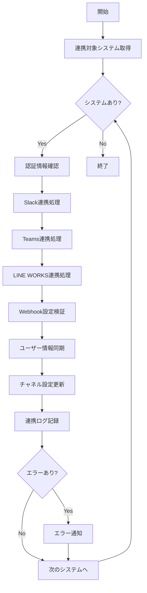

# バッチ仕様書：外部システム連携バッチ

| 項目                | 内容                                                                                |
|---------------------|------------------------------------------------------------------------------------|
| **バッチID**        | BATCH-953                                                                          |
| **バッチ名称**      | 外部システム連携バッチ                                                              |
| **機能カテゴリ**    | 通知・連携管理                                                                      |
| **概要・目的**      | Teams/Slack/LINE WORKS等の外部システムとの連携処理を実行する                       |
| **バッチ種別**      | 定期バッチ                                                                          |
| **実行スケジュール**| 毎日深夜（5:00）                                                                    |
| **入出力対象**      | ExternalIntegration, SyncStatus, WebhookLog                                        |
| **優先度**          | 中                                                                                  |
| **備考**            | 外部API依存                                                                         |

## 1. 処理概要

外部システム連携バッチは、Teams、Slack、LINE WORKS等の外部コミュニケーションツールとの連携処理を行うバッチです。ユーザー情報の同期、チャネル設定の更新、Webhook設定の検証等を実行します。

## 2. 処理フロー



## 3. 入力データ

### 3.1 ExternalIntegrationテーブル

| フィールド名      | データ型 | 説明                                           |
|-------------------|----------|------------------------------------------------|
| integration_id    | String   | 連携ID（主キー）                               |
| tenant_id         | String   | テナントID（外部キー）                         |
| system_type       | String   | システム種別（"SLACK"/"TEAMS"/"LINE_WORKS"）   |
| api_endpoint      | String   | API エンドポイント                             |
| auth_token        | String   | 認証トークン（暗号化）                         |
| webhook_url       | String   | Webhook URL                                    |
| is_active         | Boolean  | 有効フラグ                                     |
| last_sync_at      | DateTime | 最終同期日時                                   |

### 3.2 UserExternalAccountテーブル

| フィールド名      | データ型 | 説明                                           |
|-------------------|----------|------------------------------------------------ |
| user_id           | String   | ユーザーID（主キー）                           |
| tenant_id         | String   | テナントID（外部キー）                         |
| slack_user_id     | String   | Slack ユーザーID                               |
| teams_user_id     | String   | Teams ユーザーID                               |
| line_works_user_id| String   | LINE WORKS ユーザーID                          |
| sync_enabled      | Boolean  | 同期有効フラグ                                 |

## 4. 出力データ

### 4.1 ExternalSyncLogテーブル（追加）

| フィールド名      | データ型 | 説明                                           |
|-------------------|----------|------------------------------------------------|
| sync_log_id       | String   | 同期ログID（主キー）                           |
| integration_id    | String   | 連携ID（外部キー）                             |
| sync_type         | String   | 同期種別（"USER"/"CHANNEL"/"WEBHOOK"）         |
| sync_status       | String   | 同期結果（"SUCCESS"/"FAILED"/"PARTIAL"）       |
| records_processed | Integer  | 処理レコード数                                 |
| records_success   | Integer  | 成功レコード数                                 |
| records_failed    | Integer  | 失敗レコード数                                 |
| error_details     | JSON     | エラー詳細                                     |
| sync_duration_ms  | Integer  | 同期処理時間（ミリ秒）                         |
| synced_at         | DateTime | 同期実行日時                                   |

## 5. 連携処理詳細

### 5.1 Slack連携

- **ユーザー情報同期**: Slack Workspace内のユーザー情報を取得・同期
- **チャネル管理**: プライベートチャネルの作成・更新
- **Webhook検証**: Incoming Webhook URLの有効性確認
- **Bot設定**: Slack Bot の権限・設定確認

### 5.2 Teams連携

- **ユーザー情報同期**: Microsoft Graph API経由でユーザー情報取得
- **チーム管理**: Teams チーム・チャネルの作成・更新
- **Webhook検証**: Incoming Webhook URLの有効性確認
- **アプリ設定**: Teams アプリの権限・設定確認

### 5.3 LINE WORKS連携

- **ユーザー情報同期**: LINE WORKS API経由でユーザー情報取得
- **トーク管理**: Bot トークルームの作成・更新
- **Webhook検証**: Callback URLの有効性確認
- **Bot設定**: LINE WORKS Bot の権限・設定確認

## 6. 同期対象データ

### 6.1 ユーザー情報

- **基本情報**: 表示名、メールアドレス、プロフィール画像
- **ステータス**: アクティブ/非アクティブ状態
- **権限情報**: 管理者権限、利用可能機能

### 6.2 チャネル/トーク設定

- **通知設定**: 通知の有効/無効、通知レベル
- **メンバー管理**: チャネル/トークのメンバー追加・削除
- **権限設定**: 投稿権限、管理権限

## 7. 実行パラメータ

| パラメータ名        | 必須 | デフォルト値 | 説明                                           |
|---------------------|------|--------------|------------------------------------------------|
| --tenant-id         | No   | 全テナント   | 特定テナントのみ連携                           |
| --system-type       | No   | 全システム   | 特定システムのみ連携                           |
| --sync-type         | No   | 全種別       | 特定同期種別のみ実行                           |
| --force-sync        | No   | false        | 強制同期（差分なしでも実行）                   |
| --dry-run           | No   | false        | 同期対象の確認のみ行い、実際の同期は行わない   |

## 8. 実行例

```bash
# 通常実行
npm run batch:external-integration

# 特定テナントのみ連携
npm run batch:external-integration -- --tenant-id=tenant001

# Slack連携のみ実行
npm run batch:external-integration -- --system-type=slack

# ユーザー情報同期のみ実行
npm run batch:external-integration -- --sync-type=user

# 強制同期
npm run batch:external-integration -- --force-sync

# ドライラン
npm run batch:external-integration -- --dry-run

# TypeScript直接実行
npx tsx src/batch/external-integration.ts
```

## 9. エラー処理

| エラーケース                      | 対応方法                                                                 |
|-----------------------------------|--------------------------------------------------------------------------|
| API認証エラー                     | 認証情報の再確認を管理者に通知                                           |
| レート制限エラー                  | 指数バックオフでリトライ                                                 |
| ネットワークエラー                | 最大3回リトライ、失敗時は次回実行時に再試行                              |
| 権限不足エラー                    | 必要な権限を管理者に通知                                                 |
| データ形式エラー                  | エラーログ記録、該当データをスキップして処理継続                         |

## 10. セキュリティ考慮事項

- **認証トークン**: AES-256で暗号化して保存
- **通信**: 全てHTTPS/TLS1.3で暗号化
- **ログ**: 認証情報をログに出力しない
- **権限**: 最小権限の原則に従った API権限設定

## 11. 関連バッチ

- **BATCH-951**: 定期通知送信バッチ（外部システム経由で通知送信）
- **BATCH-905**: テナント設定同期バッチ（外部システム設定を同期）
- **BATCH-955**: 通知設定検証バッチ（外部システム設定を検証）

## 12. 改訂履歴

| 改訂日     | 改訂者 | 改訂内容                                         |
|------------|--------|--------------------------------------------------|
| 2025/05/30 | 初版   | 初版作成                                         |
