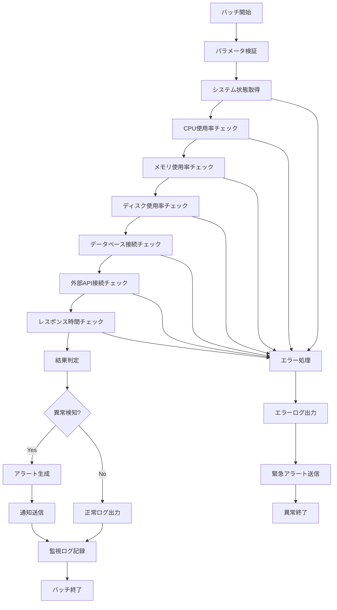

# バッチ定義書：システムヘルスチェックバッチ (BATCH-001)

## 1. 基本情報

| 項目 | 内容 |
|------|------|
| **バッチID** | BATCH-001 |
| **バッチ名** | システムヘルスチェックバッチ |
| **実行スケジュール** | 時間毎（毎時00分） |
| **優先度** | 高 |
| **ステータス** | 実装済み |
| **作成日** | 2025/05/31 |
| **最終更新日** | 2025/05/31 |

## 2. バッチ概要

### 2.1 概要・目的
システム全体の稼働状況を定期的に監視し、異常を早期発見することで、システムの安定稼働を確保する。

### 2.2 関連テーブル
- TBL-030_システム監視ログ
- TBL-031_アラート履歴
- TBL-032_システム状態

### 2.3 関連API
- API-301_システム状態取得API
- API-302_アラート送信API

## 3. 実行仕様

### 3.1 実行スケジュール
| 項目 | 設定値 | 備考 |
|------|--------|------|
| 実行頻度 | 0 * * * * | cron形式（毎時00分） |
| 実行時間 | 毎時00分 | 24時間監視 |
| タイムアウト | 10分 | 最大実行時間 |
| リトライ回数 | 3回 | 失敗時の再実行 |

### 3.2 実行条件
| 条件 | 内容 | 備考 |
|------|------|------|
| 前提条件 | システム稼働中 | 基本的な稼働状態 |
| 実行可能時間 | 24時間 | 常時監視 |
| 排他制御 | 同一バッチの重複実行禁止 | ロックファイル使用 |

### 3.3 実行パラメータ
| パラメータ名 | データ型 | 必須 | デフォルト値 | 説明 |
|--------------|----------|------|--------------|------|
| check_level | string | × | standard | チェックレベル（basic/standard/detailed） |
| alert_threshold | number | × | 80 | アラート閾値（%） |
| notification_enabled | boolean | × | true | 通知送信フラグ |

## 4. 処理仕様

### 4.1 処理フロー

### 4.2 詳細処理
1. **初期化処理**
   - パラメータ検証
   - ログファイル初期化
   - 排他制御ロック取得

2. **システム状態チェック**
   - CPU使用率監視（閾値：80%）
   - メモリ使用率監視（閾値：85%）
   - ディスク使用率監視（閾値：90%）
   - プロセス稼働状況確認

3. **データベースチェック**
   - 接続可能性確認
   - レスポンス時間測定
   - アクティブ接続数確認

4. **外部システムチェック**
   - 外部API接続確認
   - ネットワーク疎通確認
   - SSL証明書有効期限確認

5. **結果判定・通知**
   - 異常レベル判定
   - アラート生成・送信
   - 監視ログ記録

## 5. データ仕様

### 5.1 入力データ
| データ名 | 形式 | 取得元 | 説明 |
|----------|------|--------|------|
| システム情報 | API | OS/ミドルウェア | CPU、メモリ、ディスク情報 |
| データベース情報 | DB | PostgreSQL | 接続状況、パフォーマンス |
| 外部API情報 | HTTP | 各種外部サービス | 接続状況、レスポンス時間 |

### 5.2 出力データ
| データ名 | 形式 | 出力先 | 説明 |
|----------|------|--------|------|
| 監視ログ | DB | TBL-030 | システム状態記録 |
| アラート情報 | DB | TBL-031 | 異常検知情報 |
| 実行ログ | LOG | /logs/batch/ | 実行履歴ログ |

### 5.3 データ量見積もり
| 項目 | 件数 | 備考 |
|------|------|------|
| 監視ログ件数 | 24件/日 | 時間毎実行 |
| アラート件数 | 0-10件/日 | 異常発生時のみ |
| 処理時間 | 2-5分 | 平均実行時間 |

## 6. エラーハンドリング

### 6.1 エラー分類
| エラー種別 | 対応方法 | 通知要否 | 備考 |
|------------|----------|----------|------|
| システムエラー | 処理中断・緊急アラート | ○ | CPU/メモリ/ディスク異常 |
| 接続エラー | リトライ・アラート | ○ | DB/外部API接続失敗 |
| 設定エラー | エラーログ出力 | △ | パラメータ不正等 |

### 6.2 リトライ仕様
| 条件 | リトライ回数 | 間隔 | 備考 |
|------|--------------|------|------|
| DB接続エラー | 3回 | 30秒 | 指数バックオフ |
| 外部API呼び出しエラー | 2回 | 10秒 | 固定間隔 |
| システム情報取得エラー | 1回 | 5秒 | 即座にリトライ |

### 6.3 異常終了時の処理
1. 処理中断
2. 緊急アラート送信
3. エラーログ出力
4. 運用チームへ通知
5. 排他制御ロック解除

## 7. 監視・運用

### 7.1 監視項目
| 監視項目 | 閾値 | アラート条件 | 対応方法 |
|----------|------|--------------|----------|
| CPU使用率 | 80% | 超過時 | プロセス確認・最適化 |
| メモリ使用率 | 85% | 超過時 | メモリリーク調査 |
| ディスク使用率 | 90% | 超過時 | ディスククリーンアップ |
| DB接続数 | 最大接続数の80% | 超過時 | 接続プール調整 |
| レスポンス時間 | 5秒 | 超過時 | パフォーマンス調査 |

### 7.2 ログ出力
| ログ種別 | 出力レベル | 出力内容 | 保存期間 |
|----------|------------|----------|----------|
| 実行ログ | INFO | 処理開始・終了・各チェック結果 | 3ヶ月 |
| エラーログ | ERROR | エラー詳細・スタックトレース | 1年 |
| アラートログ | WARN | 閾値超過・異常検知 | 6ヶ月 |

### 7.3 アラート通知
| 通知条件 | 通知先 | 通知方法 | 備考 |
|----------|--------|----------|------|
| 緊急異常 | 運用チーム | メール・Slack・電話 | 即座に通知 |
| 警告レベル | 開発チーム | Slack | 業務時間内のみ |
| 情報レベル | 監視ダッシュボード | Web画面 | リアルタイム表示 |

## 8. 非機能要件

### 8.1 パフォーマンス
- 処理時間：10分以内
- メモリ使用量：512MB以内
- CPU使用率：20%以内

### 8.2 可用性
- 成功率：99.9%以上
- 24時間365日稼働
- 障害時の自動復旧機能

### 8.3 セキュリティ
- 実行権限の制限
- 監視データの暗号化
- アクセスログの記録

## 9. テスト仕様

### 9.1 単体テスト
| テストケース | 入力条件 | 期待結果 |
|--------------|----------|----------|
| 正常処理 | 全システム正常 | 正常終了・正常ログ出力 |
| CPU高負荷 | CPU使用率85% | 警告アラート生成 |
| メモリ不足 | メモリ使用率90% | 警告アラート生成 |
| ディスク容量不足 | ディスク使用率95% | 緊急アラート生成 |

### 9.2 異常系テスト
| テストケース | 入力条件 | 期待結果 |
|--------------|----------|----------|
| DB接続エラー | DB停止状態 | リトライ後緊急アラート |
| 外部API障害 | API応答なし | 警告アラート生成 |
| システム情報取得失敗 | OS情報取得不可 | エラーログ出力・アラート |

## 10. 実装メモ

### 10.1 技術仕様
- 言語：Node.js
- フレームワーク：Express.js
- 監視ライブラリ：node-os-utils, systeminformation
- 通知：Slack API, メール送信

### 10.2 注意事項
- システムリソース監視時の負荷を最小限に抑制
- 大量アラート発生時の通知制限機能
- 監視対象システムの動的追加・削除対応

### 10.3 デプロイ・実行環境
- 実行サーバー：監視サーバー
- 実行ユーザー：monitor_user
- 実行ディレクトリ：/opt/batch/health-check/
- 設定ファイル：/etc/batch/health-check.json

---

**改訂履歴**

| バージョン | 日付 | 変更者 | 変更内容 |
|------------|------|--------|----------|
| 1.0 | 2025/05/31 | システムアーキテクト | 初版作成 |
