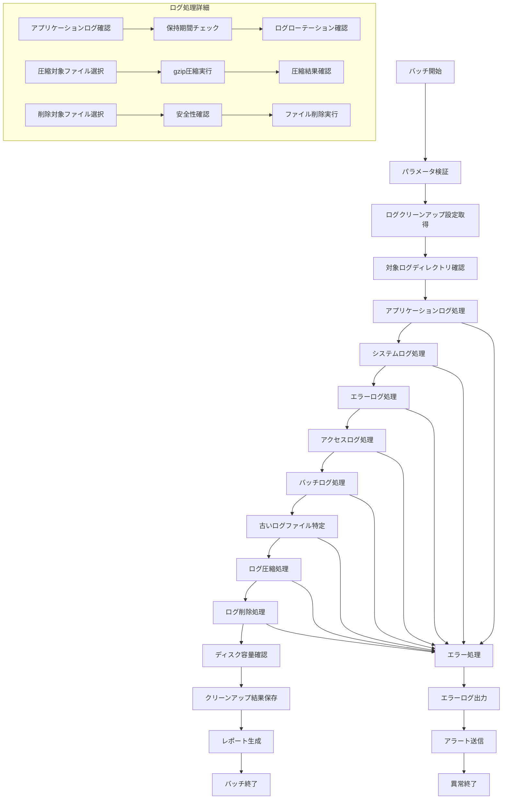

# バッチ定義書：ログクリーンアップバッチ (BATCH-002)

## 1. 基本情報

| 項目 | 内容 |
|------|------|
| **バッチID** | BATCH-002 |
| **バッチ名** | ログクリーンアップバッチ |
| **実行スケジュール** | 日次（03:00） |
| **優先度** | 中 |
| **ステータス** | 未着手 |
| **作成日** | 2025/05/31 |
| **最終更新日** | 2025/05/31 |

## 2. バッチ概要

### 2.1 概要・目的
システム全体のログファイルの整理・削除を行い、ディスク容量の最適化とログ管理の効率化を図る。

### 2.2 関連テーブル
- TBL-010_ログ
- TBL-020_ログクリーンアップ設定
- TBL-021_ログクリーンアップ履歴

### 2.3 関連API
- API-020_ログクリーンアップ設定取得API
- API-021_ログクリーンアップ結果登録API

## 3. 実行仕様

### 3.1 実行スケジュール
| 項目 | 設定値 | 備考 |
|------|--------|------|
| 実行頻度 | 0 3 * * * | cron形式（毎日03:00） |
| 実行時間 | 03:00 | 深夜バッチ |
| タイムアウト | 120分 | 最大実行時間 |
| リトライ回数 | 2回 | 失敗時の再実行 |

### 3.2 実行条件
| 条件 | 内容 | 備考 |
|------|------|------|
| 前提条件 | ファイルシステム稼働中 | ディスクアクセス権限確認 |
| 実行可能時間 | 03:00-05:00 | 深夜メンテナンス時間 |
| 排他制御 | 同一バッチの重複実行禁止 | ロックファイル使用 |

### 3.3 実行パラメータ
| パラメータ名 | データ型 | 必須 | デフォルト値 | 説明 |
|--------------|----------|------|--------------|------|
| retention_days | number | × | 30 | ログ保持日数 |
| log_types | string[] | × | all | 対象ログ種別 |
| compress_before_delete | boolean | × | true | 削除前圧縮フラグ |
| dry_run | boolean | × | false | テスト実行フラグ |

## 4. 処理仕様

### 4.1 処理フロー

### 4.2 詳細処理
1. **初期化処理**
   - パラメータ検証・設定確認
   - 対象ログディレクトリの確認
   - 排他制御ロック取得

2. **ログファイル分析**
   - 各ログ種別の確認
   - ファイルサイズ・作成日時の取得
   - 保持期間との比較

3. **アプリケーションログ処理**
   - アプリケーション実行ログの整理
   - デバッグログの削除
   - パフォーマンスログの圧縮

4. **システムログ処理**
   - OS レベルのシステムログ整理
   - セキュリティログの保持期間確認
   - 監査ログの適切な保管

5. **エラーログ処理**
   - エラーログの重要度別分類
   - 重要エラーログの長期保持
   - 一般エラーログの削除

6. **ログ圧縮・削除**
   - 保持期間内ログの圧縮
   - 保持期間超過ログの削除
   - 圧縮・削除結果の確認

7. **結果確認・レポート**
   - ディスク容量削減効果の確認
   - クリーンアップ統計の生成
   - 処理結果レポートの作成

## 5. データ仕様

### 5.1 入力データ
| データ名 | 形式 | 取得元 | 説明 |
|----------|------|--------|------|
| ログクリーンアップ設定 | DB | TBL-020 | 保持期間・対象ディレクトリ設定 |
| ログファイル | FILE | /logs/ | 各種ログファイル |
| ディスク使用量情報 | OS | システム | 現在のディスク使用状況 |

### 5.2 出力データ
| データ名 | 形式 | 出力先 | 説明 |
|----------|------|--------|------|
| クリーンアップ履歴 | DB | TBL-021 | 削除・圧縮ファイル履歴 |
| 実行ログ | LOG | /logs/batch/ | バッチ実行ログ |
| クリーンアップレポート | JSON | /reports/ | 詳細なクリーンアップ結果 |
| 圧縮ログファイル | FILE | /logs/archive/ | 圧縮されたログファイル |

### 5.3 データ量見積もり
| 項目 | 件数 | 備考 |
|------|------|------|
| 処理対象ログファイル数 | 1,000-10,000ファイル | ログ種別・期間による |
| 削除対象ファイルサイズ | 1-10GB | 保持期間・ログ量による |
| 処理時間 | 60-120分 | ファイル数・サイズによる |

## 6. エラーハンドリング

### 6.1 エラー分類
| エラー種別 | 対応方法 | 通知要否 | 備考 |
|------------|----------|----------|------|
| ファイルアクセスエラー | エラーログ出力・スキップ | △ | 権限・ロックエラー |
| ディスク容量不足エラー | 処理中断・アラート | ○ | 容量不足 |
| 圧縮処理エラー | エラーログ出力・継続 | △ | 圧縮失敗 |
| 削除処理エラー | エラーログ出力・継続 | △ | 削除失敗 |

### 6.2 リトライ仕様
| 条件 | リトライ回数 | 間隔 | 備考 |
|------|--------------|------|------|
| ファイルロックエラー | 3回 | 30秒 | 固定間隔 |
| 一時的なI/Oエラー | 2回 | 60秒 | 固定間隔 |
| 圧縮処理エラー | 1回 | 10秒 | 短間隔リトライ |

### 6.3 異常終了時の処理
1. 処理中断
2. 部分的な処理結果保存
3. エラーログ出力
4. システム管理者への通知
5. 排他制御ロック解除

## 7. 監視・運用

### 7.1 監視項目
| 監視項目 | 閾値 | アラート条件 | 対応方法 |
|----------|------|--------------|----------|
| 処理時間 | 120分 | 超過時 | ログ量・処理見直し |
| 削除ファイル数 | 期待値±30% | 乖離時 | ログ生成量確認 |
| 容量削減率 | 10%以上 | 未達時 | 設定見直し |
| エラー率 | 5% | 超過時 | 原因調査 |

### 7.2 ログ出力
| ログ種別 | 出力レベル | 出力内容 | 保存期間 |
|----------|------------|----------|----------|
| 実行ログ | INFO | 処理開始・終了・削除件数・容量削減 | 3ヶ月 |
| エラーログ | ERROR | エラー詳細・対象ファイルパス | 6ヶ月 |
| 詳細ログ | DEBUG | 削除対象ファイル詳細 | 1ヶ月 |

### 7.3 アラート通知
| 通知条件 | 通知先 | 通知方法 | 備考 |
|----------|--------|----------|------|
| 異常終了 | システム管理者 | メール・Slack | 即座に通知 |
| 容量削減未達 | 運用チーム | メール | 翌営業日まで |
| 大量ファイル削除 | 運用チーム | Slack | 確認要請 |

## 8. 非機能要件

### 8.1 パフォーマンス
- 処理時間：120分以内
- メモリ使用量：1GB以内
- CPU使用率：40%以内

### 8.2 可用性
- 成功率：98%以上
- 部分的な処理継続機能
- ファイル整合性の保証

### 8.3 セキュリティ
- 削除ログの完全消去
- 圧縮ファイルのアクセス制御
- 削除履歴の改ざん防止

## 9. テスト仕様

### 9.1 単体テスト
| テストケース | 入力条件 | 期待結果 |
|--------------|----------|----------|
| 正常処理 | 削除対象ログファイルあり | 正常終了・ファイル削除完了 |
| 削除対象なし | 削除対象ファイル0件 | 正常終了（削除件数0） |
| 大量ファイル | 10,000ファイルの削除対象 | 正常終了・適切な処理時間 |

### 9.2 異常系テスト
| テストケース | 入力条件 | 期待結果 |
|--------------|----------|----------|
| ファイルロック | 使用中ファイル | エラーログ出力・スキップ |
| 容量不足 | ディスク容量不足 | 処理中断・アラート |
| 権限エラー | 削除権限なし | エラーログ出力・スキップ |

## 10. 実装メモ

### 10.1 技術仕様
- 言語：Node.js
- ファイル操作：fs/promises
- 圧縮：zlib (gzip)
- 並列処理：worker_threads

### 10.2 注意事項
- 重要ログファイルの誤削除防止
- 圧縮処理時のメモリ使用量制御
- ログローテーション中のファイル処理

### 10.3 デプロイ・実行環境
- 実行サーバー：バッチサーバー
- 実行ユーザー：log_cleanup_user
- 実行ディレクトリ：/opt/batch/log-cleanup/
- 設定ファイル：/etc/batch/log-cleanup.json

---

**改訂履歴**

| バージョン | 日付 | 変更者 | 変更内容 |
|------------|------|--------|----------|
| 1.0 | 2025/05/31 | システムアーキテクト | 初版作成 |
