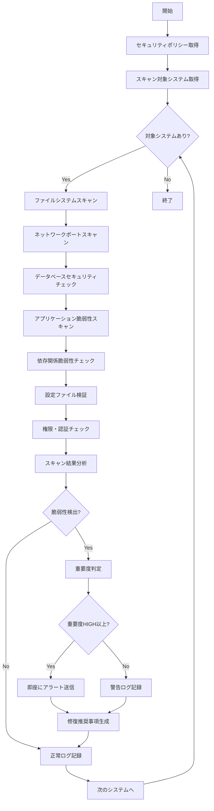

# バッチ定義書：セキュリティスキャンバッチ

| 項目                | 内容                                                                                |
|---------------------|------------------------------------------------------------------------------------|
| **バッチID**        | BATCH-003                                                                          |
| **バッチ名称**      | セキュリティスキャンバッチ                                                          |
| **機能カテゴリ**    | 基盤・システム管理                                                                  |
| **概要・目的**      | システム全体のセキュリティ脆弱性を定期的にスキャンし、脅威を早期発見・対処する      |
| **バッチ種別**      | 定期バッチ                                                                          |
| **実行スケジュール**| 日次（04:30）                                                                       |
| **入出力対象**      | システムファイル、ネットワーク、データベース、セキュリティログ                      |
| **優先度**          | 最高                                                                                |
| **備考**            | マルチテナント対応、セキュリティポリシー準拠、OWASP準拠                             |

## 1. 処理概要

セキュリティスキャンバッチは、マルチテナント環境において各システムコンポーネントのセキュリティ脆弱性を定期的にスキャンし、潜在的な脅威を早期発見するバッチ処理です。ファイルシステム、ネットワーク、データベース、アプリケーションレベルでの包括的なセキュリティチェックを実行し、問題があれば即座に管理者に通知します。

## 2. 処理フロー



## 3. 入力データ

### 3.1 スキャン対象コンポーネント

| コンポーネント種別  | スキャン項目                                               |
|---------------------|-----------------------------------------------------------|
| ファイルシステム    | 不正ファイル、権限設定、マルウェア、設定ファイル           |
| ネットワーク        | 開放ポート、不正接続、通信暗号化、ファイアウォール         |
| データベース        | SQLインジェクション、権限設定、暗号化、監査ログ           |
| アプリケーション    | XSS、CSRF、認証バイパス、セッション管理                   |
| 依存関係            | 脆弱性ライブラリ、古いバージョン、ライセンス問題           |
| 設定ファイル        | セキュリティ設定、デフォルト値、機密情報漏洩               |

### 3.2 セキュリティスキャン設定

| 設定項目                | データ型 | デフォルト値 | 説明                                 |
|-------------------------|----------|--------------|--------------------------------------|
| scan_depth              | String   | deep         | スキャン深度（quick/normal/deep）    |
| network_timeout         | Integer  | 10000        | ネットワークスキャンタイムアウト（ms）|
| max_concurrent_scans    | Integer  | 5            | 同時実行スキャン数                   |
| vulnerability_db_update | Boolean  | true         | 脆弱性データベース自動更新           |
| false_positive_filter   | Boolean  | true         | 誤検知フィルタ有効/無効              |
| compliance_check        | Boolean  | true         | コンプライアンスチェック有効/無効    |

## 4. 出力データ

### 4.1 セキュリティスキャン結果テーブル（新規作成）

| フィールド名      | データ型 | 説明                                           |
|-------------------|----------|------------------------------------------------|
| scan_id           | String   | スキャン実行ID（主キー）                       |
| scan_date         | DateTime | スキャン実行日時                               |
| component_type    | String   | コンポーネント種別                             |
| component_name    | String   | コンポーネント名                               |
| vulnerability_id  | String   | 脆弱性ID（CVE番号等）                          |
| vulnerability_name| String   | 脆弱性名                                       |
| severity          | String   | 重要度（CRITICAL/HIGH/MEDIUM/LOW/INFO）        |
| cvss_score        | Float    | CVSSスコア                                     |
| description       | String   | 脆弱性詳細説明                                 |
| affected_resource | String   | 影響を受けるリソース                           |
| remediation       | String   | 修復推奨事項                                   |
| status            | String   | ステータス（OPEN/FIXED/ACCEPTED/FALSE_POSITIVE）|
| detected_at       | DateTime | 検出日時                                       |
| fixed_at          | DateTime | 修正日時                                       |

### 4.2 セキュリティスキャン履歴テーブル（新規作成）

| フィールド名      | データ型 | 説明                                           |
|-------------------|----------|------------------------------------------------|
| execution_id      | String   | 実行ID（主キー）                               |
| execution_start   | DateTime | 実行開始日時                                   |
| execution_end     | DateTime | 実行終了日時                                   |
| scan_type         | String   | スキャン種別（FULL/INCREMENTAL/TARGETED）      |
| total_components  | Integer  | スキャン対象コンポーネント数                   |
| vulnerabilities_found| Integer | 検出脆弱性数                                |
| critical_count    | Integer  | 重要脆弱性数                                   |
| high_count        | Integer  | 高脆弱性数                                     |
| medium_count      | Integer  | 中脆弱性数                                     |
| low_count         | Integer  | 低脆弱性数                                     |
| false_positive_count| Integer | 誤検知数                                    |
| overall_risk_score| Float    | 全体リスクスコア                               |

### 4.3 セキュリティアラート通知

重要度がHIGH以上の脆弱性が検出された場合、以下の内容で即座に通知：

- 件名：「セキュリティスキャン：重要な脆弱性を検出」
- 本文：脆弱性情報、影響範囲、CVSSスコア、修復推奨事項

## 5. スキャン仕様

### 5.1 ファイルシステムスキャン

```typescript
class FileSystemSecurityScanner {
  async scanFileSystem(): Promise<SecurityScanResult[]> {
    const results: SecurityScanResult[] = [];
    
    // 不正ファイル検出
    const maliciousFiles = await this.scanForMaliciousFiles();
    results.push(...maliciousFiles);
    
    // 権限設定チェック
    const permissionIssues = await this.checkFilePermissions();
    results.push(...permissionIssues);
    
    // 設定ファイル検証
    const configIssues = await this.validateConfigFiles();
    results.push(...configIssues);
    
    // 機密情報漏洩チェック
    const secretLeaks = await this.scanForSecretLeaks();
    results.push(...secretLeaks);
    
    return results;
  }
  
  private async scanForMaliciousFiles(): Promise<SecurityScanResult[]> {
    const suspiciousPatterns = [
      /\.php\d+$/,
      /shell\.(php|jsp|asp)/,
      /backdoor/i,
      /webshell/i
    ];
    
    const results: SecurityScanResult[] = [];
    const files = await this.getAllFiles();
    
    for (const file of files) {
      for (const pattern of suspiciousPatterns) {
        if (pattern.test(file.name) || await this.containsSuspiciousContent(file.path)) {
          results.push({
            componentType: 'filesystem',
            componentName: file.path,
            vulnerabilityId: 'MALICIOUS_FILE',
            vulnerabilityName: 'Potentially Malicious File',
            severity: 'HIGH',
            cvssScore: 7.5,
            description: `Suspicious file detected: ${file.name}`,
            affectedResource: file.path,
            remediation: 'Review and remove if confirmed malicious'
          });
        }
      }
    }
    
    return results;
  }
}
```

### 5.2 ネットワークセキュリティスキャン

```typescript
class NetworkSecurityScanner {
  async scanNetworkSecurity(): Promise<SecurityScanResult[]> {
    const results: SecurityScanResult[] = [];
    
    // ポートスキャン
    const openPorts = await this.scanOpenPorts();
    results.push(...this.analyzeOpenPorts(openPorts));
    
    // SSL/TLS設定チェック
    const sslIssues = await this.checkSSLConfiguration();
    results.push(...sslIssues);
    
    // ファイアウォール設定チェック
    const firewallIssues = await this.checkFirewallRules();
    results.push(...firewallIssues);
    
    return results;
  }
  
  private async scanOpenPorts(): Promise<OpenPort[]> {
    const commonPorts = [21, 22, 23, 25, 53, 80, 110, 143, 443, 993, 995, 3389, 5432, 3306];
    const openPorts: OpenPort[] = [];
    
    for (const port of commonPorts) {
      try {
        const isOpen = await this.checkPortOpen('localhost', port);
        if (isOpen) {
          const service = await this.identifyService(port);
          openPorts.push({ port, service });
        }
      } catch (error) {
        // ポートチェック失敗は無視
      }
    }
    
    return openPorts;
  }
  
  private analyzeOpenPorts(openPorts: OpenPort[]): SecurityScanResult[] {
    const results: SecurityScanResult[] = [];
    const dangerousPorts = [21, 23, 135, 139, 445, 1433, 1521, 3389];
    
    for (const port of openPorts) {
      if (dangerousPorts.includes(port.port)) {
        results.push({
          componentType: 'network',
          componentName: `Port ${port.port}`,
          vulnerabilityId: 'DANGEROUS_PORT_OPEN',
          vulnerabilityName: 'Dangerous Port Open',
          severity: 'MEDIUM',
          cvssScore: 5.0,
          description: `Potentially dangerous port ${port.port} is open`,
          affectedResource: `localhost:${port.port}`,
          remediation: 'Close unnecessary ports or restrict access'
        });
      }
    }
    
    return results;
  }
}
```

### 5.3 データベースセキュリティスキャン

```typescript
class DatabaseSecurityScanner {
  async scanDatabaseSecurity(): Promise<SecurityScanResult[]> {
    const results: SecurityScanResult[] = [];
    
    // SQLインジェクション脆弱性チェック
    const sqlInjectionIssues = await this.checkSQLInjectionVulnerabilities();
    results.push(...sqlInjectionIssues);
    
    // データベース権限チェック
    const privilegeIssues = await this.checkDatabasePrivileges();
    results.push(...privilegeIssues);
    
    // 暗号化設定チェック
    const encryptionIssues = await this.checkEncryptionSettings();
    results.push(...encryptionIssues);
    
    // デフォルト認証情報チェック
    const defaultCredentials = await this.checkDefaultCredentials();
    results.push(...defaultCredentials);
    
    return results;
  }
  
  private async checkSQLInjectionVulnerabilities(): Promise<SecurityScanResult[]> {
    const results: SecurityScanResult[] = [];
    const testPayloads = [
      "' OR '1'='1",
      "'; DROP TABLE users; --",
      "' UNION SELECT * FROM information_schema.tables --"
    ];
    
    // 動的SQLクエリの検出
    const dynamicQueries = await this.findDynamicQueries();
    
    for (const query of dynamicQueries) {
      if (this.isPotentiallyVulnerable(query)) {
        results.push({
          componentType: 'database',
          componentName: query.location,
          vulnerabilityId: 'SQL_INJECTION',
          vulnerabilityName: 'Potential SQL Injection',
          severity: 'HIGH',
          cvssScore: 8.0,
          description: 'Dynamic SQL query without proper parameterization',
          affectedResource: query.queryText,
          remediation: 'Use parameterized queries or prepared statements'
        });
      }
    }
    
    return results;
  }
}
```

### 5.4 アプリケーション脆弱性スキャン

```typescript
class ApplicationSecurityScanner {
  async scanApplicationSecurity(): Promise<SecurityScanResult[]> {
    const results: SecurityScanResult[] = [];
    
    // XSS脆弱性チェック
    const xssIssues = await this.checkXSSVulnerabilities();
    results.push(...xssIssues);
    
    // CSRF脆弱性チェック
    const csrfIssues = await this.checkCSRFVulnerabilities();
    results.push(...csrfIssues);
    
    // 認証・認可チェック
    const authIssues = await this.checkAuthenticationSecurity();
    results.push(...authIssues);
    
    // セッション管理チェック
    const sessionIssues = await this.checkSessionSecurity();
    results.push(...sessionIssues);
    
    return results;
  }
  
  private async checkXSSVulnerabilities(): Promise<SecurityScanResult[]> {
    const results: SecurityScanResult[] = [];
    const xssPayloads = [
      '<script>alert("XSS")</script>',
      '"><script>alert("XSS")</script>',
      'javascript:alert("XSS")'
    ];
    
    // 入力フィールドの検出
    const inputFields = await this.findInputFields();
    
    for (const field of inputFields) {
      if (!this.hasXSSProtection(field)) {
        results.push({
          componentType: 'application',
          componentName: field.component,
          vulnerabilityId: 'XSS_VULNERABILITY',
          vulnerabilityName: 'Cross-Site Scripting (XSS)',
          severity: 'MEDIUM',
          cvssScore: 6.0,
          description: 'Input field without proper XSS protection',
          affectedResource: field.fieldName,
          remediation: 'Implement input validation and output encoding'
        });
      }
    }
    
    return results;
  }
}
```

## 6. エラー処理

| エラーケース                      | 対応方法                                                                 |
|-----------------------------------|--------------------------------------------------------------------------|
| スキャンツール実行失敗            | 代替ツールで再実行、手動チェック推奨                                     |
| ネットワーク接続失敗              | 接続可能な範囲でスキャン継続、接続失敗を記録                             |
| 権限不足                          | 実行可能な範囲でスキャン、権限不足箇所を記録                             |
| 脆弱性データベース更新失敗        | 既存データベースでスキャン継続、更新失敗を警告                           |
| 大量脆弱性検出                    | 重要度別に分類、段階的通知                                               |

## 7. 脆弱性データベース管理

### 7.1 脆弱性データベース更新

```typescript
class VulnerabilityDatabaseManager {
  async updateVulnerabilityDatabase(): Promise<void> {
    try {
      // CVE データベース更新
      await this.updateCVEDatabase();
      
      // OWASP Top 10 更新
      await this.updateOWASPDatabase();
      
      // カスタム脆弱性パターン更新
      await this.updateCustomPatterns();
      
      // 誤検知パターン更新
      await this.updateFalsePositivePatterns();
      
    } catch (error) {
      console.error('Vulnerability database update failed:', error);
      throw error;
    }
  }
  
  private async updateCVEDatabase(): Promise<void> {
    const cveApiUrl = 'https://services.nvd.nist.gov/rest/json/cves/1.0';
    const response = await fetch(cveApiUrl);
    const cveData = await response.json();
    
    // CVE データをローカルデータベースに保存
    await this.saveCVEData(cveData);
  }
}
```

### 7.2 誤検知フィルタリング

```typescript
class FalsePositiveFilter {
  private falsePositivePatterns: FalsePositivePattern[] = [];
  
  async filterFalsePositives(results: SecurityScanResult[]): Promise<SecurityScanResult[]> {
    const filteredResults: SecurityScanResult[] = [];
    
    for (const result of results) {
      if (!this.isFalsePositive(result)) {
        filteredResults.push(result);
      } else {
        // 誤検知として記録
        await this.recordFalsePositive(result);
      }
    }
    
    return filteredResults;
  }
  
  private isFalsePositive(result: SecurityScanResult): boolean {
    return this.falsePositivePatterns.some(pattern => 
      this.matchesPattern(result, pattern)
    );
  }
}
```

## 8. 依存関係

- セキュリティスキャンツール（Nmap、OWASP ZAP、Nessus等）
- 脆弱性データベース（CVE、NVD、OWASP）
- ファイルシステムアクセス権限
- ネットワークアクセス権限
- データベースアクセス権限
- 通知サービス

## 9. 実行パラメータ

| パラメータ名        | 必須 | デフォルト値 | 説明                                           |
|---------------------|------|--------------|------------------------------------------------|
| --scan-type         | No   | full         | スキャン種別（full/incremental/targeted）      |
| --component         | No   | all          | 特定コンポーネントのみスキャン                 |
| --severity-filter   | No   | all          | 特定重要度以上のみ報告                         |
| --update-db         | No   | true         | 脆弱性データベース更新                         |
| --skip-false-positive| No  | false        | 誤検知フィルタをスキップ                       |
| --parallel          | No   | true         | 並列スキャン有効/無効                          |

## 10. 実行例

```bash
# 通常実行
npm run batch:security-scan

# 増分スキャン
npm run batch:security-scan -- --scan-type=incremental

# 特定コンポーネントのみ
npm run batch:security-scan -- --component=database

# 高重要度のみ報告
npm run batch:security-scan -- --severity-filter=high

# データベース更新なし
npm run batch:security-scan -- --update-db=false

# TypeScript直接実行
npx tsx src/batch/security-scan.ts
```

## 11. 運用上の注意点

- セキュリティスキャンは本番環境への影響を最小限に抑えて実行してください。
- 検出された脆弱性は迅速に対応し、修正状況を追跡してください。
- 誤検知の可能性があるため、手動での確認も併用してください。
- 法的要件やコンプライアンス要件に応じてスキャン範囲を調整してください。

## 12. コンプライアンス対応

### 12.1 対応規格・基準

| 規格・基準          | 対応項目                                       |
|---------------------|------------------------------------------------|
| OWASP Top 10        | Web アプリケーション脆弱性                     |
| CWE                 | 共通脆弱性タイプ                               |
| ISO 27001           | 情報セキュリティ管理                           |
| PCI DSS             | 決済カード業界データセキュリティ基準           |
| GDPR                | 個人データ保護                                 |

### 12.2 コンプライアンスレポート

```typescript
interface ComplianceReport {
  standard: string;
  version: string;
  scanDate: Date;
  overallCompliance: number;
  requirements: {
    id: string;
    description: string;
    status: 'COMPLIANT' | 'NON_COMPLIANT' | 'PARTIAL';
    findings: SecurityScanResult[];
    remediation: string[];
  }[];
  summary: {
    totalRequirements: number;
    compliantCount: number;
    nonCompliantCount: number;
    partialCount: number;
  };
}
```

## 13. 改訂履歴

| 改訂日     | 改訂者 | 改訂内容                                         |
|------------|--------|--------------------------------------------------|
| 2025/05/31 | 初版   | 初版作成                                         |
