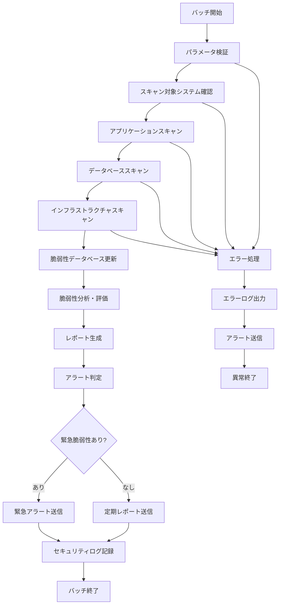

# バッチ定義書：セキュリティスキャンバッチ (BATCH-003)

## 1. 基本情報

| 項目 | 内容 |
|------|------|
| **バッチID** | BATCH-003 |
| **バッチ名** | セキュリティスキャンバッチ |
| **実行スケジュール** | 日次 04:30 |
| **優先度** | 高 |
| **ステータス** | 設計完了 |
| **作成日** | 2025/05/31 |
| **最終更新日** | 2025/05/31 |

## 2. バッチ概要

### 2.1 概要・目的
システム全体のセキュリティ脆弱性を定期的にスキャンし、潜在的なセキュリティリスクを早期発見・対処するバッチです。アプリケーション、データベース、インフラストラクチャの各層でセキュリティチェックを実行し、脅威の検出とアラート通知を行います。

### 2.2 関連テーブル
- [TBL-027_セキュリティログ](../database/tables/テーブル定義書_TBL-027.md)
- [TBL-028_脆弱性情報](../database/tables/テーブル定義書_TBL-028.md)
- [TBL-029_セキュリティ設定](../database/tables/テーブル定義書_TBL-029.md)
- [TBL-001_テナント管理](../database/tables/テーブル定義書_TBL-001.md)

### 2.3 関連API
- [API-301_セキュリティ状態取得API](../api/specs/API定義書_API-301.md)
- [API-302_脆弱性レポートAPI](../api/specs/API定義書_API-302.md)

## 3. 実行仕様

### 3.1 実行スケジュール
| 項目 | 設定値 | 備考 |
|------|--------|------|
| 実行頻度 | 日次 | cron: 30 4 * * * |
| 実行時間 | 04:30 | 深夜バッチ |
| タイムアウト | 120分 | 最大実行時間 |
| リトライ回数 | 2回 | 失敗時の再実行 |

### 3.2 実行条件
| 条件 | 内容 | 備考 |
|------|------|------|
| 前提条件 | システム稼働中 | 全サービス正常稼働 |
| 実行可能時間 | 04:00-07:00 | メンテナンス時間帯 |
| 排他制御 | 同一バッチの重複実行禁止 | ロックファイル使用 |

### 3.3 実行パラメータ
| パラメータ名 | データ型 | 必須 | デフォルト値 | 説明 |
|--------------|----------|------|--------------|------|
| scan_type | string | × | full | スキャン種別（full/quick/custom） |
| target_tenants | array | × | all | 対象テナントID配列 |
| severity_threshold | string | × | medium | 報告する脆弱性の最低レベル |
| dry_run | boolean | × | false | テスト実行フラグ |

## 4. 処理仕様

### 4.1 処理フロー


### 4.2 詳細処理

#### 4.2.1 アプリケーションセキュリティスキャン
```typescript
interface SecurityScanResult {
  scanId: string;
  scanType: 'application' | 'database' | 'infrastructure';
  target: string;
  vulnerabilities: Vulnerability[];
  scanDuration: number;
  completedAt: Date;
}

interface Vulnerability {
  id: string;
  type: string;
  severity: 'critical' | 'high' | 'medium' | 'low';
  title: string;
  description: string;
  affectedComponent: string;
  cveId?: string;
  cvssScore?: number;
  remediation: string;
  detectedAt: Date;
}

class ApplicationSecurityScanner {
  async scanApplication(): Promise<SecurityScanResult> {
    const scanId = generateScanId();
    const startTime = new Date();
    const vulnerabilities: Vulnerability[] = [];

    // 1. 依存関係の脆弱性スキャン
    const dependencyVulns = await this.scanDependencies();
    vulnerabilities.push(...dependencyVulns);

    // 2. コード静的解析
    const codeVulns = await this.performStaticAnalysis();
    vulnerabilities.push(...codeVulns);

    // 3. 設定ファイルセキュリティチェック
    const configVulns = await this.scanConfigurations();
    vulnerabilities.push(...configVulns);

    // 4. API セキュリティスキャン
    const apiVulns = await this.scanApiEndpoints();
    vulnerabilities.push(...apiVulns);

    // 5. 認証・認可チェック
    const authVulns = await this.scanAuthentication();
    vulnerabilities.push(...authVulns);

    return {
      scanId,
      scanType: 'application',
      target: 'skill-report-web',
      vulnerabilities,
      scanDuration: Date.now() - startTime.getTime(),
      completedAt: new Date()
    };
  }

  private async scanDependencies(): Promise<Vulnerability[]> {
    const vulnerabilities: Vulnerability[] = [];
    
    // package.json の依存関係をチェック
    const packageJson = await this.readPackageJson();
    const dependencies = { ...packageJson.dependencies, ...packageJson.devDependencies };

    for (const [packageName, version] of Object.entries(dependencies)) {
      const vulns = await this.checkPackageVulnerabilities(packageName, version as string);
      vulnerabilities.push(...vulns);
    }

    return vulnerabilities;
  }

  private async performStaticAnalysis(): Promise<Vulnerability[]> {
    const vulnerabilities: Vulnerability[] = [];

    // ESLint セキュリティルールでのスキャン
    const eslintResults = await this.runESLintSecurity();
    vulnerabilities.push(...this.parseESLintResults(eslintResults));

    // Semgrep でのセキュリティパターンマッチング
    const semgrepResults = await this.runSemgrep();
    vulnerabilities.push(...this.parseSemgrepResults(semgrepResults));

    // カスタムセキュリティルールチェック
    const customResults = await this.runCustomSecurityChecks();
    vulnerabilities.push(...customResults);

    return vulnerabilities;
  }

  private async scanConfigurations(): Promise<Vulnerability[]> {
    const vulnerabilities: Vulnerability[] = [];

    // 環境変数の機密情報チェック
    const envVulns = await this.checkEnvironmentVariables();
    vulnerabilities.push(...envVulns);

    // Next.js 設定のセキュリティチェック
    const nextConfigVulns = await this.checkNextJsConfig();
    vulnerabilities.push(...nextConfigVulns);

    // Docker 設定のセキュリティチェック
    const dockerVulns = await this.checkDockerConfig();
    vulnerabilities.push(...dockerVulns);

    return vulnerabilities;
  }

  private async scanApiEndpoints(): Promise<Vulnerability[]> {
    const vulnerabilities: Vulnerability[] = [];

    // API エンドポイントの列挙
    const endpoints = await this.discoverApiEndpoints();

    for (const endpoint of endpoints) {
      // OWASP Top 10 チェック
      const owaspVulns = await this.checkOwaspTop10(endpoint);
      vulnerabilities.push(...owaspVulns);

      // 認証バイパステスト
      const authBypassVulns = await this.testAuthenticationBypass(endpoint);
      vulnerabilities.push(...authBypassVulns);

      // SQLインジェクションテスト
      const sqlInjectionVulns = await this.testSqlInjection(endpoint);
      vulnerabilities.push(...sqlInjectionVulns);

      // XSS テスト
      const xssVulns = await this.testXss(endpoint);
      vulnerabilities.push(...xssVulns);
    }

    return vulnerabilities;
  }

  private async scanAuthentication(): Promise<Vulnerability[]> {
    const vulnerabilities: Vulnerability[] = [];

    // JWT トークンセキュリティチェック
    const jwtVulns = await this.checkJwtSecurity();
    vulnerabilities.push(...jwtVulns);

    // セッション管理チェック
    const sessionVulns = await this.checkSessionManagement();
    vulnerabilities.push(...sessionVulns);

    // パスワードポリシーチェック
    const passwordVulns = await this.checkPasswordPolicy();
    vulnerabilities.push(...passwordVulns);

    // 多要素認証設定チェック
    const mfaVulns = await this.checkMfaConfiguration();
    vulnerabilities.push(...mfaVulns);

    return vulnerabilities;
  }
}
```

#### 4.2.2 データベースセキュリティスキャン
```typescript
class DatabaseSecurityScanner {
  async scanDatabase(): Promise<SecurityScanResult> {
    const scanId = generateScanId();
    const startTime = new Date();
    const vulnerabilities: Vulnerability[] = [];

    // 1. データベース設定チェック
    const configVulns = await this.scanDatabaseConfiguration();
    vulnerabilities.push(...configVulns);

    // 2. アクセス権限チェック
    const permissionVulns = await this.scanDatabasePermissions();
    vulnerabilities.push(...permissionVulns);

    // 3. 暗号化状態チェック
    const encryptionVulns = await this.scanDataEncryption();
    vulnerabilities.push(...encryptionVulns);

    // 4. SQLインジェクション脆弱性チェック
    const sqlVulns = await this.scanSqlInjectionVulnerabilities();
    vulnerabilities.push(...sqlVulns);

    // 5. データベースバージョン・パッチレベルチェック
    const versionVulns = await this.scanDatabaseVersion();
    vulnerabilities.push(...versionVulns);

    return {
      scanId,
      scanType: 'database',
      target: 'PostgreSQL',
      vulnerabilities,
      scanDuration: Date.now() - startTime.getTime(),
      completedAt: new Date()
    };
  }

  private async scanDatabaseConfiguration(): Promise<Vulnerability[]> {
    const vulnerabilities: Vulnerability[] = [];

    // SSL/TLS 設定チェック
    const sslConfig = await this.checkSslConfiguration();
    if (!sslConfig.enabled) {
      vulnerabilities.push({
        id: generateVulnId(),
        type: 'configuration',
        severity: 'high',
        title: 'データベース接続でSSL/TLSが無効',
        description: 'データベース接続でSSL/TLSが有効になっていません',
        affectedComponent: 'database-connection',
        remediation: 'SSL/TLS接続を有効にしてください',
        detectedAt: new Date()
      });
    }

    // ログ設定チェック
    const logConfig = await this.checkLogConfiguration();
    if (!logConfig.auditEnabled) {
      vulnerabilities.push({
        id: generateVulnId(),
        type: 'configuration',
        severity: 'medium',
        title: '監査ログが無効',
        description: 'データベースの監査ログが有効になっていません',
        affectedComponent: 'database-logging',
        remediation: '監査ログを有効にしてください',
        detectedAt: new Date()
      });
    }

    return vulnerabilities;
  }

  private async scanDatabasePermissions(): Promise<Vulnerability[]> {
    const vulnerabilities: Vulnerability[] = [];

    // 過剰な権限チェック
    const users = await this.getDatabaseUsers();
    for (const user of users) {
      const permissions = await this.getUserPermissions(user.username);
      
      if (permissions.includes('SUPERUSER') && user.username !== 'postgres') {
        vulnerabilities.push({
          id: generateVulnId(),
          type: 'privilege-escalation',
          severity: 'critical',
          title: `ユーザー ${user.username} に過剰な権限`,
          description: 'アプリケーションユーザーにSUPERUSER権限が付与されています',
          affectedComponent: `database-user-${user.username}`,
          remediation: '最小権限の原則に従って権限を見直してください',
          detectedAt: new Date()
        });
      }
    }

    return vulnerabilities;
  }

  private async scanDataEncryption(): Promise<Vulnerability[]> {
    const vulnerabilities: Vulnerability[] = [];

    // 暗号化されていない機密データの検出
    const sensitiveColumns = await this.findSensitiveColumns();
    for (const column of sensitiveColumns) {
      const isEncrypted = await this.checkColumnEncryption(column);
      if (!isEncrypted) {
        vulnerabilities.push({
          id: generateVulnId(),
          type: 'data-exposure',
          severity: 'high',
          title: `機密データが暗号化されていません: ${column.table}.${column.name}`,
          description: '個人情報や機密データが平文で保存されています',
          affectedComponent: `table-${column.table}`,
          remediation: 'データベースレベルまたはアプリケーションレベルで暗号化を実装してください',
          detectedAt: new Date()
        });
      }
    }

    return vulnerabilities;
  }
}
```

#### 4.2.3 インフラストラクチャセキュリティスキャン
```typescript
class InfrastructureSecurityScanner {
  async scanInfrastructure(): Promise<SecurityScanResult> {
    const scanId = generateScanId();
    const startTime = new Date();
    const vulnerabilities: Vulnerability[] = [];

    // 1. ネットワークセキュリティスキャン
    const networkVulns = await this.scanNetworkSecurity();
    vulnerabilities.push(...networkVulns);

    // 2. クラウドセキュリティ設定チェック
    const cloudVulns = await this.scanCloudSecurity();
    vulnerabilities.push(...cloudVulns);

    // 3. コンテナセキュリティスキャン
    const containerVulns = await this.scanContainerSecurity();
    vulnerabilities.push(...containerVulns);

    // 4. 証明書・暗号化チェック
    const certVulns = await this.scanCertificates();
    vulnerabilities.push(...certVulns);

    return {
      scanId,
      scanType: 'infrastructure',
      target: 'vercel-infrastructure',
      vulnerabilities,
      scanDuration: Date.now() - startTime.getTime(),
      completedAt: new Date()
    };
  }

  private async scanNetworkSecurity(): Promise<Vulnerability[]> {
    const vulnerabilities: Vulnerability[] = [];

    // ポートスキャン
    const openPorts = await this.scanOpenPorts();
    for (const port of openPorts) {
      if (this.isUnnecessaryPort(port)) {
        vulnerabilities.push({
          id: generateVulnId(),
          type: 'network-exposure',
          severity: 'medium',
          title: `不要なポートが開放されています: ${port.number}`,
          description: `ポート ${port.number} (${port.service}) が不要に開放されています`,
          affectedComponent: 'network-firewall',
          remediation: '不要なポートを閉じるか、適切なファイアウォールルールを設定してください',
          detectedAt: new Date()
        });
      }
    }

    // SSL/TLS 設定チェック
    const sslConfig = await this.checkSslConfiguration();
    if (sslConfig.weakCiphers.length > 0) {
      vulnerabilities.push({
        id: generateVulnId(),
        type: 'weak-cryptography',
        severity: 'high',
        title: '弱い暗号化アルゴリズムが使用されています',
        description: `弱い暗号化アルゴリズムが検出されました: ${sslConfig.weakCiphers.join(', ')}`,
        affectedComponent: 'ssl-configuration',
        remediation: '強力な暗号化アルゴリズムのみを使用するよう設定してください',
        detectedAt: new Date()
      });
    }

    return vulnerabilities;
  }

  private async scanCloudSecurity(): Promise<Vulnerability[]> {
    const vulnerabilities: Vulnerability[] = [];

    // Vercel セキュリティ設定チェック
    const vercelConfig = await this.checkVercelSecurity();
    
    if (!vercelConfig.httpsRedirect) {
      vulnerabilities.push({
        id: generateVulnId(),
        type: 'configuration',
        severity: 'medium',
        title: 'HTTPS リダイレクトが無効',
        description: 'HTTP から HTTPS への自動リダイレクトが設定されていません',
        affectedComponent: 'vercel-configuration',
        remediation: 'Vercel の設定で HTTPS リダイレクトを有効にしてください',
        detectedAt: new Date()
      });
    }

    // 環境変数の機密情報チェック
    const envVars = await this.checkEnvironmentVariables();
    for (const envVar of envVars) {
      if (this.containsSensitiveData(envVar.value) && !envVar.encrypted) {
        vulnerabilities.push({
          id: generateVulnId(),
          type: 'data-exposure',
          severity: 'high',
          title: `環境変数に機密情報が平文で保存: ${envVar.name}`,
          description: '機密情報が暗号化されずに環境変数に保存されています',
          affectedComponent: 'environment-variables',
          remediation: '機密情報は暗号化して保存するか、専用のシークレット管理サービスを使用してください',
          detectedAt: new Date()
        });
      }
    }

    return vulnerabilities;
  }
}
```

#### 4.2.4 脆弱性分析・評価処理
```typescript
class VulnerabilityAnalyzer {
  async analyzeVulnerabilities(scanResults: SecurityScanResult[]): Promise<VulnerabilityAnalysisResult> {
    const allVulnerabilities = scanResults.flatMap(result => result.vulnerabilities);
    
    // 重複排除
    const uniqueVulnerabilities = this.deduplicateVulnerabilities(allVulnerabilities);
    
    // 重要度別分類
    const severityDistribution = this.categorizeBySeverity(uniqueVulnerabilities);
    
    // リスクスコア計算
    const riskScore = this.calculateRiskScore(uniqueVulnerabilities);
    
    // 修復優先度決定
    const prioritizedVulnerabilities = this.prioritizeRemediation(uniqueVulnerabilities);
    
    // トレンド分析
    const trendAnalysis = await this.analyzeTrends(uniqueVulnerabilities);
    
    return {
      totalVulnerabilities: uniqueVulnerabilities.length,
      severityDistribution,
      riskScore,
      prioritizedVulnerabilities,
      trendAnalysis,
      recommendations: this.generateRecommendations(uniqueVulnerabilities),
      analyzedAt: new Date()
    };
  }

  private calculateRiskScore(vulnerabilities: Vulnerability[]): number {
    const weights = {
      critical: 10,
      high: 7,
      medium: 4,
      low: 1
    };

    const totalScore = vulnerabilities.reduce((score, vuln) => {
      return score + weights[vuln.severity];
    }, 0);

    // 0-100 のスケールに正規化
    const maxPossibleScore = vulnerabilities.length * weights.critical;
    return maxPossibleScore > 0 ? Math.round((totalScore / maxPossibleScore) * 100) : 0;
  }

  private prioritizeRemediation(vulnerabilities: Vulnerability[]): Vulnerability[] {
    return vulnerabilities.sort((a, b) => {
      // 重要度による優先順位
      const severityOrder = { critical: 4, high: 3, medium: 2, low: 1 };
      const severityDiff = severityOrder[b.severity] - severityOrder[a.severity];
      
      if (severityDiff !== 0) return severityDiff;
      
      // CVSS スコアによる優先順位
      const cvssA = a.cvssScore || 0;
      const cvssB = b.cvssScore || 0;
      
      return cvssB - cvssA;
    });
  }

  private generateRecommendations(vulnerabilities: Vulnerability[]): string[] {
    const recommendations: string[] = [];
    
    const criticalCount = vulnerabilities.filter(v => v.severity === 'critical').length;
    const highCount = vulnerabilities.filter(v => v.severity === 'high').length;
    
    if (criticalCount > 0) {
      recommendations.push(`緊急: ${criticalCount}件のクリティカルな脆弱性を即座に修復してください`);
    }
    
    if (highCount > 5) {
      recommendations.push(`高優先度の脆弱性が多数検出されています。セキュリティレビューの実施を推奨します`);
    }
    
    // 脆弱性タイプ別の推奨事項
    const vulnTypes = vulnerabilities.map(v => v.type);
    const typeFrequency = vulnTypes.reduce((acc, type) => {
      acc[type] = (acc[type] || 0) + 1;
      return acc;
    }, {} as Record<string, number>);
    
    if (typeFrequency['configuration'] > 3) {
      recommendations.push('設定関連の脆弱性が多数検出されています。セキュリティ設定の見直しを行ってください');
    }
    
    if (typeFrequency['data-exposure'] > 0) {
      recommendations.push('データ漏洩リスクが検出されています。データ暗号化とアクセス制御の強化を検討してください');
    }
    
    return recommendations;
  }
}
```

## 5. データ仕様

### 5.1 入力データ
| データ名 | 形式 | 取得元 | 説明 |
|----------|------|--------|------|
| アプリケーションコード | ファイル | Git Repository | スキャン対象のソースコード |
| 設定ファイル | JSON/YAML | 各種設定ファイル | システム設定情報 |
| データベーススキーマ | SQL | PostgreSQL | データベース構造情報 |
| インフラ設定 | API | Vercel/AWS | クラウドインフラ設定 |

### 5.2 出力データ
| データ名 | 形式 | 出力先 | 説明 |
|----------|------|--------|------|
| 脆弱性レポート | JSON/PDF | security_reports/ | 検出された脆弱性の詳細 |
| セキュリティログ | LOG | security_logs/ | スキャン実行ログ |
| アラート通知 | メール/Slack | 通知システム | 緊急脆弱性の通知 |
| ダッシュボードデータ | JSON | DB | セキュリティ状況の可視化データ |

### 5.3 データ量見積もり
| 項目 | 件数 | 備考 |
|------|------|------|
| スキャン対象ファイル数 | 1,000ファイル | アプリケーションコード |
| 検出脆弱性数 | 50件/日 | 平均値 |
| 生成レポートサイズ | 5MB | PDF形式 |
| 処理時間 | 90分 | 平均実行時間 |

## 6. エラーハンドリング

### 6.1 エラー分類
| エラー種別 | 対応方法 | 通知要否 | 備考 |
|------------|----------|----------|------|
| スキャンツールエラー | リトライ・代替ツール使用 | ○ | 重要エラー |
| ネットワークエラー | 接続リトライ | △ | 一時的エラー |
| 権限エラー | 設定確認・手動対応 | ○ | 設定エラー |

### 6.2 リトライ仕様
| 条件 | リトライ回数 | 間隔 | 備考 |
|------|--------------|------|------|
| ネットワークエラー | 3回 | 5分 | 指数バックオフ |
| API呼び出しエラー | 2回 | 2分 | 固定間隔 |
| ツール実行エラー | 1回 | 10分 | 手動確認推奨 |

## 7. 監視・運用

### 7.1 監視項目
| 監視項目 | 閾値 | アラート条件 | 対応方法 |
|----------|------|--------------|----------|
| 実行時間 | 120分 | 超過時 | 処理見直し |
| クリティカル脆弱性数 | 1件 | 検出時 | 即座に対応 |
| スキャン失敗率 | 10% | 超過時 | 原因調査 |

### 7.2 ログ出力
| ログ種別 | 出力レベル | 出力内容 | 保存期間 |
|----------|------------|----------|----------|
| 実行ログ | INFO | スキャン開始・終了・進捗 | 3ヶ月 |
| 脆弱性ログ | WARN | 検出された脆弱性詳細 | 1年 |
| エラーログ | ERROR | スキャンエラー・例外 | 1年 |

### 7.3 アラート通知
| 通知条件 | 通知先 | 通知方法 | 備考 |
|----------|--------|----------|------|
| クリティカル脆弱性検出 | セキュリティチーム | メール・Slack | 即座に通知 |
| 高リスク脆弱性多数検出 | 開発チーム | Slack | 業務時間内 |
| スキャン失敗 | 運用チーム | メール | 翌営業日まで |

## 8. 非機能要件

### 8.1 パフォーマンス
- 処理時間：120分以内
- メモリ使用量：4GB以内
- CPU使用率：70%以内

### 8.2 可用性
- 成功率：95%以上
- 障害時の手動実行機能
- スキャンツール冗長化

### 8.3 セキュリティ
- スキャン結果の暗号化保存
- アクセスログの記録
- 機密情報の適切な取り扱い

## 9. テスト仕様

### 9.1 単体テスト
| テストケース | 入力条件 | 期待結果 |
|--------------|----------|----------|
| 正常スキャン | 正常なシステム状態 | 脆弱性レポート生成 |
| 脆弱性検出 | 既知の脆弱性あり | 脆弱性検出・アラート |
| スキャン対象なし | 対象システム停止 | 正常終了（処理件数0） |

### 9.2 異常系テスト
| テストケース | 入力条件 | 期待結果 |
|--------------|----------|----------|
| スキャンツールエラー | ツール実行失敗 | エラーログ・リトライ |
| ネットワークエラー | 接続不可 | 接続リトライ・アラート |
| 権限不足エラー | アクセス権限なし | エラーログ・手動対応要求 |

## 10. 実装メモ

### 10.1 技術仕様
- 言語：Node.js
- フレームワーク：Express.js
- セキュリティツール：ESLint Security, Semgrep, OWASP ZAP
- DB接続：Prisma
- 脆弱性DB：National Vulnerability Database (NVD)

### 10.2 注意事項
- スキャン実行時のシステム負荷に注意
- 機密情報の適切な取り扱い
- 脆弱性情報の機密性保持
- 緊急脆弱性の迅速な対応体制

### 10.3 デプロイ・実行環境
- 実行サーバー：セキュリティスキャンサーバー
- 実行ユーザー：security_scanner
- 実行ディレクトリ：/opt/security/
- 設定ファイル：/etc/security/scanner-config.json

---

**改訂履歴**

| バージョン | 日付 | 変更者 | 変更内容 |
|------------|------|--------|----------|
| 1.0 | 2025/05/31 | システムアーキテクト | 初版作成 |
