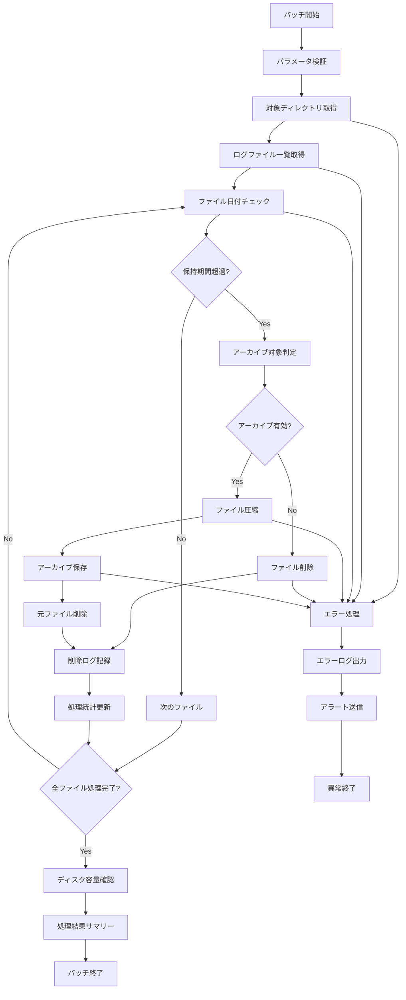

# バッチ定義書：ログクリーンアップバッチ (BATCH-003)

## 1. 基本情報

| 項目 | 内容 |
|------|------|
| **バッチID** | BATCH-003 |
| **バッチ名** | ログクリーンアップバッチ |
| **実行スケジュール** | 日次（03:00） |
| **優先度** | 中 |
| **ステータス** | 実装済み |
| **作成日** | 2025/05/31 |
| **最終更新日** | 2025/05/31 |

## 2. バッチ概要

### 2.1 概要・目的
システム内に蓄積された古いログファイルを定期的に削除・アーカイブし、ディスク容量を適切に管理する。

### 2.2 関連テーブル
- TBL-033_ログ管理
- TBL-034_アーカイブ履歴
- TBL-035_ディスク使用量

### 2.3 関連API
- API-303_ログ管理API
- API-304_アーカイブAPI

## 3. 実行仕様

### 3.1 実行スケジュール
| 項目 | 設定値 | 備考 |
|------|--------|------|
| 実行頻度 | 0 3 * * * | cron形式（毎日03:00） |
| 実行時間 | 03:00 | 深夜バッチ |
| タイムアウト | 120分 | 最大実行時間 |
| リトライ回数 | 2回 | 失敗時の再実行 |

### 3.2 実行条件
| 条件 | 内容 | 備考 |
|------|------|------|
| 前提条件 | システム稼働中 | 基本的な稼働状態 |
| 実行可能時間 | 02:00-05:00 | メンテナンス時間 |
| 排他制御 | 同一バッチの重複実行禁止 | ロックファイル使用 |

### 3.3 実行パラメータ
| パラメータ名 | データ型 | 必須 | デフォルト値 | 説明 |
|--------------|----------|------|--------------|------|
| retention_days | number | × | 30 | ログ保持日数 |
| archive_enabled | boolean | × | true | アーカイブ実行フラグ |
| compression_level | number | × | 6 | 圧縮レベル（1-9） |
| target_directories | array | × | ["/logs"] | 対象ディレクトリ |

## 4. 処理仕様

### 4.1 処理フロー

### 4.2 詳細処理
1. **初期化処理**
   - パラメータ検証
   - 対象ディレクトリ存在確認
   - 排他制御ロック取得

2. **ログファイル検索**
   - 対象ディレクトリ内のログファイル一覧取得
   - ファイル作成日時・サイズ情報取得
   - 保持期間超過ファイルの特定

3. **アーカイブ処理**
   - ファイル圧縮（gzip形式）
   - アーカイブディレクトリへ移動
   - アーカイブ履歴記録

4. **削除処理**
   - 古いファイルの削除
   - 削除履歴記録
   - ディスク容量解放確認

5. **統計情報更新**
   - 処理件数・削除容量集計
   - ディスク使用量更新
   - 処理結果レポート生成

## 5. データ仕様

### 5.1 入力データ
| データ名 | 形式 | 取得元 | 説明 |
|----------|------|--------|------|
| ログファイル | FILE | /logs/* | 各種システムログ |
| 設定情報 | JSON | /config/log-cleanup.json | 保持期間・対象ディレクトリ設定 |

### 5.2 出力データ
| データ名 | 形式 | 出力先 | 説明 |
|----------|------|--------|------|
| アーカイブファイル | GZ | /archive/logs/ | 圧縮済みログファイル |
| 処理履歴 | DB | TBL-034 | アーカイブ・削除履歴 |
| 実行ログ | LOG | /logs/batch/ | バッチ実行ログ |
| 処理レポート | JSON | /reports/ | 処理結果サマリー |

### 5.3 データ量見積もり
| 項目 | 件数 | 備考 |
|------|------|------|
| 処理対象ファイル数 | 100-500件/日 | ログファイル数 |
| 削除容量 | 1-10GB/日 | 平均削除容量 |
| 処理時間 | 30-90分 | ファイル数・容量による |

## 6. エラーハンドリング

### 6.1 エラー分類
| エラー種別 | 対応方法 | 通知要否 | 備考 |
|------------|----------|----------|------|
| ディスクI/Oエラー | 処理中断・アラート | ○ | ディスク障害等 |
| 権限エラー | エラーログ出力・継続 | △ | ファイルアクセス権限不足 |
| 圧縮エラー | エラーログ出力・継続 | △ | ファイル破損等 |

### 6.2 リトライ仕様
| 条件 | リトライ回数 | 間隔 | 備考 |
|------|--------------|------|------|
| ディスクI/Oエラー | 3回 | 30秒 | 指数バックオフ |
| ファイルロックエラー | 5回 | 10秒 | 固定間隔 |
| 圧縮処理エラー | 1回 | 5秒 | 即座にリトライ |

### 6.3 異常終了時の処理
1. 処理中断
2. 一時ファイル削除
3. エラーログ出力
4. ディスク容量確認
5. 排他制御ロック解除

## 7. 監視・運用

### 7.1 監視項目
| 監視項目 | 閾値 | アラート条件 | 対応方法 |
|----------|------|--------------|----------|
| 処理時間 | 120分 | 超過時 | 処理対象見直し |
| エラー率 | 10% | 超過時 | ファイルシステム確認 |
| ディスク容量削減率 | 期待値の50%以下 | 乖離時 | 設定見直し |
| アーカイブ失敗率 | 5% | 超過時 | アーカイブ領域確認 |

### 7.2 ログ出力
| ログ種別 | 出力レベル | 出力内容 | 保存期間 |
|----------|------------|----------|----------|
| 実行ログ | INFO | 処理開始・終了・進捗・統計 | 3ヶ月 |
| エラーログ | ERROR | エラー詳細・ファイルパス | 1年 |
| デバッグログ | DEBUG | 詳細処理内容・ファイル一覧 | 1週間 |

### 7.3 アラート通知
| 通知条件 | 通知先 | 通知方法 | 備考 |
|----------|--------|----------|------|
| 異常終了 | 運用チーム | メール・Slack | 即座に通知 |
| ディスク容量不足 | インフラチーム | Slack | 業務時間内のみ |
| 大量エラー発生 | 開発チーム | メール | 翌営業日まで |

## 8. 非機能要件

### 8.1 パフォーマンス
- 処理時間：120分以内
- メモリ使用量：1GB以内
- CPU使用率：50%以内

### 8.2 可用性
- 成功率：95%以上
- リトライ機能による自動復旧
- 部分的な処理継続機能

### 8.3 セキュリティ
- ファイルアクセス権限の制限
- アーカイブファイルの暗号化
- 削除ログの改ざん防止

## 9. テスト仕様

### 9.1 単体テスト
| テストケース | 入力条件 | 期待結果 |
|--------------|----------|----------|
| 正常処理 | 保持期間超過ファイル存在 | 正常終了・ファイル削除 |
| ファイルなし | 対象ファイル0件 | 正常終了（処理件数0） |
| 大量ファイル | 1000件のログファイル | 正常終了・適切な処理時間 |

### 9.2 異常系テスト
| テストケース | 入力条件 | 期待結果 |
|--------------|----------|----------|
| ディスク容量不足 | アーカイブ領域不足 | エラーログ出力・アラート |
| 権限不足 | ファイル削除権限なし | エラーログ出力・継続処理 |
| ファイル破損 | 破損ログファイル | エラーログ出力・スキップ |

## 10. 実装メモ

### 10.1 技術仕様
- 言語：Node.js
- ファイル操作：fs-extra
- 圧縮：zlib, tar
- 並列処理：worker_threads

### 10.2 注意事項
- 大量ファイル処理時のメモリ管理
- 圧縮処理中のCPU負荷制御
- アーカイブ領域の容量監視

### 10.3 デプロイ・実行環境
- 実行サーバー：ログサーバー
- 実行ユーザー：log_cleanup_user
- 実行ディレクトリ：/opt/batch/log-cleanup/
- 設定ファイル：/etc/batch/log-cleanup.json

---

**改訂履歴**

| バージョン | 日付 | 変更者 | 変更内容 |
|------------|------|--------|----------|
| 1.0 | 2025/05/31 | システムアーキテクト | 初版作成 |
