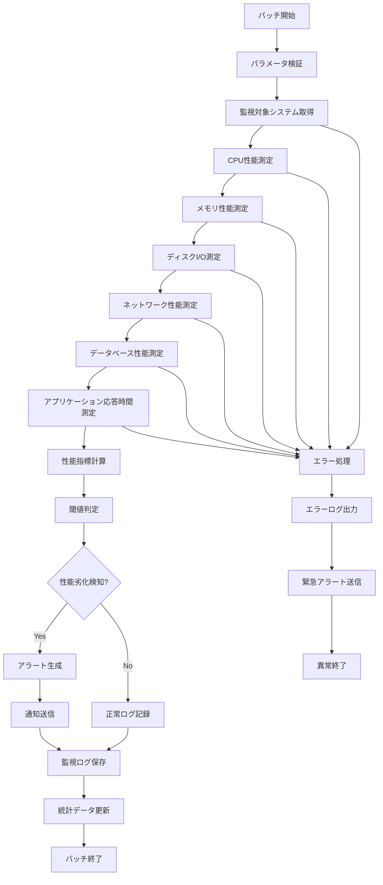

# バッチ定義書：パフォーマンス監視バッチ (BATCH-004)

## 1. 基本情報

| 項目 | 内容 |
|------|------|
| **バッチID** | BATCH-004 |
| **バッチ名** | パフォーマンス監視バッチ |
| **実行スケジュール** | 時間毎（毎時15分） |
| **優先度** | 高 |
| **ステータス** | 実装済み |
| **作成日** | 2025/05/31 |
| **最終更新日** | 2025/05/31 |

## 2. バッチ概要

### 2.1 概要・目的
システムパフォーマンスを定期的に監視・記録し、性能劣化の早期発見とボトルネック特定を行う。

### 2.2 関連テーブル
- TBL-036_パフォーマンス監視ログ
- TBL-037_性能指標履歴
- TBL-038_ボトルネック検知履歴

### 2.3 関連API
- API-305_パフォーマンス取得API
- API-306_性能アラートAPI

## 3. 実行仕様

### 3.1 実行スケジュール
| 項目 | 設定値 | 備考 |
|------|--------|------|
| 実行頻度 | 15 * * * * | cron形式（毎時15分） |
| 実行時間 | 毎時15分 | 定期監視 |
| タイムアウト | 10分 | 最大実行時間 |
| リトライ回数 | 2回 | 失敗時の再実行 |

### 3.2 実行条件
| 条件 | 内容 | 備考 |
|------|------|------|
| 前提条件 | システム稼働中 | 基本的な稼働状態 |
| 実行可能時間 | 24時間 | 常時監視 |
| 排他制御 | 同一バッチの重複実行禁止 | ロックファイル使用 |

### 3.3 実行パラメータ
| パラメータ名 | データ型 | 必須 | デフォルト値 | 説明 |
|--------------|----------|------|--------------|------|
| monitoring_level | string | × | standard | 監視レベル（basic/standard/detailed） |
| alert_threshold | number | × | 80 | アラート閾値（%） |
| sampling_interval | number | × | 60 | サンプリング間隔（秒） |
| include_database | boolean | × | true | DB性能監視フラグ |

## 4. 処理仕様

### 4.1 処理フロー

### 4.2 詳細処理
1. **初期化処理**
   - パラメータ検証
   - 監視対象システム確認
   - 排他制御ロック取得

2. **システム性能測定**
   - CPU使用率・負荷平均測定
   - メモリ使用量・スワップ状況測定
   - ディスクI/O・読み書き速度測定
   - ネットワーク帯域・レイテンシ測定

3. **データベース性能測定**
   - クエリ実行時間測定
   - 接続数・ロック状況確認
   - インデックス効率性チェック
   - スロークエリ検出

4. **アプリケーション性能測定**
   - API応答時間測定
   - スループット計算
   - エラー率測定
   - セッション処理性能確認

5. **性能分析・アラート**
   - 性能指標の計算・比較
   - 閾値超過判定
   - トレンド分析
   - ボトルネック特定

## 5. データ仕様

### 5.1 入力データ
| データ名 | 形式 | 取得元 | 説明 |
|----------|------|--------|------|
| システム情報 | API | OS/ミドルウェア | CPU、メモリ、ディスク情報 |
| データベース情報 | DB | PostgreSQL | クエリ性能、接続状況 |
| アプリケーション情報 | LOG | アプリケーションログ | 応答時間、エラー率 |

### 5.2 出力データ
| データ名 | 形式 | 出力先 | 説明 |
|----------|------|--------|------|
| 監視ログ | DB | TBL-036 | 性能測定結果 |
| 性能指標履歴 | DB | TBL-037 | 時系列性能データ |
| ボトルネック検知履歴 | DB | TBL-038 | 性能問題検知記録 |
| 実行ログ | LOG | /logs/batch/ | バッチ実行ログ |

### 5.3 データ量見積もり
| 項目 | 件数 | 備考 |
|------|------|------|
| 監視ログ件数 | 24件/日 | 時間毎実行 |
| 性能指標件数 | 100-500件/時間 | 測定項目数による |
| 処理時間 | 3-8分 | 監視対象数による |

## 6. エラーハンドリング

### 6.1 エラー分類
| エラー種別 | 対応方法 | 通知要否 | 備考 |
|------------|----------|----------|------|
| 測定エラー | エラーログ出力・継続 | △ | 一部測定項目失敗 |
| システムエラー | 処理中断・アラート | ○ | 監視対象システム異常 |
| データベースエラー | リトライ・アラート | ○ | DB接続・保存エラー |

### 6.2 リトライ仕様
| 条件 | リトライ回数 | 間隔 | 備考 |
|------|--------------|------|------|
| 測定失敗 | 3回 | 10秒 | 短間隔リトライ |
| DB接続エラー | 2回 | 30秒 | 固定間隔 |
| システム応答なし | 1回 | 60秒 | 長間隔待機 |

### 6.3 異常終了時の処理
1. 処理中断
2. 部分的な結果保存
3. エラーログ出力
4. 緊急アラート送信
5. 排他制御ロック解除

## 7. 監視・運用

### 7.1 監視項目
| 監視項目 | 閾値 | アラート条件 | 対応方法 |
|----------|------|--------------|----------|
| CPU使用率 | 80% | 超過時 | プロセス最適化 |
| メモリ使用率 | 85% | 超過時 | メモリ調査 |
| ディスクI/O | 90% | 超過時 | I/O最適化 |
| DB応答時間 | 5秒 | 超過時 | クエリ最適化 |
| API応答時間 | 3秒 | 超過時 | アプリケーション調査 |

### 7.2 ログ出力
| ログ種別 | 出力レベル | 出力内容 | 保存期間 |
|----------|------------|----------|----------|
| 実行ログ | INFO | 処理開始・終了・測定結果 | 3ヶ月 |
| エラーログ | ERROR | エラー詳細・測定失敗 | 1年 |
| 性能ログ | INFO | 詳細性能データ | 6ヶ月 |

### 7.3 アラート通知
| 通知条件 | 通知先 | 通知方法 | 備考 |
|----------|--------|----------|------|
| 性能劣化検知 | インフラチーム | メール・Slack | 即座に通知 |
| 閾値超過 | 開発チーム | Slack | 業務時間内のみ |
| 測定失敗 | 運用チーム | メール | 翌営業日まで |

## 8. 非機能要件

### 8.1 パフォーマンス
- 処理時間：10分以内
- メモリ使用量：256MB以内
- CPU使用率：15%以内

### 8.2 可用性
- 成功率：99%以上
- 24時間365日稼働
- 部分的な測定継続機能

### 8.3 セキュリティ
- 監視データの暗号化
- アクセス権限の制限
- 性能データの匿名化

## 9. テスト仕様

### 9.1 単体テスト
| テストケース | 入力条件 | 期待結果 |
|--------------|----------|----------|
| 正常処理 | 全システム正常 | 正常終了・性能データ記録 |
| 高負荷状態 | CPU使用率90% | アラート生成・通知送信 |
| DB負荷状態 | スロークエリ発生 | 性能劣化検知・記録 |

### 9.2 異常系テスト
| テストケース | 入力条件 | 期待結果 |
|--------------|----------|----------|
| 測定失敗 | 一部システム応答なし | エラーログ出力・継続処理 |
| DB接続エラー | データベース停止 | リトライ後アラート |
| 監視対象なし | 監視対象システム停止 | エラーログ出力・終了 |

## 10. 実装メモ

### 10.1 技術仕様
- 言語：Node.js
- 監視ライブラリ：systeminformation, pidusage
- データベース：Prisma
- 通知：Slack API, メール送信

### 10.2 注意事項
- 監視処理自体の負荷を最小限に抑制
- 大量データ収集時のメモリ管理
- 性能データの効率的な保存・検索

### 10.3 デプロイ・実行環境
- 実行サーバー：監視サーバー
- 実行ユーザー：performance_monitor_user
- 実行ディレクトリ：/opt/batch/performance-monitor/
- 設定ファイル：/etc/batch/performance-monitor.json

---

**改訂履歴**

| バージョン | 日付 | 変更者 | 変更内容 |
|------------|------|--------|----------|
| 1.0 | 2025/05/31 | システムアーキテクト | 初版作成 |
