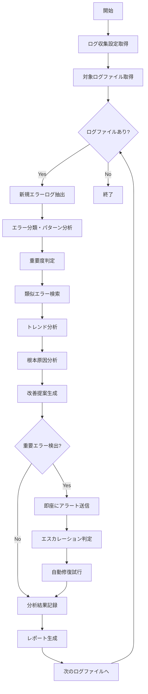

# バッチ定義書：エラーログ分析バッチ

| 項目                | 内容                                                                                |
|---------------------|------------------------------------------------------------------------------------|
| **バッチID**        | BATCH-005                                                                          |
| **バッチ名称**      | エラーログ分析バッチ                                                                |
| **機能カテゴリ**    | 基盤・システム管理                                                                  |
| **概要・目的**      | エラーログを自動分析し、パターン検出・アラート生成・改善提案を行う                  |
| **バッチ種別**      | 定期バッチ                                                                          |
| **実行スケジュール**| 日次（05:00）                                                                       |
| **入出力対象**      | エラーログファイル、分析結果テーブル、アラート通知                                  |
| **優先度**          | 高                                                                                  |
| **備考**            | マルチテナント対応、AI分析、自動分類、トレンド分析                                  |

## 1. 処理概要

エラーログ分析バッチは、マルチテナント環境において各システムコンポーネントで発生するエラーログを自動的に収集・分析し、エラーパターンの検出、重要度判定、トレンド分析を実行するバッチ処理です。機械学習アルゴリズムを活用してエラーの分類・予測を行い、問題の早期発見と改善提案を自動化します。

## 2. 処理フロー



## 3. 入力データ

### 3.1 対象ログファイル

| ログ種別            | ファイルパス                    | 分析対象エラー                 |
|---------------------|--------------------------------|--------------------------------|
| アプリケーションログ | /var/log/app/*.log             | 例外、エラー、警告             |
| システムログ        | /var/log/system/*.log          | システムエラー、クラッシュ     |
| データベースログ    | /var/log/postgresql/*.log      | SQLエラー、接続エラー          |
| Webサーバーログ     | /var/log/nginx/*.log           | HTTP エラー、アクセスエラー    |
| セキュリティログ    | /var/log/security/*.log        | 認証エラー、不正アクセス       |
| バッチ実行ログ      | /var/log/batch/*.log           | バッチエラー、処理失敗         |

### 3.2 分析設定

| 設定項目                | データ型 | デフォルト値 | 説明                                 |
|-------------------------|----------|--------------|--------------------------------------|
| analysis_period_hours   | Integer  | 24           | 分析対象期間（時間）                 |
| error_threshold         | Integer  | 10           | アラート発生エラー数閾値             |
| pattern_similarity      | Float    | 0.8          | パターン類似度閾値                   |
| ml_analysis_enabled     | Boolean  | true         | 機械学習分析有効/無効                |
| auto_categorization     | Boolean  | true         | 自動分類有効/無効                    |
| trend_analysis_days     | Integer  | 7            | トレンド分析期間（日）               |

## 4. 出力データ

### 4.1 エラーログ分析結果テーブル（新規作成）

| フィールド名      | データ型 | 説明                                           |
|-------------------|----------|------------------------------------------------|
| analysis_id       | String   | 分析ID（主キー）                               |
| log_file_path     | String   | ログファイルパス                               |
| error_timestamp   | DateTime | エラー発生日時                                 |
| error_level       | String   | エラーレベル（ERROR/WARN/FATAL/CRITICAL）      |
| error_category    | String   | エラーカテゴリ                                 |
| error_pattern_id  | String   | エラーパターンID                               |
| error_message     | String   | エラーメッセージ                               |
| stack_trace       | String   | スタックトレース                               |
| affected_component| String   | 影響コンポーネント                             |
| severity_score    | Float    | 重要度スコア（0-10）                           |
| frequency_count   | Integer  | 発生頻度                                       |
| tenant_id         | String   | テナントID                                     |
| analyzed_at       | DateTime | 分析実行日時                                   |

### 4.2 エラーパターンテーブル（新規作成）

| フィールド名      | データ型 | 説明                                           |
|-------------------|----------|------------------------------------------------|
| pattern_id        | String   | パターンID（主キー）                           |
| pattern_name      | String   | パターン名                                     |
| pattern_regex     | String   | パターン正規表現                               |
| category          | String   | カテゴリ                                       |
| severity          | String   | 重要度                                         |
| description       | String   | パターン説明                                   |
| solution_template | String   | 解決策テンプレート                             |
| occurrence_count  | Integer  | 発生回数                                       |
| first_seen        | DateTime | 初回検出日時                                   |
| last_seen         | DateTime | 最終検出日時                                   |
| auto_fix_available| Boolean  | 自動修復可能フラグ                             |

### 4.3 エラートレンド分析結果テーブル（新規作成）

| フィールド名      | データ型 | 説明                                           |
|-------------------|----------|------------------------------------------------|
| trend_id          | String   | トレンドID（主キー）                           |
| analysis_date     | Date     | 分析日                                         |
| error_category    | String   | エラーカテゴリ                                 |
| daily_count       | Integer  | 日次エラー数                                   |
| weekly_average    | Float    | 週平均エラー数                                 |
| trend_direction   | String   | トレンド方向（INCREASING/DECREASING/STABLE）   |
| change_percentage | Float    | 変化率（%）                                    |
| prediction_next_week| Integer | 来週予測エラー数                            |
| risk_level        | String   | リスクレベル（LOW/MEDIUM/HIGH/CRITICAL）       |

## 5. 分析仕様

### 5.1 エラーログ抽出・解析

```typescript
class ErrorLogAnalyzer {
  async analyzeErrorLogs(): Promise<ErrorAnalysisResult[]> {
    const results: ErrorAnalysisResult[] = [];
    const logFiles = await this.getLogFiles();
    
    for (const logFile of logFiles) {
      const errors = await this.extractErrors(logFile);
      
      for (const error of errors) {
        const analysis = await this.analyzeError(error);
        results.push(analysis);
      }
    }
    
    return results;
  }
  
  private async extractErrors(logFile: LogFile): Promise<ErrorEntry[]> {
    const content = await fs.readFile(logFile.path, 'utf-8');
    const lines = content.split('\n');
    const errors: ErrorEntry[] = [];
    
    const errorPatterns = [
      /ERROR\s+(.+)/i,
      /FATAL\s+(.+)/i,
      /Exception\s+(.+)/i,
      /\[error\]\s+(.+)/i,
      /HTTP\/\d\.\d"\s+[45]\d{2}/i
    ];
    
    for (let i = 0; i < lines.length; i++) {
      const line = lines[i];
      
      for (const pattern of errorPatterns) {
        const match = line.match(pattern);
        if (match) {
          const error = await this.parseErrorEntry(line, lines, i);
          errors.push(error);
          break;
        }
      }
    }
    
    return errors;
  }
  
  private async analyzeError(error: ErrorEntry): Promise<ErrorAnalysisResult> {
    // パターンマッチング
    const pattern = await this.identifyPattern(error);
    
    // 重要度判定
    const severity = await this.calculateSeverity(error, pattern);
    
    // 類似エラー検索
    const similarErrors = await this.findSimilarErrors(error);
    
    // 根本原因分析
    const rootCause = await this.analyzeRootCause(error, similarErrors);
    
    return {
      errorId: generateId(),
      timestamp: error.timestamp,
      level: error.level,
      category: pattern?.category || 'UNKNOWN',
      patternId: pattern?.id,
      message: error.message,
      stackTrace: error.stackTrace,
      severityScore: severity,
      rootCause,
      recommendedAction: await this.generateRecommendation(error, pattern)
    };
  }
}
```

### 5.2 機械学習による分類・予測

```typescript
class MLErrorClassifier {
  private model: any;
  
  async classifyError(error: ErrorEntry): Promise<ErrorClassification> {
    // 特徴量抽出
    const features = this.extractFeatures(error);
    
    // モデル予測
    const prediction = await this.model.predict(features);
    
    return {
      category: prediction.category,
      severity: prediction.severity,
      confidence: prediction.confidence,
      suggestedActions: prediction.actions
    };
  }
  
  private extractFeatures(error: ErrorEntry): number[] {
    const features: number[] = [];
    
    // メッセージ長
    features.push(error.message.length);
    
    // キーワード頻度
    const keywords = ['null', 'undefined', 'timeout', 'connection', 'permission'];
    for (const keyword of keywords) {
      features.push((error.message.toLowerCase().match(new RegExp(keyword, 'g')) || []).length);
    }
    
    // スタックトレース深度
    features.push(error.stackTrace ? error.stackTrace.split('\n').length : 0);
    
    // 時間帯（0-23）
    features.push(error.timestamp.getHours());
    
    // 曜日（0-6）
    features.push(error.timestamp.getDay());
    
    return features;
  }
  
  async trainModel(trainingData: ErrorEntry[]): Promise<void> {
    const features = trainingData.map(error => this.extractFeatures(error));
    const labels = trainingData.map(error => ({
      category: error.category,
      severity: error.severity
    }));
    
    // モデル訓練（TensorFlow.js等を使用）
    await this.model.fit(features, labels);
  }
}
```

### 5.3 トレンド分析

```typescript
class ErrorTrendAnalyzer {
  async analyzeTrends(): Promise<ErrorTrend[]> {
    const trends: ErrorTrend[] = [];
    const categories = await this.getErrorCategories();
    
    for (const category of categories) {
      const trend = await this.analyzeCategory(category);
      trends.push(trend);
    }
    
    return trends;
  }
  
  private async analyzeCategory(category: string): Promise<ErrorTrend> {
    const dailyCounts = await this.getDailyErrorCounts(category, 30);
    const weeklyAverage = this.calculateWeeklyAverage(dailyCounts);
    const trendDirection = this.calculateTrendDirection(dailyCounts);
    const changePercentage = this.calculateChangePercentage(dailyCounts);
    const prediction = await this.predictNextWeek(dailyCounts);
    
    return {
      category,
      dailyCounts,
      weeklyAverage,
      trendDirection,
      changePercentage,
      prediction,
      riskLevel: this.assessRiskLevel(trendDirection, changePercentage)
    };
  }
  
  private calculateTrendDirection(counts: number[]): 'INCREASING' | 'DECREASING' | 'STABLE' {
    const recent = counts.slice(-7);
    const previous = counts.slice(-14, -7);
    
    const recentAvg = recent.reduce((a, b) => a + b, 0) / recent.length;
    const previousAvg = previous.reduce((a, b) => a + b, 0) / previous.length;
    
    const changeRatio = (recentAvg - previousAvg) / previousAvg;
    
    if (changeRatio > 0.1) return 'INCREASING';
    if (changeRatio < -0.1) return 'DECREASING';
    return 'STABLE';
  }
  
  private async predictNextWeek(historicalData: number[]): Promise<number> {
    // 簡単な線形回帰による予測
    const x = historicalData.map((_, i) => i);
    const y = historicalData;
    
    const n = x.length;
    const sumX = x.reduce((a, b) => a + b, 0);
    const sumY = y.reduce((a, b) => a + b, 0);
    const sumXY = x.reduce((sum, xi, i) => sum + xi * y[i], 0);
    const sumXX = x.reduce((sum, xi) => sum + xi * xi, 0);
    
    const slope = (n * sumXY - sumX * sumY) / (n * sumXX - sumX * sumX);
    const intercept = (sumY - slope * sumX) / n;
    
    // 来週の予測値
    return Math.max(0, Math.round(slope * n + intercept));
  }
}
```

## 6. 自動修復機能

### 6.1 自動修復パターン

```typescript
class AutoFixManager {
  private fixPatterns: AutoFixPattern[] = [
    {
      patternId: 'DISK_SPACE_LOW',
      condition: (error) => error.message.includes('No space left on device'),
      action: async () => await this.cleanupTempFiles(),
      description: 'Clean up temporary files'
    },
    {
      patternId: 'MEMORY_LEAK',
      condition: (error) => error.message.includes('OutOfMemoryError'),
      action: async () => await this.restartService(),
      description: 'Restart affected service'
    },
    {
      patternId: 'DB_CONNECTION_POOL',
      condition: (error) => error.message.includes('connection pool exhausted'),
      action: async () => await this.resetConnectionPool(),
      description: 'Reset database connection pool'
    }
  ];
  
  async attemptAutoFix(error: ErrorAnalysisResult): Promise<AutoFixResult> {
    const applicablePattern = this.fixPatterns.find(pattern => 
      pattern.condition(error)
    );
    
    if (!applicablePattern) {
      return {
        attempted: false,
        reason: 'No applicable auto-fix pattern found'
      };
    }
    
    try {
      await applicablePattern.action();
      
      return {
        attempted: true,
        success: true,
        patternId: applicablePattern.patternId,
        description: applicablePattern.description,
        executedAt: new Date()
      };
    } catch (fixError) {
      return {
        attempted: true,
        success: false,
        patternId: applicablePattern.patternId,
        error: fixError.message,
        executedAt: new Date()
      };
    }
  }
}
```

## 7. アラート・通知

### 7.1 重要度別アラート

```typescript
class ErrorAlertManager {
  async processAlerts(analysisResults: ErrorAnalysisResult[]): Promise<void> {
    const criticalErrors = analysisResults.filter(r => r.severityScore >= 8);
    const highErrors = analysisResults.filter(r => r.severityScore >= 6 && r.severityScore < 8);
    
    // 重要エラーの即座通知
    for (const error of criticalErrors) {
      await this.sendCriticalAlert(error);
    }
    
    // 高重要度エラーのバッチ通知
    if (highErrors.length > 0) {
      await this.sendHighPriorityAlert(highErrors);
    }
    
    // トレンド異常の通知
    const trends = await this.analyzeTrends();
    const anomalies = trends.filter(t => t.riskLevel === 'HIGH' || t.riskLevel === 'CRITICAL');
    
    if (anomalies.length > 0) {
      await this.sendTrendAlert(anomalies);
    }
  }
  
  private async sendCriticalAlert(error: ErrorAnalysisResult): Promise<void> {
    const message = `
🚨 重要エラー検出

エラー: ${error.message}
重要度: ${error.severityScore}/10
発生時刻: ${error.timestamp.toISOString()}
コンポーネント: ${error.affectedComponent}
根本原因: ${error.rootCause}

推奨対応: ${error.recommendedAction}
    `;
    
    await this.notificationService.sendImmediate({
      level: 'CRITICAL',
      title: 'システム重要エラー検出',
      message,
      channels: ['slack', 'email', 'sms']
    });
  }
}
```

## 8. 依存関係

- ログファイルアクセス権限
- 機械学習ライブラリ（TensorFlow.js等）
- 自然言語処理ライブラリ
- 通知サービス
- データベース
- 自動修復スクリプト

## 9. 実行パラメータ

| パラメータ名        | 必須 | デフォルト値 | 説明                                           |
|---------------------|------|--------------|------------------------------------------------|
| --log-type          | No   | all          | 特定ログ種別のみ分析                           |
| --analysis-period   | No   | 24           | 分析対象期間（時間）                           |
| --severity-filter   | No   | all          | 特定重要度以上のみ処理                         |
| --enable-ml         | No   | true         | 機械学習分析有効/無効                          |
| --auto-fix          | No   | false        | 自動修復機能有効/無効                          |
| --trend-analysis    | No   | true         | トレンド分析有効/無効                          |

## 10. 実行例

```bash
# 通常実行
npm run batch:error-log-analysis

# 特定ログ種別のみ
npm run batch:error-log-analysis -- --log-type=application

# 重要エラーのみ
npm run batch:error-log-analysis -- --severity-filter=high

# 自動修復有効
npm run batch:error-log-analysis -- --auto-fix

# TypeScript直接実行
npx tsx src/batch/error-log-analysis.ts
```

## 11. 改訂履歴

| 改訂日     | 改訂者 | 改訂内容                                         |
|------------|--------|--------------------------------------------------|
| 2025/05/31 | 初版   | 初版作成                                         |
