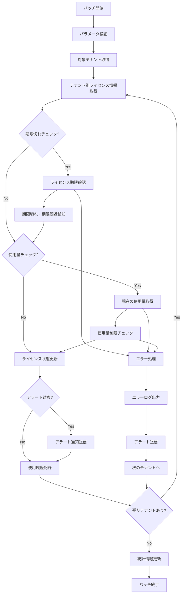

# バッチ定義書：ライセンス管理バッチ (BATCH-005)

## 1. 基本情報

| 項目 | 内容 |
|------|------|
| **バッチID** | BATCH-005 |
| **バッチ名** | ライセンス管理バッチ |
| **実行スケジュール** | 日次（02:30） |
| **優先度** | 中 |
| **ステータス** | 未着手 |
| **作成日** | 2025/05/31 |
| **最終更新日** | 2025/05/31 |

## 2. バッチ概要

### 2.1 概要・目的
各テナントのライセンス使用状況を監視し、期限切れ・使用量超過の検知と通知を行う。

### 2.2 関連テーブル
- TBL-051_ライセンス情報
- TBL-052_ライセンス使用履歴
- TBL-053_ライセンスアラート設定
- TBL-001_テナント情報

### 2.3 関連API
- API-305_ライセンス情報取得API
- API-306_ライセンス使用量更新API

## 3. 実行仕様

### 3.1 実行スケジュール
| 項目 | 設定値 | 備考 |
|------|--------|------|
| 実行頻度 | 30 2 * * * | cron形式（毎日 02:30） |
| 実行時間 | 02:30 | 深夜の低負荷時間帯 |
| タイムアウト | 60分 | 最大実行時間 |
| リトライ回数 | 3回 | 失敗時の再実行 |

### 3.2 実行条件
| 条件 | 内容 | 備考 |
|------|------|------|
| 前提条件 | システム稼働中 | 基本的な稼働状態 |
| 実行可能時間 | 02:00-04:00 | 深夜メンテナンス時間帯 |
| 排他制御 | 同一バッチの重複実行禁止 | ロックファイル使用 |

### 3.3 実行パラメータ
| パラメータ名 | データ型 | 必須 | デフォルト値 | 説明 |
|--------------|----------|------|--------------|------|
| tenant_id | string | × | all | 対象テナントID |
| check_expiry | boolean | × | true | 期限切れチェックフラグ |
| check_usage | boolean | × | true | 使用量チェックフラグ |

## 4. 処理仕様

### 4.1 処理フロー

### 4.2 詳細処理
1. **初期化処理**
   - パラメータ検証
   - 対象テナント一覧取得
   - ログファイル初期化
   - 排他制御ロック取得

2. **ライセンス期限チェック**
   - 各テナントのライセンス期限確認
   - 期限切れライセンスの検知
   - 期限間近（30日以内）ライセンスの検知
   - 自動更新設定の確認

3. **使用量チェック**
   - 現在の使用量（ユーザー数・ストレージ等）取得
   - ライセンス制限との比較
   - 使用量超過・制限間近の検知
   - 使用量推移の分析

4. **ライセンス状態更新**
   - ライセンス状態の更新（有効・期限切れ・停止）
   - 使用量履歴の記録
   - 制限超過時の機能制限適用
   - 自動更新処理の実行

5. **アラート・通知**
   - 期限切れ・使用量超過の通知
   - 管理者・テナント管理者への通知
   - 営業チームへの更新提案通知
   - ダッシュボードでの状態表示更新

## 5. データ仕様

### 5.1 入力データ
| データ名 | 形式 | 取得元 | 説明 |
|----------|------|--------|------|
| ライセンス情報 | DB | TBL-051_ライセンス情報 | 契約・期限・制限情報 |
| テナント情報 | DB | TBL-001_テナント情報 | テナント基本情報 |
| 使用量データ | DB | 各種テーブル | 実際の使用量データ |

### 5.2 出力データ
| データ名 | 形式 | 出力先 | 説明 |
|----------|------|--------|------|
| 使用履歴 | DB | TBL-052_ライセンス使用履歴 | 使用量・状態履歴 |
| アラートログ | LOG | /logs/alerts/ | アラート送信履歴 |
| 実行ログ | LOG | /logs/batch/ | 実行履歴ログ |

### 5.3 データ量見積もり
| 項目 | 件数 | 備考 |
|------|------|------|
| 対象テナント | 100件 | 全テナント |
| ライセンス種別 | 5種類 | Basic・Standard・Premium等 |
| 処理時間 | 30分 | 平均実行時間 |

## 6. エラーハンドリング

### 6.1 エラー分類
| エラー種別 | 対応方法 | 通知要否 | 備考 |
|------------|----------|----------|------|
| ライセンス情報不整合 | エラー記録・継続 | ○ | データ修正要 |
| 使用量取得エラー | リトライ・継続 | △ | 一時的な問題 |
| 通知送信エラー | リトライ・継続 | ○ | 重要な通知 |

### 6.2 リトライ仕様
| 条件 | リトライ回数 | 間隔 | 備考 |
|------|--------------|------|------|
| DB接続エラー | 3回 | 30秒 | 短間隔リトライ |
| 外部API呼び出しエラー | 3回 | 60秒 | 中間隔リトライ |
| 通知送信エラー | 5回 | 10秒 | 短間隔リトライ |

### 6.3 異常終了時の処理
1. 処理中断
2. 部分更新のロールバック
3. エラーログ出力
4. 緊急アラート送信
5. 排他制御ロック解除

## 7. 監視・運用

### 7.1 監視項目
| 監視項目 | 閾値 | アラート条件 | 対応方法 |
|----------|------|--------------|----------|
| 実行時間 | 60分 | 超過時 | 処理見直し・最適化 |
| 期限切れライセンス数 | 5件 | 超過時 | 営業チーム連携 |
| 使用量超過テナント数 | 10件 | 超過時 | 制限・アップグレード提案 |

### 7.2 ログ出力
| ログ種別 | 出力レベル | 出力内容 | 保存期間 |
|----------|------------|----------|----------|
| 実行ログ | INFO | 処理開始・終了・チェック結果 | 3ヶ月 |
| エラーログ | ERROR | エラー詳細・スタックトレース | 1年 |
| アラートログ | WARN | アラート詳細・通知内容 | 6ヶ月 |

### 7.3 アラート通知
| 通知条件 | 通知先 | 通知方法 | 備考 |
|----------|--------|----------|------|
| ライセンス期限切れ | 営業チーム・管理者 | メール・Slack | 即座に通知 |
| 使用量超過 | テナント管理者 | メール | 制限適用前に通知 |
| 期限間近 | 営業チーム | メール | 更新提案 |

## 8. 非機能要件

### 8.1 パフォーマンス
- 処理時間：60分以内
- メモリ使用量：512MB以内
- CPU使用率：30%以内

### 8.2 可用性
- 成功率：99%以上
- 部分的な処理失敗の許容
- 重要な通知の確実な送信

### 8.3 セキュリティ
- ライセンス情報の適切な管理
- 機密情報の暗号化
- アクセスログの記録

## 9. テスト仕様

### 9.1 単体テスト
| テストケース | 入力条件 | 期待結果 |
|--------------|----------|----------|
| 正常処理 | 有効なライセンス | 正常終了・履歴記録 |
| 期限切れ検知 | 期限切れライセンス | アラート送信 |
| 使用量超過検知 | 制限超過使用量 | 制限適用・通知 |

### 9.2 異常系テスト
| テストケース | 入力条件 | 期待結果 |
|--------------|----------|----------|
| ライセンス情報不正 | 不正なライセンスデータ | エラー記録・継続処理 |
| 使用量取得失敗 | 使用量データ取得不可 | リトライ後継続 |
| 通知送信失敗 | 通知サービス障害 | リトライ後エラー記録 |

## 10. 実装メモ

### 10.1 技術仕様
- 言語：Node.js
- フレームワーク：なし（Pure Node.js）
- DB接続：Prisma
- 通知：Nodemailer・Slack API
- ログ出力：Winston

### 10.2 注意事項
- ライセンス制限の適切な適用
- 通知タイミングの最適化
- 使用量計算の正確性確保

### 10.3 デプロイ・実行環境
- 実行サーバー：バッチサーバー
- 実行ユーザー：batch_user
- 実行ディレクトリ：/opt/batch/license-management/
- 設定ファイル：/etc/batch/license-management.json

---

**改訂履歴**

| バージョン | 日付 | 変更者 | 変更内容 |
|------------|------|--------|----------|
| 1.0 | 2025/05/31 | システムアーキテクト | 初版作成 |
