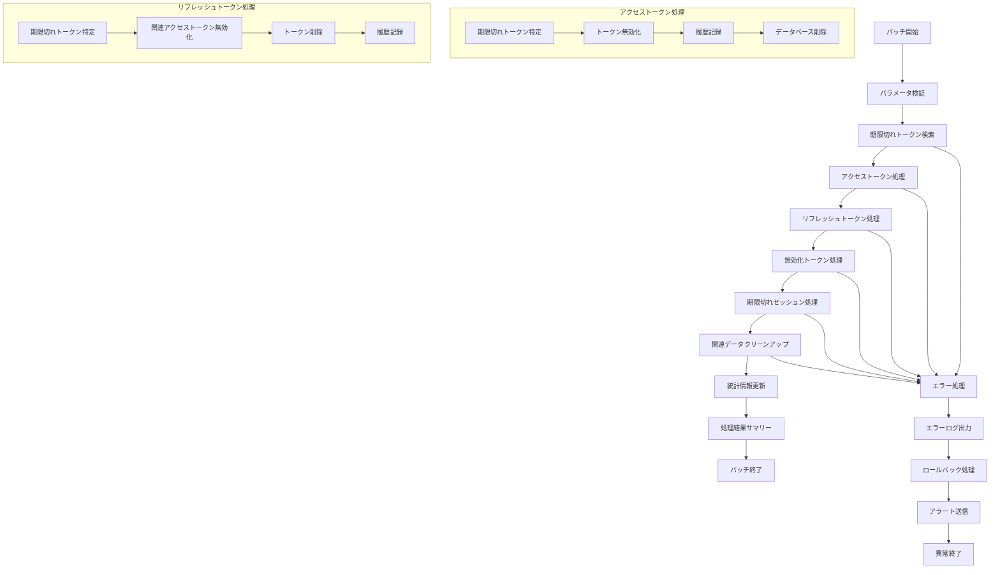

# バッチ定義書：トークン無効化バッチ (BATCH-006)

## 1. 基本情報

| 項目 | 内容 |
|------|------|
| **バッチID** | BATCH-006 |
| **バッチ名** | トークン無効化バッチ |
| **実行スケジュール** | 時間毎（毎時30分） |
| **優先度** | 高 |
| **ステータス** | 未着手 |
| **作成日** | 2025/05/31 |
| **最終更新日** | 2025/05/31 |

## 2. バッチ概要

### 2.1 概要・目的
期限切れや無効化されたアクセストークン・リフレッシュトークンを定期的に削除し、セキュリティを確保する。

### 2.2 関連テーブル
- TBL-015_アクセストークン
- TBL-016_リフレッシュトークン
- TBL-017_セッション管理
- TBL-018_トークン無効化履歴

### 2.3 関連API
- API-105_トークン検証API
- API-106_トークン無効化API

## 3. 実行仕様

### 3.1 実行スケジュール
| 項目 | 設定値 | 備考 |
|------|--------|------|
| 実行頻度 | 30 * * * * | cron形式（毎時30分） |
| 実行時間 | 毎時30分 | 定期実行 |
| タイムアウト | 15分 | 最大実行時間 |
| リトライ回数 | 3回 | 失敗時の再実行 |

### 3.2 実行条件
| 条件 | 内容 | 備考 |
|------|------|------|
| 前提条件 | データベース稼働中 | 基本的な稼働状態 |
| 実行可能時間 | 24時間 | 常時実行 |
| 排他制御 | 同一バッチの重複実行禁止 | ロックファイル使用 |

### 3.3 実行パラメータ
| パラメータ名 | データ型 | 必須 | デフォルト値 | 説明 |
|--------------|----------|------|--------------|------|
| access_token_ttl | number | × | 3600 | アクセストークン有効期間（秒） |
| refresh_token_ttl | number | × | 2592000 | リフレッシュトークン有効期間（秒） |
| batch_size | number | × | 1000 | 一括処理件数 |
| cleanup_expired_sessions | boolean | × | true | 期限切れセッション削除フラグ |

## 4. 処理仕様

### 4.1 処理フロー

### 4.2 詳細処理
1. **初期化処理**
   - パラメータ検証
   - データベース接続確認
   - 排他制御ロック取得

2. **期限切れアクセストークン処理**
   - 現在時刻と有効期限の比較
   - 期限切れトークンの特定
   - トークン無効化処理
   - データベースからの削除

3. **期限切れリフレッシュトークン処理**
   - 期限切れリフレッシュトークンの特定
   - 関連するアクセストークンの無効化
   - リフレッシュトークンの削除

4. **手動無効化トークン処理**
   - 無効化フラグが設定されたトークンの処理
   - 関連セッションの終了
   - トークンの完全削除

5. **セッション管理**
   - 期限切れセッションの特定
   - セッションデータの削除
   - セッション統計の更新

## 5. データ仕様

### 5.1 入力データ
| データ名 | 形式 | 取得元 | 説明 |
|----------|------|--------|------|
| アクセストークン | DB | TBL-015 | 有効期限・無効化フラグ |
| リフレッシュトークン | DB | TBL-016 | 有効期限・使用状況 |
| セッション情報 | DB | TBL-017 | セッション有効期限 |

### 5.2 出力データ
| データ名 | 形式 | 出力先 | 説明 |
|----------|------|--------|------|
| 無効化履歴 | DB | TBL-018 | トークン無効化記録 |
| 実行ログ | LOG | /logs/batch/ | バッチ実行ログ |
| 統計レポート | JSON | /reports/ | 処理統計情報 |

### 5.3 データ量見積もり
| 項目 | 件数 | 備考 |
|------|------|------|
| 処理対象トークン数 | 500-2000件/時間 | アクティブユーザー数による |
| 削除セッション数 | 100-500件/時間 | セッション有効期限による |
| 処理時間 | 5-10分 | データ量による |

## 6. エラーハンドリング

### 6.1 エラー分類
| エラー種別 | 対応方法 | 通知要否 | 備考 |
|------------|----------|----------|------|
| データベースエラー | 処理中断・リトライ | ○ | 接続エラー・ロック競合 |
| データ整合性エラー | エラーログ出力・継続 | △ | 外部キー制約違反等 |
| トークン検証エラー | エラーログ出力・スキップ | × | 不正なトークン形式 |

### 6.2 リトライ仕様
| 条件 | リトライ回数 | 間隔 | 備考 |
|------|--------------|------|------|
| DB接続エラー | 3回 | 30秒 | 指数バックオフ |
| ロック競合エラー | 5回 | 10秒 | 固定間隔 |
| 一時的なDB負荷 | 2回 | 60秒 | 負荷軽減待ち |

### 6.3 異常終了時の処理
1. 処理中断
2. トランザクションロールバック
3. エラーログ出力
4. セキュリティアラート送信
5. 排他制御ロック解除

## 7. 監視・運用

### 7.1 監視項目
| 監視項目 | 閾値 | アラート条件 | 対応方法 |
|----------|------|--------------|----------|
| 処理時間 | 15分 | 超過時 | データベース負荷確認 |
| エラー率 | 5% | 超過時 | データ整合性確認 |
| 削除トークン数 | 期待値±50% | 乖離時 | トークン発行状況確認 |
| データベース負荷 | CPU80% | 超過時 | 処理タイミング調整 |

### 7.2 ログ出力
| ログ種別 | 出力レベル | 出力内容 | 保存期間 |
|----------|------------|----------|----------|
| 実行ログ | INFO | 処理開始・終了・統計情報 | 3ヶ月 |
| エラーログ | ERROR | エラー詳細・トークンID | 1年 |
| セキュリティログ | WARN | 不正トークン検知・大量削除 | 2年 |

### 7.3 アラート通知
| 通知条件 | 通知先 | 通知方法 | 備考 |
|----------|--------|----------|------|
| 異常終了 | セキュリティチーム | メール・Slack | 即座に通知 |
| 大量トークン削除 | 開発チーム | Slack | 業務時間内のみ |
| データベース負荷 | インフラチーム | メール | 翌営業日まで |

## 8. 非機能要件

### 8.1 パフォーマンス
- 処理時間：15分以内
- メモリ使用量：512MB以内
- CPU使用率：30%以内

### 8.2 可用性
- 成功率：99%以上
- リトライ機能による自動復旧
- 部分的な処理継続機能

### 8.3 セキュリティ
- トークンデータの完全削除
- 処理ログの暗号化
- アクセス権限の厳格な制御

## 9. テスト仕様

### 9.1 単体テスト
| テストケース | 入力条件 | 期待結果 |
|--------------|----------|----------|
| 正常処理 | 期限切れトークン存在 | 正常終了・トークン削除 |
| トークンなし | 期限切れトークン0件 | 正常終了（処理件数0） |
| 大量トークン | 10000件の期限切れトークン | 正常終了・適切な処理時間 |

### 9.2 異常系テスト
| テストケース | 入力条件 | 期待結果 |
|--------------|----------|----------|
| DB接続エラー | データベース停止 | リトライ後異常終了 |
| ロック競合 | 他プロセスによるロック | リトライ後正常処理 |
| 不正トークン | 破損したトークンデータ | エラーログ出力・スキップ |

## 10. 実装メモ

### 10.1 技術仕様
- 言語：Node.js
- ORM：Prisma
- トークン処理：jsonwebtoken
- 暗号化：crypto

### 10.2 注意事項
- 大量データ処理時のメモリ管理
- トークン削除の原子性保証
- セキュリティログの確実な記録

### 10.3 デプロイ・実行環境
- 実行サーバー：アプリケーションサーバー
- 実行ユーザー：token_cleanup_user
- 実行ディレクトリ：/opt/batch/token-cleanup/
- 設定ファイル：/etc/batch/token-cleanup.json

---

**改訂履歴**

| バージョン | 日付 | 変更者 | 変更内容 |
|------------|------|--------|----------|
| 1.0 | 2025/05/31 | システムアーキテクト | 初版作成 |
