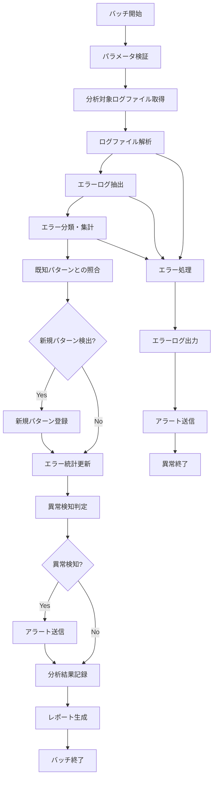

# バッチ定義書：エラーログ分析バッチ (BATCH-007)

## 1. 基本情報

| 項目 | 内容 |
|------|------|
| **バッチID** | BATCH-007 |
| **バッチ名** | エラーログ分析バッチ |
| **実行スケジュール** | 時間毎（毎時30分） |
| **優先度** | 中 |
| **ステータス** | 未着手 |
| **作成日** | 2025/05/31 |
| **最終更新日** | 2025/05/31 |

## 2. バッチ概要

### 2.1 概要・目的
アプリケーションのエラーログを解析し、異常パターンの検出・分類・アラート送信を行う。

### 2.2 関連テーブル
- TBL-054_エラーログ分析結果
- TBL-055_エラーパターン定義
- TBL-056_エラーアラート設定

### 2.3 関連API
- API-307_エラー統計取得API
- API-308_エラーパターン更新API

## 3. 実行仕様

### 3.1 実行スケジュール
| 項目 | 設定値 | 備考 |
|------|--------|------|
| 実行頻度 | 30 * * * * | cron形式（毎時30分） |
| 実行時間 | 毎時30分 | 定期的な分析 |
| タイムアウト | 25分 | 最大実行時間 |
| リトライ回数 | 2回 | 失敗時の再実行 |

### 3.2 実行条件
| 条件 | 内容 | 備考 |
|------|------|------|
| 前提条件 | ログファイル存在 | 分析対象ログ |
| 実行可能時間 | 24時間 | 常時実行 |
| 排他制御 | 同一バッチの重複実行禁止 | ロックファイル使用 |

### 3.3 実行パラメータ
| パラメータ名 | データ型 | 必須 | デフォルト値 | 説明 |
|--------------|----------|------|--------------|------|
| analysis_period | number | × | 1 | 分析期間（時間） |
| error_threshold | number | × | 10 | エラー閾値（件数） |
| pattern_update | boolean | × | true | パターン更新フラグ |

## 4. 処理仕様

### 4.1 処理フロー

### 4.2 詳細処理
1. **初期化処理**
   - パラメータ検証
   - 分析対象期間の設定
   - ログファイル一覧取得
   - 排他制御ロック取得

2. **ログファイル解析**
   - アプリケーションログファイルの読み込み
   - ログレベル別の分類（ERROR・WARN・FATAL）
   - タイムスタンプ・メッセージの抽出
   - スタックトレースの解析

3. **エラー分類・集計**
   - エラーメッセージのパターン分析
   - 発生頻度・発生時間帯の集計
   - エラー種別の分類（DB・API・認証等）
   - 影響範囲の特定

4. **パターン照合・更新**
   - 既知のエラーパターンとの照合
   - 新規パターンの検出・登録
   - パターンの重要度判定
   - 自動分類ルールの更新

5. **異常検知・アラート**
   - エラー発生率の閾値チェック
   - 異常なエラーパターンの検出
   - 重要度に応じたアラート送信
   - 関連チームへの通知

## 5. データ仕様

### 5.1 入力データ
| データ名 | 形式 | 取得元 | 説明 |
|----------|------|--------|------|
| アプリケーションログ | LOG | /logs/application/ | 分析対象ログファイル |
| エラーパターン定義 | DB | TBL-055_エラーパターン定義 | 既知のエラーパターン |
| アラート設定 | DB | TBL-056_エラーアラート設定 | 通知設定・閾値 |

### 5.2 出力データ
| データ名 | 形式 | 出力先 | 説明 |
|----------|------|--------|------|
| 分析結果 | DB | TBL-054_エラーログ分析結果 | エラー統計・分析結果 |
| 分析レポート | JSON | /data/reports/ | 詳細分析レポート |
| アラートログ | LOG | /logs/alerts/ | アラート送信履歴 |
| 実行ログ | LOG | /logs/batch/ | 実行履歴ログ |

### 5.3 データ量見積もり
| 項目 | 件数 | 備考 |
|------|------|------|
| 分析対象ログ行数 | 100,000行 | 1時間分 |
| エラーログ抽出数 | 500行 | 平均値 |
| 処理時間 | 15分 | 平均実行時間 |

## 6. エラーハンドリング

### 6.1 エラー分類
| エラー種別 | 対応方法 | 通知要否 | 備考 |
|------------|----------|----------|------|
| ログファイル読み込みエラー | リトライ・継続 | △ | ファイルロック等 |
| パターン解析エラー | エラー記録・継続 | ○ | 解析ロジック問題 |
| DB更新エラー | リトライ・継続 | ○ | データ整合性問題 |

### 6.2 リトライ仕様
| 条件 | リトライ回数 | 間隔 | 備考 |
|------|--------------|------|------|
| ファイルアクセスエラー | 3回 | 30秒 | ファイルロック解除待ち |
| DB接続エラー | 3回 | 30秒 | 短間隔リトライ |
| メモリ不足エラー | 2回 | 60秒 | GC実行後リトライ |

### 6.3 異常終了時の処理
1. 処理中断
2. 部分更新のロールバック
3. エラーログ出力
4. アラート送信
5. 排他制御ロック解除

## 7. 監視・運用

### 7.1 監視項目
| 監視項目 | 閾値 | アラート条件 | 対応方法 |
|----------|------|--------------|----------|
| 実行時間 | 25分 | 超過時 | 処理見直し・最適化 |
| エラー発生率 | 5% | 超過時 | アプリケーション調査 |
| 新規パターン検出数 | 10件 | 超過時 | パターン定義見直し |

### 7.2 ログ出力
| ログ種別 | 出力レベル | 出力内容 | 保存期間 |
|----------|------------|----------|----------|
| 実行ログ | INFO | 処理開始・終了・分析結果 | 1ヶ月 |
| エラーログ | ERROR | エラー詳細・スタックトレース | 3ヶ月 |
| 分析ログ | DEBUG | 詳細分析過程 | 1週間 |

### 7.3 アラート通知
| 通知条件 | 通知先 | 通知方法 | 備考 |
|----------|--------|----------|------|
| 重要エラー急増 | 開発チーム | Slack・メール | 即座に通知 |
| 新規エラーパターン | 開発チーム | Slack | 業務時間内のみ |
| 分析処理失敗 | 運用チーム | メール | 定期確認 |

## 8. 非機能要件

### 8.1 パフォーマンス
- 処理時間：25分以内
- メモリ使用量：1GB以内
- CPU使用率：50%以内

### 8.2 可用性
- 成功率：95%以上
- ログファイル障害時の継続処理
- 部分的な分析失敗の許容

### 8.3 セキュリティ
- ログ内機密情報の適切な処理
- 分析結果の適切な管理
- アクセスログの記録

## 9. テスト仕様

### 9.1 単体テスト
| テストケース | 入力条件 | 期待結果 |
|--------------|----------|----------|
| 正常分析 | 通常のエラーログ | 正常終了・統計更新 |
| 高エラー率検知 | 大量エラーログ | アラート送信 |
| 新規パターン検知 | 未知のエラーパターン | パターン登録 |

### 9.2 異常系テスト
| テストケース | 入力条件 | 期待結果 |
|--------------|----------|----------|
| ログファイル不存在 | ログファイルなし | エラー記録・継続処理 |
| 不正ログ形式 | 破損ログファイル | エラー記録・スキップ |
| メモリ不足 | 大容量ログファイル | エラー記録・分割処理 |

## 10. 実装メモ

### 10.1 技術仕様
- 言語：Node.js
- フレームワーク：なし（Pure Node.js）
- DB接続：Prisma
- ログ解析：正規表現・自然言語処理
- ログ出力：Winston

### 10.2 注意事項
- 大容量ログファイルの効率的な処理
- メモリ使用量の最適化
- パターンマッチングの精度向上

### 10.3 デプロイ・実行環境
- 実行サーバー：バッチサーバー
- 実行ユーザー：batch_user
- 実行ディレクトリ：/opt/batch/error-analysis/
- 設定ファイル：/etc/batch/error-analysis.json

---

**改訂履歴**

| バージョン | 日付 | 変更者 | 変更内容 |
|------------|------|--------|----------|
| 1.0 | 2025/05/31 | システムアーキテクト | 初版作成 |
