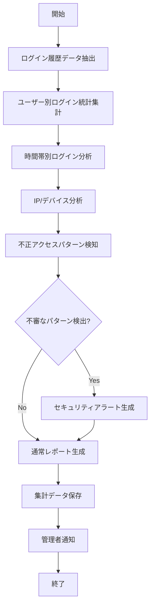

# バッチ定義書：ログイン履歴集計バッチ

| 項目                | 内容                                                                                |
|---------------------|------------------------------------------------------------------------------------|
| **バッチID**        | BATCH-102                                                                          |
| **バッチ名称**      | ログイン履歴集計バッチ                                                              |
| **機能カテゴリ**    | 認証・認可                                                                          |
| **概要・目的**      | ログイン履歴を集計し、不正アクセスの検知および管理者への通知を行う                   |
| **バッチ種別**      | 定期バッチ                                                                          |
| **実行スケジュール**| 毎日深夜（1:00）                                                                    |
| **入出力対象**      | ログイン履歴                                                                        |
| **優先度**          | 高                                                                                  |
| **備考**            | セキュリティ監査用                                                                  |

## 1. 処理概要

ログイン履歴集計バッチは、システムに記録されたログイン履歴データを集計・分析し、不審なログインパターンや不正アクセスの兆候を検知するバッチ処理です。異常なログイン試行（時間外アクセス、複数拠点からの同時アクセスなど）を検出した場合は、セキュリティ管理者に通知します。また、ログイン統計情報を集計し、セキュリティ監査用のレポートを生成します。

## 2. 処理フロー



## 3. 入力データ

### 3.1 LoginHistoryテーブル

| フィールド名      | データ型 | 説明                                           |
|-------------------|----------|------------------------------------------------|
| login_id          | String   | ログインID（主キー）                           |
| user_id           | String   | ユーザーID（外部キー）                         |
| login_timestamp   | DateTime | ログイン日時                                   |
| logout_timestamp  | DateTime | ログアウト日時（nullの場合はセッション継続中） |
| ip_address        | String   | IPアドレス                                     |
| user_agent        | String   | ユーザーエージェント                           |
| device_info       | String   | デバイス情報                                   |
| location          | String   | 位置情報（可能な場合）                         |
| login_status      | String   | ログイン状態（"SUCCESS"/"FAILED"）             |
| failure_reason    | String   | 失敗理由（失敗時のみ）                         |
| session_id        | String   | セッションID                                   |
| created_at        | DateTime | 記録日時                                       |

### 3.2 UserAuthテーブル

| フィールド名      | データ型 | 説明                                           |
|-------------------|----------|------------------------------------------------|
| user_id           | String   | ユーザーID（主キー）                           |
| username          | String   | ユーザー名                                     |
| status            | String   | アカウント状態（"ACTIVE"/"LOCKED"/"INACTIVE"） |
| last_login_at     | DateTime | 最終ログイン日時                               |
| failed_login_count| Integer  | 連続ログイン失敗回数                           |

### 3.3 システム設定

| 設定項目                    | データ型 | デフォルト値 | 説明                                 |
|-----------------------------|----------|--------------|--------------------------------------|
| login_history_retention_days| Integer  | 90           | ログイン履歴の保持日数               |
| suspicious_login_threshold  | Integer  | 5            | 不審ログイン判定閾値（失敗回数）     |
| time_window_minutes         | Integer  | 10           | 不審判定の時間枠（分）               |
| working_hours_start         | Integer  | 8            | 通常業務時間開始（時）               |
| working_hours_end           | Integer  | 19           | 通常業務時間終了（時）               |
| notify_admin_on_suspicious  | Boolean  | true         | 不審ログイン検知時の管理者通知有無   |
| geo_location_check_enabled  | Boolean  | true         | 地理的位置情報チェック有効/無効      |

## 4. 出力データ

### 4.1 LoginStatisticsテーブル（追加/更新）

| フィールド名      | データ型 | 説明                                           |
|-------------------|----------|------------------------------------------------|
| stat_id           | String   | 統計ID（主キー）                               |
| stat_date         | Date     | 統計日                                         |
| user_id           | String   | ユーザーID（外部キー、全体統計の場合はnull）   |
| total_logins      | Integer  | 総ログイン回数                                 |
| successful_logins | Integer  | 成功ログイン回数                               |
| failed_logins     | Integer  | 失敗ログイン回数                               |
| unique_ip_count   | Integer  | ユニークIPアドレス数                           |
| unique_device_count| Integer | ユニークデバイス数                             |
| avg_session_duration| Integer| 平均セッション時間（分）                       |
| non_working_hours_logins| Integer | 業務時間外ログイン回数                    |
| suspicious_activities| Integer | 不審アクティビティ数                         |
| created_at        | DateTime | 作成日時                                       |
| created_by        | String   | "SYSTEM_BATCH"                                 |

### 4.2 SecurityAlertテーブル（追加）

| フィールド名      | データ型 | 説明                                           |
|-------------------|----------|------------------------------------------------|
| alert_id          | String   | アラートID（主キー）                           |
| alert_type        | String   | アラートタイプ（"MULTIPLE_FAILURES"/"UNUSUAL_LOCATION"/"OFF_HOURS"/"MULTIPLE_DEVICES"） |
| severity          | String   | 重要度（"LOW"/"MEDIUM"/"HIGH"/"CRITICAL"）     |
| user_id           | String   | ユーザーID（外部キー）                         |
| description       | Text     | アラート詳細                                   |
| detection_time    | DateTime | 検知日時                                       |
| related_login_ids | String   | 関連ログインID（カンマ区切り）                 |
| status            | String   | ステータス（"NEW"/"ACKNOWLEDGED"/"RESOLVED"/"FALSE_POSITIVE"） |
| created_at        | DateTime | 作成日時                                       |
| created_by        | String   | "SYSTEM_BATCH"                                 |

### 4.3 ログイン分析レポート

**ファイル形式**: PDF/HTML  
**ファイル名**: `login_analysis_report_YYYYMMDD.pdf`  
**レポート内容**:

1. **サマリー**
   - 日次ログイン統計（成功/失敗回数、ユニークユーザー数）
   - 前日比較（増減率）
   - 不審アクティビティ数

2. **時間帯別分析**
   - 時間帯別ログイン分布グラフ
   - 業務時間外ログイン一覧

3. **失敗ログイン分析**
   - 失敗理由別の集計
   - 連続失敗ユーザー一覧

4. **地理的分析**
   - 地域別ログイン分布
   - 異常な地理的移動検出（短時間での遠距離ログイン）

5. **デバイス分析**
   - デバイスタイプ別ログイン統計
   - 新規デバイスからのログイン一覧

6. **セキュリティアラート**
   - 検出された不審アクティビティ一覧
   - 推奨アクション

### 4.4 管理者通知

不審なアクティビティが検出された場合、以下の内容で管理者に通知メールを送信：

- 件名：「【セキュリティアラート】不審なログインアクティビティ検出」
- 本文：
  - アラートタイプと重要度
  - 対象ユーザー情報
  - 検出された不審アクティビティの詳細
  - 関連ログイン情報（日時、IPアドレス、デバイス）
  - 推奨アクション
  - 管理画面へのリンク

## 5. エラー処理

| エラーケース                      | 対応方法                                                                 |
|-----------------------------------|--------------------------------------------------------------------------|
| ログイン履歴データ不足            | 警告ログを記録し、利用可能なデータのみで処理を継続。                     |
| DBアクセスエラー                  | エラーログを記録し、管理者に通知。処理を中断。                           |
| レポート生成エラー                | エラーログを記録し、管理者に通知。集計データは保存済みの状態で終了。     |
| 通知送信エラー                    | エラーログを記録。レポート生成は完了させ、通知エラーのみ管理者に報告。   |
| 地理的位置情報解決エラー          | 警告ログを記録し、位置情報なしで処理を継続。                             |
| 設定値不正                        | デフォルト値を使用し、警告ログを記録。                                   |

## 6. 依存関係

- LoginHistoryテーブル
- UserAuthテーブル
- LoginStatisticsテーブル
- SecurityAlertテーブル
- レポート生成サービス
- メール通知サービス
- 地理的位置情報解決サービス（オプション）

## 7. 実行パラメータ

| パラメータ名        | 必須 | デフォルト値 | 説明                                           |
|---------------------|------|--------------|------------------------------------------------|
| --target-date       | No   | 前日         | 対象日を指定（YYYY-MM-DD形式）                 |
| --alert-only        | No   | false        | アラート検出のみ実行（統計集計なし）           |
| --stats-only        | No   | false        | 統計集計のみ実行（アラート検出なし）           |
| --skip-notification | No   | false        | 管理者通知をスキップ                           |
| --user-id           | No   | null         | 特定ユーザーのみを対象とする場合に指定         |
| --threshold-override| No   | null         | 不審ログイン判定閾値を上書き                   |

## 8. 実行例

```bash
# 通常実行（前日のログイン履歴を分析）
npm run batch:login-history

# TypeScript直接実行
npx tsx src/batch/loginHistoryAnalysis.ts

# 特定日のログイン履歴を分析
npm run batch:login-history -- --target-date=2025-05-28

# アラート検出のみ実行
npm run batch:login-history -- --alert-only

# 特定ユーザーのみ分析
npm run batch:login-history -- --user-id=U10023

# 不審ログイン判定閾値を変更して実行
npm run batch:login-history -- --threshold-override=3
```

## 9. 運用上の注意点

- 本バッチは毎日深夜に実行され、前日のログイン履歴を分析します。
- セキュリティアラートは重要度に応じて対応が必要です。特に「HIGH」「CRITICAL」レベルのアラートは早急な確認が推奨されます。
- 誤検知（False Positive）の可能性もあるため、アラートは必ず人間による確認が必要です。
- 業務パターンの変化（リモートワーク増加など）により、不審判定の閾値調整が必要になる場合があります。
- ログイン履歴は `login_history_retention_days` の設定に基づいて保持され、期間を超えた古いデータは自動的に削除されます。
- 地理的位置情報チェックを有効にする場合は、位置情報解決サービスの設定が必要です。

## 10. 改訂履歴

| 改訂日     | 改訂者 | 改訂内容                                         |
|------------|--------|--------------------------------------------------|
| 2025/05/29 | 初版   | 初版作成                                         |
