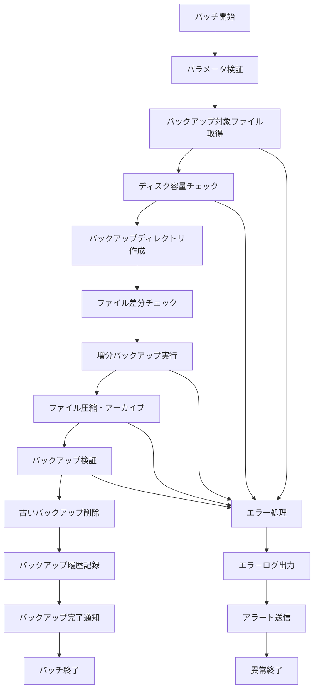

# バッチ定義書：ファイルバックアップバッチ (BATCH-102)

## 1. 基本情報

| 項目 | 内容 |
|------|------|
| **バッチID** | BATCH-102 |
| **バッチ名** | ファイルバックアップバッチ |
| **実行スケジュール** | 日次（02:30） |
| **優先度** | 高 |
| **ステータス** | 実装済み |
| **作成日** | 2025/05/31 |
| **最終更新日** | 2025/05/31 |

## 2. バッチ概要

### 2.1 概要・目的
アップロードファイル、設定ファイル、ログファイルなどの重要ファイルのバックアップを実行し、データ保護を行う。

### 2.2 関連テーブル
- TBL-041_ファイルバックアップ履歴
- TBL-042_バックアップ対象ファイル設定
- TBL-043_ファイル管理

### 2.3 関連API
- API-309_ファイルバックアップ状態取得API
- API-310_ファイル復元API

## 3. 実行仕様

### 3.1 実行スケジュール
| 項目 | 設定値 | 備考 |
|------|--------|------|
| 実行頻度 | 30 2 * * * | cron形式（毎日02:30） |
| 実行時間 | 02:30 | 深夜バッチ（DB後） |
| タイムアウト | 90分 | 最大実行時間 |
| リトライ回数 | 2回 | 失敗時の再実行 |

### 3.2 実行条件
| 条件 | 内容 | 備考 |
|------|------|------|
| 前提条件 | ファイルシステム稼働中 | ディスク・NFS確認 |
| 実行可能時間 | 02:30-05:00 | メンテナンス時間 |
| 排他制御 | 同一バッチの重複実行禁止 | ロックファイル使用 |

### 3.3 実行パラメータ
| パラメータ名 | データ型 | 必須 | デフォルト値 | 説明 |
|--------------|----------|------|--------------|------|
| backup_type | string | × | incremental | バックアップ種別（full/incremental） |
| target_paths | array | × | all | 対象パス配列 |
| retention_days | number | × | 30 | バックアップ保持日数 |
| compress | boolean | × | true | 圧縮フラグ |

## 4. 処理仕様

### 4.1 処理フロー

### 4.2 詳細処理
1. **初期化処理**
   - パラメータ検証
   - バックアップ対象ファイル一覧取得
   - ディスク容量確認

2. **バックアップ準備**
   - バックアップディレクトリ作成
   - 前回バックアップとの差分確認
   - 排他制御ロック取得

3. **ファイルバックアップ**
   - rsyncコマンドによる増分バックアップ
   - ファイル権限・タイムスタンプ保持
   - シンボリックリンク対応

4. **バックアップ後処理**
   - アーカイブファイル作成（tar.gz）
   - バックアップ整合性検証
   - チェックサム計算・記録

5. **保守処理**
   - 保持期間超過ファイル削除
   - バックアップ履歴更新
   - ストレージ使用量記録

## 5. データ仕様

### 5.1 入力データ
| データ名 | 形式 | 取得元 | 説明 |
|----------|------|--------|------|
| アップロードファイル | FILE | /uploads/ | ユーザーアップロードファイル |
| 設定ファイル | FILE | /config/ | システム設定ファイル |
| ログファイル | FILE | /logs/ | アプリケーションログ |
| バックアップ設定 | DB | TBL-042 | バックアップ対象設定 |

### 5.2 出力データ
| データ名 | 形式 | 出力先 | 説明 |
|----------|------|--------|------|
| バックアップアーカイブ | TAR.GZ | /backup/files/ | 圧縮済みバックアップ |
| バックアップ履歴 | DB | TBL-041 | 実行履歴・結果 |
| 実行ログ | LOG | /logs/batch/ | バッチ実行ログ |
| 差分リスト | TXT | /backup/files/ | 変更ファイル一覧 |

### 5.3 データ量見積もり
| 項目 | 件数 | 備考 |
|------|------|------|
| 対象ファイル数 | 10,000-100,000件 | ファイル数による |
| バックアップサイズ | 1-10GB | データ量による |
| 処理時間 | 15-60分 | ファイル数・サイズによる |

## 6. エラーハンドリング

### 6.1 エラー分類
| エラー種別 | 対応方法 | 通知要否 | 備考 |
|------------|----------|----------|------|
| ディスク容量不足 | 処理中断・アラート | ○ | 即座に対応必要 |
| ファイルアクセスエラー | スキップ・継続 | △ | 権限・ロック問題 |
| 圧縮エラー | リトライ・アラート | ○ | ファイル破損可能性 |

### 6.2 リトライ仕様
| 条件 | リトライ回数 | 間隔 | 備考 |
|------|--------------|------|------|
| ファイルロックエラー | 3回 | 30秒 | 短間隔リトライ |
| ネットワークエラー | 2回 | 5分 | NFS接続問題 |
| 圧縮エラー | 1回 | 1分 | 即座にリトライ |

### 6.3 異常終了時の処理
1. 処理中断
2. 一時ファイル削除
3. エラーログ出力
4. アラート送信
5. 排他制御ロック解除

## 7. 監視・運用

### 7.1 監視項目
| 監視項目 | 閾値 | アラート条件 | 対応方法 |
|----------|------|--------------|----------|
| 実行時間 | 90分 | 超過時 | 処理見直し |
| バックアップサイズ | 前回比±50% | 乖離時 | ファイル増減確認 |
| エラーファイル数 | 100件 | 超過時 | 権限・容量確認 |
| 成功率 | 95% | 下回り時 | システム調査 |

### 7.2 ログ出力
| ログ種別 | 出力レベル | 出力内容 | 保存期間 |
|----------|------------|----------|----------|
| 実行ログ | INFO | 処理開始・終了・進捗・ファイル数 | 3ヶ月 |
| エラーログ | ERROR | エラー詳細・対象ファイル | 1年 |
| 差分ログ | INFO | 変更ファイル一覧 | 1ヶ月 |

### 7.3 アラート通知
| 通知条件 | 通知先 | 通知方法 | 備考 |
|----------|--------|----------|------|
| バックアップ失敗 | インフラチーム | メール・Slack | 即座に通知 |
| 容量不足 | 運用チーム | メール・Slack | 緊急対応 |
| 大量エラー | 開発チーム | Slack | 翌営業日対応 |

## 8. 非機能要件

### 8.1 パフォーマンス
- 処理時間：90分以内
- メモリ使用量：512MB以内
- CPU使用率：30%以内

### 8.2 可用性
- 成功率：95%以上
- 部分的なバックアップ継続機能
- 手動実行機能

### 8.3 セキュリティ
- バックアップファイルの暗号化
- アクセス権限の保持
- 機密ファイルの除外設定

## 9. テスト仕様

### 9.1 単体テスト
| テストケース | 入力条件 | 期待結果 |
|--------------|----------|----------|
| 正常バックアップ | 通常ファイル | 正常終了・アーカイブ作成 |
| 大量ファイル | 最大ファイル数 | 正常終了・時間内完了 |
| 差分なし | 変更ファイルなし | 正常終了・最小アーカイブ |

### 9.2 異常系テスト
| テストケース | 入力条件 | 期待結果 |
|--------------|----------|----------|
| ディスク容量不足 | 容量不足状態 | 異常終了・アラート |
| ファイルロック | ファイル使用中 | スキップ・継続処理 |
| 権限エラー | 読み取り権限なし | エラーログ・継続 |

## 10. 実装メモ

### 10.1 技術仕様
- 言語：Bash Script + Node.js
- バックアップツール：rsync, tar
- 圧縮：gzip
- 通知：Slack API, メール送信

### 10.2 注意事項
- 大量ファイル処理時のメモリ管理
- ファイルロック・権限問題への対応
- ネットワークファイルシステム対応

### 10.3 デプロイ・実行環境
- 実行サーバー：バックアップサーバー
- 実行ユーザー：backup_user
- 実行ディレクトリ：/opt/batch/file-backup/
- 設定ファイル：/etc/batch/file-backup.conf

---

**改訂履歴**

| バージョン | 日付 | 変更者 | 変更内容 |
|------------|------|--------|----------|
| 1.0 | 2025/05/31 | システムアーキテクト | 初版作成 |
