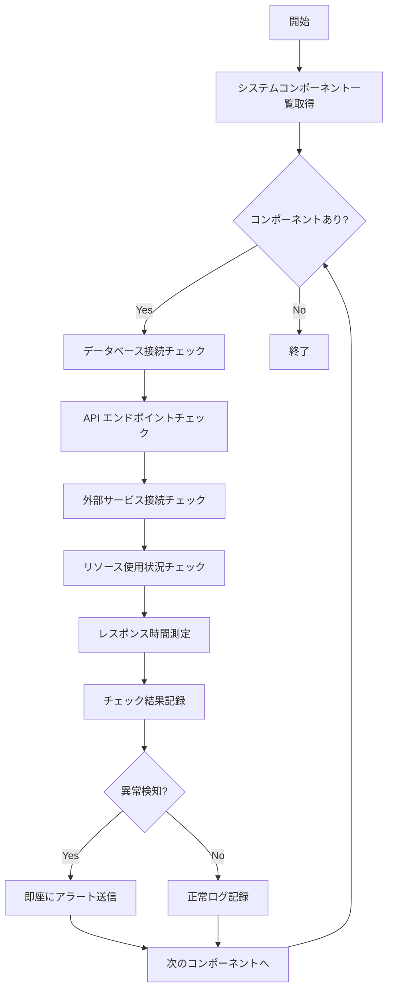

# バッチ定義書：システムヘルスチェックバッチ

| 項目                | 内容                                                                                |
|---------------------|------------------------------------------------------------------------------------|
| **バッチID**        | BATCH-001                                                                          |
| **バッチ名称**      | システムヘルスチェックバッチ                                                        |
| **機能カテゴリ**    | 基盤・システム管理                                                                  |
| **概要・目的**      | システム全体の稼働状況を定期的に監視し、異常を早期発見・通知する                    |
| **バッチ種別**      | 定期バッチ                                                                          |
| **実行スケジュール**| 毎時00分                                                                            |
| **入出力対象**      | システム監視テーブル、ヘルスチェック結果テーブル                                    |
| **優先度**          | 最高                                                                                |
| **備考**            | マルチテナント対応、システム全体の健全性監視                                        |

## 1. 処理概要

システムヘルスチェックバッチは、マルチテナント環境において各システムコンポーネントの稼働状況を定期的に監視し、異常を早期発見するバッチ処理です。データベース、API、外部サービス、リソース使用状況などを包括的にチェックし、問題があれば即座に管理者に通知します。

## 2. 処理フロー



## 3. 入力データ

### 3.1 監視対象コンポーネント

| コンポーネント種別  | 監視項目                                               |
|---------------------|-------------------------------------------------------|
| データベース        | 接続可能性、レスポンス時間、接続プール状況             |
| API エンドポイント  | HTTP ステータス、レスポンス時間、エラー率              |
| 外部サービス        | 認証API、通知サービス、ファイルストレージ              |
| システムリソース    | CPU使用率、メモリ使用率、ディスク容量                  |
| ネットワーク        | 接続性、帯域幅、レイテンシ                             |

### 3.2 チェック設定

| 設定項目                | データ型 | デフォルト値 | 説明                                 |
|-------------------------|----------|--------------|--------------------------------------|
| database_timeout        | Integer  | 5000         | データベース接続タイムアウト（ms）   |
| api_timeout             | Integer  | 3000         | API レスポンスタイムアウト（ms）     |
| cpu_threshold           | Float    | 80.0         | CPU使用率アラート閾値（%）           |
| memory_threshold        | Float    | 85.0         | メモリ使用率アラート閾値（%）        |
| disk_threshold          | Float    | 90.0         | ディスク使用率アラート閾値（%）      |
| response_time_threshold | Integer  | 2000         | レスポンス時間アラート閾値（ms）     |

## 4. 出力データ

### 4.1 ヘルスチェック結果テーブル（新規作成）

| フィールド名      | データ型 | 説明                                           |
|-------------------|----------|------------------------------------------------|
| check_id          | String   | チェック実行ID（主キー）                       |
| component_type    | String   | コンポーネント種別                             |
| component_name    | String   | コンポーネント名                               |
| status            | String   | ステータス（HEALTHY/WARNING/CRITICAL/DOWN）    |
| response_time     | Integer  | レスポンス時間（ms）                           |
| error_message     | String   | エラーメッセージ                               |
| cpu_usage         | Float    | CPU使用率（%）                                 |
| memory_usage      | Float    | メモリ使用率（%）                              |
| disk_usage        | Float    | ディスク使用率（%）                            |
| checked_at        | DateTime | チェック実行日時                               |

### 4.2 システム監視履歴テーブル（新規作成）

| フィールド名      | データ型 | 説明                                           |
|-------------------|----------|------------------------------------------------|
| execution_id      | String   | 実行ID（主キー）                               |
| execution_start   | DateTime | 実行開始日時                                   |
| execution_end     | DateTime | 実行終了日時                                   |
| total_components  | Integer  | チェック対象コンポーネント数                   |
| healthy_count     | Integer  | 正常コンポーネント数                           |
| warning_count     | Integer  | 警告コンポーネント数                           |
| critical_count    | Integer  | 重要警告コンポーネント数                       |
| down_count        | Integer  | 停止コンポーネント数                           |
| overall_status    | String   | 全体ステータス（HEALTHY/DEGRADED/DOWN）        |

### 4.3 アラート通知

重要度がWARNING以上の異常が検出された場合、以下の内容で即座に通知：

- 件名：「システムヘルスチェック：異常を検知」
- 本文：コンポーネント情報、異常内容、影響範囲、推奨対応

## 5. チェック仕様

### 5.1 データベース接続チェック

```typescript
async checkDatabaseHealth(): Promise<HealthCheckResult> {
  const startTime = Date.now();
  try {
    await prisma.$queryRaw`SELECT 1`;
    const responseTime = Date.now() - startTime;
    
    return {
      componentType: 'database',
      componentName: 'PostgreSQL',
      status: responseTime < 1000 ? 'HEALTHY' : 'WARNING',
      responseTime,
      errorMessage: null
    };
  } catch (error) {
    return {
      componentType: 'database',
      componentName: 'PostgreSQL',
      status: 'CRITICAL',
      responseTime: Date.now() - startTime,
      errorMessage: error.message
    };
  }
}
```

### 5.2 API エンドポイントチェック

```typescript
async checkApiEndpoints(): Promise<HealthCheckResult[]> {
  const endpoints = [
    '/api/health',
    '/api/auth/status',
    '/api/tenants',
    '/api/users/me'
  ];
  
  const results = await Promise.all(
    endpoints.map(async (endpoint) => {
      const startTime = Date.now();
      try {
        const response = await fetch(`${process.env.BASE_URL}${endpoint}`, {
          timeout: 3000
        });
        const responseTime = Date.now() - startTime;
        
        return {
          componentType: 'api',
          componentName: endpoint,
          status: response.ok ? 'HEALTHY' : 'WARNING',
          responseTime,
          errorMessage: response.ok ? null : `HTTP ${response.status}`
        };
      } catch (error) {
        return {
          componentType: 'api',
          componentName: endpoint,
          status: 'CRITICAL',
          responseTime: Date.now() - startTime,
          errorMessage: error.message
        };
      }
    })
  );
  
  return results;
}
```

### 5.3 システムリソースチェック

```typescript
async checkSystemResources(): Promise<HealthCheckResult[]> {
  const os = require('os');
  const fs = require('fs').promises;
  
  // CPU使用率
  const cpuUsage = await this.getCpuUsage();
  
  // メモリ使用率
  const totalMemory = os.totalmem();
  const freeMemory = os.freemem();
  const memoryUsage = ((totalMemory - freeMemory) / totalMemory) * 100;
  
  // ディスク使用率
  const diskUsage = await this.getDiskUsage();
  
  return [
    {
      componentType: 'resource',
      componentName: 'CPU',
      status: cpuUsage < 80 ? 'HEALTHY' : cpuUsage < 90 ? 'WARNING' : 'CRITICAL',
      cpuUsage,
      errorMessage: null
    },
    {
      componentType: 'resource',
      componentName: 'Memory',
      status: memoryUsage < 85 ? 'HEALTHY' : memoryUsage < 95 ? 'WARNING' : 'CRITICAL',
      memoryUsage,
      errorMessage: null
    },
    {
      componentType: 'resource',
      componentName: 'Disk',
      status: diskUsage < 90 ? 'HEALTHY' : diskUsage < 95 ? 'WARNING' : 'CRITICAL',
      diskUsage,
      errorMessage: null
    }
  ];
}
```

## 6. エラー処理

| エラーケース                      | 対応方法                                                                 |
|-----------------------------------|--------------------------------------------------------------------------|
| データベース接続失敗              | 即座にCRITICALアラート送信、自動復旧試行                                 |
| API エンドポイント応答なし        | WARNINGアラート送信、継続監視                                            |
| 外部サービス接続失敗              | サービス別にアラート送信、代替手段の提案                                 |
| システムリソース閾値超過          | 段階的アラート送信、自動スケーリング検討                                 |
| 監視システム自体の異常            | フェイルセーフ機能で最低限の監視継続                                     |

## 7. アラート通知仕様

### 7.1 通知レベル

| レベル    | 条件                                   | 通知方法                    | 通知先           |
|-----------|----------------------------------------|-----------------------------|------------------|
| HEALTHY   | 全コンポーネント正常                   | ログ記録のみ                | -                |
| WARNING   | 一部コンポーネントで軽微な問題         | Slack通知                   | 運用チーム       |
| CRITICAL  | 重要コンポーネントで深刻な問題         | Slack + メール + SMS        | 運用チーム + 管理者 |
| DOWN      | システム全体またはコアサービス停止     | 全通知手段 + 電話           | 全関係者         |

### 7.2 通知内容

```typescript
interface AlertNotification {
  level: 'WARNING' | 'CRITICAL' | 'DOWN';
  title: string;
  components: {
    name: string;
    status: string;
    responseTime?: number;
    errorMessage?: string;
  }[];
  systemOverview: {
    totalComponents: number;
    healthyCount: number;
    warningCount: number;
    criticalCount: number;
    downCount: number;
  };
  recommendedActions: string[];
  timestamp: Date;
}
```

## 8. 依存関係

- 全システムコンポーネント
- データベース（PostgreSQL）
- 外部API（認証、通知、ストレージ）
- 監視ツール（Prometheus、Grafana）
- 通知サービス（Slack、メール、SMS）

## 9. 実行パラメータ

| パラメータ名        | 必須 | デフォルト値 | 説明                                           |
|---------------------|------|--------------|------------------------------------------------|
| --component-type    | No   | all          | 特定コンポーネント種別のみチェック             |
| --skip-alerts       | No   | false        | アラート送信をスキップ                         |
| --detailed-check    | No   | false        | 詳細チェックモードを有効化                     |
| --timeout           | No   | 5000         | 各チェックのタイムアウト（ms）                 |

## 10. 実行例

```bash
# 通常実行
npm run batch:system-health-check

# データベースのみチェック
npm run batch:system-health-check -- --component-type=database

# アラート送信なし
npm run batch:system-health-check -- --skip-alerts

# 詳細チェック
npm run batch:system-health-check -- --detailed-check

# TypeScript直接実行
npx tsx src/batch/system-health-check.ts
```

## 11. 運用上の注意点

- 本バッチは他の全バッチの基盤となるため、最優先で実行してください。
- 異常検知時は迅速な対応が必要です。エスカレーション手順を明確にしてください。
- システム負荷を考慮し、チェック間隔と詳細度のバランスを調整してください。
- 外部サービスの一時的な障害と恒久的な問題を区別して対応してください。

## 12. パフォーマンス最適化

### 12.1 並列処理

```typescript
class SystemHealthChecker {
  async executeHealthChecks(): Promise<HealthCheckResult[]> {
    const [
      databaseResults,
      apiResults,
      resourceResults,
      externalResults
    ] = await Promise.all([
      this.checkDatabaseHealth(),
      this.checkApiEndpoints(),
      this.checkSystemResources(),
      this.checkExternalServices()
    ]);
    
    return [
      ...databaseResults,
      ...apiResults,
      ...resourceResults,
      ...externalResults
    ];
  }
}
```

### 12.2 キャッシュ活用

```typescript
class HealthCheckCache {
  private cache = new Map<string, HealthCheckResult>();
  private readonly CACHE_TTL = 30000; // 30秒
  
  async getCachedResult(componentName: string): Promise<HealthCheckResult | null> {
    const cached = this.cache.get(componentName);
    if (cached && Date.now() - cached.timestamp < this.CACHE_TTL) {
      return cached;
    }
    return null;
  }
  
  setCachedResult(componentName: string, result: HealthCheckResult): void {
    this.cache.set(componentName, {
      ...result,
      timestamp: Date.now()
    });
  }
}
```

## 13. 改訂履歴

| 改訂日     | 改訂者 | 改訂内容                                         |
|------------|--------|--------------------------------------------------|
| 2025/05/31 | 初版   | 初版作成                                         |
