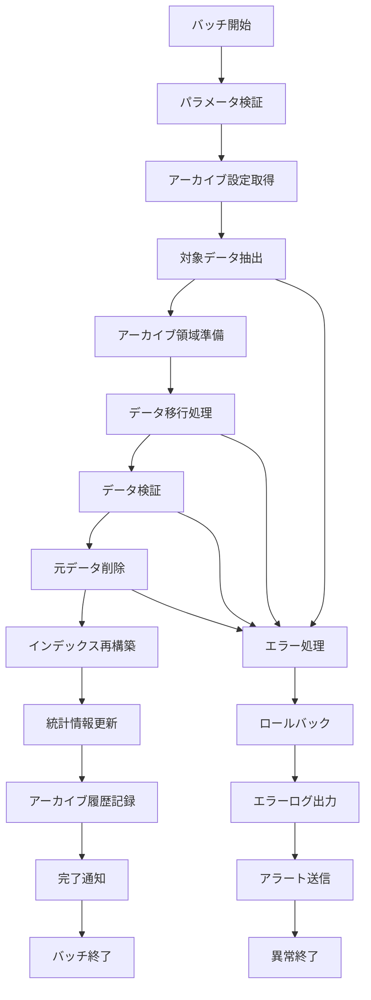

# バッチ定義書：データアーカイブバッチ (BATCH-103)

## 1. 基本情報

| 項目 | 内容 |
|------|------|
| **バッチID** | BATCH-103 |
| **バッチ名** | データアーカイブバッチ |
| **実行スケジュール** | 月次（1日 03:00） |
| **優先度** | 中 |
| **ステータス** | 実装済み |
| **作成日** | 2025/05/31 |
| **最終更新日** | 2025/05/31 |

## 2. バッチ概要

### 2.1 概要・目的
古いデータのアーカイブ処理を実行し、データベースのパフォーマンス維持とストレージ最適化を行う。

### 2.2 関連テーブル
- TBL-044_アーカイブ履歴
- TBL-045_アーカイブ設定
- TBL-046_アーカイブデータ
- 各業務テーブル（アーカイブ対象）

### 2.3 関連API
- API-311_アーカイブ状態取得API
- API-312_アーカイブデータ検索API

## 3. 実行仕様

### 3.1 実行スケジュール
| 項目 | 設定値 | 備考 |
|------|--------|------|
| 実行頻度 | 0 3 1 * * | cron形式（毎月1日03:00） |
| 実行時間 | 03:00 | 深夜バッチ |
| タイムアウト | 180分 | 最大実行時間 |
| リトライ回数 | 1回 | 失敗時の再実行 |

### 3.2 実行条件
| 条件 | 内容 | 備考 |
|------|------|------|
| 前提条件 | データベース稼働中 | 低負荷時間帯 |
| 実行可能時間 | 03:00-06:00 | メンテナンス時間 |
| 排他制御 | 同一バッチの重複実行禁止 | ロックファイル使用 |

### 3.3 実行パラメータ
| パラメータ名 | データ型 | 必須 | デフォルト値 | 説明 |
|--------------|----------|------|--------------|------|
| archive_months | number | × | 12 | アーカイブ対象月数 |
| target_tables | array | × | all | 対象テーブル配列 |
| batch_size | number | × | 1000 | バッチ処理件数 |
| verify_data | boolean | × | true | データ検証フラグ |

## 4. 処理仕様

### 4.1 処理フロー

### 4.2 詳細処理
1. **初期化処理**
   - パラメータ検証
   - アーカイブ設定読み込み
   - 対象テーブル・期間確認

2. **データ抽出**
   - アーカイブ対象データ特定
   - データ件数・サイズ確認
   - 依存関係チェック

3. **アーカイブ処理**
   - アーカイブテーブルへのデータ移行
   - バッチ単位での処理実行
   - トランザクション管理

4. **データ検証**
   - 移行データの整合性確認
   - 件数・チェックサム検証
   - 参照整合性確認

5. **後処理**
   - 元テーブルからのデータ削除
   - インデックス・統計情報更新
   - 領域回収処理

## 5. データ仕様

### 5.1 入力データ
| データ名 | 形式 | 取得元 | 説明 |
|----------|------|--------|------|
| 業務データ | DB | 各業務テーブル | アーカイブ対象データ |
| アーカイブ設定 | DB | TBL-045 | アーカイブルール設定 |

### 5.2 出力データ
| データ名 | 形式 | 出力先 | 説明 |
|----------|------|--------|------|
| アーカイブデータ | DB | TBL-046 | アーカイブ済みデータ |
| アーカイブ履歴 | DB | TBL-044 | 実行履歴・結果 |
| 実行ログ | LOG | /logs/batch/ | バッチ実行ログ |
| 統計レポート | CSV | /data/archive/ | アーカイブ統計情報 |

### 5.3 データ量見積もり
| 項目 | 件数 | 備考 |
|------|------|------|
| 対象データ件数 | 100,000-1,000,000件 | テーブル・期間による |
| アーカイブサイズ | 1-50GB | データ量による |
| 処理時間 | 60-150分 | データ量・サーバー性能による |

## 6. エラーハンドリング

### 6.1 エラー分類
| エラー種別 | 対応方法 | 通知要否 | 備考 |
|------------|----------|----------|------|
| データ整合性エラー | ロールバック・アラート | ○ | 即座に対応必要 |
| 容量不足エラー | 処理中断・アラート | ○ | ストレージ確認 |
| 参照整合性エラー | スキップ・継続 | △ | 依存データ確認 |

### 6.2 リトライ仕様
| 条件 | リトライ回数 | 間隔 | 備考 |
|------|--------------|------|------|
| DB接続エラー | 3回 | 10分 | 指数バックオフ |
| ロックエラー | 2回 | 30分 | 長時間待機 |
| 容量不足 | 0回 | - | 手動対応必要 |

### 6.3 異常終了時の処理
1. 処理中断
2. トランザクションロールバック
3. 一時データ削除
4. エラーログ出力
5. 緊急アラート送信

## 7. 監視・運用

### 7.1 監視項目
| 監視項目 | 閾値 | アラート条件 | 対応方法 |
|----------|------|--------------|----------|
| 実行時間 | 180分 | 超過時 | 処理見直し・分割実行 |
| アーカイブ件数 | 期待値±30% | 乖離時 | データ確認 |
| エラー率 | 1% | 超過時 | データ整合性確認 |
| ディスク使用率 | 85% | 超過時 | 容量拡張 |

### 7.2 ログ出力
| ログ種別 | 出力レベル | 出力内容 | 保存期間 |
|----------|------------|----------|----------|
| 実行ログ | INFO | 処理開始・終了・進捗・件数 | 1年 |
| エラーログ | ERROR | エラー詳細・対象データ | 2年 |
| 統計ログ | INFO | アーカイブ統計・パフォーマンス | 6ヶ月 |

### 7.3 アラート通知
| 通知条件 | 通知先 | 通知方法 | 備考 |
|----------|--------|----------|------|
| アーカイブ失敗 | データベースチーム | メール・Slack | 即座に通知 |
| 容量不足 | インフラチーム | メール・電話 | 緊急対応 |
| 処理時間超過 | 運用チーム | Slack | 翌営業日対応 |

## 8. 非機能要件

### 8.1 パフォーマンス
- 処理時間：180分以内
- メモリ使用量：2GB以内
- CPU使用率：60%以内

### 8.2 可用性
- 成功率：98%以上
- ロールバック機能
- 手動実行機能

### 8.3 セキュリティ
- アーカイブデータの暗号化
- アクセス権限の制限
- 監査ログの保持

## 9. テスト仕様

### 9.1 単体テスト
| テストケース | 入力条件 | 期待結果 |
|--------------|----------|----------|
| 正常アーカイブ | 通常データ量 | 正常終了・データ移行 |
| 大量データ | 最大データ量 | 正常終了・時間内完了 |
| データなし | 対象データ0件 | 正常終了・処理件数0 |

### 9.2 異常系テスト
| テストケース | 入力条件 | 期待結果 |
|--------------|----------|----------|
| 容量不足 | ディスク容量不足 | 異常終了・アラート |
| 参照整合性エラー | 依存データあり | エラーログ・スキップ |
| DB接続エラー | データベース停止 | リトライ後異常終了 |

## 10. 実装メモ

### 10.1 技術仕様
- 言語：Node.js
- データベース：Prisma
- バッチ処理：トランザクション管理
- 通知：Slack API, メール送信

### 10.2 注意事項
- 大量データ処理時のメモリ管理
- 長時間実行時のタイムアウト対策
- 参照整合性の慎重な確認

### 10.3 デプロイ・実行環境
- 実行サーバー：データベースサーバー
- 実行ユーザー：archive_user
- 実行ディレクトリ：/opt/batch/data-archive/
- 設定ファイル：/etc/batch/data-archive.conf

---

**改訂履歴**

| バージョン | 日付 | 変更者 | 変更内容 |
|------------|------|--------|----------|
| 1.0 | 2025/05/31 | システムアーキテクト | 初版作成 |
