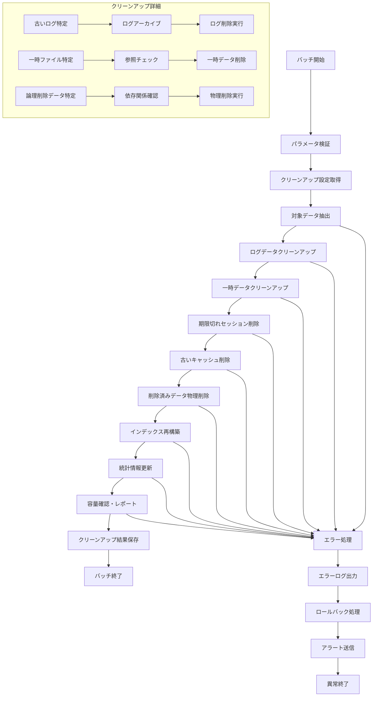

# バッチ定義書：データクリーンアップバッチ (BATCH-104)

## 1. 基本情報

| 項目 | 内容 |
|------|------|
| **バッチID** | BATCH-104 |
| **バッチ名** | データクリーンアップバッチ |
| **実行スケジュール** | 週次（日曜 04:00） |
| **優先度** | 高 |
| **ステータス** | 未着手 |
| **作成日** | 2025/05/31 |
| **最終更新日** | 2025/05/31 |

## 2. バッチ概要

### 2.1 概要・目的
不要データの削除・整理を行い、データベースの容量最適化とパフォーマンス向上を図る。

### 2.2 関連テーブル
- TBL-010_ログ
- TBL-011_一時データ
- TBL-012_セッション
- TBL-013_キャッシュ
- TBL-014_削除済みデータ

### 2.3 関連API
- API-104_データクリーンアップ設定取得API
- API-105_クリーンアップ結果登録API

## 3. 実行仕様

### 3.1 実行スケジュール
| 項目 | 設定値 | 備考 |
|------|--------|------|
| 実行頻度 | 0 4 * * 0 | cron形式（日曜04:00） |
| 実行時間 | 04:00 | 深夜バッチ |
| タイムアウト | 240分 | 最大実行時間 |
| リトライ回数 | 2回 | 失敗時の再実行 |

### 3.2 実行条件
| 条件 | 内容 | 備考 |
|------|------|------|
| 前提条件 | データベース稼働中 | DB接続確認 |
| 実行可能時間 | 04:00-08:00 | メンテナンス時間 |
| 排他制御 | 同一バッチの重複実行禁止 | ロックファイル使用 |

### 3.3 実行パラメータ
| パラメータ名 | データ型 | 必須 | デフォルト値 | 説明 |
|--------------|----------|------|--------------|------|
| retention_days | number | × | 90 | データ保持日数 |
| target_tables | string[] | × | all | 対象テーブル一覧 |
| dry_run | boolean | × | false | テスト実行フラグ |
| force_cleanup | boolean | × | false | 強制クリーンアップフラグ |

## 4. 処理仕様

### 4.1 処理フロー

### 4.2 詳細処理
1. **初期化処理**
   - パラメータ検証・設定確認
   - 対象テーブル・保持期間の確定
   - 排他制御ロック取得

2. **対象データ抽出**
   - 保持期間を超過したデータの特定
   - 削除対象データの件数確認
   - 依存関係の確認

3. **ログデータクリーンアップ**
   - 古いアプリケーションログの削除
   - システムログのアーカイブ・削除
   - エラーログの整理

4. **一時データクリーンアップ**
   - 期限切れの一時ファイル削除
   - 未使用の一時テーブル削除
   - キャッシュデータの整理

5. **セッション・キャッシュクリーンアップ**
   - 期限切れセッションの削除
   - 古いキャッシュエントリの削除
   - 無効なトークンの削除

6. **物理削除・最適化**
   - 論理削除済みデータの物理削除
   - インデックスの再構築
   - テーブル統計情報の更新

7. **結果確認・レポート**
   - 削除データ件数の集計
   - 容量削減効果の確認
   - クリーンアップレポートの生成

## 5. データ仕様

### 5.1 入力データ
| データ名 | 形式 | 取得元 | 説明 |
|----------|------|--------|------|
| クリーンアップ設定 | DB | TBL-015 | 保持期間・対象テーブル設定 |
| ログデータ | DB | TBL-010 | 削除対象のログデータ |
| 一時データ | DB | TBL-011 | 削除対象の一時データ |
| セッションデータ | DB | TBL-012 | 期限切れセッション |

### 5.2 出力データ
| データ名 | 形式 | 出力先 | 説明 |
|----------|------|--------|------|
| クリーンアップ結果 | DB | TBL-016 | 削除件数・容量削減結果 |
| 実行ログ | LOG | /logs/batch/ | バッチ実行ログ |
| クリーンアップレポート | JSON | /reports/ | 詳細なクリーンアップ結果 |
| アーカイブデータ | FILE | /archive/ | アーカイブされたデータ |

### 5.3 データ量見積もり
| 項目 | 件数 | 備考 |
|------|------|------|
| 削除対象ログ件数 | 100,000-1,000,000件 | 保持期間による |
| 削除対象一時データ件数 | 10,000-100,000件 | 利用状況による |
| 処理時間 | 120-240分 | データ量による |

## 6. エラーハンドリング

### 6.1 エラー分類
| エラー種別 | 対応方法 | 通知要否 | 備考 |
|------------|----------|----------|------|
| データベースエラー | 処理中断・ロールバック | ○ | 接続・権限エラー |
| 依存関係エラー | エラーログ出力・スキップ | △ | 外部キー制約違反 |
| 容量不足エラー | 処理中断・アラート | ○ | ディスク容量不足 |
| タイムアウトエラー | 処理中断・部分コミット | ○ | 処理時間超過 |

### 6.2 リトライ仕様
| 条件 | リトライ回数 | 間隔 | 備考 |
|------|--------------|------|------|
| DB接続エラー | 3回 | 60秒 | 指数バックオフ |
| ロックエラー | 5回 | 30秒 | 固定間隔 |
| 一時的なエラー | 2回 | 120秒 | 固定間隔 |

### 6.3 異常終了時の処理
1. 処理中断
2. 部分的なロールバック
3. エラーログ出力
4. データベース管理者への通知
5. 排他制御ロック解除

## 7. 監視・運用

### 7.1 監視項目
| 監視項目 | 閾値 | アラート条件 | 対応方法 |
|----------|------|--------------|----------|
| 処理時間 | 240分 | 超過時 | データ量・処理見直し |
| 削除件数 | 期待値±50% | 乖離時 | データ確認 |
| 容量削減率 | 5%以上 | 未達時 | 設定見直し |
| エラー率 | 1% | 超過時 | 原因調査 |

### 7.2 ログ出力
| ログ種別 | 出力レベル | 出力内容 | 保存期間 |
|----------|------------|----------|----------|
| 実行ログ | INFO | 処理開始・終了・削除件数・容量削減 | 6ヶ月 |
| エラーログ | ERROR | エラー詳細・対象データID | 1年 |
| 詳細ログ | DEBUG | 削除対象データ詳細 | 1ヶ月 |

### 7.3 アラート通知
| 通知条件 | 通知先 | 通知方法 | 備考 |
|----------|--------|----------|------|
| 異常終了 | データベース管理者 | メール・Slack | 即座に通知 |
| 容量削減未達 | 運用チーム | メール | 翌営業日まで |
| 大量削除検知 | 業務担当者 | Slack | 確認要請 |

## 8. 非機能要件

### 8.1 パフォーマンス
- 処理時間：240分以内
- メモリ使用量：4GB以内
- CPU使用率：60%以内

### 8.2 可用性
- 成功率：95%以上
- 部分的な処理継続機能
- データ整合性の保証

### 8.3 セキュリティ
- 削除データの完全消去
- アーカイブデータの暗号化
- 削除ログの改ざん防止

## 9. テスト仕様

### 9.1 単体テスト
| テストケース | 入力条件 | 期待結果 |
|--------------|----------|----------|
| 正常処理 | 削除対象データあり | 正常終了・データ削除完了 |
| 削除対象なし | 削除対象データ0件 | 正常終了（削除件数0） |
| 大量データ | 1,000,000件の削除対象 | 正常終了・適切な処理時間 |

### 9.2 異常系テスト
| テストケース | 入力条件 | 期待結果 |
|--------------|----------|----------|
| 依存関係エラー | 外部キー制約違反 | エラーログ出力・スキップ |
| 容量不足 | ディスク容量不足 | 処理中断・アラート |
| DB接続エラー | データベース停止 | リトライ後異常終了 |

## 10. 実装メモ

### 10.1 技術仕様
- 言語：Node.js
- ORM：Prisma
- バッチ処理：バルク削除・トランザクション制御
- 並列処理：worker_threads

### 10.2 注意事項
- 大量データ削除時のロック競合対策
- 削除処理の原子性確保
- アーカイブデータの整合性確認

### 10.3 デプロイ・実行環境
- 実行サーバー：バッチサーバー
- 実行ユーザー：data_cleanup_user
- 実行ディレクトリ：/opt/batch/data-cleanup/
- 設定ファイル：/etc/batch/data-cleanup.json

---

**改訂履歴**

| バージョン | 日付 | 変更者 | 変更内容 |
|------------|------|--------|----------|
| 1.0 | 2025/05/31 | システムアーキテクト | 初版作成 |
