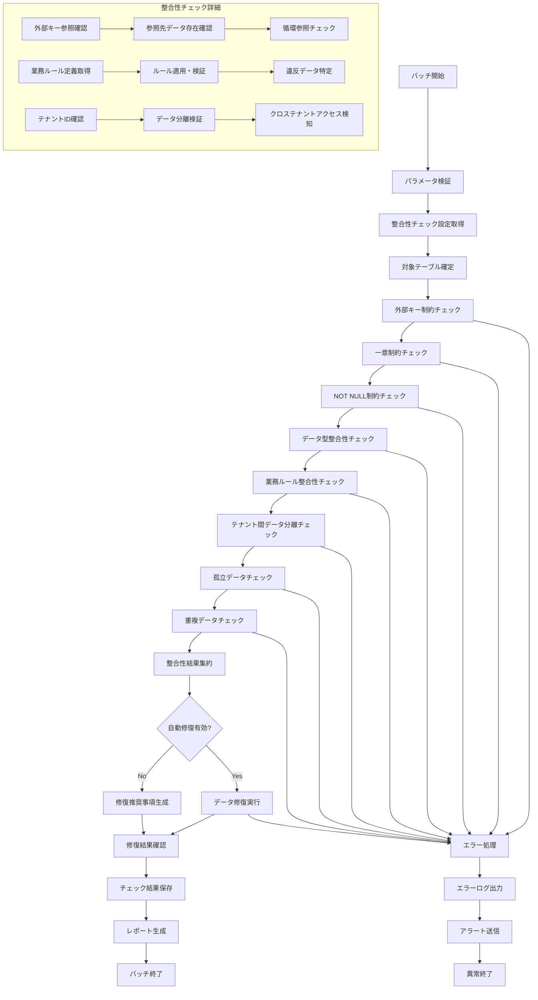

# バッチ定義書：データ整合性チェックバッチ (BATCH-105)

## 1. 基本情報

| 項目 | 内容 |
|------|------|
| **バッチID** | BATCH-105 |
| **バッチ名** | データ整合性チェックバッチ |
| **実行スケジュール** | 日次（05:30） |
| **優先度** | 高 |
| **ステータス** | 未着手 |
| **作成日** | 2025/05/31 |
| **最終更新日** | 2025/05/31 |

## 2. バッチ概要

### 2.1 概要・目的
データベース整合性の確認を行い、データの不整合・破損・制約違反を検知・修復する。

### 2.2 関連テーブル
- 全テーブル（整合性チェック対象）
- TBL-050_整合性チェック設定
- TBL-051_整合性チェック結果
- TBL-052_データ修復履歴

### 2.3 関連API
- API-105_整合性チェック設定取得API
- API-106_整合性チェック結果登録API
- API-107_データ修復実行API

## 3. 実行仕様

### 3.1 実行スケジュール
| 項目 | 設定値 | 備考 |
|------|--------|------|
| 実行頻度 | 0 5 30 * * * | cron形式（毎日05:30） |
| 実行時間 | 05:30 | 朝バッチ |
| タイムアウト | 180分 | 最大実行時間 |
| リトライ回数 | 2回 | 失敗時の再実行 |

### 3.2 実行条件
| 条件 | 内容 | 備考 |
|------|------|------|
| 前提条件 | データベース稼働中 | DB接続・読み取り権限確認 |
| 実行可能時間 | 05:30-08:30 | 業務開始前 |
| 排他制御 | 同一バッチの重複実行禁止 | ロックファイル使用 |

### 3.3 実行パラメータ
| パラメータ名 | データ型 | 必須 | デフォルト値 | 説明 |
|--------------|----------|------|--------------|------|
| check_level | string | × | standard | チェックレベル（basic/standard/full） |
| target_tables | string[] | × | all | 対象テーブル一覧 |
| auto_repair | boolean | × | false | 自動修復フラグ |
| tenant_id | string | × | all | 対象テナントID |

## 4. 処理仕様

### 4.1 処理フロー

### 4.2 詳細処理
1. **初期化処理**
   - パラメータ検証・設定確認
   - 対象テーブル・チェックレベルの確定
   - 排他制御ロック取得

2. **制約整合性チェック**
   - 外部キー制約の検証
   - 一意制約・NOT NULL制約の確認
   - データ型制約の検証

3. **業務ルール整合性チェック**
   - 業務固有のデータルール検証
   - 日付・数値範囲の妥当性確認
   - ステータス遷移の整合性確認

4. **テナント分離チェック**
   - テナント間データ分離の確認
   - クロステナントアクセスの検知
   - テナントIDの整合性確認

5. **データ品質チェック**
   - 孤立データの検出
   - 重複データの特定
   - 欠損データの確認

6. **修復処理（自動修復有効時）**
   - 軽微な不整合の自動修復
   - 孤立データの削除・関連付け
   - 重複データの統合

7. **結果処理・レポート**
   - チェック結果の集約・保存
   - 修復履歴の記録
   - 整合性レポートの生成

## 5. データ仕様

### 5.1 入力データ
| データ名 | 形式 | 取得元 | 説明 |
|----------|------|--------|------|
| 整合性チェック設定 | DB | TBL-050 | チェック項目・ルール設定 |
| 全テーブルデータ | DB | 各テーブル | 整合性チェック対象データ |
| 業務ルール定義 | DB | TBL-053 | 業務固有の整合性ルール |

### 5.2 出力データ
| データ名 | 形式 | 出力先 | 説明 |
|----------|------|--------|------|
| 整合性チェック結果 | DB | TBL-051 | チェック結果・不整合データ |
| データ修復履歴 | DB | TBL-052 | 修復実行履歴 |
| 実行ログ | LOG | /logs/batch/ | バッチ実行ログ |
| 整合性レポート | JSON | /reports/ | 詳細な整合性チェック結果 |

### 5.3 データ量見積もり
| 項目 | 件数 | 備考 |
|------|------|------|
| チェック対象テーブル数 | 50-100テーブル | システム全体 |
| チェック対象レコード数 | 1,000,000-10,000,000件 | テーブルサイズによる |
| 処理時間 | 90-180分 | データ量・チェックレベルによる |

## 6. エラーハンドリング

### 6.1 エラー分類
| エラー種別 | 対応方法 | 通知要否 | 備考 |
|------------|----------|----------|------|
| データベースエラー | 処理中断・リトライ | ○ | 接続・権限エラー |
| 整合性違反検出 | ログ出力・継続 | △ | 業務データ不整合 |
| 修復処理エラー | エラーログ出力・スキップ | ○ | 自動修復失敗 |
| タイムアウトエラー | 処理中断・部分結果保存 | ○ | 処理時間超過 |

### 6.2 リトライ仕様
| 条件 | リトライ回数 | 間隔 | 備考 |
|------|--------------|------|------|
| DB接続エラー | 3回 | 60秒 | 指数バックオフ |
| ロックエラー | 5回 | 30秒 | 固定間隔 |
| 一時的なエラー | 2回 | 120秒 | 固定間隔 |

### 6.3 異常終了時の処理
1. 処理中断
2. 部分的な結果保存
3. エラーログ出力
4. データベース管理者への通知
5. 排他制御ロック解除

## 7. 監視・運用

### 7.1 監視項目
| 監視項目 | 閾値 | アラート条件 | 対応方法 |
|----------|------|--------------|----------|
| 処理時間 | 180分 | 超過時 | チェック範囲・処理見直し |
| 整合性違反件数 | 100件 | 超過時 | データ品質確認 |
| 修復成功率 | 90% | 低下時 | 修復ロジック見直し |
| エラー率 | 5% | 超過時 | 原因調査 |

### 7.2 ログ出力
| ログ種別 | 出力レベル | 出力内容 | 保存期間 |
|----------|------------|----------|----------|
| 実行ログ | INFO | 処理開始・終了・チェック結果サマリー | 6ヶ月 |
| エラーログ | ERROR | エラー詳細・不整合データID | 1年 |
| 整合性ログ | WARN | 整合性違反詳細 | 1年 |

### 7.3 アラート通知
| 通知条件 | 通知先 | 通知方法 | 備考 |
|----------|--------|----------|------|
| 異常終了 | データベース管理者 | メール・Slack | 即座に通知 |
| 大量整合性違反 | 業務担当者 | メール | 業務時間内のみ |
| 修復失敗 | 開発チーム | Slack | 翌営業日まで |

## 8. 非機能要件

### 8.1 パフォーマンス
- 処理時間：180分以内
- メモリ使用量：3GB以内
- CPU使用率：50%以内

### 8.2 可用性
- 成功率：98%以上
- 部分的なチェック継続機能
- データ整合性の保証

### 8.3 セキュリティ
- チェック結果のアクセス制御
- 修復ログの改ざん防止
- テナントデータの分離保証

## 9. テスト仕様

### 9.1 単体テスト
| テストケース | 入力条件 | 期待結果 |
|--------------|----------|----------|
| 正常データ | 整合性のあるデータ | 正常終了・違反0件 |
| 外部キー違反 | 参照先不存在データ | 違反検出・ログ出力 |
| 重複データ | 一意制約違反データ | 違反検出・修復推奨 |

### 9.2 異常系テスト
| テストケース | 入力条件 | 期待結果 |
|--------------|----------|----------|
| DB接続エラー | データベース停止 | リトライ後異常終了 |
| 大量違反データ | 10,000件の違反 | 処理継続・アラート |
| 修復処理エラー | 修復不可能データ | エラーログ・スキップ |

## 10. 実装メモ

### 10.1 技術仕様
- 言語：Node.js
- ORM：Prisma
- 整合性チェック：SQL制約確認・カスタムルール
- 並列処理：テーブル単位での並列チェック

### 10.2 注意事項
- 大量データチェック時のパフォーマンス対策
- 修復処理の安全性確保
- テナント間データ分離の厳格な確認

### 10.3 デプロイ・実行環境
- 実行サーバー：バッチサーバー
- 実行ユーザー：data_integrity_user
- 実行ディレクトリ：/opt/batch/data-integrity/
- 設定ファイル：/etc/batch/data-integrity.json

---

**改訂履歴**

| バージョン | 日付 | 変更者 | 変更内容 |
|------------|------|--------|----------|
| 1.0 | 2025/05/31 | システムアーキテクト | 初版作成 |
