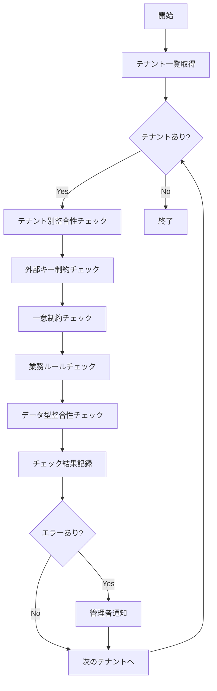

# バッチ定義書：データ整合性チェックバッチ

| 項目                | 内容                                                                                |
|---------------------|------------------------------------------------------------------------------------|
| **バッチID**        | BATCH-105                                                                          |
| **バッチ名称**      | データ整合性チェックバッチ                                                          |
| **機能カテゴリ**    | データ管理・バックアップ                                                            |
| **概要・目的**      | データベース全体の整合性を定期的にチェックし、データ不整合を早期発見・修正する       |
| **バッチ種別**      | 定期バッチ                                                                          |
| **実行スケジュール**| 毎日深夜（5:30）                                                                    |
| **入出力対象**      | 全テーブル、整合性チェック結果テーブル                                              |
| **優先度**          | 高                                                                                  |
| **備考**            | マルチテナント対応、テナント別チェック実行                                          |

## 1. 処理概要

データ整合性チェックバッチは、マルチテナント環境において各テナントのデータベース整合性を定期的に検証し、データ不整合やリレーション違反を早期発見するバッチ処理です。外部キー制約、一意制約、業務ルール違反などを包括的にチェックし、問題があれば管理者に通知します。

## 2. 処理フロー



## 3. 入力データ

### 3.1 対象テーブル（全テーブル）

| テーブルカテゴリ    | 主要テーブル                                           |
|---------------------|-------------------------------------------------------|
| テナント管理        | tenants, tenant_settings, tenant_users               |
| ユーザー管理        | users, user_profiles, user_roles                     |
| スキル管理          | skills, skill_categories, user_skills                |
| レポート管理        | reports, report_templates, report_data               |
| 通知管理            | notifications, notification_templates                |
| システム管理        | audit_logs, system_settings                          |

### 3.2 チェック設定

| 設定項目                | データ型 | デフォルト値 | 説明                                 |
|-------------------------|----------|--------------|--------------------------------------|
| check_foreign_keys      | Boolean  | true         | 外部キー制約チェック有効/無効        |
| check_unique_constraints| Boolean  | true         | 一意制約チェック有効/無効            |
| check_business_rules    | Boolean  | true         | 業務ルールチェック有効/無効          |
| check_data_types        | Boolean  | true         | データ型整合性チェック有効/無効      |
| max_error_count         | Integer  | 1000         | 最大エラー記録件数                   |

## 4. 出力データ

### 4.1 整合性チェック結果テーブル（新規作成）

| フィールド名      | データ型 | 説明                                           |
|-------------------|----------|------------------------------------------------|
| check_id          | String   | チェック実行ID（主キー）                       |
| tenant_id         | String   | テナントID                                     |
| table_name        | String   | チェック対象テーブル名                         |
| check_type        | String   | チェック種別（FK/UNIQUE/BUSINESS/DATATYPE）    |
| error_type        | String   | エラー種別                                     |
| error_description | String   | エラー詳細説明                                 |
| affected_records  | Integer  | 影響レコード数                                 |
| severity          | String   | 重要度（CRITICAL/HIGH/MEDIUM/LOW）             |
| status            | String   | 状態（DETECTED/FIXED/IGNORED）                 |
| detected_at       | DateTime | 検出日時                                       |
| fixed_at          | DateTime | 修正日時                                       |

### 4.2 チェック実行履歴テーブル（新規作成）

| フィールド名      | データ型 | 説明                                           |
|-------------------|----------|------------------------------------------------|
| execution_id      | String   | 実行ID（主キー）                               |
| tenant_id         | String   | テナントID                                     |
| execution_start   | DateTime | 実行開始日時                                   |
| execution_end     | DateTime | 実行終了日時                                   |
| total_tables      | Integer  | チェック対象テーブル数                         |
| total_records     | Integer  | チェック対象レコード数                         |
| error_count       | Integer  | 検出エラー数                                   |
| status            | String   | 実行ステータス（SUCCESS/FAILED/PARTIAL）       |
| execution_summary | String   | 実行サマリー                                   |

### 4.3 管理者通知

重要度がHIGH以上のエラーが検出された場合、以下の内容で管理者に通知：

- 件名：「データ整合性チェック：重要なエラーを検出」
- 本文：テナント情報、エラー種別、影響範囲、推奨対応

## 5. チェック仕様

### 5.1 外部キー制約チェック

```sql
-- 孤立レコードの検出例
SELECT t1.id, t1.tenant_id 
FROM user_skills t1 
LEFT JOIN users t2 ON t1.user_id = t2.id AND t1.tenant_id = t2.tenant_id
WHERE t2.id IS NULL;
```

### 5.2 一意制約チェック

```sql
-- 重複レコードの検出例
SELECT tenant_id, email, COUNT(*) as duplicate_count
FROM users 
GROUP BY tenant_id, email 
HAVING COUNT(*) > 1;
```

### 5.3 業務ルールチェック

| ルール名                | チェック内容                                           |
|-------------------------|-------------------------------------------------------|
| テナント分離            | 全テーブルでテナントIDが正しく設定されているか        |
| 日付整合性              | 開始日 ≤ 終了日の関係が保たれているか                 |
| ステータス整合性        | 無効なステータス値が設定されていないか                |
| 権限整合性              | ユーザーロールと権限の組み合わせが正しいか            |

### 5.4 データ型整合性チェック

| チェック項目            | 内容                                                   |
|-------------------------|-------------------------------------------------------|
| 数値範囲                | 数値フィールドが定義範囲内にあるか                    |
| 文字列長                | 文字列フィールドが最大長を超えていないか              |
| 日付形式                | 日付フィールドが正しい形式か                          |
| JSON形式                | JSONフィールドが正しい形式か                          |

## 6. エラー処理

| エラーケース                      | 対応方法                                                                 |
|-----------------------------------|--------------------------------------------------------------------------|
| DBアクセスエラー                  | エラーログを記録し、該当テナントをスキップして継続処理                   |
| チェック処理タイムアウト          | 処理を中断し、部分実行として記録。次回実行時に継続                       |
| 大量エラー検出                    | 設定した最大エラー数に達した場合、処理を中断し緊急通知                   |
| メモリ不足                        | バッチサイズを縮小して再実行                                             |

## 7. 自動修正機能

### 7.1 軽微なエラーの自動修正

| エラー種別              | 自動修正内容                                           |
|-------------------------|-------------------------------------------------------|
| 孤立レコード            | 参照先が存在しない場合、論理削除フラグを設定          |
| 無効ステータス          | デフォルト値に自動修正                                |
| 日付不整合              | 開始日を終了日に合わせて調整                          |

### 7.2 修正不可能なエラー

重要なデータ整合性エラーは自動修正せず、管理者判断を仰ぐ：
- 重複する主キー
- 必須フィールドのNULL値
- 重要な外部キー制約違反

## 8. 依存関係

- 全データベーステーブル
- テナント管理システム
- 通知サービス
- 監査ログシステム

## 9. 実行パラメータ

| パラメータ名        | 必須 | デフォルト値 | 説明                                           |
|---------------------|------|--------------|------------------------------------------------|
| --tenant-id         | No   | all          | 特定テナントのみチェック                       |
| --check-type        | No   | all          | 特定チェック種別のみ実行                       |
| --auto-fix          | No   | false        | 軽微なエラーの自動修正を有効化                 |
| --dry-run           | No   | false        | チェックのみ実行、結果記録なし                 |
| --max-errors        | No   | 1000         | 最大エラー記録件数の上書き                     |

## 10. 実行例

```bash
# 通常実行
npm run batch:data-integrity-check

# 特定テナントのみチェック
npm run batch:data-integrity-check -- --tenant-id=tenant_001

# 外部キー制約のみチェック
npm run batch:data-integrity-check -- --check-type=foreign_key

# 自動修正有効
npm run batch:data-integrity-check -- --auto-fix

# ドライラン
npm run batch:data-integrity-check -- --dry-run

# TypeScript直接実行
npx tsx src/batch/data-integrity-check.ts

# パラメータ付きTypeScript実行
npx tsx src/batch/data-integrity-check.ts --tenant-id=tenant_001 --auto-fix
```

## 11. 運用上の注意点

- 本バッチは他のバッチ処理の影響を受けないよう、データ更新系バッチの実行後に実行してください。
- 大量のエラーが検出された場合は、システム全体の健全性に問題がある可能性があるため、緊急対応が必要です。
- テナント数が多い場合、実行時間が長くなる可能性があるため、並列処理の導入を検討してください。
- 自動修正機能は慎重に使用し、重要なデータについては必ず管理者の確認を経てから修正してください。

## 12. パフォーマンス最適化

### 12.1 インデックス要件

整合性チェックの高速化のため、以下のインデックスが必要：

```sql
-- 外部キーチェック用
CREATE INDEX idx_user_skills_user_tenant ON user_skills(user_id, tenant_id);
CREATE INDEX idx_reports_user_tenant ON reports(user_id, tenant_id);

-- 重複チェック用
CREATE INDEX idx_users_email_tenant ON users(email, tenant_id);
CREATE INDEX idx_skills_name_tenant ON skills(name, tenant_id);
```

### 12.2 バッチサイズ調整

| テナント規模    | 推奨バッチサイズ | 並列度 |
|-----------------|------------------|--------|
| 小規模（～100件）| 1000件          | 1      |
| 中規模（～1000件）| 5000件         | 2      |
| 大規模（1000件～）| 10000件        | 4      |

## 13. 改訂履歴

| 改訂日     | 改訂者 | 改訂内容                                         |
|------------|--------|--------------------------------------------------|
| 2025/05/31 | 初版   | 初版作成                                         |
