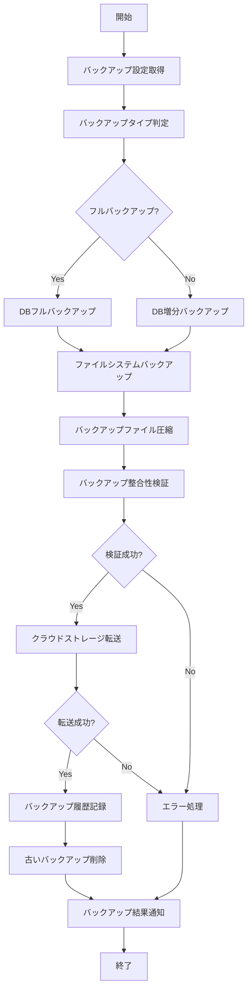

# バッチ定義書：バックアップバッチ

| 項目                | 内容                                                                                |
|---------------------|------------------------------------------------------------------------------------|
| **バッチID**        | BATCH-103                                                                          |
| **バッチ名称**      | バックアップバッチ                                                                  |
| **機能カテゴリ**    | システム管理                                                                        |
| **概要・目的**      | DB・ファイルの定期バックアップを行い、システムデータの安全性を確保する               |
| **バッチ種別**      | 定期バッチ                                                                          |
| **実行スケジュール**| 毎日深夜（2:30）                                                                    |
| **入出力対象**      | BackupHistory                                                                       |
| **優先度**          | 高                                                                                  |
| **備考**            | クラウドストレージ連携                                                              |

## 1. 処理概要

バックアップバッチは、システムのデータベースおよび重要ファイルの定期的なバックアップを実行し、データの安全性と可用性を確保するバッチ処理です。日次の増分バックアップと週次のフルバックアップを組み合わせて効率的にデータを保護し、障害発生時の迅速な復旧を可能にします。バックアップデータはローカルストレージに一時保存された後、クラウドストレージに転送され、地理的に分散した安全な環境で保管されます。また、バックアップの整合性検証や保持期間に基づく古いバックアップの自動削除も行います。

## 2. 処理フロー



## 3. 入力データ

### 3.1 BackupConfigテーブル

| フィールド名      | データ型 | 説明                                           |
|-------------------|----------|------------------------------------------------|
| config_id         | String   | 設定ID（主キー）                               |
| backup_type       | String   | バックアップタイプ（"DATABASE"/"FILE"/"BOTH"） |
| target_name       | String   | バックアップ対象名                             |
| target_path       | String   | バックアップ対象パス                           |
| full_backup_day   | Integer  | フルバックアップ実行曜日（1=月曜〜7=日曜）     |
| retention_days    | Integer  | 保持日数                                       |
| compression_level | Integer  | 圧縮レベル（1-9）                              |
| encryption_enabled| Boolean  | 暗号化有効/無効                                |
| priority          | Integer  | 優先度（実行順序）                             |
| active            | Boolean  | 有効フラグ                                     |
| created_at        | DateTime | 作成日時                                       |
| last_modified_at  | DateTime | 最終更新日時                                   |
| last_modified_by  | String   | 最終更新者                                     |

### 3.2 データベース接続情報

| 設定項目                    | データ型 | 説明                                 |
|-----------------------------|----------|--------------------------------------|
| db_host                     | String   | データベースホスト                   |
| db_port                     | Integer  | データベースポート                   |
| db_name                     | String   | データベース名                       |
| db_user                     | String   | データベースユーザー                 |
| db_password                 | String   | データベースパスワード（暗号化）     |
| db_type                     | String   | データベースタイプ（"MySQL"/"PostgreSQL"など）|

### 3.3 システム設定

| 設定項目                    | データ型 | デフォルト値 | 説明                                 |
|-----------------------------|----------|--------------|--------------------------------------|
| backup_local_path           | String   | "/backups"   | ローカルバックアップパス             |
| backup_temp_path            | String   | "/tmp/backups" | 一時バックアップパス               |
| cloud_storage_enabled       | Boolean  | true         | クラウドストレージ連携有効/無効      |
| cloud_storage_provider      | String   | "AWS"        | クラウドストレージプロバイダ（"AWS"/"GCP"/"Azure"）|
| cloud_storage_bucket        | String   | "app-backups" | クラウドストレージバケット名        |
| cloud_storage_path          | String   | "/daily"     | クラウドストレージパス               |
| cloud_storage_credentials   | String   | ""           | クラウドストレージ認証情報（暗号化） |
| notify_admin_on_backup      | Boolean  | true         | バックアップ完了時の管理者通知有無   |
| notify_admin_on_error       | Boolean  | true         | エラー発生時の管理者通知有無         |
| max_concurrent_backups      | Integer  | 3            | 最大同時バックアップ数               |

## 4. 出力データ

### 4.1 バックアップファイル

**ファイル形式**: 圧縮アーカイブ (.tar.gz / .zip)  
**ファイル名パターン**: `{target_name}_{backup_type}_{YYYYMMDD_HHMMSS}.tar.gz`  
**例**: `main_db_full_20250529_023000.tar.gz`, `uploads_incremental_20250529_023015.zip`

### 4.2 BackupHistoryテーブル（追加）

| フィールド名      | データ型 | 説明                                           |
|-------------------|----------|------------------------------------------------|
| backup_id         | String   | バックアップID（主キー）                       |
| config_id         | String   | 設定ID（外部キー）                             |
| backup_date       | DateTime | バックアップ日時                               |
| backup_type       | String   | バックアップタイプ（"FULL"/"INCREMENTAL"）     |
| target_name       | String   | バックアップ対象名                             |
| file_name         | String   | バックアップファイル名                         |
| file_size         | Long     | ファイルサイズ（バイト）                       |
| local_path        | String   | ローカルパス                                   |
| cloud_path        | String   | クラウドパス                                   |
| checksum          | String   | チェックサム（SHA-256）                        |
| compression_ratio | Double   | 圧縮率                                         |
| encryption_used   | Boolean  | 暗号化使用有無                                 |
| duration_seconds  | Integer  | 処理時間（秒）                                 |
| status            | String   | ステータス（"SUCCESS"/"PARTIAL"/"FAILED"）     |
| error_details     | Text     | エラー詳細（発生時）                           |
| expiry_date       | Date     | 有効期限日                                     |
| created_at        | DateTime | 作成日時                                       |
| created_by        | String   | "SYSTEM_BATCH"                                 |

### 4.3 バックアップログファイル

**ファイル形式**: テキスト (.log)  
**ファイル名**: `backup_YYYYMMDD.log`  
**内容**:
- バックアップ開始・終了時刻
- 処理対象一覧
- 処理結果詳細
- エラー情報（発生時）
- パフォーマンス統計

### 4.4 管理者通知

**通知方法**: メール  
**対象者**: システム管理者

**成功時テンプレート**:
```
件名: 【バックアップ完了】日次バックアップ実行結果 ({実行日})

システム管理者様

日次バックアップが正常に完了しました。

■実行概要
実行日時: {実行日時}
バックアップタイプ: {バックアップタイプ}
処理時間: {処理時間}

■バックアップ詳細
対象数: {対象数}
総サイズ: {総サイズ}
圧縮後サイズ: {圧縮後サイズ}
圧縮率: {圧縮率}

■保存場所
ローカルパス: {ローカルパス}
クラウドパス: {クラウドパス}

■保持期間
保持期限: {保持期限}
自動削除予定日: {自動削除予定日}

※このメールはシステムより自動送信されています。
```

**エラー時テンプレート**:
```
件名: 【緊急】バックアップエラー発生 ({実行日})

システム管理者様

日次バックアップの実行中にエラーが発生しました。
早急な確認と対応をお願いします。

■実行概要
実行日時: {実行日時}
バックアップタイプ: {バックアップタイプ}
ステータス: {ステータス}

■エラー詳細
エラー発生箇所: {エラー発生箇所}
エラーメッセージ: {エラーメッセージ}
影響対象: {影響対象}

■部分的に成功したバックアップ
{成功したバックアップリスト}

■ログファイル
{ログファイルパス}

※このメールはシステムより自動送信されています。
```

## 5. エラー処理

| エラーケース                      | 対応方法                                                                 |
|-----------------------------------|--------------------------------------------------------------------------|
| データベース接続エラー            | エラーログを記録し、管理者に通知。処理を中断。                           |
| バックアップコマンド実行エラー    | エラーログを記録し、管理者に通知。他の対象の処理は継続。                 |
| ディスク容量不足                  | エラーログを記録し、管理者に通知。処理を中断。                           |
| 圧縮処理エラー                    | エラーログを記録し、非圧縮ファイルでバックアップを試行。                 |
| クラウドストレージ接続エラー      | エラーログを記録し、管理者に通知。ローカルバックアップのみ保持。         |
| クラウドストレージ転送エラー      | エラーログを記録し、管理者に通知。再試行スケジュールを設定。             |
| 整合性検証エラー                  | エラーログを記録し、管理者に通知。バックアップを無効としてマーク。       |
| 古いバックアップ削除エラー        | 警告ログを記録し、管理者に通知。メインのバックアップ処理は完了させる。   |
| 設定値不正                        | デフォルト値を使用し、警告ログを記録。                                   |

## 6. 依存関係

- BackupConfigテーブル
- BackupHistoryテーブル
- データベースバックアップツール（mysqldump, pg_dump など）
- ファイルシステムバックアップツール（tar, rsync など）
- 圧縮ツール（gzip, zip など）
- 暗号化ライブラリ
- クラウドストレージSDK
- メール通知サービス

## 7. 実行パラメータ

| パラメータ名        | 必須 | デフォルト値 | 説明                                           |
|---------------------|------|--------------|------------------------------------------------|
| --config-id         | No   | null         | 特定設定のみを対象とする場合に指定             |
| --backup-type       | No   | null         | バックアップタイプを上書き（"FULL"/"INCREMENTAL"）|
| --target-name       | No   | null         | 特定対象のみをバックアップする場合に指定       |
| --skip-cloud        | No   | false        | クラウドストレージ転送をスキップ               |
| --skip-notification | No   | false        | 管理者通知をスキップ                           |
| --retention-override| No   | null         | 保持期間を上書き（日数）                       |
| --compression-level | No   | null         | 圧縮レベルを上書き（1-9）                      |
| --dry-run           | No   | false        | 実行シミュレーションのみ（実際のバックアップなし）|

## 8. 実行例

```bash
# 通常実行
npm run batch:backup

# フルバックアップを強制実行
npm run batch:backup -- --backup-type=FULL

# 特定対象のみバックアップ
npm run batch:backup -- --target-name=main_db

# クラウド転送なしで実行
npm run batch:backup -- --skip-cloud

# 保持期間を90日に設定して実行
npm run batch:backup -- --retention-override=90

# 実行シミュレーション（ドライラン）
npm run batch:backup -- --dry-run
```

## 9. 運用上の注意点

- 本バッチは毎日深夜に実行され、曜日に応じてフルバックアップまたは増分バックアップを実行します。
- フルバックアップは処理時間とディスク容量を多く消費するため、システム負荷の低い時間帯に実行するよう設定してください。
- バックアップファイルは一時的にローカルストレージに保存されるため、十分なディスク容量を確保してください。
- クラウドストレージへの転送は、ネットワーク帯域を消費します。必要に応じて帯域制限を設定することを検討してください。
- 暗号化を有効にする場合は、暗号化キーの安全な管理が重要です。キーの紛失はデータ復旧不能の原因となります。
- バックアップの定期的な復元テストを実施し、バックアップデータの有効性を確認することを推奨します。
- 保持期間を超えたバックアップは自動的に削除されます。重要なバックアップは別途アーカイブすることを検討してください。
- クラウドストレージのコスト管理のため、不要なバックアップの早期削除や低頻度アクセスストレージへの移行を検討してください。

## 10. 改訂履歴

| 改訂日     | 改訂者 | 改訂内容                                         |
|------------|--------|--------------------------------------------------|
| 2025/05/29 | 初版   | 初版作成                                         |
