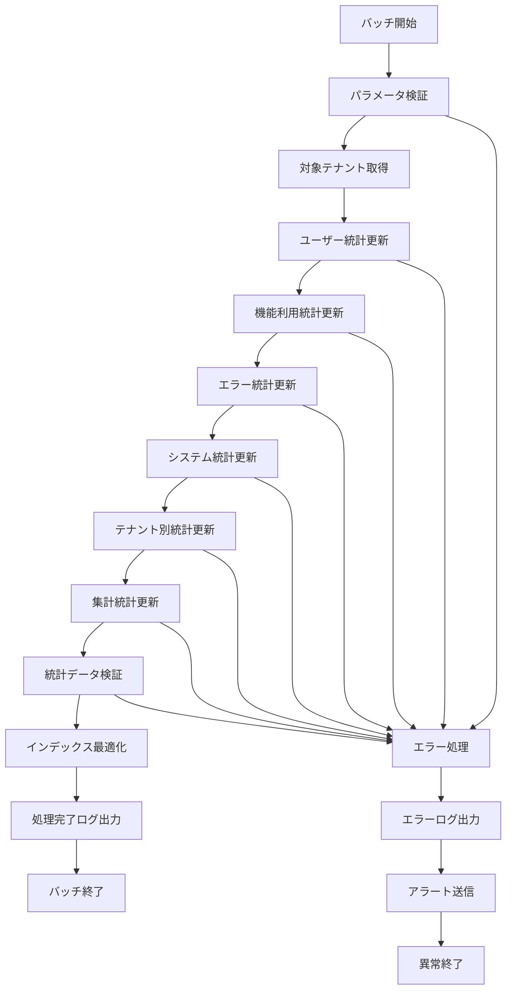

# バッチ定義書：統計データ更新バッチ (BATCH-201)

## 1. 基本情報

| 項目 | 内容 |
|------|------|
| **バッチID** | BATCH-201 |
| **バッチ名** | 統計データ更新バッチ |
| **実行スケジュール** | 日次 01:00 |
| **優先度** | 高 |
| **ステータス** | 設計完了 |
| **作成日** | 2025/05/31 |
| **最終更新日** | 2025/05/31 |

## 2. バッチ概要

### 2.1 概要・目的
システム全体の各種統計データを日次で更新・集計するバッチ処理です。ダッシュボード表示、レポート生成、分析機能の基礎となる統計情報を提供します。

### 2.2 関連テーブル
- [TBL-001_テナント管理](../database/tables/テーブル定義書_TBL-001.md)
- [TBL-015_使用量統計](../database/tables/テーブル定義書_TBL-015.md)
- [TBL-016_ユーザー統計](../database/tables/テーブル定義書_TBL-016.md)
- [TBL-017_機能利用統計](../database/tables/テーブル定義書_TBL-017.md)
- [TBL-018_エラー統計](../database/tables/テーブル定義書_TBL-018.md)

### 2.3 関連API
- [API-301_統計データ取得API](../api/specs/API定義書_API-301.md)
- [API-302_ダッシュボード統計API](../api/specs/API定義書_API-302.md)

## 3. 実行仕様

### 3.1 実行スケジュール
| 項目 | 設定値 | 備考 |
|------|--------|------|
| 実行頻度 | 日次 | cron: 0 1 * * * |
| 実行時間 | 01:00 | 深夜バッチ |
| タイムアウト | 60分 | 最大実行時間 |
| リトライ回数 | 3回 | 失敗時の再実行 |

### 3.2 実行条件
| 条件 | 内容 | 備考 |
|------|------|------|
| 前提条件 | なし | 独立実行可能 |
| 実行可能時間 | 00:30-03:00 | 深夜メンテナンス時間 |
| 排他制御 | 同一バッチの重複実行禁止 | ロックファイル使用 |

### 3.3 実行パラメータ
| パラメータ名 | データ型 | 必須 | デフォルト値 | 説明 |
|--------------|----------|------|--------------|------|
| target_date | date | × | 前日 | 統計対象日 |
| tenant_id | string | × | all | 対象テナントID |
| stats_type | string | × | all | 統計種別指定 |
| dry_run | boolean | × | false | テスト実行フラグ |

## 4. 処理仕様

### 4.1 処理フロー


### 4.2 詳細処理

#### 4.2.1 ユーザー統計更新
```sql
-- 日次アクティブユーザー統計
INSERT INTO user_statistics (
  tenant_id, 
  statistics_date, 
  total_users, 
  active_users, 
  new_users, 
  login_count,
  avg_session_duration
)
SELECT 
  u.tenant_id,
  :target_date as statistics_date,
  COUNT(DISTINCT u.id) as total_users,
  COUNT(DISTINCT CASE WHEN ul.login_at >= :target_date THEN u.id END) as active_users,
  COUNT(DISTINCT CASE WHEN DATE(u.created_at) = :target_date THEN u.id END) as new_users,
  COUNT(ul.id) as login_count,
  AVG(ul.session_duration) as avg_session_duration
FROM users u
LEFT JOIN user_logins ul ON u.id = ul.user_id 
  AND DATE(ul.login_at) = :target_date
WHERE u.tenant_id = :tenant_id
GROUP BY u.tenant_id
ON DUPLICATE KEY UPDATE
  total_users = VALUES(total_users),
  active_users = VALUES(active_users),
  new_users = VALUES(new_users),
  login_count = VALUES(login_count),
  avg_session_duration = VALUES(avg_session_duration);
```

#### 4.2.2 機能利用統計更新
```sql
-- 機能別利用統計
INSERT INTO feature_usage_statistics (
  tenant_id,
  statistics_date,
  feature_name,
  usage_count,
  unique_users,
  total_duration,
  avg_duration
)
SELECT 
  tenant_id,
  :target_date as statistics_date,
  feature_name,
  COUNT(*) as usage_count,
  COUNT(DISTINCT user_id) as unique_users,
  SUM(duration_seconds) as total_duration,
  AVG(duration_seconds) as avg_duration
FROM feature_usage_logs
WHERE DATE(used_at) = :target_date
  AND tenant_id = :tenant_id
GROUP BY tenant_id, feature_name
ON DUPLICATE KEY UPDATE
  usage_count = VALUES(usage_count),
  unique_users = VALUES(unique_users),
  total_duration = VALUES(total_duration),
  avg_duration = VALUES(avg_duration);
```

#### 4.2.3 エラー統計更新
```sql
-- エラー発生統計
INSERT INTO error_statistics (
  tenant_id,
  statistics_date,
  error_type,
  error_count,
  affected_users,
  critical_errors,
  resolved_errors
)
SELECT 
  tenant_id,
  :target_date as statistics_date,
  error_type,
  COUNT(*) as error_count,
  COUNT(DISTINCT user_id) as affected_users,
  COUNT(CASE WHEN severity = 'critical' THEN 1 END) as critical_errors,
  COUNT(CASE WHEN status = 'resolved' THEN 1 END) as resolved_errors
FROM error_logs
WHERE DATE(occurred_at) = :target_date
  AND tenant_id = :tenant_id
GROUP BY tenant_id, error_type
ON DUPLICATE KEY UPDATE
  error_count = VALUES(error_count),
  affected_users = VALUES(affected_users),
  critical_errors = VALUES(critical_errors),
  resolved_errors = VALUES(resolved_errors);
```

#### 4.2.4 システム統計更新
```sql
-- システム全体統計
INSERT INTO system_statistics (
  statistics_date,
  total_tenants,
  active_tenants,
  total_users,
  active_users,
  total_api_calls,
  avg_response_time,
  error_rate,
  system_uptime
)
SELECT 
  :target_date as statistics_date,
  COUNT(DISTINCT t.id) as total_tenants,
  COUNT(DISTINCT CASE WHEN us.active_users > 0 THEN t.id END) as active_tenants,
  SUM(us.total_users) as total_users,
  SUM(us.active_users) as active_users,
  SUM(usage.api_calls_count) as total_api_calls,
  AVG(usage.avg_response_time) as avg_response_time,
  (SUM(es.error_count) * 100.0 / NULLIF(SUM(usage.api_calls_count), 0)) as error_rate,
  AVG(health.uptime_percentage) as system_uptime
FROM tenants t
LEFT JOIN user_statistics us ON t.id = us.tenant_id AND us.statistics_date = :target_date
LEFT JOIN usage_statistics usage ON t.id = usage.tenant_id AND usage.usage_date = :target_date
LEFT JOIN error_statistics es ON t.id = es.tenant_id AND es.statistics_date = :target_date
LEFT JOIN system_health_checks health ON DATE(health.checked_at) = :target_date
ON DUPLICATE KEY UPDATE
  total_tenants = VALUES(total_tenants),
  active_tenants = VALUES(active_tenants),
  total_users = VALUES(total_users),
  active_users = VALUES(active_users),
  total_api_calls = VALUES(total_api_calls),
  avg_response_time = VALUES(avg_response_time),
  error_rate = VALUES(error_rate),
  system_uptime = VALUES(system_uptime);
```

## 5. データ仕様

### 5.1 入力データ
| データ名 | 形式 | 取得元 | 説明 |
|----------|------|--------|------|
| ユーザーログイン履歴 | DB | user_logins | ユーザー活動データ |
| 機能使用履歴 | DB | feature_usage_logs | 機能利用データ |
| エラーログ | DB | error_logs | システムエラーデータ |
| API呼び出し履歴 | DB | api_call_logs | API使用データ |
| システムヘルスチェック | DB | system_health_checks | システム稼働データ |

### 5.2 出力データ
| データ名 | 形式 | 出力先 | 説明 |
|----------|------|--------|------|
| ユーザー統計 | DB | user_statistics | ユーザー活動統計 |
| 機能利用統計 | DB | feature_usage_statistics | 機能別利用統計 |
| エラー統計 | DB | error_statistics | エラー発生統計 |
| システム統計 | DB | system_statistics | システム全体統計 |
| 実行ログ | LOG | /logs/batch/ | 実行履歴ログ |

### 5.3 データ量見積もり
| 項目 | 件数 | 備考 |
|------|------|------|
| 対象テナント数 | 100テナント | 平均値 |
| 統計レコード数 | 500件/日 | 全統計種別合計 |
| 処理時間 | 30分 | 平均実行時間 |

## 6. エラーハンドリング

### 6.1 エラー分類
| エラー種別 | 対応方法 | 通知要否 | 備考 |
|------------|----------|----------|------|
| データ不足 | 前日データで補完・継続 | △ | 一部統計欠損 |
| 計算エラー | エラーログ出力・継続 | × | 個別統計失敗 |
| DB接続エラー | リトライ・継続 | ○ | 接続問題 |
| インデックスエラー | 警告ログ出力・継続 | △ | 性能影響 |

### 6.2 リトライ仕様
| 条件 | リトライ回数 | 間隔 | 備考 |
|------|--------------|------|------|
| DB接続エラー | 3回 | 5分 | 指数バックオフ |
| 計算タイムアウト | 2回 | 2分 | 固定間隔 |
| インデックス作成エラー | 1回 | 10分 | 固定間隔 |

## 7. 監視・運用

### 7.1 監視項目
| 監視項目 | 閾値 | アラート条件 | 対応方法 |
|----------|------|--------------|----------|
| 実行時間 | 60分 | 超過時 | 処理見直し |
| 統計計算失敗率 | 5% | 超過時 | 原因調査 |
| データ欠損率 | 10% | 超過時 | データ確認 |
| メモリ使用量 | 2GB | 超過時 | リソース調整 |

### 7.2 ログ出力
| ログ種別 | 出力レベル | 出力内容 | 保存期間 |
|----------|------------|----------|----------|
| 実行ログ | INFO | 処理開始・終了・進捗 | 3ヶ月 |
| 統計ログ | INFO | 統計計算結果 | 6ヶ月 |
| エラーログ | ERROR | エラー詳細・スタックトレース | 1年 |

### 7.3 アラート通知
| 通知条件 | 通知先 | 通知方法 | 備考 |
|----------|--------|----------|------|
| 異常終了 | 運用チーム | メール・Slack | 即座に通知 |
| 統計計算エラー | 開発チーム | Slack | 業務時間内のみ |
| データ欠損 | 運用チーム | メール | 日次サマリー |

## 8. 非機能要件

### 8.1 パフォーマンス
- 処理時間：60分以内
- メモリ使用量：2GB以内
- CPU使用率：50%以内
- 並列処理：統計種別単位で並列実行可能

### 8.2 可用性
- 成功率：99%以上
- リトライ機能による自動復旧
- 部分実行・再開機能
- 障害時の手動実行機能

### 8.3 セキュリティ
- 実行権限の制限
- 統計データのアクセス制御
- 個人情報の匿名化

## 9. 実装メモ

### 9.1 技術仕様
- 言語：Node.js (TypeScript)
- フレームワーク：なし（Pure Node.js）
- DB接続：Prisma
- ログ出力：Winston
- 並列処理：Worker Threads

### 9.2 注意事項
- マルチテナント対応必須
- 統計計算の精度保証
- 大量データ処理時のメモリ管理
- インデックス最適化による性能向上

---

**改訂履歴**

| バージョン | 日付 | 変更者 | 変更内容 |
|------------|------|--------|----------|
| 1.0 | 2025/05/31 | システムアーキテクト | 初版作成 |
