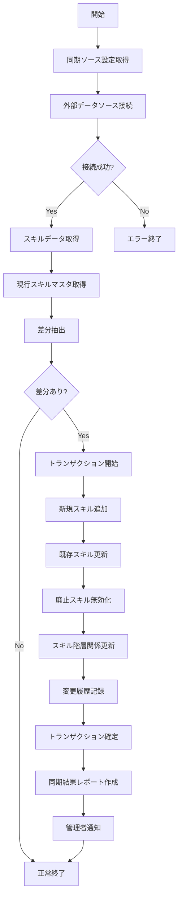

# バッチ定義書：スキルマスタ定期同期バッチ

| 項目                | 内容                                                                                |
|---------------------|------------------------------------------------------------------------------------|
| **バッチID**        | BATCH-201                                                                          |
| **バッチ名称**      | スキルマスタ定期同期バッチ                                                          |
| **機能カテゴリ**    | スキル管理                                                                          |
| **概要・目的**      | スキルマスタの一括インポート・外部連携を行い、最新のスキル体系を維持する             |
| **バッチ種別**      | 定期バッチ                                                                          |
| **実行スケジュール**| 毎週日曜深夜（3:00）                                                                |
| **入出力対象**      | SkillHierarchy                                                                      |
| **優先度**          | 高                                                                                  |
| **備考**            | 外部DB/CSV連携可                                                                    |

## 1. 処理概要

スキルマスタ定期同期バッチは、外部システムや標準スキル定義ファイルからスキル階層構造データを取得し、システム内のスキルマスタを最新の状態に保つバッチ処理です。業界標準スキルや社内独自スキル体系の変更を定期的に取り込み、スキル評価・分析の基盤となるスキル階層マスタを維持します。新規スキルの追加、既存スキルの更新、廃止スキルの無効化などを一括で処理します。

## 2. 処理フロー



## 3. 入力データ

### 3.1 外部スキルデータソース

#### 3.1.1 外部APIの場合

**エンドポイント**: `/api/v1/skills`  
**認証方式**: API Key / OAuth2.0  
**レスポンス形式**: JSON

```json
{
  "skills": [
    {
      "skill_id": "SKILL-001",
      "skill_name": "Java",
      "parent_skill_id": "PROG-LANG",
      "skill_category": "プログラミング",
      "skill_subcategory": "言語",
      "skill_level": 3,
      "importance": 4,
      "description": "Javaプログラミング言語",
      "active": true,
      "last_updated": "2025-04-01T00:00:00Z"
    },
    // 他のスキル情報...
  ]
}
```

#### 3.1.2 CSVファイルの場合

**ファイル形式**: CSV  
**文字コード**: UTF-8  
**区切り文字**: カンマ(,)  
**ヘッダ行**: あり

```
skill_id,skill_name,parent_skill_id,skill_category,skill_subcategory,skill_level,importance,description,active,last_updated
SKILL-001,Java,PROG-LANG,プログラミング,言語,3,4,Javaプログラミング言語,true,2025-04-01T00:00:00Z
SKILL-002,Python,PROG-LANG,プログラミング,言語,3,4,Pythonプログラミング言語,true,2025-04-01T00:00:00Z
...
```

#### 3.1.3 データベース連携の場合

**接続情報**: 外部DBへの接続パラメータ（URL、認証情報など）  
**クエリ**: スキル情報取得用SQL

### 3.2 SkillHierarchyテーブル（現行データ）

| フィールド名      | データ型 | 説明                                           |
|-------------------|----------|------------------------------------------------|
| skill_id          | String   | スキルID（主キー）                             |
| parent_skill_id   | String   | 親スキルID（外部キー、自己参照）               |
| skill_name        | String   | スキル名称                                     |
| skill_category    | String   | スキルカテゴリ                                 |
| skill_subcategory | String   | スキルサブカテゴリ                             |
| skill_level       | Integer  | スキル階層レベル（1=カテゴリ, 2=サブカテゴリ, 3=スキル項目） |
| importance        | Integer  | 重要度（1-5）                                  |
| description       | Text     | 説明                                           |
| active            | Boolean  | 有効フラグ                                     |
| created_at        | DateTime | 作成日時                                       |
| last_modified_at  | DateTime | 最終更新日時                                   |
| last_modified_by  | String   | 最終更新者                                     |

### 3.3 システム設定

| 設定項目                    | データ型 | デフォルト値 | 説明                                 |
|-----------------------------|----------|--------------|--------------------------------------|
| skill_sync_source_type      | String   | "CSV"        | 同期ソースタイプ（"API"/"CSV"/"DB"） |
| skill_sync_source_path      | String   | "/data/skills.csv" | 同期ソースパス（CSVの場合）    |
| skill_sync_api_url          | String   | ""           | 同期API URL（APIの場合）            |
| skill_sync_api_key          | String   | ""           | 同期API認証キー                      |
| skill_sync_db_connection    | String   | ""           | 同期DB接続情報（JSON形式）           |
| skill_sync_history_retention| Integer  | 12           | 同期履歴の保持月数                   |
| notify_admin_on_sync        | Boolean  | true         | 同期完了時の管理者通知有無           |
| skill_change_threshold      | Integer  | 10           | 変更閾値（%、これを超えると警告）    |

## 4. 出力データ

### 4.1 SkillHierarchyテーブル（更新）

| フィールド名      | データ型 | 説明                                           |
|-------------------|----------|------------------------------------------------|
| skill_id          | String   | スキルID（主キー）                             |
| parent_skill_id   | String   | 親スキルID（外部キー、自己参照）               |
| skill_name        | String   | スキル名称                                     |
| skill_category    | String   | スキルカテゴリ                                 |
| skill_subcategory | String   | スキルサブカテゴリ                             |
| skill_level       | Integer  | スキル階層レベル                               |
| importance        | Integer  | 重要度                                         |
| description       | Text     | 説明                                           |
| active            | Boolean  | 有効フラグ                                     |
| created_at        | DateTime | 作成日時                                       |
| last_modified_at  | DateTime | 最終更新日時（更新）                           |
| last_modified_by  | String   | "SYSTEM_BATCH"（更新）                         |

### 4.2 SkillSyncHistoryテーブル（追加）

| フィールド名      | データ型 | 説明                                           |
|-------------------|----------|------------------------------------------------|
| sync_id           | String   | 同期ID（主キー）                               |
| sync_date         | DateTime | 同期実行日時                                   |
| source_type       | String   | 同期ソースタイプ                               |
| source_path       | String   | 同期ソースパス                                 |
| total_skills      | Integer  | 総スキル数                                     |
| added_skills      | Integer  | 追加スキル数                                   |
| updated_skills    | Integer  | 更新スキル数                                   |
| deactivated_skills| Integer  | 無効化スキル数                                 |
| error_count       | Integer  | エラー数                                       |
| status            | String   | ステータス（"SUCCESS"/"PARTIAL"/"FAILURE"）    |
| error_details     | Text     | エラー詳細（発生時）                           |
| created_at        | DateTime | 作成日時                                       |
| created_by        | String   | "SYSTEM_BATCH"                                 |

### 4.3 SkillChangeLogテーブル（追加）

| フィールド名      | データ型 | 説明                                           |
|-------------------|----------|------------------------------------------------|
| log_id            | String   | ログID（主キー）                               |
| sync_id           | String   | 同期ID（外部キー）                             |
| skill_id          | String   | スキルID（外部キー）                           |
| change_type       | String   | 変更タイプ（"ADD"/"UPDATE"/"DEACTIVATE"）      |
| field_name        | String   | 変更フィールド名（変更時のみ）                 |
| old_value         | String   | 変更前の値                                     |
| new_value         | String   | 変更後の値                                     |
| created_at        | DateTime | 作成日時                                       |

### 4.4 同期結果レポート

以下の内容でCSVファイルを生成：

- ファイル名：`skill_sync_report_YYYYMMDD_HHMMSS.csv`
- 内容：
  - 同期日時
  - 同期ソース情報
  - 処理結果（成功/失敗）
  - 総スキル数
  - 追加スキル数と追加スキルリスト
  - 更新スキル数と更新スキルリスト
  - 無効化スキル数と無効化スキルリスト
  - エラー内容（発生時）

### 4.5 管理者通知

通知設定が有効な場合、以下の内容で管理者に通知メールを送信：

- 件名：「スキルマスタ同期完了通知」
- 本文：
  - 同期日時
  - 同期ソース情報
  - 処理結果サマリ（追加/更新/無効化スキル数）
  - 主要な変更点
  - 詳細レポートへのリンク
  - エラー内容（発生時）

## 5. エラー処理

| エラーケース                      | 対応方法                                                                 |
|-----------------------------------|--------------------------------------------------------------------------|
| 外部データソース接続エラー        | エラーログを記録し、管理者に通知。処理を中断。                           |
| データ形式不正                    | エラーログを記録し、管理者に通知。処理を中断。                           |
| 一部スキルデータ不整合            | 警告ログを記録し、整合性のあるデータのみで処理を継続。                   |
| DBアクセスエラー                  | エラーログを記録し、管理者に通知。トランザクションをロールバック。       |
| スキル階層関係の循環参照          | エラーログを記録し、該当スキルの更新をスキップ。処理を継続。             |
| 通知送信エラー                    | エラーログを記録。同期処理は完了させ、通知エラーのみ管理者に報告。       |

## 6. 依存関係

- 外部スキルデータソース（API/CSV/DB）
- SkillHierarchyテーブル
- SkillSyncHistoryテーブル
- SkillChangeLogテーブル
- システム設定テーブル
- メール通知サービス
- ファイルストレージサービス

## 7. 実行パラメータ

| パラメータ名        | 必須 | デフォルト値 | 説明                                           |
|---------------------|------|--------------|------------------------------------------------|
| --source-type       | No   | 設定値       | 同期ソースタイプを上書き（"API"/"CSV"/"DB"）   |
| --source-path       | No   | 設定値       | 同期ソースパスを上書き                         |
| --force-sync        | No   | false        | 差分がなくても強制的に同期を実行               |
| --dry-run           | No   | false        | 同期対象の確認のみ行い、実際の更新は行わない   |
| --skip-notification | No   | false        | 管理者通知をスキップ                           |
| --category-filter   | No   | null         | 特定カテゴリのみを対象とする場合に指定         |

## 8. 実行例

```bash
# 通常実行
npm run batch:skill-sync

# CSVファイルを指定して実行
npm run batch:skill-sync -- --source-type=CSV --source-path=/data/new_skills.csv

# APIから同期
npm run batch:skill-sync -- --source-type=API

# ドライラン（同期対象確認のみ）
npm run batch:skill-sync -- --dry-run

# 特定カテゴリのみ同期
npm run batch:skill-sync -- --category-filter="プログラミング"

# TypeScript直接実行
npx tsx src/batch/skill-sync.ts

# パラメータ付きTypeScript実行
npx tsx src/batch/skill-sync.ts --source-type=CSV --source-path=/data/new_skills.csv --dry-run
```

## 9. 運用上の注意点

- 本バッチは毎週日曜深夜に実行され、最新のスキル体系をシステムに反映します。
- スキルマスタの大規模な変更は、ユーザーのスキル評価やレポートに影響を与える可能性があります。特に重要なスキルの無効化や大幅な変更を行う場合は、事前に影響範囲を確認することを推奨します。
- 同期ソースの変更（例：CSVからAPIへの切り替え）を行う場合は、事前にテスト環境での検証を行ってください。
- スキル階層の深さは最大3レベル（カテゴリ→サブカテゴリ→スキル項目）を想定しています。これを超える階層構造は正しく処理されない可能性があります。
- 同期履歴は `skill_sync_history_retention` の設定に基づいて保持され、期間を超えた古いデータは自動的に削除されます。
- 変更率が `skill_change_threshold` を超える場合は、大規模な変更として警告が発生します。これは誤ったデータソースからの同期を防ぐための安全機能です。

## 10. 改訂履歴

| 改訂日     | 改訂者 | 改訂内容                                         |
|------------|--------|--------------------------------------------------|
| 2025/05/29 | 初版   | 初版作成                                         |
