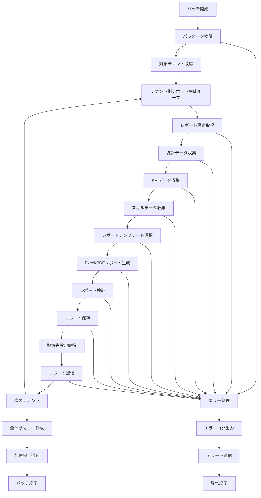

# バッチ定義書：月次レポート生成バッチ (BATCH-202)

## 1. 基本情報

| 項目 | 内容 |
|------|------|
| **バッチID** | BATCH-202 |
| **バッチ名** | 月次レポート生成バッチ |
| **実行スケジュール** | 月次 1日 06:00 |
| **優先度** | 高 |
| **ステータス** | 設計完了 |
| **作成日** | 2025/05/31 |
| **最終更新日** | 2025/05/31 |

## 2. バッチ概要

### 2.1 概要・目的
各テナントの月次レポートを自動生成し、管理者・利用者に配信するバッチ処理です。スキル管理、利用状況、パフォーマンス分析の包括的なレポートを提供します。

### 2.2 関連テーブル
- [TBL-001_テナント管理](../database/tables/テーブル定義書_TBL-001.md)
- [TBL-016_ユーザー統計](../database/tables/テーブル定義書_TBL-016.md)
- [TBL-019_KPI統計](../database/tables/テーブル定義書_TBL-019.md)
- [TBL-027_レポート履歴](../database/tables/テーブル定義書_TBL-027.md)
- [TBL-028_レポート設定](../database/tables/テーブル定義書_TBL-028.md)

### 2.3 関連API
- [API-309_レポート生成API](../api/specs/API定義書_API-309.md)
- [API-310_レポート配信API](../api/specs/API定義書_API-310.md)

## 3. 実行仕様

### 3.1 実行スケジュール
| 項目 | 設定値 | 備考 |
|------|--------|------|
| 実行頻度 | 月次 | cron: 0 6 1 * * |
| 実行時間 | 毎月1日 06:00 | 月初朝 |
| タイムアウト | 120分 | 最大実行時間 |
| リトライ回数 | 3回 | 失敗時の再実行 |

### 3.2 実行条件
| 条件 | 内容 | 備考 |
|------|------|------|
| 前提条件 | BATCH-201, BATCH-205完了後 | 統計・KPI計算依存 |
| 実行可能時間 | 05:00-09:00 | 朝の業務開始前 |
| 排他制御 | 同一バッチの重複実行禁止 | ロックファイル使用 |

### 3.3 実行パラメータ
| パラメータ名 | データ型 | 必須 | デフォルト値 | 説明 |
|--------------|----------|------|--------------|------|
| target_month | string | × | 前月 | レポート対象月（YYYY-MM） |
| tenant_id | string | × | all | 対象テナントID |
| report_type | string | × | all | レポート種別指定 |
| dry_run | boolean | × | false | テスト実行フラグ |

## 4. 処理仕様

### 4.1 処理フロー


### 4.2 詳細処理

#### 4.2.1 統計データ収集
```sql
-- 月次統計データ取得
SELECT 
  tenant_id,
  SUM(total_users) as monthly_total_users,
  AVG(active_users) as avg_active_users,
  SUM(new_users) as monthly_new_users,
  SUM(login_count) as monthly_login_count,
  AVG(avg_session_duration) as avg_session_duration
FROM user_statistics 
WHERE DATE_FORMAT(statistics_date, '%Y-%m') = :target_month
  AND tenant_id = :tenant_id
GROUP BY tenant_id;

-- 機能利用統計
SELECT 
  tenant_id,
  feature_name,
  SUM(usage_count) as monthly_usage_count,
  AVG(unique_users) as avg_unique_users,
  SUM(total_duration) as monthly_total_duration
FROM feature_usage_statistics 
WHERE DATE_FORMAT(statistics_date, '%Y-%m') = :target_month
  AND tenant_id = :tenant_id
GROUP BY tenant_id, feature_name;
```

#### 4.2.2 KPIデータ収集
```sql
-- 月次KPI統計
SELECT 
  tenant_id,
  kpi_name,
  AVG(kpi_value) as avg_kpi_value,
  MIN(kpi_value) as min_kpi_value,
  MAX(kpi_value) as max_kpi_value,
  STDDEV(kpi_value) as kpi_stddev
FROM kpi_statistics 
WHERE DATE_FORMAT(calculated_date, '%Y-%m') = :target_month
  AND tenant_id = :tenant_id
GROUP BY tenant_id, kpi_name;
```

#### 4.2.3 レポート生成処理
```typescript
interface MonthlyReportData {
  tenantId: string;
  reportMonth: string;
  
  // 基本統計
  userStatistics: UserStatistics;
  featureUsage: FeatureUsageStatistics[];
  kpiMetrics: KPIMetrics[];
  
  // スキル関連
  skillAnalysis: SkillAnalysis;
  skillGrowth: SkillGrowthMetrics;
  
  // システム利用
  systemUsage: SystemUsageMetrics;
  performanceMetrics: PerformanceMetrics;
}

class MonthlyReportGenerator {
  async generateReport(tenant: Tenant, targetMonth: string): Promise<ReportResult> {
    // データ収集
    const reportData = await this.collectReportData(tenant.id, targetMonth);
    
    // レポート設定取得
    const reportConfig = await this.getReportConfig(tenant.id);
    
    // テンプレート選択
    const template = await this.selectTemplate(reportConfig.templateType);
    
    // レポート生成
    const reports = await Promise.all([
      this.generateExcelReport(reportData, template),
      this.generatePDFReport(reportData, template),
      this.generateDashboardReport(reportData)
    ]);
    
    return {
      tenantId: tenant.id,
      reportMonth: targetMonth,
      reports,
      generatedAt: new Date()
    };
  }
  
  private async generateExcelReport(data: MonthlyReportData, template: ReportTemplate): Promise<ExcelReport> {
    const workbook = new ExcelJS.Workbook();
    
    // サマリーシート
    const summarySheet = workbook.addWorksheet('月次サマリー');
    await this.createSummarySheet(summarySheet, data);
    
    // ユーザー統計シート
    const userSheet = workbook.addWorksheet('ユーザー統計');
    await this.createUserStatisticsSheet(userSheet, data.userStatistics);
    
    // 機能利用シート
    const featureSheet = workbook.addWorksheet('機能利用状況');
    await this.createFeatureUsageSheet(featureSheet, data.featureUsage);
    
    // KPIシート
    const kpiSheet = workbook.addWorksheet('KPI分析');
    await this.createKPISheet(kpiSheet, data.kpiMetrics);
    
    // スキル分析シート
    const skillSheet = workbook.addWorksheet('スキル分析');
    await this.createSkillAnalysisSheet(skillSheet, data.skillAnalysis);
    
    const buffer = await workbook.xlsx.writeBuffer();
    const filename = `月次レポート_${data.tenantId}_${data.reportMonth}.xlsx`;
    
    return {
      type: 'excel',
      filename,
      buffer,
      size: buffer.length
    };
  }
  
  private async generatePDFReport(data: MonthlyReportData, template: ReportTemplate): Promise<PDFReport> {
    const html = await this.renderReportHTML(data, template);
    
    const browser = await puppeteer.launch();
    const page = await browser.newPage();
    
    await page.setContent(html);
    const pdf = await page.pdf({
      format: 'A4',
      printBackground: true,
      margin: {
        top: '20mm',
        right: '15mm',
        bottom: '20mm',
        left: '15mm'
      }
    });
    
    await browser.close();
    
    const filename = `月次レポート_${data.tenantId}_${data.reportMonth}.pdf`;
    
    return {
      type: 'pdf',
      filename,
      buffer: pdf,
      size: pdf.length
    };
  }
}
```

#### 4.2.4 レポート配信処理
```typescript
class ReportDistributionService {
  async distributeReport(tenant: Tenant, reports: ReportResult): Promise<DistributionResult> {
    const distributionConfig = await this.getDistributionConfig(tenant.id);
    const results: DistributionResult[] = [];
    
    for (const config of distributionConfig) {
      try {
        switch (config.method) {
          case 'email':
            await this.sendEmailReport(config, reports);
            break;
          case 'slack':
            await this.sendSlackReport(config, reports);
            break;
          case 'teams':
            await this.sendTeamsReport(config, reports);
            break;
          case 'download':
            await this.prepareDownloadReport(config, reports);
            break;
        }
        
        results.push({
          method: config.method,
          status: 'success',
          recipients: config.recipients
        });
      } catch (error) {
        results.push({
          method: config.method,
          status: 'failed',
          error: error.message,
          recipients: config.recipients
        });
      }
    }
    
    return {
      tenantId: tenant.id,
      distributionResults: results,
      distributedAt: new Date()
    };
  }
  
  private async sendEmailReport(config: DistributionConfig, reports: ReportResult): Promise<void> {
    const attachments = reports.reports.map(report => ({
      filename: report.filename,
      content: report.buffer,
      contentType: report.type === 'excel' ? 'application/vnd.openxmlformats-officedocument.spreadsheetml.sheet' : 'application/pdf'
    }));
    
    await this.emailService.send({
      to: config.recipients,
      subject: `月次レポート - ${reports.reportMonth}`,
      template: 'monthly-report',
      data: {
        reportMonth: reports.reportMonth,
        tenantName: config.tenantName
      },
      attachments
    });
  }
}
```

## 5. データ仕様

### 5.1 入力データ
| データ名 | 形式 | 取得元 | 説明 |
|----------|------|--------|------|
| ユーザー統計 | DB | user_statistics | 月間ユーザー活動データ |
| 機能利用統計 | DB | feature_usage_statistics | 機能別利用データ |
| KPI統計 | DB | kpi_statistics | KPI計算結果 |
| スキルデータ | DB | skill_assessments | スキル評価データ |
| レポート設定 | DB | report_configurations | レポート生成設定 |

### 5.2 出力データ
| データ名 | 形式 | 出力先 | 説明 |
|----------|------|--------|------|
| Excelレポート | File | /reports/excel/ | Excel形式月次レポート |
| PDFレポート | File | /reports/pdf/ | PDF形式月次レポート |
| レポート履歴 | DB | report_history | レポート生成履歴 |
| 配信ログ | DB | distribution_logs | 配信結果ログ |
| 実行ログ | LOG | /logs/batch/ | 実行履歴ログ |

### 5.3 データ量見積もり
| 項目 | 件数 | 備考 |
|------|------|------|
| 対象テナント数 | 100テナント | 平均値 |
| 生成レポート数 | 200件/月 | Excel+PDF |
| 処理時間 | 90分 | 平均実行時間 |

## 6. エラーハンドリング

### 6.1 エラー分類
| エラー種別 | 対応方法 | 通知要否 | 備考 |
|------------|----------|----------|------|
| データ不足 | 警告付きレポート生成・継続 | △ | データ欠損表示 |
| テンプレートエラー | デフォルトテンプレート使用・継続 | ○ | 見た目影響 |
| PDF生成エラー | Excel版のみ生成・継続 | ○ | 代替手段提供 |
| 配信エラー | リトライ・継続 | ○ | 配信失敗 |

### 6.2 リトライ仕様
| 条件 | リトライ回数 | 間隔 | 備考 |
|------|--------------|------|------|
| PDF生成エラー | 2回 | 5分 | 固定間隔 |
| 配信エラー | 3回 | 10分 | 指数バックオフ |
| DB接続エラー | 3回 | 5分 | 指数バックオフ |

## 7. 監視・運用

### 7.1 監視項目
| 監視項目 | 閾値 | アラート条件 | 対応方法 |
|----------|------|--------------|----------|
| 実行時間 | 120分 | 超過時 | 処理見直し |
| レポート生成失敗率 | 5% | 超過時 | 原因調査 |
| 配信失敗率 | 10% | 超過時 | 配信設定確認 |
| メモリ使用量 | 4GB | 超過時 | リソース調整 |

### 7.2 ログ出力
| ログ種別 | 出力レベル | 出力内容 | 保存期間 |
|----------|------------|----------|----------|
| 実行ログ | INFO | 処理開始・終了・進捗 | 3ヶ月 |
| レポートログ | INFO | レポート生成詳細 | 1年 |
| 配信ログ | INFO | 配信結果詳細 | 1年 |
| エラーログ | ERROR | エラー詳細・スタックトレース | 1年 |

### 7.3 アラート通知
| 通知条件 | 通知先 | 通知方法 | 備考 |
|----------|--------|----------|------|
| 異常終了 | 運用チーム | メール・Slack | 即座に通知 |
| レポート生成失敗 | 運用チーム | Slack | 業務時間内のみ |
| 配信失敗 | テナント管理者 | メール | 自動通知 |

## 8. 非機能要件

### 8.1 パフォーマンス
- 処理時間：120分以内
- メモリ使用量：4GB以内
- CPU使用率：70%以内
- 並列処理：テナント単位で並列実行可能

### 8.2 可用性
- 成功率：95%以上
- リトライ機能による自動復旧
- 部分実行・再開機能
- 障害時の手動実行機能

### 8.3 セキュリティ
- 実行権限の制限
- レポートデータの暗号化
- 配信先の認証・認可
- 個人情報の適切な匿名化

## 9. 実装メモ

### 9.1 技術仕様
- 言語：Node.js (TypeScript)
- Excel生成：ExcelJS
- PDF生成：Puppeteer
- メール送信：Nodemailer
- ログ出力：Winston

### 9.2 注意事項
- マルチテナント対応必須
- レポートテンプレートの柔軟性確保
- 大量データ処理時のメモリ管理
- 配信先設定の適切な管理

---

**改訂履歴**

| バージョン | 日付 | 変更者 | 変更内容 |
|------------|------|--------|----------|
| 1.0 | 2025/05/31 | システムアーキテクト | 初版作成 |
