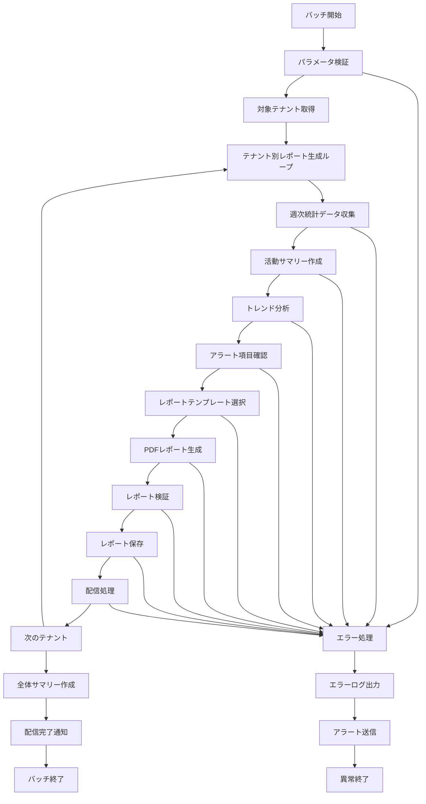

# バッチ定義書：週次レポート生成バッチ (BATCH-203)

## 1. 基本情報

| 項目 | 内容 |
|------|------|
| **バッチID** | BATCH-203 |
| **バッチ名** | 週次レポート生成バッチ |
| **実行スケジュール** | 週次 月曜 07:00 |
| **優先度** | 中 |
| **ステータス** | 設計完了 |
| **作成日** | 2025/05/31 |
| **最終更新日** | 2025/05/31 |

## 2. バッチ概要

### 2.1 概要・目的
各テナントの週次レポートを自動生成し、管理者・利用者に配信するバッチ処理です。週単位でのスキル活動、システム利用状況、パフォーマンス指標の迅速な把握を支援します。

### 2.2 関連テーブル
- [TBL-001_テナント管理](../database/tables/テーブル定義書_TBL-001.md)
- [TBL-016_ユーザー統計](../database/tables/テーブル定義書_TBL-016.md)
- [TBL-017_機能利用統計](../database/tables/テーブル定義書_TBL-017.md)
- [TBL-027_レポート履歴](../database/tables/テーブル定義書_TBL-027.md)
- [TBL-028_レポート設定](../database/tables/テーブル定義書_TBL-028.md)

### 2.3 関連API
- [API-309_レポート生成API](../api/specs/API定義書_API-309.md)
- [API-311_週次レポート配信API](../api/specs/API定義書_API-311.md)

## 3. 実行仕様

### 3.1 実行スケジュール
| 項目 | 設定値 | 備考 |
|------|--------|------|
| 実行頻度 | 週次 | cron: 0 7 * * 1 |
| 実行時間 | 月曜 07:00 | 週初朝 |
| タイムアウト | 60分 | 最大実行時間 |
| リトライ回数 | 3回 | 失敗時の再実行 |

### 3.2 実行条件
| 条件 | 内容 | 備考 |
|------|------|------|
| 前提条件 | BATCH-201完了後 | 統計データ依存 |
| 実行可能時間 | 06:00-09:00 | 朝の業務開始前 |
| 排他制御 | 同一バッチの重複実行禁止 | ロックファイル使用 |

### 3.3 実行パラメータ
| パラメータ名 | データ型 | 必須 | デフォルト値 | 説明 |
|--------------|----------|------|--------------|------|
| target_week | string | × | 前週 | レポート対象週（YYYY-WW） |
| tenant_id | string | × | all | 対象テナントID |
| report_format | string | × | pdf | レポート形式（pdf/excel） |
| dry_run | boolean | × | false | テスト実行フラグ |

## 4. 処理仕様

### 4.1 処理フロー


### 4.2 詳細処理

#### 4.2.1 週次統計データ収集
```sql
-- 週次ユーザー活動統計
SELECT 
  tenant_id,
  YEARWEEK(statistics_date, 1) as week_number,
  AVG(total_users) as avg_total_users,
  AVG(active_users) as avg_active_users,
  SUM(new_users) as weekly_new_users,
  SUM(login_count) as weekly_login_count,
  AVG(avg_session_duration) as avg_session_duration
FROM user_statistics 
WHERE YEARWEEK(statistics_date, 1) = :target_week
  AND tenant_id = :tenant_id
GROUP BY tenant_id, YEARWEEK(statistics_date, 1);

-- 週次機能利用統計
SELECT 
  tenant_id,
  feature_name,
  SUM(usage_count) as weekly_usage_count,
  AVG(unique_users) as avg_unique_users,
  SUM(total_duration) as weekly_total_duration,
  (SUM(usage_count) - LAG(SUM(usage_count)) OVER (PARTITION BY tenant_id, feature_name ORDER BY YEARWEEK(statistics_date, 1))) as usage_growth
FROM feature_usage_statistics 
WHERE YEARWEEK(statistics_date, 1) IN (:target_week, :target_week - 1)
  AND tenant_id = :tenant_id
GROUP BY tenant_id, feature_name, YEARWEEK(statistics_date, 1);
```

#### 4.2.2 トレンド分析処理
```typescript
interface WeeklyTrendAnalysis {
  tenantId: string;
  targetWeek: string;
  
  userTrends: {
    activeUserGrowth: number;
    loginFrequencyTrend: number;
    sessionDurationTrend: number;
  };
  
  featureTrends: {
    mostUsedFeatures: FeatureUsage[];
    growingFeatures: FeatureUsage[];
    decliningFeatures: FeatureUsage[];
  };
  
  alerts: WeeklyAlert[];
}

class WeeklyTrendAnalyzer {
  async analyzeTrends(tenantId: string, targetWeek: string): Promise<WeeklyTrendAnalysis> {
    const currentWeekData = await this.getWeeklyData(tenantId, targetWeek);
    const previousWeekData = await this.getWeeklyData(tenantId, this.getPreviousWeek(targetWeek));
    
    const userTrends = this.calculateUserTrends(currentWeekData, previousWeekData);
    const featureTrends = this.calculateFeatureTrends(currentWeekData, previousWeekData);
    const alerts = this.generateAlerts(currentWeekData, previousWeekData);
    
    return {
      tenantId,
      targetWeek,
      userTrends,
      featureTrends,
      alerts
    };
  }
  
  private calculateUserTrends(current: WeeklyData, previous: WeeklyData): UserTrends {
    return {
      activeUserGrowth: this.calculateGrowthRate(current.activeUsers, previous.activeUsers),
      loginFrequencyTrend: this.calculateGrowthRate(current.loginCount, previous.loginCount),
      sessionDurationTrend: this.calculateGrowthRate(current.avgSessionDuration, previous.avgSessionDuration)
    };
  }
  
  private generateAlerts(current: WeeklyData, previous: WeeklyData): WeeklyAlert[] {
    const alerts: WeeklyAlert[] = [];
    
    // アクティブユーザー減少アラート
    if (this.calculateGrowthRate(current.activeUsers, previous.activeUsers) < -20) {
      alerts.push({
        type: 'user_decline',
        severity: 'high',
        message: 'アクティブユーザーが前週比20%以上減少しています',
        value: current.activeUsers,
        previousValue: previous.activeUsers
      });
    }
    
    // 機能利用減少アラート
    for (const feature of current.featureUsage) {
      const previousFeature = previous.featureUsage.find(f => f.name === feature.name);
      if (previousFeature && this.calculateGrowthRate(feature.usageCount, previousFeature.usageCount) < -30) {
        alerts.push({
          type: 'feature_decline',
          severity: 'medium',
          message: `${feature.name}の利用が前週比30%以上減少しています`,
          featureName: feature.name,
          value: feature.usageCount,
          previousValue: previousFeature.usageCount
        });
      }
    }
    
    return alerts;
  }
}
```

#### 4.2.3 レポート生成処理
```typescript
class WeeklyReportGenerator {
  async generateWeeklyReport(tenant: Tenant, targetWeek: string): Promise<WeeklyReportResult> {
    // データ収集
    const weeklyData = await this.collectWeeklyData(tenant.id, targetWeek);
    const trendAnalysis = await this.analyzeTrends(tenant.id, targetWeek);
    
    // レポート設定取得
    const reportConfig = await this.getWeeklyReportConfig(tenant.id);
    
    // レポート生成
    const report = await this.generatePDFReport(weeklyData, trendAnalysis, reportConfig);
    
    return {
      tenantId: tenant.id,
      targetWeek,
      report,
      generatedAt: new Date()
    };
  }
  
  private async generatePDFReport(
    data: WeeklyData, 
    trends: WeeklyTrendAnalysis, 
    config: WeeklyReportConfig
  ): Promise<PDFReport> {
    const html = await this.renderWeeklyReportHTML(data, trends, config);
    
    const browser = await puppeteer.launch();
    const page = await browser.newPage();
    
    await page.setContent(html);
    const pdf = await page.pdf({
      format: 'A4',
      printBackground: true,
      margin: {
        top: '15mm',
        right: '10mm',
        bottom: '15mm',
        left: '10mm'
      }
    });
    
    await browser.close();
    
    const filename = `週次レポート_${data.tenantId}_${data.targetWeek}.pdf`;
    
    return {
      type: 'pdf',
      filename,
      buffer: pdf,
      size: pdf.length
    };
  }
  
  private async renderWeeklyReportHTML(
    data: WeeklyData, 
    trends: WeeklyTrendAnalysis, 
    config: WeeklyReportConfig
  ): Promise<string> {
    return `
    <!DOCTYPE html>
    <html>
    <head>
      <meta charset="UTF-8">
      <title>週次レポート - ${data.targetWeek}</title>
      <style>
        body { font-family: 'Noto Sans JP', sans-serif; margin: 0; padding: 20px; }
        .header { text-align: center; border-bottom: 2px solid #333; padding-bottom: 10px; }
        .summary { display: grid; grid-template-columns: 1fr 1fr; gap: 20px; margin: 20px 0; }
        .metric-card { border: 1px solid #ddd; padding: 15px; border-radius: 5px; }
        .trend-up { color: #28a745; }
        .trend-down { color: #dc3545; }
        .alert { background: #fff3cd; border: 1px solid #ffeaa7; padding: 10px; margin: 10px 0; border-radius: 5px; }
        .chart { text-align: center; margin: 20px 0; }
      </style>
    </head>
    <body>
      <div class="header">
        <h1>週次レポート</h1>
        <h2>${config.tenantName}</h2>
        <p>対象期間: ${this.formatWeekRange(data.targetWeek)}</p>
      </div>
      
      <div class="summary">
        <div class="metric-card">
          <h3>ユーザー活動</h3>
          <p>アクティブユーザー: ${data.activeUsers}人 
            <span class="${trends.userTrends.activeUserGrowth >= 0 ? 'trend-up' : 'trend-down'}">
              (${trends.userTrends.activeUserGrowth > 0 ? '+' : ''}${trends.userTrends.activeUserGrowth.toFixed(1)}%)
            </span>
          </p>
          <p>ログイン回数: ${data.loginCount}回</p>
          <p>平均セッション時間: ${data.avgSessionDuration}分</p>
        </div>
        
        <div class="metric-card">
          <h3>機能利用状況</h3>
          ${trends.featureTrends.mostUsedFeatures.slice(0, 3).map(feature => 
            `<p>${feature.name}: ${feature.usageCount}回</p>`
          ).join('')}
        </div>
      </div>
      
      ${trends.alerts.length > 0 ? `
        <div class="alerts">
          <h3>注意事項</h3>
          ${trends.alerts.map(alert => 
            `<div class="alert">${alert.message}</div>`
          ).join('')}
        </div>
      ` : ''}
      
      <div class="chart">
        <h3>週次トレンド</h3>
        <!-- チャート画像をここに挿入 -->
      </div>
    </body>
    </html>
    `;
  }
}
```

## 5. データ仕様

### 5.1 入力データ
| データ名 | 形式 | 取得元 | 説明 |
|----------|------|--------|------|
| ユーザー統計 | DB | user_statistics | 週間ユーザー活動データ |
| 機能利用統計 | DB | feature_usage_statistics | 機能別利用データ |
| レポート設定 | DB | report_configurations | 週次レポート設定 |
| 前週データ | DB | 各統計テーブル | トレンド比較用データ |

### 5.2 出力データ
| データ名 | 形式 | 出力先 | 説明 |
|----------|------|--------|------|
| PDFレポート | File | /reports/weekly/ | PDF形式週次レポート |
| レポート履歴 | DB | report_history | レポート生成履歴 |
| 配信ログ | DB | distribution_logs | 配信結果ログ |
| 実行ログ | LOG | /logs/batch/ | 実行履歴ログ |

### 5.3 データ量見積もり
| 項目 | 件数 | 備考 |
|------|------|------|
| 対象テナント数 | 100テナント | 平均値 |
| 生成レポート数 | 100件/週 | PDF形式 |
| 処理時間 | 30分 | 平均実行時間 |

## 6. エラーハンドリング

### 6.1 エラー分類
| エラー種別 | 対応方法 | 通知要否 | 備考 |
|------------|----------|----------|------|
| データ不足 | 警告付きレポート生成・継続 | △ | データ欠損表示 |
| PDF生成エラー | リトライ・継続 | ○ | 生成失敗 |
| 配信エラー | リトライ・継続 | ○ | 配信失敗 |
| トレンド計算エラー | 基本レポートのみ生成・継続 | △ | 分析機能制限 |

### 6.2 リトライ仕様
| 条件 | リトライ回数 | 間隔 | 備考 |
|------|--------------|------|------|
| PDF生成エラー | 2回 | 3分 | 固定間隔 |
| 配信エラー | 3回 | 5分 | 指数バックオフ |
| DB接続エラー | 3回 | 2分 | 指数バックオフ |

## 7. 監視・運用

### 7.1 監視項目
| 監視項目 | 閾値 | アラート条件 | 対応方法 |
|----------|------|--------------|----------|
| 実行時間 | 60分 | 超過時 | 処理見直し |
| レポート生成失敗率 | 5% | 超過時 | 原因調査 |
| 配信失敗率 | 10% | 超過時 | 配信設定確認 |
| メモリ使用量 | 2GB | 超過時 | リソース調整 |

### 7.2 ログ出力
| ログ種別 | 出力レベル | 出力内容 | 保存期間 |
|----------|------------|----------|----------|
| 実行ログ | INFO | 処理開始・終了・進捗 | 3ヶ月 |
| レポートログ | INFO | レポート生成詳細 | 6ヶ月 |
| 配信ログ | INFO | 配信結果詳細 | 6ヶ月 |
| エラーログ | ERROR | エラー詳細・スタックトレース | 1年 |

### 7.3 アラート通知
| 通知条件 | 通知先 | 通知方法 | 備考 |
|----------|--------|----------|------|
| 異常終了 | 運用チーム | メール・Slack | 即座に通知 |
| レポート生成失敗 | 運用チーム | Slack | 業務時間内のみ |
| 配信失敗 | テナント管理者 | メール | 自動通知 |

## 8. 非機能要件

### 8.1 パフォーマンス
- 処理時間：60分以内
- メモリ使用量：2GB以内
- CPU使用率：50%以内
- 並列処理：テナント単位で並列実行可能

### 8.2 可用性
- 成功率：95%以上
- リトライ機能による自動復旧
- 部分実行・再開機能
- 障害時の手動実行機能

### 8.3 セキュリティ
- 実行権限の制限
- レポートデータの暗号化
- 配信先の認証・認可

## 9. 実装メモ

### 9.1 技術仕様
- 言語：Node.js (TypeScript)
- PDF生成：Puppeteer
- メール送信：Nodemailer
- ログ出力：Winston

### 9.2 注意事項
- 月次レポートとの差別化
- 迅速な配信を重視
- トレンド分析の精度確保
- アラート機能の適切な設定

---

**改訂履歴**

| バージョン | 日付 | 変更者 | 変更内容 |
|------------|------|--------|----------|
| 1.0 | 2025/05/31 | システムアーキテクト | 初版作成 |
