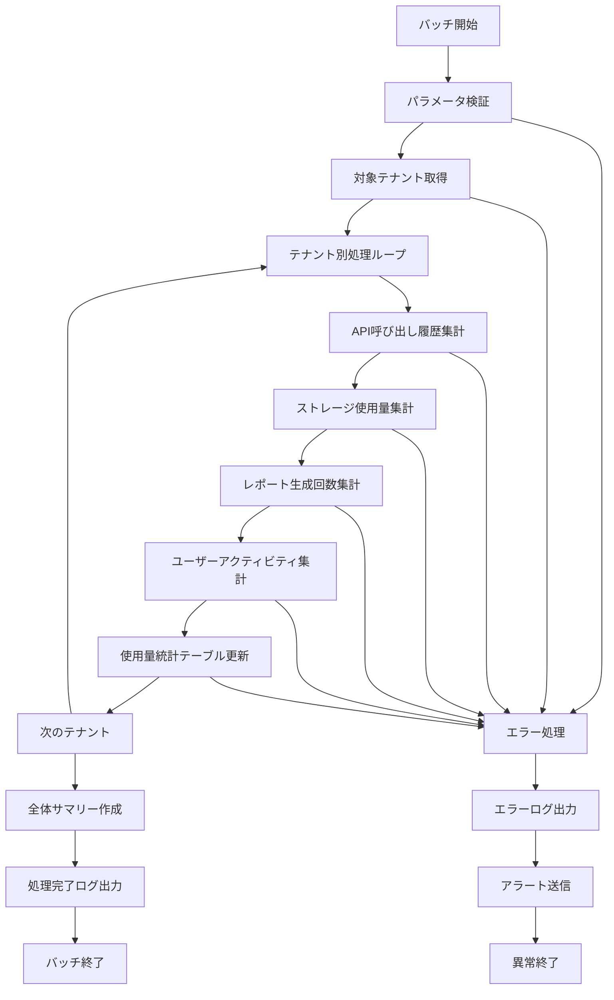

# バッチ定義書：使用量集計バッチ (BATCH-204)

## 1. 基本情報

| 項目 | 内容 |
|------|------|
| **バッチID** | BATCH-204 |
| **バッチ名** | 使用量集計バッチ |
| **実行スケジュール** | 日次 01:30 |
| **優先度** | 高 |
| **ステータス** | 設計完了 |
| **作成日** | 2025/05/31 |
| **最終更新日** | 2025/05/31 |

## 2. バッチ概要

### 2.1 概要・目的
システム全体の使用量データを日次で集計し、テナント別・機能別の利用状況を把握するためのバッチ処理です。課金計算、リソース管理、パフォーマンス分析の基礎データとして活用されます。

### 2.2 関連テーブル
- [TBL-001_テナント管理](../database/tables/テーブル定義書_TBL-001.md)
- [TBL-015_使用量統計](../database/tables/テーブル定義書_TBL-015.md)
- [TBL-016_API呼び出し履歴](../database/tables/テーブル定義書_TBL-016.md)
- [TBL-017_ストレージ使用量](../database/tables/テーブル定義書_TBL-017.md)
- [TBL-018_レポート生成履歴](../database/tables/テーブル定義書_TBL-018.md)

### 2.3 関連API
- [API-301_使用量統計取得API](../api/specs/API定義書_API-301.md)
- [API-302_テナント使用量取得API](../api/specs/API定義書_API-302.md)

## 3. 実行仕様

### 3.1 実行スケジュール
| 項目 | 設定値 | 備考 |
|------|--------|------|
| 実行頻度 | 日次 | cron: 30 1 * * * |
| 実行時間 | 01:30 | 深夜バッチ |
| タイムアウト | 120分 | 最大実行時間 |
| リトライ回数 | 3回 | 失敗時の再実行 |

### 3.2 実行条件
| 条件 | 内容 | 備考 |
|------|------|------|
| 前提条件 | データベース稼働中 | 依存システムチェック |
| 実行可能時間 | 01:00-05:00 | メンテナンス時間外 |
| 排他制御 | 同一バッチの重複実行禁止 | ロックファイル使用 |

### 3.3 実行パラメータ
| パラメータ名 | データ型 | 必須 | デフォルト値 | 説明 |
|--------------|----------|------|--------------|------|
| target_date | date | × | 前日 | 集計対象日 |
| tenant_id | string | × | all | 対象テナントID |
| force_recalc | boolean | × | false | 強制再計算フラグ |
| dry_run | boolean | × | false | テスト実行フラグ |

## 4. 処理仕様

### 4.1 処理フロー


### 4.2 詳細処理

#### 4.2.1 初期化処理
1. パラメータ検証
   - 対象日付の妥当性チェック
   - テナントIDの存在確認
2. ログファイル初期化
3. 排他制御ロック取得

#### 4.2.2 テナント別使用量集計
各テナントに対して以下の集計を実行：

1. **API呼び出し履歴集計**
   ```sql
   SELECT 
     tenant_id,
     COUNT(*) as total_api_calls,
     COUNT(DISTINCT user_id) as unique_users,
     SUM(CASE WHEN response_status = 200 THEN 1 ELSE 0 END) as successful_calls,
     AVG(response_time) as avg_response_time
   FROM api_call_logs 
   WHERE DATE(created_at) = :target_date 
     AND tenant_id = :tenant_id
   GROUP BY tenant_id
   ```

2. **ストレージ使用量集計**
   ```sql
   SELECT 
     tenant_id,
     SUM(file_size) as total_storage_bytes,
     COUNT(*) as total_files,
     MAX(created_at) as last_upload_time
   FROM file_storage 
   WHERE DATE(created_at) <= :target_date 
     AND tenant_id = :tenant_id
     AND deleted_at IS NULL
   GROUP BY tenant_id
   ```

3. **レポート生成履歴集計**
   ```sql
   SELECT 
     tenant_id,
     COUNT(*) as reports_generated,
     COUNT(DISTINCT user_id) as report_users,
     SUM(CASE WHEN status = 'completed' THEN 1 ELSE 0 END) as successful_reports
   FROM report_generation_logs 
   WHERE DATE(created_at) = :target_date 
     AND tenant_id = :tenant_id
   GROUP BY tenant_id
   ```

4. **ユーザーアクティビティ集計**
   ```sql
   SELECT 
     tenant_id,
     COUNT(DISTINCT user_id) as active_users,
     COUNT(*) as total_sessions,
     AVG(session_duration) as avg_session_duration
   FROM user_sessions 
   WHERE DATE(created_at) = :target_date 
     AND tenant_id = :tenant_id
   GROUP BY tenant_id
   ```

#### 4.2.3 使用量統計テーブル更新
集計結果を使用量統計テーブルに挿入/更新：

```sql
INSERT INTO usage_statistics (
  tenant_id,
  usage_date,
  api_calls_count,
  unique_users_count,
  successful_api_calls,
  avg_response_time,
  storage_used_bytes,
  total_files_count,
  reports_generated,
  active_users_count,
  total_sessions,
  avg_session_duration,
  created_at,
  updated_at
) VALUES (
  :tenant_id,
  :target_date,
  :api_calls_count,
  :unique_users_count,
  :successful_api_calls,
  :avg_response_time,
  :storage_used_bytes,
  :total_files_count,
  :reports_generated,
  :active_users_count,
  :total_sessions,
  :avg_session_duration,
  NOW(),
  NOW()
) ON DUPLICATE KEY UPDATE
  api_calls_count = VALUES(api_calls_count),
  unique_users_count = VALUES(unique_users_count),
  successful_api_calls = VALUES(successful_api_calls),
  avg_response_time = VALUES(avg_response_time),
  storage_used_bytes = VALUES(storage_used_bytes),
  total_files_count = VALUES(total_files_count),
  reports_generated = VALUES(reports_generated),
  active_users_count = VALUES(active_users_count),
  total_sessions = VALUES(total_sessions),
  avg_session_duration = VALUES(avg_session_duration),
  updated_at = NOW()
```

## 5. データ仕様

### 5.1 入力データ
| データ名 | 形式 | 取得元 | 説明 |
|----------|------|--------|------|
| API呼び出し履歴 | DB | api_call_logs | API使用状況データ |
| ストレージ使用量 | DB | file_storage | ファイル保存状況データ |
| レポート生成履歴 | DB | report_generation_logs | レポート作成状況データ |
| ユーザーセッション | DB | user_sessions | ユーザー活動データ |
| テナント情報 | DB | tenants | 対象テナント一覧 |

### 5.2 出力データ
| データ名 | 形式 | 出力先 | 説明 |
|----------|------|--------|------|
| 使用量統計 | DB | usage_statistics | 集計済み使用量データ |
| 実行ログ | LOG | /logs/batch/ | 実行履歴ログ |
| 集計サマリー | JSON | /data/output/ | 日次集計結果サマリー |

### 5.3 データ量見積もり
| 項目 | 件数 | 備考 |
|------|------|------|
| 対象テナント数 | 100テナント | 平均値 |
| API呼び出し履歴 | 1,000,000件/日 | 全テナント合計 |
| ストレージファイル数 | 50,000件 | 累積 |
| 処理時間 | 45分 | 平均実行時間 |

## 6. エラーハンドリング

### 6.1 エラー分類
| エラー種別 | 対応方法 | 通知要否 | 備考 |
|------------|----------|----------|------|
| DB接続エラー | 処理中断・リトライ | ○ | 即座にアラート |
| データ不整合 | エラーログ出力・継続 | △ | 翌日確認 |
| 計算エラー | デフォルト値設定・継続 | × | ログ記録のみ |

### 6.2 リトライ仕様
| 条件 | リトライ回数 | 間隔 | 備考 |
|------|--------------|------|------|
| DB接続エラー | 3回 | 5分 | 指数バックオフ |
| タイムアウト | 2回 | 10分 | 固定間隔 |
| 一時的エラー | 5回 | 1分 | 指数バックオフ |

### 6.3 異常終了時の処理
1. 処理中断
2. 部分的な結果のロールバック
3. エラーログ出力
4. 運用チームへアラート送信
5. 排他制御ロック解除

## 7. 監視・運用

### 7.1 監視項目
| 監視項目 | 閾値 | アラート条件 | 対応方法 |
|----------|------|--------------|----------|
| 実行時間 | 120分 | 超過時 | 処理見直し |
| エラー率 | 3% | 超過時 | 原因調査 |
| 処理テナント数 | 期待値±10% | 乖離時 | データ確認 |
| メモリ使用量 | 4GB | 超過時 | リソース調整 |

### 7.2 ログ出力
| ログ種別 | 出力レベル | 出力内容 | 保存期間 |
|----------|------------|----------|----------|
| 実行ログ | INFO | 処理開始・終了・進捗 | 3ヶ月 |
| エラーログ | ERROR | エラー詳細・スタックトレース | 1年 |
| 集計ログ | INFO | テナント別集計結果 | 6ヶ月 |

### 7.3 アラート通知
| 通知条件 | 通知先 | 通知方法 | 備考 |
|----------|--------|----------|------|
| 異常終了 | 運用チーム | メール・Slack | 即座に通知 |
| 処理時間超過 | 開発チーム | Slack | 業務時間内のみ |
| データ異常 | 業務担当者 | メール | 翌営業日まで |

## 8. 非機能要件

### 8.1 パフォーマンス
- 処理時間：120分以内
- メモリ使用量：4GB以内
- CPU使用率：70%以内
- 並列処理：テナント単位で並列実行可能

### 8.2 可用性
- 成功率：99.5%以上
- リトライ機能による自動復旧
- 障害時の手動実行機能
- 部分実行・再開機能

### 8.3 セキュリティ
- 実行権限の制限
- ログファイルのアクセス制御
- テナントデータの分離保証

## 9. テスト仕様

### 9.1 単体テスト
| テストケース | 入力条件 | 期待結果 |
|--------------|----------|----------|
| 正常処理 | 通常データ | 正常終了・正確な集計 |
| データなし | 対象データ0件 | 正常終了（使用量0） |
| 大量データ | 最大件数 | 正常終了・性能要件内 |
| 特定テナント | 単一テナント指定 | 該当テナントのみ処理 |

### 9.2 異常系テスト
| テストケース | 入力条件 | 期待結果 |
|--------------|----------|----------|
| DB接続エラー | DB停止状態 | リトライ後異常終了 |
| メモリ不足 | 大量データ処理 | 適切なエラーハンドリング |
| 不正日付 | 未来日付指定 | パラメータエラー |
| テナント不存在 | 存在しないテナントID | エラーログ出力・継続 |

## 10. 実装メモ

### 10.1 技術仕様
- 言語：Node.js (TypeScript)
- フレームワーク：なし（Pure Node.js）
- DB接続：Prisma
- ログ出力：Winston
- 並列処理：Worker Threads

### 10.2 注意事項
- マルチテナント対応必須
- 大量データ処理時のメモリ管理
- 長時間実行時のタイムアウト対策
- テナント間のデータ分離保証

### 10.3 デプロイ・実行環境
- 実行サーバー：バッチサーバー
- 実行ユーザー：batch_user
- 実行ディレクトリ：/opt/batch/usage-aggregation/
- 設定ファイル：/etc/batch/usage-aggregation.json

### 10.4 実装サンプル
```typescript
// batch/usage-aggregation.ts
interface UsageAggregationBatch {
  batchId: 'BATCH-204';
  name: '使用量集計バッチ';
  schedule: '30 1 * * *';
  timeout: 7200; // 2時間
}

class UsageAggregationService {
  async execute(targetDate?: Date, tenantId?: string): Promise<BatchResult> {
    const date = targetDate || this.getPreviousDay();
    const tenants = tenantId ? [await this.getTenant(tenantId)] : await this.getAllActiveTenants();
    
    const results: TenantUsageResult[] = [];
    
    for (const tenant of tenants) {
      try {
        const usage = await this.aggregateTenantUsage(tenant.id, date);
        await this.saveUsageStatistics(tenant.id, date, usage);
        results.push({ tenantId: tenant.id, status: 'success', usage });
      } catch (error) {
        results.push({ tenantId: tenant.id, status: 'error', error });
        await this.logError(tenant.id, error);
      }
    }
    
    return {
      batchId: 'BATCH-204',
      executedAt: new Date(),
      targetDate: date,
      totalTenants: tenants.length,
      successCount: results.filter(r => r.status === 'success').length,
      errorCount: results.filter(r => r.status === 'error').length,
      results
    };
  }
  
  private async aggregateTenantUsage(tenantId: string, date: Date): Promise<TenantUsage> {
    const [apiStats, storageStats, reportStats, sessionStats] = await Promise.all([
      this.aggregateApiUsage(tenantId, date),
      this.aggregateStorageUsage(tenantId, date),
      this.aggregateReportUsage(tenantId, date),
      this.aggregateSessionUsage(tenantId, date)
    ]);
    
    return {
      tenantId,
      usageDate: date,
      apiCallsCount: apiStats.totalCalls,
      uniqueUsersCount: apiStats.uniqueUsers,
      successfulApiCalls: apiStats.successfulCalls,
      avgResponseTime: apiStats.avgResponseTime,
      storageUsedBytes: storageStats.totalBytes,
      totalFilesCount: storageStats.totalFiles,
      reportsGenerated: reportStats.totalReports,
      activeUsersCount: sessionStats.activeUsers,
      totalSessions: sessionStats.totalSessions,
      avgSessionDuration: sessionStats.avgDuration
    };
  }
}
```

---

**改訂履歴**

| バージョン | 日付 | 変更者 | 変更内容 |
|------------|------|--------|----------|
| 1.0 | 2025/05/31 | システムアーキテクト | 初版作成 |
