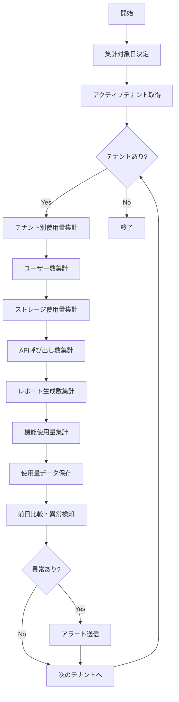

# バッチ定義書：使用量集計バッチ

| 項目                | 内容                                                                                |
|---------------------|------------------------------------------------------------------------------------|
| **バッチID**        | BATCH-204                                                                          |
| **バッチ名称**      | 使用量集計バッチ                                                                    |
| **機能カテゴリ**    | レポート・集計処理                                                                  |
| **概要・目的**      | システム全体の使用量データを日次で集計し、課金計算やリソース管理の基礎データを作成する |
| **バッチ種別**      | 定期バッチ                                                                          |
| **実行スケジュール**| 毎日深夜（1:30）                                                                    |
| **入出力対象**      | 各種ログテーブル、使用量集計テーブル                                                |
| **優先度**          | 高                                                                                  |
| **備考**            | 課金計算バッチ（BATCH-302）の前提処理                                               |

## 1. 処理概要

使用量集計バッチは、マルチテナント環境において各テナントのシステム使用量を日次で集計し、課金計算やリソース管理の基礎となるデータを作成するバッチ処理です。ユーザー数、ストレージ使用量、API呼び出し数、レポート生成数などを包括的に集計し、テナント別・日別の使用量データを蓄積します。

## 2. 処理フロー



## 3. 入力データ

### 3.1 ユーザー活動ログ

| フィールド名      | データ型 | 説明                                           |
|-------------------|----------|------------------------------------------------|
| user_id           | String   | ユーザーID                                     |
| tenant_id         | String   | テナントID                                     |
| action_type       | String   | アクション種別（LOGIN/LOGOUT/VIEW/EDIT等）     |
| timestamp         | DateTime | アクション実行日時                             |
| session_id        | String   | セッションID                                   |
| ip_address        | String   | IPアドレス                                     |

### 3.2 API呼び出しログ

| フィールド名      | データ型 | 説明                                           |
|-------------------|----------|------------------------------------------------|
| api_id            | String   | API識別子                                      |
| tenant_id         | String   | テナントID                                     |
| user_id           | String   | 呼び出しユーザーID                             |
| endpoint          | String   | APIエンドポイント                              |
| method            | String   | HTTPメソッド                                   |
| response_time     | Integer  | レスポンス時間（ms）                           |
| status_code       | Integer  | HTTPステータスコード                           |
| timestamp         | DateTime | 呼び出し日時                                   |

### 3.3 ストレージ使用量ログ

| フィールド名      | データ型 | 説明                                           |
|-------------------|----------|------------------------------------------------|
| tenant_id         | String   | テナントID                                     |
| file_type         | String   | ファイル種別（REPORT/TEMPLATE/UPLOAD等）       |
| file_size         | BigInt   | ファイルサイズ（バイト）                       |
| operation         | String   | 操作種別（CREATE/UPDATE/DELETE）               |
| timestamp         | DateTime | 操作日時                                       |

### 3.4 レポート生成ログ

| フィールド名      | データ型 | 説明                                           |
|-------------------|----------|------------------------------------------------|
| report_id         | String   | レポートID                                     |
| tenant_id         | String   | テナントID                                     |
| user_id           | String   | 生成ユーザーID                                 |
| report_type       | String   | レポート種別                                   |
| generation_time   | Integer  | 生成時間（秒）                                 |
| output_size       | Integer  | 出力サイズ（バイト）                           |
| timestamp         | DateTime | 生成日時                                       |

## 4. 出力データ

### 4.1 日次使用量集計テーブル（新規作成）

| フィールド名          | データ型 | 説明                                           |
|-----------------------|----------|------------------------------------------------|
| usage_id              | String   | 使用量ID（主キー）                             |
| tenant_id             | String   | テナントID                                     |
| usage_date            | Date     | 集計対象日                                     |
| active_users          | Integer  | アクティブユーザー数                           |
| total_users           | Integer  | 総ユーザー数                                   |
| login_count           | Integer  | ログイン回数                                   |
| api_calls             | Integer  | API呼び出し数                                  |
| storage_used_bytes    | BigInt   | ストレージ使用量（バイト）                     |
| reports_generated     | Integer  | レポート生成数                                 |
| avg_response_time     | Float    | 平均レスポンス時間（ms）                       |
| error_count           | Integer  | エラー発生数                                   |
| peak_concurrent_users | Integer  | 最大同時接続ユーザー数                         |
| data_transfer_bytes   | BigInt   | データ転送量（バイト）                         |
| created_at            | DateTime | 作成日時                                       |
| updated_at            | DateTime | 更新日時                                       |

### 4.2 機能別使用量集計テーブル（新規作成）

| フィールド名      | データ型 | 説明                                           |
|-------------------|----------|------------------------------------------------|
| feature_usage_id  | String   | 機能使用量ID（主キー）                         |
| tenant_id         | String   | テナントID                                     |
| usage_date        | Date     | 集計対象日                                     |
| feature_name      | String   | 機能名                                         |
| usage_count       | Integer  | 使用回数                                       |
| unique_users      | Integer  | 利用ユニークユーザー数                         |
| total_time        | Integer  | 総利用時間（秒）                               |
| avg_time_per_use  | Float    | 1回あたり平均利用時間（秒）                    |
| created_at        | DateTime | 作成日時                                       |

### 4.3 時間別使用量集計テーブル（新規作成）

| フィールド名      | データ型 | 説明                                           |
|-------------------|----------|------------------------------------------------|
| hourly_usage_id   | String   | 時間別使用量ID（主キー）                       |
| tenant_id         | String   | テナントID                                     |
| usage_datetime    | DateTime | 集計対象時間（時間単位）                       |
| concurrent_users  | Integer  | 同時接続ユーザー数                             |
| api_calls         | Integer  | API呼び出し数                                  |
| response_time_avg | Float    | 平均レスポンス時間（ms）                       |
| error_rate        | Float    | エラー率（%）                                  |
| created_at        | DateTime | 作成日時                                       |

## 5. 集計仕様

### 5.1 アクティブユーザー数集計

```sql
-- 日次アクティブユーザー数
SELECT 
    tenant_id,
    COUNT(DISTINCT user_id) as active_users
FROM user_activity_logs 
WHERE DATE(timestamp) = :target_date
GROUP BY tenant_id;
```

### 5.2 API呼び出し数集計

```sql
-- テナント別API呼び出し数
SELECT 
    tenant_id,
    COUNT(*) as api_calls,
    AVG(response_time) as avg_response_time,
    SUM(CASE WHEN status_code >= 400 THEN 1 ELSE 0 END) as error_count
FROM api_call_logs 
WHERE DATE(timestamp) = :target_date
GROUP BY tenant_id;
```

### 5.3 ストレージ使用量集計

```sql
-- テナント別ストレージ使用量（累積）
SELECT 
    tenant_id,
    SUM(CASE WHEN operation = 'CREATE' THEN file_size
             WHEN operation = 'UPDATE' THEN file_size
             WHEN operation = 'DELETE' THEN -file_size
             ELSE 0 END) as storage_delta
FROM storage_usage_logs 
WHERE DATE(timestamp) = :target_date
GROUP BY tenant_id;
```

### 5.4 同時接続ユーザー数集計

```sql
-- 時間別最大同時接続ユーザー数
SELECT 
    tenant_id,
    DATE_TRUNC('hour', timestamp) as hour,
    COUNT(DISTINCT session_id) as concurrent_users
FROM user_activity_logs 
WHERE DATE(timestamp) = :target_date
    AND action_type IN ('LOGIN', 'VIEW', 'EDIT')
GROUP BY tenant_id, DATE_TRUNC('hour', timestamp);
```

## 6. 異常検知機能

### 6.1 使用量異常パターン

| 異常パターン            | 検知条件                                           |
|-------------------------|---------------------------------------------------|
| 急激な使用量増加        | 前日比200%以上の増加                              |
| 使用量ゼロ              | アクティブテナントで使用量が0                     |
| API呼び出し異常         | 前日比500%以上の増加                              |
| エラー率異常            | エラー率が10%以上                                 |
| ストレージ使用量異常    | 前日比150%以上の増加                              |

### 6.2 アラート通知

```typescript
interface UsageAlert {
  tenantId: string;
  alertType: 'USAGE_SPIKE' | 'ZERO_USAGE' | 'HIGH_ERROR_RATE' | 'STORAGE_SPIKE';
  currentValue: number;
  previousValue: number;
  threshold: number;
  severity: 'LOW' | 'MEDIUM' | 'HIGH' | 'CRITICAL';
}
```

## 7. エラー処理

| エラーケース                      | 対応方法                                                                 |
|-----------------------------------|--------------------------------------------------------------------------|
| ログデータ不整合                  | エラーログを記録し、該当データをスキップして継続処理                     |
| 集計処理タイムアウト              | 処理を中断し、部分集計として記録。次回実行時に差分処理                   |
| ストレージ容量不足                | アラートを送信し、古いログデータの削除を提案                             |
| 大量データ処理エラー              | バッチサイズを縮小して再実行                                             |

## 8. パフォーマンス最適化

### 8.1 インデックス要件

```sql
-- ユーザー活動ログ用インデックス
CREATE INDEX idx_user_activity_tenant_date ON user_activity_logs(tenant_id, timestamp);
CREATE INDEX idx_user_activity_user_date ON user_activity_logs(user_id, timestamp);

-- API呼び出しログ用インデックス
CREATE INDEX idx_api_calls_tenant_date ON api_call_logs(tenant_id, timestamp);
CREATE INDEX idx_api_calls_endpoint_date ON api_call_logs(endpoint, timestamp);

-- ストレージ使用量ログ用インデックス
CREATE INDEX idx_storage_tenant_date ON storage_usage_logs(tenant_id, timestamp);
```

### 8.2 並列処理設定

| テナント数      | 並列度 | バッチサイズ | 推定処理時間 |
|-----------------|--------|--------------|--------------|
| ～50テナント    | 2      | 10テナント   | 15分         |
| 51～200テナント | 4      | 25テナント   | 20分         |
| 201テナント～   | 8      | 50テナント   | 30分         |

## 9. 依存関係

- ユーザー活動ログテーブル
- API呼び出しログテーブル
- ストレージ使用量ログテーブル
- レポート生成ログテーブル
- テナント管理システム
- 通知サービス

## 10. 実行パラメータ

| パラメータ名        | 必須 | デフォルト値 | 説明                                           |
|---------------------|------|--------------|------------------------------------------------|
| --target-date       | No   | 前日         | 集計対象日（YYYY-MM-DD形式）                   |
| --tenant-id         | No   | all          | 特定テナントのみ集計                           |
| --skip-alerts       | No   | false        | 異常検知アラートをスキップ                     |
| --parallel-count    | No   | 4            | 並列処理数                                     |
| --batch-size        | No   | 25           | バッチサイズ（テナント数）                     |
| --dry-run           | No   | false        | 集計のみ実行、データ保存なし                   |

## 11. 実行例

```bash
# 通常実行
npm run batch:usage-aggregation

# 特定日の集計
npm run batch:usage-aggregation -- --target-date=2025-05-30

# 特定テナントのみ集計
npm run batch:usage-aggregation -- --tenant-id=tenant_001

# 並列処理数指定
npm run batch:usage-aggregation -- --parallel-count=8

# ドライラン
npm run batch:usage-aggregation -- --dry-run

# TypeScript直接実行
npx tsx src/batch/usage-aggregation.ts

# パラメータ付きTypeScript実行
npx tsx src/batch/usage-aggregation.ts --target-date=2025-05-30 --parallel-count=8
```

## 12. 運用上の注意点

- 本バッチは課金計算バッチ（BATCH-302）の前提処理のため、必ず先に実行してください。
- ログデータの保持期間を適切に設定し、古いデータは定期的にアーカイブしてください。
- 大量のテナントがある場合、処理時間が長くなる可能性があるため、並列処理数を調整してください。
- 異常検知の閾値は、システムの特性に応じて調整が必要です。

## 13. データ保持ポリシー

### 13.1 集計データ保持期間

| データ種別          | 保持期間 | アーカイブ先 |
|---------------------|----------|--------------|
| 日次使用量集計      | 2年      | S3 Glacier   |
| 機能別使用量集計    | 1年      | S3 Glacier   |
| 時間別使用量集計    | 3ヶ月    | S3 Standard  |

### 13.2 ログデータクリーンアップ

```sql
-- 3ヶ月以上古いログデータの削除
DELETE FROM user_activity_logs 
WHERE timestamp < NOW() - INTERVAL '3 months';

DELETE FROM api_call_logs 
WHERE timestamp < NOW() - INTERVAL '3 months';
```

## 14. 改訂履歴

| 改訂日     | 改訂者 | 改訂内容                                         |
|------------|--------|--------------------------------------------------|
| 2025/05/31 | 初版   | 初版作成                                         |
