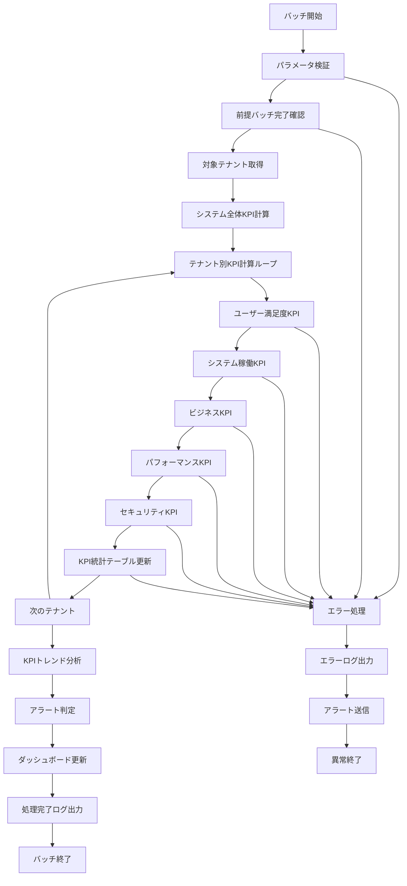

# バッチ定義書：KPI計算バッチ (BATCH-205)

## 1. 基本情報

| 項目 | 内容 |
|------|------|
| **バッチID** | BATCH-205 |
| **バッチ名** | KPI計算バッチ |
| **実行スケジュール** | 日次 06:30 |
| **優先度** | 高 |
| **ステータス** | 設計完了 |
| **作成日** | 2025/05/31 |
| **最終更新日** | 2025/05/31 |

## 2. バッチ概要

### 2.1 概要・目的
システム全体およびテナント別の主要業績指標（KPI）を日次で計算・更新するバッチ処理です。経営判断、運用改善、顧客満足度向上のための重要な指標を提供します。

### 2.2 関連テーブル
- [TBL-001_テナント管理](../database/tables/テーブル定義書_TBL-001.md)
- [TBL-015_使用量統計](../database/tables/テーブル定義書_TBL-015.md)
- [TBL-019_KPI統計](../database/tables/テーブル定義書_TBL-019.md)
- [TBL-020_ユーザー活動履歴](../database/tables/テーブル定義書_TBL-020.md)
- [TBL-021_システム稼働統計](../database/tables/テーブル定義書_TBL-021.md)

### 2.3 関連API
- [API-303_KPI統計取得API](../api/specs/API定義書_API-303.md)
- [API-304_ダッシュボード統計API](../api/specs/API定義書_API-304.md)

## 3. 実行仕様

### 3.1 実行スケジュール
| 項目 | 設定値 | 備考 |
|------|--------|------|
| 実行頻度 | 日次 | cron: 30 6 * * * |
| 実行時間 | 06:30 | 朝の業務開始前 |
| タイムアウト | 90分 | 最大実行時間 |
| リトライ回数 | 3回 | 失敗時の再実行 |

### 3.2 実行条件
| 条件 | 内容 | 備考 |
|------|------|------|
| 前提条件 | BATCH-204完了後 | 使用量集計バッチ依存 |
| 実行可能時間 | 06:00-08:00 | 業務開始前 |
| 排他制御 | 同一バッチの重複実行禁止 | ロックファイル使用 |

### 3.3 実行パラメータ
| パラメータ名 | データ型 | 必須 | デフォルト値 | 説明 |
|--------------|----------|------|--------------|------|
| target_date | date | × | 前日 | KPI計算対象日 |
| tenant_id | string | × | all | 対象テナントID |
| kpi_category | string | × | all | KPIカテゴリ指定 |
| dry_run | boolean | × | false | テスト実行フラグ |

## 4. 処理仕様

### 4.1 処理フロー


### 4.2 詳細処理

#### 4.2.1 システム全体KPI計算
1. **システム稼働率KPI**
   ```sql
   SELECT 
     (SUM(CASE WHEN status = 'UP' THEN 1 ELSE 0 END) * 100.0 / COUNT(*)) as system_uptime_rate,
     AVG(response_time) as avg_response_time,
     MAX(response_time) as max_response_time
   FROM system_health_checks 
   WHERE DATE(checked_at) = :target_date
   ```

2. **全体利用率KPI**
   ```sql
   SELECT 
     COUNT(DISTINCT tenant_id) as active_tenants,
     SUM(api_calls_count) as total_api_calls,
     SUM(active_users_count) as total_active_users,
     AVG(avg_response_time) as system_avg_response_time
   FROM usage_statistics 
   WHERE usage_date = :target_date
   ```

#### 4.2.2 テナント別KPI計算
各テナントに対して以下のKPIを計算：

1. **ユーザー満足度KPI**
   ```sql
   -- ユーザーエンゲージメント率
   SELECT 
     tenant_id,
     (active_users_count * 100.0 / total_users_count) as user_engagement_rate,
     (total_sessions * 1.0 / active_users_count) as avg_sessions_per_user,
     avg_session_duration
   FROM usage_statistics us
   JOIN tenant_user_counts tuc ON us.tenant_id = tuc.tenant_id
   WHERE us.usage_date = :target_date
   ```

2. **システム品質KPI**
   ```sql
   -- API成功率
   SELECT 
     tenant_id,
     (successful_api_calls * 100.0 / api_calls_count) as api_success_rate,
     avg_response_time,
     (CASE WHEN avg_response_time <= 500 THEN 100 
           WHEN avg_response_time <= 1000 THEN 80
           WHEN avg_response_time <= 2000 THEN 60
           ELSE 40 END) as performance_score
   FROM usage_statistics 
   WHERE usage_date = :target_date AND tenant_id = :tenant_id
   ```

3. **ビジネスKPI**
   ```sql
   -- レポート利用率
   SELECT 
     tenant_id,
     reports_generated,
     (reports_generated * 100.0 / active_users_count) as report_usage_rate,
     storage_used_bytes / (1024 * 1024 * 1024) as storage_used_gb
   FROM usage_statistics 
   WHERE usage_date = :target_date AND tenant_id = :tenant_id
   ```

4. **成長率KPI**
   ```sql
   -- 前日比成長率
   SELECT 
     current.tenant_id,
     ((current.active_users_count - previous.active_users_count) * 100.0 / 
      NULLIF(previous.active_users_count, 0)) as user_growth_rate,
     ((current.api_calls_count - previous.api_calls_count) * 100.0 / 
      NULLIF(previous.api_calls_count, 0)) as api_growth_rate
   FROM usage_statistics current
   LEFT JOIN usage_statistics previous 
     ON current.tenant_id = previous.tenant_id 
     AND previous.usage_date = DATE_SUB(:target_date, INTERVAL 1 DAY)
   WHERE current.usage_date = :target_date
   ```

#### 4.2.3 KPIトレンド分析
1. **7日間移動平均計算**
2. **月次トレンド分析**
3. **異常値検知**
4. **予測値計算**

#### 4.2.4 アラート判定
```typescript
interface KPIThreshold {
  kpiName: string;
  warningThreshold: number;
  criticalThreshold: number;
  direction: 'above' | 'below'; // 閾値を上回る/下回る
}

const KPI_THRESHOLDS: KPIThreshold[] = [
  { kpiName: 'system_uptime_rate', warningThreshold: 99.0, criticalThreshold: 98.0, direction: 'below' },
  { kpiName: 'api_success_rate', warningThreshold: 99.5, criticalThreshold: 99.0, direction: 'below' },
  { kpiName: 'avg_response_time', warningThreshold: 1000, criticalThreshold: 2000, direction: 'above' },
  { kpiName: 'user_engagement_rate', warningThreshold: 70.0, criticalThreshold: 50.0, direction: 'below' }
];
```

## 5. データ仕様

### 5.1 入力データ
| データ名 | 形式 | 取得元 | 説明 |
|----------|------|--------|------|
| 使用量統計 | DB | usage_statistics | 前日の使用量データ |
| システム稼働履歴 | DB | system_health_checks | システム監視データ |
| ユーザー活動履歴 | DB | user_activity_logs | ユーザー行動データ |
| エラーログ | DB | error_logs | システムエラー情報 |
| テナント情報 | DB | tenants | テナント基本情報 |

### 5.2 出力データ
| データ名 | 形式 | 出力先 | 説明 |
|----------|------|--------|------|
| KPI統計 | DB | kpi_statistics | 計算済みKPIデータ |
| KPIアラート | DB | kpi_alerts | 閾値超過アラート |
| 実行ログ | LOG | /logs/batch/ | 実行履歴ログ |
| KPIレポート | JSON | /data/output/ | 日次KPIサマリー |

### 5.3 データ量見積もり
| 項目 | 件数 | 備考 |
|------|------|------|
| 対象テナント数 | 100テナント | 平均値 |
| KPI項目数 | 20項目/テナント | 各種指標 |
| 履歴保持期間 | 365日 | 年次トレンド分析用 |
| 処理時間 | 30分 | 平均実行時間 |

## 6. KPI定義

### 6.1 システムKPI
| KPI名 | 計算式 | 目標値 | 説明 |
|-------|--------|--------|------|
| システム稼働率 | (稼働時間/全時間) × 100 | 99.9% | システム可用性 |
| 平均応答時間 | 全API呼び出しの平均応答時間 | 500ms以下 | システム性能 |
| API成功率 | (成功API数/全API数) × 100 | 99.5% | システム品質 |
| エラー発生率 | (エラー数/全処理数) × 100 | 0.1%以下 | システム安定性 |

### 6.2 ビジネスKPI
| KPI名 | 計算式 | 目標値 | 説明 |
|-------|--------|--------|------|
| ユーザーエンゲージメント率 | (アクティブユーザー/全ユーザー) × 100 | 80% | ユーザー活用度 |
| レポート利用率 | (レポート生成数/アクティブユーザー) × 100 | 150% | 機能活用度 |
| セッション継続率 | 平均セッション時間 | 30分以上 | ユーザー満足度 |
| 月次成長率 | (今月値-前月値)/前月値 × 100 | 5%以上 | ビジネス成長 |

### 6.3 運用KPI
| KPI名 | 計算式 | 目標値 | 説明 |
|-------|--------|--------|------|
| ストレージ効率 | 使用ストレージ/割当ストレージ × 100 | 80%以下 | リソース効率 |
| バッチ成功率 | (成功バッチ数/全バッチ数) × 100 | 99% | 運用品質 |
| セキュリティスコア | セキュリティ指標の総合評価 | 90点以上 | セキュリティ水準 |

## 7. エラーハンドリング

### 7.1 エラー分類
| エラー種別 | 対応方法 | 通知要否 | 備考 |
|------------|----------|----------|------|
| 前提バッチ未完了 | 待機・リトライ | ○ | 依存関係エラー |
| データ不足 | デフォルト値使用・継続 | △ | 一部KPI計算不可 |
| 計算エラー | エラーログ出力・継続 | × | 個別KPI失敗 |
| 閾値設定エラー | デフォルト閾値使用 | ○ | 設定不備 |

### 7.2 リトライ仕様
| 条件 | リトライ回数 | 間隔 | 備考 |
|------|--------------|------|------|
| 前提バッチ待機 | 10回 | 5分 | 最大50分待機 |
| DB接続エラー | 3回 | 2分 | 指数バックオフ |
| 計算タイムアウト | 2回 | 1分 | 固定間隔 |

## 8. 監視・運用

### 8.1 監視項目
| 監視項目 | 閾値 | アラート条件 | 対応方法 |
|----------|------|--------------|----------|
| 実行時間 | 90分 | 超過時 | 処理見直し |
| KPI計算失敗率 | 5% | 超過時 | 原因調査 |
| アラート発生数 | 10件/日 | 超過時 | 閾値見直し |
| メモリ使用量 | 3GB | 超過時 | リソース調整 |

### 8.2 ログ出力
| ログ種別 | 出力レベル | 出力内容 | 保存期間 |
|----------|------------|----------|----------|
| 実行ログ | INFO | 処理開始・終了・進捗 | 3ヶ月 |
| KPIログ | INFO | 各KPI計算結果 | 1年 |
| アラートログ | WARN | 閾値超過情報 | 1年 |
| エラーログ | ERROR | エラー詳細・スタックトレース | 1年 |

### 8.3 アラート通知
| 通知条件 | 通知先 | 通知方法 | 備考 |
|----------|--------|----------|------|
| 異常終了 | 運用チーム | メール・Slack | 即座に通知 |
| KPI閾値超過 | 管理者 | メール | 重要度に応じて |
| 処理時間超過 | 開発チーム | Slack | 業務時間内のみ |

## 9. 非機能要件

### 9.1 パフォーマンス
- 処理時間：90分以内
- メモリ使用量：3GB以内
- CPU使用率：60%以内
- 並列処理：KPIカテゴリ単位で並列実行可能

### 9.2 可用性
- 成功率：99%以上
- リトライ機能による自動復旧
- 部分実行・再開機能
- 障害時の手動実行機能

### 9.3 セキュリティ
- 実行権限の制限
- KPIデータのアクセス制御
- 機密KPIの暗号化

## 10. 実装メモ

### 10.1 技術仕様
- 言語：Node.js (TypeScript)
- フレームワーク：なし（Pure Node.js）
- DB接続：Prisma
- ログ出力：Winston
- 数値計算：Math.js

### 10.2 注意事項
- マルチテナント対応必須
- KPI計算の精度保証
- 大量データ処理時のメモリ管理
- 履歴データとの整合性確保

### 10.3 実装サンプル
```typescript
// batch/kpi-calculation.ts
interface KPICalculationBatch {
  batchId: 'BATCH-205';
  name: 'KPI計算バッチ';
  schedule: '30 6 * * *';
  timeout: 5400; // 90分
}

class KPICalculationService {
  async execute(targetDate?: Date, tenantId?: string): Promise<BatchResult> {
    const date = targetDate || this.getPreviousDay();
    
    // 前提バッチ完了確認
    await this.waitForPrerequisiteBatch('BATCH-204', date);
    
    const tenants = tenantId ? [await this.getTenant(tenantId)] : await this.getAllActiveTenants();
    
    // システム全体KPI計算
    const systemKPIs = await this.calculateSystemKPIs(date);
    await this.saveSystemKPIs(date, systemKPIs);
    
    // テナント別KPI計算
    const results: TenantKPIResult[] = [];
    
    for (const tenant of tenants) {
      try {
        const kpis = await this.calculateTenantKPIs(tenant.id, date);
        await this.saveKPIStatistics(tenant.id, date, kpis);
        
        // アラート判定
        const alerts = await this.checkKPIAlerts(tenant.id, kpis);
        if (alerts.length > 0) {
          await this.saveKPIAlerts(tenant.id, date, alerts);
          await this.sendKPIAlerts(tenant, alerts);
        }
        
        results.push({ tenantId: tenant.id, status: 'success', kpis, alerts });
      } catch (error) {
        results.push({ tenantId: tenant.id, status: 'error', error });
        await this.logError(tenant.id, error);
      }
    }
    
    return {
      batchId: 'BATCH-205',
      executedAt: new Date(),
      targetDate: date,
      systemKPIs,
      totalTenants: tenants.length,
      successCount: results.filter(r => r.status === 'success').length,
      errorCount: results.filter(r => r.status === 'error').length,
      totalAlerts: results.reduce((sum, r) => sum + (r.alerts?.length || 0), 0),
      results
    };
  }
  
  private async calculateTenantKPIs(tenantId: string, date: Date): Promise<TenantKPIs> {
    const [usageStats, systemStats, userStats] = await Promise.all([
      this.getUsageStatistics(tenantId, date),
      this.getSystemStatistics(tenantId, date),
      this.getUserStatistics(tenantId, date)
    ]);
    
    return {
      // システムKPI
      systemUptimeRate: this.calculateUptimeRate(systemStats),
      apiSuccessRate: this.calculateApiSuccessRate(usageStats),
      avgResponseTime: usageStats.avgResponseTime,
      performanceScore: this.calculatePerformanceScore(usageStats.avgResponseTime),
      
      // ビジネスKPI
      userEngagementRate: this.calculateEngagementRate(usageStats, userStats),
      reportUsageRate: this.calculateReportUsageRate(usageStats),
      sessionContinuationRate: this.calculateSessionContinuationRate(usageStats),
      
      // 成長KPI
      userGrowthRate: await this.calculateGrowthRate(tenantId, date, 'users'),
      apiGrowthRate: await this.calculateGrowthRate(tenantId, date, 'api_calls'),
      
      // 運用KPI
      storageEfficiency: this.calculateStorageEfficiency(usageStats),
      securityScore: await this.calculateSecurityScore(tenantId, date)
    };
  }
}
```

---

**改訂履歴**

| バージョン | 日付 | 変更者 | 変更内容 |
|------------|------|--------|----------|
| 1.0 | 2025/05/31 | システムアーキテクト | 初版作成 |
